# 全天录音智能摘要系统 — 架构设计文档

> 生成日期：2026-03-27 | 基于修订版 PRD v2 | 审计修复版

---

## Executive Summary

### 一句话

DingTalk A1 / 钉钉 AI 听记全天录音 → Qwen3-Max 262K 单次理解 → 结构化日报（决策 · 行动项 · 关键人动态）。

### 核心设计决策

| # | 决策 | 理由 |
|:--|:--|:--|
| 1 | **单次调用优先，分片兜底** | Qwen3-Max 262K 窗口可容纳 90% 工作日的全量文本（4.5-12 万 tokens），单次调用避免信息割裂 |
| 2 | **两级弹性 + 三级降级** | 短日（<80K）直通、长日（80-250K）两级、模型不可用时回退三级——用一套代码覆盖所有场景 |
| 3 | **MVP 评分：2 个变量** | `FinalScore = KeyPersonBase + LLMScore×10`，冷启动零依赖，积累数据后再回归扩展 |
| 4 | **关键人优先，宁多勿漏** | P0 保障分 80 天然过阈值；置信度分级（P0/P1: 0.35 vs 普通: 0.6）；L3 疑似降级而非丢弃 |
| 5 | **关键事实直通** | 决策、行动项、关键数据不经压缩直达日报，切断多级摘要的误差累积链 |

### 数据流全景

```
┌─────────────┐     ┌──────────────┐     ┌──────────────┐     ┌──────────────┐     ┌──────────┐
│  设备录音     │     │   预处理      │     │   智能分层    │     │   摘要生成    │     │  日报输出  │
│  A1/AI听记   │────▶│  会话检测     │────▶│  关键人匹配   │────▶│  Orchestrator│────▶│ 30s/3min │
│  ASR+Diar.  │     │  清洗/合并    │     │  重要性评分   │     │  短日/长日   │     │  /完整版  │
└─────────────┘     │  特征提取     │     │  Top-K 筛选   │     │  /降级      │     └──────────┘
                    └──────────────┘     └──────────────┘     └──────────────┘
```

### 关键数字

| 指标 | 数值 |
|:--|:--|
| 模型上下文 | 262,144 tokens |
| 单日有效文本 | 3-8 万字 ≈ 4.5-12 万 tokens |
| 单次调用覆盖率 | ~90% 工作日 |
| API 调用次数 | 短日 1 次 / 长日 3-4 次 |
| 单日成本（Batch） | ~¥0.39 |
| 月度成本 | ~¥8.58 |
| 匹配策略 | L1 精确 → L1.5 ASR纠错 → L2 模糊 → L3 推断(疑似) |
| 评分公式（MVP） | KeyPersonBase(0-80) + LLMScore(1-10)×10 = 0-180 |
| 筛选阈值 / Top-K | 60 / 20 |
| 输出格式 | 核心层 3 模块 + 扩展层 3 模块 |
| 去重阈值 | 语义 ≥0.90 + 实体重合 ≥80% |

### 模块地图

```
project/
├── config/                     ← 关键人 · 模型参数 · 时段系数 · 分片策略
├── models/                     ← 数据结构：ASR结果 · 摘要 · 评分
├── core/                       ← 核心引擎
│   ├── session_detector.py        静默>3min + 说话人变化 → 会话切分
│   ├── fragment_aggregator.py     <5min 非关键人碎片 → 聚合包
│   ├── chunking_engine.py         L0-L3 四层插件化分片（仅长日触发）
│   ├── importance_evaluator.py    MVP评分 + 连续性保护 + Top-K
│   └── summarizer.py             SummaryOrchestrator 三模式调度
├── prompts/                    ← 提示词模板（变量替换，版本化）
├── api/                        ← Qwen3-Max 调用封装
│   ├── qwen_client.py            实时调用（OpenAI compatible）
│   ├── batch_client.py           Batch API（节省50%）
│   └── retry_handler.py          指数退避 + 模型降级
└── tests/                      ← 噪声注入 · 种子数据 · Golden Case · E2E
```

### 三条处理路径一览

```
                         total_tokens
                             │
                    ┌────────┴────────┐
                    │   < 80K ?       │
                    └────┬───────┬────┘
                    Yes  │       │ No
                         ▼       ▼
                  ┌──────────┐  ┌──────────────┐
                  │ 短日直通  │  │  ≤ 250K ?    │
                  │ 1次调用   │  └───┬──────┬───┘
                  │ thinking  │  Yes │      │ No
                  │ =16384   │      ▼      ▼
                  └──────────┘  ┌────────┐ ┌──────────┐
                                │长日分片 │ │降级三级   │
                                │3-4次   │ │10+次     │
                                └────────┘ └──────────┘
```

---

> 以下为各模块的完整详细设计。

---

# 总体架构

## 1. 系统定位

全天录音智能摘要系统基于 Qwen3-Max 262K 大上下文窗口，将设备全天连续录音的 ASR 转录文本经关键人识别、重要性评估与弹性分层处理，自动生成结构化日报。

---

## 2. 总体数据流

从设备录音到结构化日报的完整数据流如下：

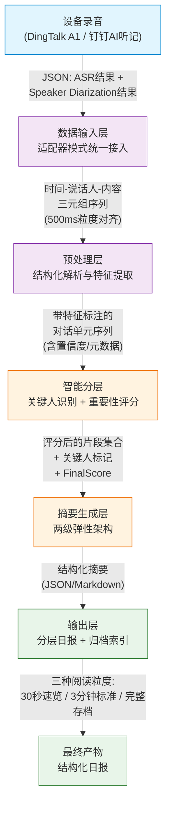
```mermaid
flowchart TD
    A["设备录音<br/>(DingTalk A1 / 钉钉AI听记)"] -->|"JSON: ASR结果 +<br/>Speaker Diarization结果"| B["数据输入层<br/>适配器模式统一接入"]
    B -->|"时间-说话人-内容<br/>三元组序列<br/>(500ms粒度对齐)"| C["预处理层<br/>结构化解析与特征提取"]
    C -->|"带特征标注的<br/>对话单元序列<br/>(含置信度/元数据)"| D["智能分层<br/>关键人识别 + 重要性评分"]
    D -->|"评分后的片段集合<br/>+ 关键人标记<br/>+ FinalScore"| E["摘要生成层<br/>两级弹性架构"]
    E -->|"结构化摘要<br/>(JSON/Markdown)"| F["输出层<br/>分层日报 + 归档索引"]
    F -->|"三种阅读粒度:<br/>30秒速览 / 3分钟标准 / 完整存档"| G["最终产物<br/>结构化日报"]

    style A fill:#e1f5fe,stroke:#0288d1
    style B fill:#f3e5f5,stroke:#7b1fa2
    style C fill:#f3e5f5,stroke:#7b1fa2
    style D fill:#fff3e0,stroke:#ef6c00
    style E fill:#fff3e0,stroke:#ef6c00
    style F fill:#e8f5e9,stroke:#2e7d32
    style G fill:#e8f5e9,stroke:#2e7d32
```

**各环节说明**：

| 环节 | 输入 | 处理 | 输出 |
|:---|:---|:---|:---|
| 数据输入层 | 设备原始 JSON (ASR + Diarization) | 适配器模式统一格式、500ms 粒度时间对齐 | 时间-说话人-内容三元组序列 |
| 预处理层 | 三元组序列 | 会话检测、数据清洗、话语合并、特征计算、元数据关联 | 带特征标注的对话单元 |
| 智能分层 | 对话单元序列 | 四级关键人匹配 (L1/L1.5/L2/L3) + MVP 统一评分 | 评分排序后的片段集合 |
| 摘要生成层 | 评分片段 + 关键人配置 + Prompt | 短日直通 / 长日分片 / 降级三级 | 结构化摘要内容 |
| 输出层 | 结构化摘要 | 格式化、分层渲染、多维索引归档 | 三粒度日报 + 归档记录 |

---

## 3. 核心组件图

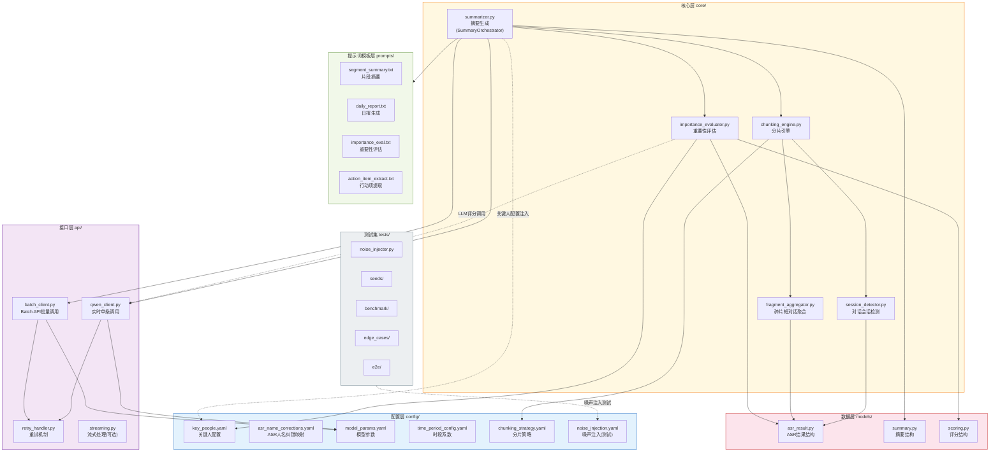
```mermaid
flowchart TB
    subgraph CONFIG["配置层 config/"]
        KP["key_people.yaml<br/>关键人配置"]
        ASR_CORR["asr_name_corrections.yaml<br/>ASR人名纠错映射"]
        MP["model_params.yaml<br/>模型参数"]
        TP["time_period_config.yaml<br/>时段系数"]
        CS["chunking_strategy.yaml<br/>分片策略"]
        NI["noise_injection.yaml<br/>噪声注入(测试)"]
    end

    subgraph MODELS["数据层 models/"]
        AR["asr_result.py<br/>ASR结果结构"]
        SM["summary.py<br/>摘要结构"]
        SC["scoring.py<br/>评分结构"]
    end

    subgraph CORE["核心层 core/"]
        SD["session_detector.py<br/>对话会话检测"]
        FA["fragment_aggregator.py<br/>碎片短对话聚合"]
        CE["chunking_engine.py<br/>分片引擎"]
        IE["importance_evaluator.py<br/>重要性评估"]
        SUM["summarizer.py<br/>摘要生成<br/>(SummaryOrchestrator)"]
    end

    subgraph PROMPTS["提示词模板层 prompts/"]
        P1["segment_summary.txt<br/>片段摘要"]
        P2["daily_report.txt<br/>日报生成"]
        P3["importance_eval.txt<br/>重要性评估"]
        P4["action_item_extract.txt<br/>行动项提取"]
    end

    subgraph API["接口层 api/"]
        QC["qwen_client.py<br/>实时单条调用"]
        BC["batch_client.py<br/>Batch API批量调用"]
        RH["retry_handler.py<br/>重试机制"]
        ST["streaming.py<br/>流式处理(可选)"]
    end

    subgraph TESTS["测试集 tests/"]
        NJ["noise_injector.py"]
        SEEDS["seeds/"]
        BM["benchmark/"]
        EC["edge_cases/"]
        E2E["e2e/"]
    end

    %% 依赖关系
    SD --> AR
    FA --> AR
    CE --> SD & FA & CS
    IE --> SC & KP & AR
    SUM --> CE & IE & QC & BC & PROMPTS & SM
    QC --> MP & RH
    BC --> MP & RH
    IE -.->|"LLM评分调用"| QC
    SUM -.->|"关键人配置注入"| KP
    TESTS -.->|"噪声注入测试"| NI

    style CONFIG fill:#e3f2fd,stroke:#1565c0
    style MODELS fill:#fce4ec,stroke:#c62828
    style CORE fill:#fff8e1,stroke:#f57f17
    style PROMPTS fill:#f1f8e9,stroke:#558b2f
    style API fill:#f3e5f5,stroke:#6a1b9a
    style TESTS fill:#eceff1,stroke:#546e7a
```

---

## 4. 两级弹性架构决策流

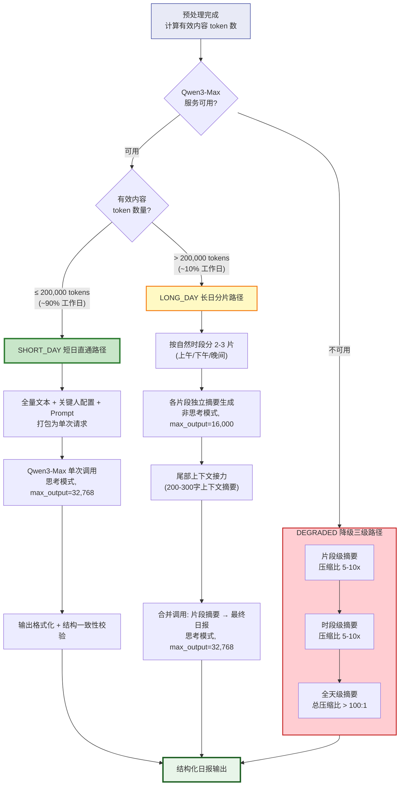
```mermaid
flowchart TD
    START["预处理完成<br/>计算有效内容 token 数"] --> CHECK_MODEL{"Qwen3-Max<br/>服务可用?"}

    CHECK_MODEL -->|"不可用"| DEGRADED_PATH

    CHECK_MODEL -->|"可用"| TOKEN_COUNT{"有效内容<br/>token 数量?"}

    TOKEN_COUNT -->|"≤ 200,000 tokens<br/>(~90% 工作日)"| SHORT_DAY["SHORT_DAY 短日直通路径"]
    TOKEN_COUNT -->|"> 200,000 tokens<br/>(~10% 工作日)"| LONG_DAY["LONG_DAY 长日分片路径"]

    SHORT_DAY --> SD_PACK["全量文本 + 关键人配置 + Prompt<br/>打包为单次请求"]
    SD_PACK --> SD_CALL["Qwen3-Max 单次调用<br/>思考模式, max_output=32,768"]
    SD_CALL --> SD_FORMAT["输出格式化 + 结构一致性校验"]
    SD_FORMAT --> OUTPUT["结构化日报输出"]

    LONG_DAY --> LD_SPLIT["按自然时段分 2-3 片<br/>(上午/下午/晚间)"]
    LD_SPLIT --> LD_SEGMENT["各片段独立摘要生成<br/>非思考模式, max_output=16,000"]
    LD_SEGMENT --> LD_CONTEXT["尾部上下文接力<br/>(200-300字上下文摘要)"]
    LD_CONTEXT --> LD_MERGE["合并调用: 片段摘要 → 最终日报<br/>思考模式, max_output=32,768"]
    LD_MERGE --> OUTPUT

    subgraph DEGRADED_PATH["DEGRADED 降级三级路径"]
        direction TB
        D1["片段级摘要<br/>压缩比 5-10x"]
        D1 --> D2["时段级摘要<br/>压缩比 5-10x"]
        D2 --> D3["全天级摘要<br/>总压缩比 > 100:1"]
    end
    DEGRADED_PATH --> OUTPUT

    style START fill:#e8eaf6,stroke:#283593
    style SHORT_DAY fill:#c8e6c9,stroke:#2e7d32,stroke-width:3px
    style LONG_DAY fill:#fff9c4,stroke:#f57f17,stroke-width:2px
    style DEGRADED_PATH fill:#ffcdd2,stroke:#c62828,stroke-width:2px
    style OUTPUT fill:#e8f5e9,stroke:#1b5e20,stroke-width:3px
```

**三条路径对比**：

| 路径 | 触发条件 | 模型调用次数 | 适用比例 | 输出质量 |
|:---|:---|:---|:---|:---|
| **短日直通** (short_day) | 有效内容 ≤ 200K tokens | 1 次 | ~90% 工作日 | 最高（全局上下文完整） |
| **长日分片** (long_day) | 有效内容 200K-250K tokens | 3-4 次（分片+合并） | ~10% 工作日 | 高（尾部上下文接力保障连贯） |
| **降级三级** (degraded) | 模型不可用 / 回退小模型 | 多次（三级渐进压缩） | 异常降级 | 中等（信息有损压缩） |

---

## 5. 技术栈概览

| 类别 | 技术选型 | 用途 |
|:---|:---|:---|
| **大语言模型** | Qwen3-Max (262K context) | 核心摘要生成、重要性评估、跨片段推理 |
| **降级模型** | Qwen3-Plus | 模型不可用时的降级备选 |
| **文本向量化** | text2vec-base-chinese / m3e-large | 语义去重（相似度>0.90-0.92时合并）、主题边界检测 |
| **数据模型** | Pydantic | ASR 结果、摘要、评分等结构化数据校验 |
| **配置管理** | YAML + Git | 关键人配置版本化管理、策略参数外置 |
| **分词器** | Qwen3 官方 tokenizer | 精确 token 计数，驱动路径选择与预算控制 |
| **API 调用** | 阿里云百炼 (实时API + Batch API) | 模型服务接入，Batch API 降本 50% |
| **重试机制** | 指数退避 (1s/2s/4s/8s) | 模型调用失败容错 |
| **测试框架** | Golden Case YAML + 噪声注入 | 端到端回归测试、ASR 噪声鲁棒性验证 |

---

## 6. 模块清单总表

| 模块名称 | 文件路径 | 职责 | 上游依赖 | 下游消费 |
|:---|:---|:---|:---|:---|
| **关键人配置** | `config/key_people.yaml` | 定义关键人等级、别名、保护策略 | Git 版本管理 | 重要性评估、摘要生成 |
| **ASR 人名纠错映射** | `config/asr_name_corrections.yaml` | 同音字/形近字的人名纠错规则 | 人工维护 | 预处理层元数据关联 |
| **模型参数配置** | `config/model_params.yaml` | Qwen3 调用参数（温度、max_tokens 等） | 人工维护 | qwen_client、batch_client |
| **时段系数配置** | `config/time_period_config.yaml` | 工作/休息时段系数定义 | 人工维护 | 重要性评估 |
| **分片策略配置** | `config/chunking_strategy.yaml` | 分片阈值、软边界搜索范围等参数 | 人工维护 | 分片引擎 |
| **ASR 结果模型** | `models/asr_result.py` | ASR 转录结果的 Pydantic 数据结构 | -- | 会话检测、碎片聚合、分片引擎 |
| **摘要模型** | `models/summary.py` | 摘要产物的 Pydantic 数据结构 | -- | 摘要生成、输出层 |
| **评分模型** | `models/scoring.py` | 重要性评分的 Pydantic 数据结构 | -- | 重要性评估 |
| **会话检测器** | `core/session_detector.py` | 基于静默间隔(>3min)+说话人变化识别自然会话边界 | asr_result.py | 分片引擎 (L0 硬约束) |
| **碎片聚合器** | `core/fragment_aggregator.py` | 将 <2min 碎片短对话合并为完整语义单元(上限15min) | asr_result.py | 分片引擎 |
| **分片引擎** | `core/chunking_engine.py` | 四层分片策略(L0会话/L1关键人/L2主题/L3时间窗口) | 会话检测器、碎片聚合器、分片策略配置 | 摘要生成 |
| **重要性评估** | `core/importance_evaluator.py` | MVP 统一评分: FinalScore = KeyPersonBase + LLM*10 | scoring.py、关键人配置、qwen_client | 摘要生成、输出排序 |
| **摘要生成器** | `core/summarizer.py` | SummaryOrchestrator: 协调短日/长日/降级三条路径 | 分片引擎、重要性评估、Prompt 模板、API 层 | 输出层 |
| **片段摘要 Prompt** | `prompts/segment_summary.txt` | 片段级摘要的 LLM 提示词模板 | -- | 摘要生成器 |
| **日报生成 Prompt** | `prompts/daily_report.txt` | 全天日报的 LLM 提示词模板 | -- | 摘要生成器 |
| **重要性评估 Prompt** | `prompts/importance_eval.txt` | LLMScore 评估的提示词模板 | -- | 重要性评估 |
| **行动项提取 Prompt** | `prompts/action_item_extract.txt` | 行动事项提取的提示词模板 | -- | 摘要生成器 |
| **Qwen 实时客户端** | `api/qwen_client.py` | 封装 Qwen3-Max 实时单条 API 调用 | model_params.yaml、retry_handler | 摘要生成器、重要性评估 |
| **Batch API 客户端** | `api/batch_client.py` | 批量提交+异步结果拉取，非实时场景降本 50% | model_params.yaml、retry_handler | 摘要生成器 |
| **重试处理器** | `api/retry_handler.py` | 指数退避重试 (1s/2s/4s/8s)，3次失败降级至 qwen-plus | -- | qwen_client、batch_client |
| **流式处理** | `api/streaming.py` | 流式输出支持（可选，非核心路径） | qwen_client | 前端展示 |
| **噪声注入器** | `tests/noise_injector.py` | 按定义噪声类型对干净 ASR 文本进行扰动 | noise_injection.yaml | 测试用例 |
| **端到端测试** | `tests/e2e/` | Golden Case 驱动的全链路回归测试 | 全部核心模块 | CI/CD |


---

# 共享类型定义 — models/types.py

> **目的**：定义全流水线共享的核心数据类型，作为各模块间的**唯一数据契约**，消除跨模块数据结构不一致问题。
>
> **解决的审计阻塞项**：BLOCK-1（Utterance 不兼容）、BLOCK-2（Segment/Chunk 接口断裂）、BLOCK-3（ScoringResult 未定义）、BLOCK-4（短日 Top-K 矛盾）、BLOCK-6（ModelClient 协议缺失）、BLOCK-9（MatchResult 枚举不一致）、BLOCK-10（80K/200K 阈值混淆）。
>
> **规则**：所有模块**必须**从 `models/types.py` 导入以下类型，**禁止**自行重新定义同名类。

---

## 目录

1. [基础枚举](#1-基础枚举)
2. [核心数据类](#2-核心数据类)
3. [评分相关](#3-评分相关)
4. [API 相关](#4-api-相关)
5. [配置常量](#5-配置常量)
6. [类型关系总览](#6-类型关系总览)
7. [迁移指引](#7-各模块迁移指引)

---

## 1. 基础枚举

所有枚举统一继承 `str, Enum`，确保 JSON 序列化时直接输出字符串值。

```python
from __future__ import annotations

from enum import Enum
from dataclasses import dataclass, field
from typing import Optional, Protocol, Sequence
from datetime import datetime


# ━━━━━━━━━━━━━━━━━━━━━━━━━━━━━━━━━━━━━━━━━━━━━━━━━━━━
# 1.1 关键人等级
# ━━━━━━━━━━━━━━━━━━━━━━━━━━━━━━━━━━━━━━━━━━━━━━━━━━━━

class KeyPersonLevel(str, Enum):
    """关键人优先级等级。

    P0: 最高优先级（如 CEO/总裁），基础保障分 80
    P1: 高优先级（如总监/VP），基础保障分 50
    P2: 中优先级（如经理），基础保障分 20
    P3: 普通人员，基础保障分 0
    """
    P0 = "P0"
    P1 = "P1"
    P2 = "P2"
    P3 = "P3"


# ━━━━━━━━━━━━━━━━━━━━━━━━━━━━━━━━━━━━━━━━━━━━━━━━━━━━
# 1.2 匹配类型（解决 BLOCK-9）
# ━━━━━━━━━━━━━━━━━━━━━━━━━━━━━━━━━━━━━━━━━━━━━━━━━━━━

class MatchType(str, Enum):
    """关键人匹配方式枚举。

    统一各模块的不同命名：
    - Module 1 旧名 "alias"   → 统一为 FUZZY
    - Module 1 旧名 "none"    → 统一为 NONE
    - Module 6 旧名 "unknown" → 统一为 NONE
    """
    EXACT = "exact"                 # L1: Speaker ID 或姓名精确匹配
    ASR_CORRECTED = "asr_corrected" # L1.5: ASR 人名纠错后匹配
    FUZZY = "fuzzy"                 # L2: 姓名/别名模糊匹配
    INFERRED = "inferred"           # L3: 内容推断（疑似），自动降级一档
    NONE = "none"                   # 未匹配到任何关键人


# ━━━━━━━━━━━━━━━━━━━━━━━━━━━━━━━━━━━━━━━━━━━━━━━━━━━━
# 1.3 对齐质量
# ━━━━━━━━━━━━━━━━━━━━━━━━━━━━━━━━━━━━━━━━━━━━━━━━━━━━

class AlignmentQuality(str, Enum):
    """ASR 与说话人分离的时间对齐质量。

    Module 1 原定义不继承 str；Module 2 原定义不继承 str。
    统一为 str, Enum 以支持 JSON 序列化。
    """
    HIGH = "high"
    MEDIUM = "medium"
    LOW = "low"


# ━━━━━━━━━━━━━━━━━━━━━━━━━━━━━━━━━━━━━━━━━━━━━━━━━━━━
# 1.4 评分阶段
# ━━━━━━━━━━━━━━━━━━━━━━━━━━━━━━━━━━━━━━━━━━━━━━━━━━━━

class ScoringPhase(str, Enum):
    """评分器实施阶段。

    MVP: 仅 KeyPersonBaseScore + LLMScore
    FULL: 引入 DurationScore、ContextScore、TimePeriodCoeff 及回归权重
    """
    MVP = "mvp"
    FULL = "full"


# ━━━━━━━━━━━━━━━━━━━━━━━━━━━━━━━━━━━━━━━━━━━━━━━━━━━━
# 1.5 摘要模式
# ━━━━━━━━━━━━━━━━━━━━━━━━━━━━━━━━━━━━━━━━━━━━━━━━━━━━

class SummaryMode(str, Enum):
    """摘要生成路径模式。

    由 SummaryOrchestrator.select_mode() 决策。
    消费方根据此值判断应使用 ScoringResult 中的哪组数据：
    - SHORT_DAY: 使用 all_segments（全量），评分仅用于展示排序
    - LONG_DAY:  使用 filtered_segments（Top-K），评分用于内容优先级
    - DEGRADED:  使用 filtered_segments，三级压缩
    """
    SHORT_DAY = "short_day"
    LONG_DAY = "long_day"
    DEGRADED = "degraded"
```

---

## 2. 核心数据类

### 2.1 MatchResult（解决 BLOCK-9）

统一替代 Module 1 的 `KeyPersonMatch` 和 Module 6 的 `MatchResult`。

```python
# ━━━━━━━━━━━━━━━━━━━━━━━━━━━━━━━━━━━━━━━━━━━━━━━━━━━━
# 等级降级映射（L3 疑似匹配专用）
# ━━━━━━━━━━━━━━━━━━━━━━━━━━━━━━━━━━━━━━━━━━━━━━━━━━━━

INFERRED_LEVEL_DOWNGRADE: dict[KeyPersonLevel, KeyPersonLevel] = {
    KeyPersonLevel.P0: KeyPersonLevel.P1,   # P0 疑似 → 按 P1 处理
    KeyPersonLevel.P1: KeyPersonLevel.P2,   # P1 疑似 → 按 P2 处理
    KeyPersonLevel.P2: KeyPersonLevel.P3,   # P2 疑似 → 按 P3 处理
    KeyPersonLevel.P3: KeyPersonLevel.P3,   # P3 维持
}

# 等级 → 基础保障分映射
LEVEL_BASE_SCORE: dict[KeyPersonLevel, int] = {
    KeyPersonLevel.P0: 80,
    KeyPersonLevel.P1: 50,
    KeyPersonLevel.P2: 20,
    KeyPersonLevel.P3: 0,
}


@dataclass(frozen=True)
class MatchResult:
    """关键人匹配结果。

    统一命名（替代 Module 1 的 KeyPersonMatch 和 Module 6 的 MatchResult）。
    frozen=True 确保匹配结果一旦产出不可篡改。

    字段说明：
    - matched_person_id / matched_person_name: 匹配到的关键人标识和姓名。
      未匹配时均为 None。
    - level: 关键人的原始配置等级。未匹配时为 None。
    - original_level: 仅在 match_type == INFERRED 时，记录降级前的原始等级。
      其他匹配类型下与 level 相同，均为 None（未匹配时）或原始值。
    - match_type: 匹配方式，取 MatchType 枚举值。
    - confidence: 匹配置信度，0.0-1.0。未匹配时为 0.0。
    """
    matched_person_id: Optional[str]        # 关键人 ID（如 "kp001"），未匹配为 None
    matched_person_name: Optional[str]       # 关键人姓名，未匹配为 None
    level: Optional[KeyPersonLevel]          # 配置中的原始等级，未匹配为 None
    original_level: Optional[KeyPersonLevel] # 降级前等级（仅 INFERRED 时不同于 level）
    match_type: MatchType                    # 匹配方式
    confidence: float                        # 匹配置信度 0.0-1.0

    @property
    def effective_level(self) -> KeyPersonLevel:
        """有效等级：疑似匹配自动降级一档。

        - EXACT / ASR_CORRECTED / FUZZY → 返回 level 原值
        - INFERRED → 返回降级后等级（P0→P1, P1→P2, P2→P3, P3→P3）
        - NONE → 返回 P3
        """
        if self.level is None:
            return KeyPersonLevel.P3
        if self.match_type == MatchType.INFERRED:
            return INFERRED_LEVEL_DOWNGRADE[self.level]
        return self.level

    @property
    def effective_base_score(self) -> int:
        """有效等级对应的基础保障分。"""
        return LEVEL_BASE_SCORE[self.effective_level]

    @property
    def is_matched(self) -> bool:
        """是否成功匹配到关键人。"""
        return self.match_type != MatchType.NONE

    @property
    def is_suspected(self) -> bool:
        """是否为疑似匹配（L3 推断）。"""
        return self.match_type == MatchType.INFERRED
```

**各匹配层级与 MatchResult 字段对应关系**：

| 匹配层 | match_type | confidence 典型值 | level | effective_level |
|:---|:---|:---|:---|:---|
| L1 Speaker ID 精确 | `EXACT` | 0.95-0.98 | 配置等级 | = level |
| L1.5 ASR 纠错 | `ASR_CORRECTED` | 0.90-0.95 | 配置等级 | = level |
| L2 模糊匹配 | `FUZZY` | 0.85-0.90 | 配置等级 | = level |
| L3 内容推断 | `INFERRED` | 0.70-0.85 | 配置等级 | 降级一档 |
| 未匹配 | `NONE` | 0.0 | None | P3 |

---

### 2.2 Utterance（解决 BLOCK-1）

统一 Module 1 和 Module 2 的两个不兼容 `Utterance` 定义。

```python
@dataclass(frozen=True)
class Utterance:
    """预处理后的最小对话单元（合并后的话语段）。

    这是全流水线的核心数据结构，由 Module 1（预处理层）生产，
    Module 2（分片引擎）、Module 3（评分器）、Module 4（摘要生成器）消费。

    解决 BLOCK-1 不兼容问题的统一规范：
    - 时间单位：秒（float），与 Module 2 对齐（Module 1 输出时需 ms → s 转换）
    - 唯一 ID：utterance_id，格式 "utt_{YYYYMMDD}_{HHMMSS}_{序号:03d}"
    - token 计数：token_count，预处理阶段用 Qwen3 tokenizer 精确计算
    - 关键人：使用统一的 MatchResult，替代 Module 1 的 KeyPersonMatch
    - 不可变：frozen=True，一旦创建不可修改
    """

    # ---- 标识 ----
    utterance_id: str
    """全局唯一标识，格式 "utt_{YYYYMMDD}_{HHMMSS}_{序号:03d}"。"""

    # ---- 说话人 ----
    speaker_id: str
    """说话人标识，如 "spk_001"。"""

    speaker_name: Optional[str]
    """ASR / 配置推断的说话人姓名。AI听记设备提供，可为 None。"""

    # ---- 时间（单位：秒） ----
    start_time: float
    """起始时间戳（秒，相对录音起点）。Module 1 输出时由 ms 转换。"""

    end_time: float
    """结束时间戳（秒，相对录音起点）。"""

    # ---- 文本 ----
    text: str
    """ASR 识别文本，由多个 Segment 合并而来。"""

    token_count: int
    """使用 Qwen3 tokenizer 精确计算的 token 数。
    预处理阶段一次性计算，避免下游重复分词。"""

    # ---- 置信度 ----
    asr_confidence: float
    """ASR 识别置信度（合并后取均值），0.0-1.0。"""

    min_asr_confidence: float
    """合并前各 Segment 中的最低 ASR 置信度，用于质量判断。"""

    speaker_confidence: float
    """说话人归属置信度（合并后取均值），0.0-1.0。"""

    alignment_quality: AlignmentQuality
    """对齐质量（合并后取最差值）。"""

    # ---- 合并元信息 ----
    segment_count: int
    """合并前的原始 Segment 数量。"""

    has_overlap: bool
    """是否包含重叠标记的 Segment（AI听记设备标记）。"""

    # ---- 关键人匹配（由预处理 Step 5 填充） ----
    key_person_match: MatchResult
    """关键人匹配结果。未匹配时 match_type == MatchType.NONE。"""

    # ---- 特征（由预处理 Step 4 填充） ----
    features: Optional["UtteranceFeatures"] = None
    """结构化特征，供评分和分片使用。Module 1 Step 4 计算填充。"""

    @property
    def duration(self) -> float:
        """时长（秒）。"""
        return self.end_time - self.start_time

    @property
    def key_person_level(self) -> Optional[KeyPersonLevel]:
        """便捷属性：关键人有效等级。未匹配返回 None。"""
        if self.key_person_match.is_matched:
            return self.key_person_match.effective_level
        return None
```

**Module 1 → Module 2 字段映射**：

| Module 1 旧字段 | 统一 Utterance 字段 | 转换说明 |
|:---|:---|:---|
| `start_ms: int` | `start_time: float` | `start_ms / 1000.0` |
| `end_ms: int` | `end_time: float` | `end_ms / 1000.0` |
| （无） | `utterance_id: str` | 预处理阶段生成 |
| （无） | `token_count: int` | 预处理阶段用 tokenizer 计算 |
| `key_person_match: KeyPersonMatch` | `key_person_match: MatchResult` | 类名变更 + 枚举值统一 |
| `features: UtteranceFeatures` | `features: UtteranceFeatures` | 不变 |
| `avg_asr_confidence` | `asr_confidence` | 字段名简化 |
| `worst_alignment` | `alignment_quality` | 字段名统一 |

---

### 2.3 Session

统一替代 Module 1 的 `ProcessedSession` / `ConversationSession` 和 Module 2 的 `Session`。

```python
@dataclass
class SessionMetadata:
    """会话级聚合元信息。"""
    total_duration_sec: float               # 会话总时长（秒）
    utterance_count: int                    # utterance 数量
    speaker_ids: list[str]                  # 出现过的说话人 ID 列表
    key_person_ids: list[str]               # 匹配到的关键人 ID 列表
    dominant_speaker_id: Optional[str]      # 发言时长最长的说话人
    scene_guess: Optional[str]              # 会话级场景推测
    filtered_segment_count: int = 0         # 置信度过滤掉的原始片段数
    avg_asr_confidence: float = 0.0         # 会话整体平均 ASR 置信度


@dataclass
class Session:
    """自然对话会话——L0 硬约束边界单元。

    替代 Module 1 的 ProcessedSession 和 Module 2 的 Session。
    由会话检测器（SessionDetector）产出，作为分片引擎的硬约束边界。

    任何分片策略都不会跨越 Session 边界。
    """
    session_id: str
    """会话标识，格式 "{device_id}_{序号:03d}" 或 "sess_{序号:03d}"。"""

    utterances: list[Utterance]
    """包含的有序 Utterance 列表，按 start_time 升序排列。"""

    time_range: tuple[float, float]
    """起止时间（秒），即 (first_utt.start_time, last_utt.end_time)。"""

    metadata: SessionMetadata
    """会话级聚合元信息。"""

    gap_before: Optional[float] = None
    """与前一个 Session 之间的静默时长（秒），首个 Session 为 None。"""

    @property
    def start_time(self) -> float:
        return self.time_range[0]

    @property
    def end_time(self) -> float:
        return self.time_range[1]

    @property
    def duration(self) -> float:
        return self.end_time - self.start_time

    @property
    def total_tokens(self) -> int:
        """所有 utterance token 之和。"""
        return sum(u.token_count for u in self.utterances)

    @property
    def speaker_set(self) -> set[str]:
        """出现过的说话人 ID 集合。"""
        return {u.speaker_id for u in self.utterances}

    @property
    def has_key_person(self) -> bool:
        """是否包含 P0 或 P1 关键人。"""
        return any(
            u.key_person_level in (KeyPersonLevel.P0, KeyPersonLevel.P1)
            for u in self.utterances
        )
```

---

### 2.4 Chunk（解决 BLOCK-2）

分片引擎的输出单元。增加 `text` 和 `speakers` 字段，解决评分模块无法获取所需数据的问题。

```python
@dataclass
class Chunk:
    """最终分片——送入 LLM 或评分器的处理单元。

    由分片引擎产出。解决 BLOCK-2：评分模块需要的 text 和 speakers 字段
    现在作为 Chunk 的一等公民提供，无需额外转换。
    """
    chunk_id: str
    """分片标识，格式 "chunk_{序号:03d}"。"""

    sessions: list[Session]
    """包含的 Session 列表（可能由 AggregatedPack 展开）。"""

    utterances: list[Utterance]
    """扁平化的全部 Utterance，按时间排序。
    冗余字段，等价于 [u for s in sessions for u in s.utterances]，
    预计算以避免下游重复展开。"""

    text: str
    """拼接文本。由所有 utterance.text 按时间顺序用换行符连接。
    格式: "[HH:MM:SS] speaker_name: text"
    供评分模块和摘要模块直接使用。"""

    speakers: list[str]
    """涉及的所有说话人 ID 列表（去重，按首次出现顺序）。
    解决 BLOCK-2：评分模块 compute_key_person_base_score 需要此字段。"""

    total_tokens: int
    """所有 utterance token_count 之和。"""

    strategy_used: str
    """产生此 Chunk 的策略名。
    取值: "L1_key_person" | "L2_topic" | "L3_time_window" | "aggregated"。"""

    key_persons_involved: list[str]
    """涉及的关键人 ID 列表（去重）。"""

    start_time: float = 0.0
    """第一条 utterance 的 start_time。"""

    end_time: float = 0.0
    """最后一条 utterance 的 end_time。"""

    label: Optional[str] = None
    """可读标签，如 "战略研讨会-第2部分，共4部分"。"""

    tail_context_summary: Optional[str] = None
    """尾部上下文摘要（200-300 字），供下一 Chunk 或合并阶段参考。"""

    boundary_score: float = 0.0
    """边界质量评分 0.0-1.0。"""

    @property
    def duration(self) -> float:
        return self.end_time - self.start_time


@dataclass
class ChunkingResult:
    """分片引擎总输出。"""
    chunks: list[Chunk]
    mode: SummaryMode
    """当前摘要模式，由 SummaryOrchestrator 决策后传入分片引擎。"""
    total_tokens: int
    metadata: dict = field(default_factory=dict)
    """策略选择日志、边界统计等调试信息。"""
```

---

## 3. 评分相关（解决 BLOCK-3, BLOCK-4）

### 3.1 ScoreBreakdown

与 Module 3 原定义保持一致，仅将松散的 `str` 类型字段改为对应枚举。

```python
@dataclass
class ScoreBreakdown:
    """单个片段/Chunk 的评分分解记录。

    保留完整的评分分解，服务于调试、可解释性和后续模型迭代。
    """

    segment_id: str
    """对应 Chunk.chunk_id 或其他可溯源标识。"""

    # ---- 关键人维度 ----
    key_person_level: Optional[KeyPersonLevel] = None
    """关键人原始等级。未匹配时为 None。"""

    match_type: Optional[MatchType] = None
    """匹配方式。使用统一的 MatchType 枚举，替代原 str 类型。"""

    effective_level: Optional[KeyPersonLevel] = None
    """疑似降级后的等效等级。非 INFERRED 时与 key_person_level 相同。"""

    key_person_base_score: int = 0
    """关键人基础保障分（P0=80, P1=50, P2=20, P3=0）。"""

    # ---- LLM 语义维度 ----
    llm_score: int = 5
    """LLM 原始语义评分 1-10。解析失败时降级为默认分 5。"""

    llm_score_weighted: int = 50
    """llm_score * llm_score_multiplier（默认 *10）。"""

    # ---- 连续性保护 ----
    continuity_bonus: float = 0.0
    """连续性保护加成分。"""

    continuity_source_segment_id: Optional[str] = None
    """加成来源片段的 segment_id。"""

    # ---- 完整阶段维度（MVP 阶段为 None） ----
    duration_score: Optional[float] = None
    context_score: Optional[float] = None
    time_period_coeff: Optional[float] = None

    # ---- 最终得分 ----
    final_score: float = 0.0
    """MVP: KeyPersonBaseScore + LLMScore * 10 + continuity_bonus"""

    # ---- 筛选结果 ----
    threshold_applied: int = 60
    """使用的最低分阈值。"""

    passed_threshold: bool = False
    """是否通过阈值筛选。"""

    rank_in_topk: Optional[int] = None
    """Top-K 排名（从 1 开始），未进入 Top-K 为 None。"""

    # ---- 元数据 ----
    speakers: list[str] = field(default_factory=list)
    duration_seconds: Optional[float] = None
    timestamp: Optional[float] = None
    """片段起始时间（秒）。用于排序。"""

    phase: ScoringPhase = ScoringPhase.MVP
```

### 3.2 ScoringResult（解决 BLOCK-3, BLOCK-4）

```python
@dataclass
class ScoringResult:
    """评分模块的统一输出包装。

    解决 BLOCK-3：评分→摘要接口断裂。提供结构化的评分输出，
    替代原来的 tuple[list[Segment], list[ScoreBreakdown]]。

    解决 BLOCK-4：短日模式下 Top-K 筛选与 PRD 矛盾。
    通过 mode 字段让消费方自行决定使用哪组数据：
    - SHORT_DAY: 消费方应使用 all_chunks（全量），评分仅用于展示排序
    - LONG_DAY / DEGRADED: 消费方应使用 filtered_chunks（Top-K 筛选后）

    数据组织：
    - all_* 字段：全量数据，按时间升序排列
    - filtered_* 字段：经阈值 + Top-K 筛选后的数据，按分数降序排列
    """

    # ---- 全量数据（按时间升序） ----
    all_chunks: list[Chunk]
    """全部评分片段，按 start_time 升序排列。"""

    all_breakdowns: list[ScoreBreakdown]
    """全部评分分解，与 all_chunks 一一对应（同序）。"""

    # ---- 筛选后数据（按分数降序） ----
    filtered_chunks: list[Chunk]
    """通过阈值 + Top-K 筛选后的片段，按 final_score 降序排列。
    SHORT_DAY 模式下此列表与 all_chunks 相同（不执行筛选）。"""

    filtered_breakdowns: list[ScoreBreakdown]
    """与 filtered_chunks 一一对应的评分分解（同序）。"""

    # ---- 模式标记 ----
    mode: SummaryMode
    """当前摘要模式。消费方据此决定使用 all_* 还是 filtered_*。"""

    # ---- 评分配置快照 ----
    config_snapshot: Optional["ScoringConfig"] = None
    """评分时使用的配置快照，用于审计和复现。"""

    @property
    def effective_chunks(self) -> list[Chunk]:
        """根据 mode 返回消费方应使用的 Chunk 列表。

        SHORT_DAY → all_chunks（全量，按时间排序，评分仅用于展示）
        LONG_DAY / DEGRADED → filtered_chunks（Top-K，按分数排序）
        """
        if self.mode == SummaryMode.SHORT_DAY:
            return self.all_chunks
        return self.filtered_chunks

    @property
    def effective_breakdowns(self) -> list[ScoreBreakdown]:
        """与 effective_chunks 对应的评分分解。"""
        if self.mode == SummaryMode.SHORT_DAY:
            return self.all_breakdowns
        return self.filtered_breakdowns
```

---

## 4. API 相关（解决 BLOCK-6）

### 4.1 ChatMessage & ChatCompletionResponse

```python
@dataclass
class ChatMessage:
    """LLM 对话消息。

    各模块统一使用此类型构建 messages 列表，
    替代 Module 4 的 list[dict] 和 Module 5 的 list[ChatMessage]（已统一）。
    """
    role: str
    """消息角色: "system" | "user" | "assistant"。"""

    content: str
    """消息内容。"""


@dataclass
class TokenUsage:
    """Token 使用量统计。"""
    prompt_tokens: int
    completion_tokens: int
    total_tokens: int
    thinking_tokens: int = 0
    """思考模式下的思维链 token 数。非思考模式为 0。"""


@dataclass
class ChatCompletionResponse:
    """LLM 调用统一响应结构。

    实时客户端和 Batch 客户端均返回此类型。
    """
    content: str
    """模型生成的回答文本。"""

    usage: TokenUsage
    """Token 使用量。"""

    model: str
    """实际使用的模型标识。"""

    thinking_content: Optional[str] = None
    """思考模式下的思维链原文。非思考模式为 None。"""

    request_id: str = ""
    """请求 ID（如阿里云请求 ID），用于排查。"""

    finish_reason: str = "stop"
    """完成原因: "stop" | "length" | "content_filter"。"""
```

### 4.2 ModelClient 协议（解决 BLOCK-6）

```python
class ModelClient(Protocol):
    """LLM 客户端协议。

    解决 BLOCK-6：摘要模块期望 async 方法，API 层定义为同步。
    所有 LLM 客户端实现（QwenClient、MockClient、BatchClient 等）
    必须实现此协议。

    使用 Protocol 而非 ABC，允许结构化子类型匹配（鸭子类型），
    无需显式继承。
    """

    async def chat_completion(
        self,
        messages: list[ChatMessage],
        *,
        model: Optional[str] = None,
        enable_thinking: bool = False,
        thinking_budget: Optional[int] = None,
        max_tokens: Optional[int] = None,
        temperature: Optional[float] = None,
    ) -> ChatCompletionResponse:
        """发送 Chat Completion 请求并返回统一响应。

        Args:
            messages: 消息列表，使用 ChatMessage 类型。
            model: 覆盖默认模型标识。
            enable_thinking: 启用思考模式。
            thinking_budget: 思维链 token 上限（仅 enable_thinking=True 时生效）。
            max_tokens: 输出 token 上限。
            temperature: 采样温度。

        Returns:
            ChatCompletionResponse 统一响应。

        Raises:
            QwenRetryableError: 可重试的 API 错误（429/500/超时）。
            QwenAPIError: 不可重试的 API 错误（400/401）。
            QwenExhaustedError: 主模型+降级模型均失败。
        """
        ...

    def count_tokens(self, text: str) -> int:
        """使用模型对应的 tokenizer 精确计算 token 数。"""
        ...

    def count_messages_tokens(self, messages: list[ChatMessage]) -> int:
        """计算完整 messages 列表的 token 数（含 role 标记开销）。"""
        ...
```

---

## 5. 配置常量（解决 BLOCK-10）

### 5.1 Token 预算阈值

解决 BLOCK-10：明确区分两个不同概念的阈值。

```python
# ━━━━━━━━━━━━━━━━━━━━━━━━━━━━━━━━━━━━━━━━━━━━━━━━━━━━
# Token 预算关键阈值（解决 BLOCK-10）
# ━━━━━━━━━━━━━━━━━━━━━━━━━━━━━━━━━━━━━━━━━━━━━━━━━━━━

SHORT_DAY_THRESHOLD: int = 80_000
"""摘要模式切换阈值（tokens）。

用途：SummaryOrchestrator.select_mode() 决策。
- total_tokens < 80,000 → SHORT_DAY（~90% 工作日）
- total_tokens 80,000 ~ 250,000 → LONG_DAY（~10% 工作日）
- total_tokens > 250,000 → DEGRADED

来源：PRD §1.1.4，扣除系统开销后 80K 有效内容恰好填满 262K 上下文。
此值由 config/model_params.yaml 中的 token_budget.short_day_threshold 配置。
"""

LONG_DAY_MAX_THRESHOLD: int = 250_000
"""长日模式上限（tokens）。超过此值降级为三级压缩。"""

CHUNK_TOKEN_BUDGET: int = 200_000
"""单 Chunk 最大 token 容量。

用途：分片引擎内部参数，决定单个 Chunk 的 token 上限。
仅在分片引擎切分逻辑中使用，与摘要模式切换无关。

来源：Qwen3-Max 262K 上下文 - 系统提示词(2K) - 关键人注入(600)
      - 输出预留(32K) - 安全余量(20K) ≈ 200K 可用载荷。
此值由 config/model_params.yaml 或 chunking_strategy.yaml 配置。
"""

MODEL_CONTEXT_LIMIT: int = 262_144
"""Qwen3-Max 上下文窗口大小（tokens）。"""

DEGRADED_MODEL_THRESHOLD: int = 64_000
"""模型能力下限。低于此值的模型自动降级为三级压缩。"""
```

### 5.2 阈值关系图

```
全天 token 总量
     │
     ├── < 80K ──────────────────────► SHORT_DAY
     │                                  └─ 全量送入单次 LLM 调用
     │                                  └─ Chunk token ≤ 200K（单 Chunk）
     │
     ├── 80K ~ 250K ─────────────────► LONG_DAY
     │                                  └─ 按时段分 2-3 个 Session
     │                                  └─ 每个 Session ≤ 80K tokens
     │
     └── > 250K ─────────────────────► DEGRADED
                                        └─ 三级压缩：Chunk(3-8K) → Session → Daily
```

---

## 6. 类型关系总览

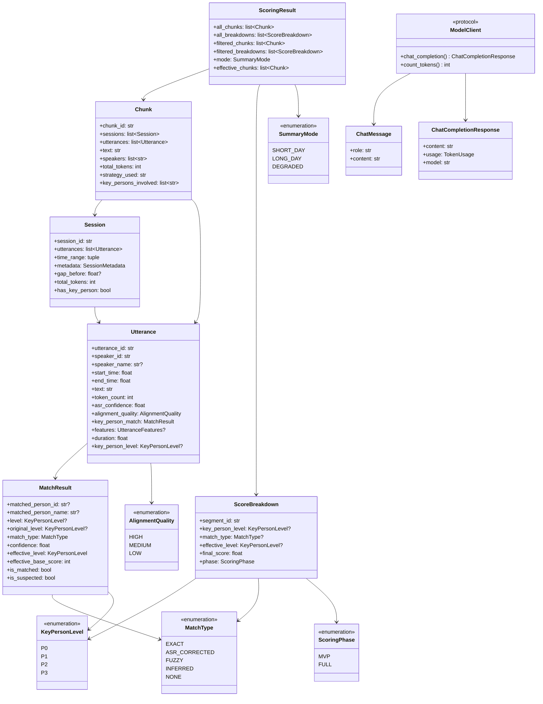
```mermaid
classDiagram
    direction TB

    class KeyPersonLevel {
        <<enumeration>>
        P0
        P1
        P2
        P3
    }

    class MatchType {
        <<enumeration>>
        EXACT
        ASR_CORRECTED
        FUZZY
        INFERRED
        NONE
    }

    class AlignmentQuality {
        <<enumeration>>
        HIGH
        MEDIUM
        LOW
    }

    class ScoringPhase {
        <<enumeration>>
        MVP
        FULL
    }

    class SummaryMode {
        <<enumeration>>
        SHORT_DAY
        LONG_DAY
        DEGRADED
    }

    class MatchResult {
        +matched_person_id: str?
        +matched_person_name: str?
        +level: KeyPersonLevel?
        +original_level: KeyPersonLevel?
        +match_type: MatchType
        +confidence: float
        +effective_level: KeyPersonLevel
        +effective_base_score: int
        +is_matched: bool
        +is_suspected: bool
    }

    class Utterance {
        +utterance_id: str
        +speaker_id: str
        +speaker_name: str?
        +start_time: float
        +end_time: float
        +text: str
        +token_count: int
        +asr_confidence: float
        +alignment_quality: AlignmentQuality
        +key_person_match: MatchResult
        +features: UtteranceFeatures?
        +duration: float
        +key_person_level: KeyPersonLevel?
    }

    class Session {
        +session_id: str
        +utterances: list~Utterance~
        +time_range: tuple
        +metadata: SessionMetadata
        +gap_before: float?
        +total_tokens: int
        +has_key_person: bool
    }

    class Chunk {
        +chunk_id: str
        +sessions: list~Session~
        +utterances: list~Utterance~
        +text: str
        +speakers: list~str~
        +total_tokens: int
        +strategy_used: str
        +key_persons_involved: list~str~
    }

    class ScoreBreakdown {
        +segment_id: str
        +key_person_level: KeyPersonLevel?
        +match_type: MatchType?
        +effective_level: KeyPersonLevel?
        +final_score: float
        +phase: ScoringPhase
    }

    class ScoringResult {
        +all_chunks: list~Chunk~
        +all_breakdowns: list~ScoreBreakdown~
        +filtered_chunks: list~Chunk~
        +filtered_breakdowns: list~ScoreBreakdown~
        +mode: SummaryMode
        +effective_chunks: list~Chunk~
    }

    class ChatMessage {
        +role: str
        +content: str
    }

    class ChatCompletionResponse {
        +content: str
        +usage: TokenUsage
        +model: str
    }

    class ModelClient {
        <<protocol>>
        +chat_completion() ChatCompletionResponse
        +count_tokens() int
    }

    MatchResult --> MatchType
    MatchResult --> KeyPersonLevel
    Utterance --> MatchResult
    Utterance --> AlignmentQuality
    Session --> Utterance
    Chunk --> Session
    Chunk --> Utterance
    ScoreBreakdown --> KeyPersonLevel
    ScoreBreakdown --> MatchType
    ScoreBreakdown --> ScoringPhase
    ScoringResult --> Chunk
    ScoringResult --> ScoreBreakdown
    ScoringResult --> SummaryMode
    ModelClient --> ChatMessage
    ModelClient --> ChatCompletionResponse
```

---

## 7. 各模块迁移指引

### Module 1（数据输入 + 预处理）

| 变更项 | 旧 | 新 |
|:---|:---|:---|
| `Utterance` 时间 | `start_ms: int`, `end_ms: int` | `start_time: float`, `end_time: float`（秒） |
| `Utterance` 新增字段 | 无 | `utterance_id`, `token_count` |
| `KeyPersonMatch` | Module 1 自有定义 | 改用 `MatchResult` |
| `AlignmentQuality` | `Enum`（不继承 str） | `str, Enum` |
| match_type 值 `"alias"` | Module 1 旧值 | 改为 `MatchType.FUZZY` |
| match_type 值 `"none"` | Module 1 旧值 | 改为 `MatchType.NONE` |
| `ProcessedSession` | Module 1 自有定义 | 改用 `Session` |
| `Utterance.worst_alignment` | Module 1 字段名 | 改为 `alignment_quality` |
| `Utterance.avg_asr_confidence` | Module 1 字段名 | 改为 `asr_confidence` |

### Module 2（分片引擎）

| 变更项 | 旧 | 新 |
|:---|:---|:---|
| `Utterance` | Module 2 自有定义 | 从 `models/types.py` 导入 |
| `Session` | Module 2 自有定义 | 从 `models/types.py` 导入，增加 `metadata` 字段 |
| `Chunk` | 无 `text`/`speakers` | 新增 `text`, `speakers` 字段 |
| `ChunkingResult.mode` | `str`（"short_day"\|"long_day"） | `SummaryMode` 枚举 |
| `AlignmentQuality` | `Enum`（不继承 str） | `str, Enum` |

### Module 3（评分器）

| 变更项 | 旧 | 新 |
|:---|:---|:---|
| 输入类型 | `Segment`（未定义） | 直接消费 `Chunk` |
| 输出类型 | `tuple[list, list]` | `ScoringResult` 数据类 |
| `ScoreBreakdown.match_type` | `Optional[str]` | `Optional[MatchType]` |
| `ScoreBreakdown.key_person_level` | `Optional[str]` | `Optional[KeyPersonLevel]` |
| Top-K 筛选 | 所有模式一律执行 | `SHORT_DAY` 模式下 `filtered_chunks = all_chunks` |

### Module 4（摘要生成器）

| 变更项 | 旧 | 新 |
|:---|:---|:---|
| 输入 `scoring_result` | 类型未定义 | `ScoringResult`，使用 `effective_chunks` 属性 |
| `messages` 构建 | `list[dict]` | `list[ChatMessage]` |
| `model_client` 类型 | 无明确类型 | `ModelClient` 协议 |

### Module 5（API 层）

| 变更项 | 旧 | 新 |
|:---|:---|:---|
| `chat_completion` | 同步 `def` | 异步 `async def`（实现 `ModelClient` 协议） |
| `ChatMessage` | Module 5 自有定义 | 从 `models/types.py` 导入 |
| `ChatCompletionResponse` | Module 5 自有定义 | 从 `models/types.py` 导入 |

### Module 6（配置管理）

| 变更项 | 旧 | 新 |
|:---|:---|:---|
| `PersonLevel` | Module 6 自有定义 | 改用 `KeyPersonLevel` |
| `MatchType` | Module 6 自有定义（`UNKNOWN` 值） | 从 `models/types.py` 导入（`NONE` 值） |
| `MatchResult` | Module 6 自有定义（含 `matched_person: KeyPerson`） | 从 `models/types.py` 导入（改用 id + name 扁平字段） |


---

# 数据输入层与预处理层 — 模块详细设计

> 对应 PRD §1.1.1（数据输入层）与 §1.1.2（预处理层）。
> 涉及文件：`models/asr_result.py`、`core/preprocessor.py`

---

## 一、数据输入层（models/asr_result.py）

### 1.1 核心数据模型

#### 1.1.1 Segment — 最小粒度片段

```python
from __future__ import annotations
from dataclasses import dataclass, field
from enum import Enum
from typing import Optional

class AlignmentQuality(str, Enum):
    HIGH = "high"
    MEDIUM = "medium"
    LOW = "low"

@dataclass(frozen=True)
class Segment:
    """ASR + Speaker Diarization 对齐后的最小粒度片段。"""
    start_ms: int                    # 片段起始时间（毫秒，相对于 session_start）
    end_ms: int                      # 片段结束时间（毫秒）
    speaker_id: str                  # 说话人标识，如 "spk_001"
    text: str                        # ASR 识别文本
    asr_confidence: float            # ASR 识别置信度，0.0-1.0
    speaker_confidence: float        # 说话人归属置信度，0.0-1.0
    alignment_quality: AlignmentQuality  # ASR 与说话人分离的时间对齐质量
    # ---- 以下为可选扩展字段 ----
    speaker_name: Optional[str] = None   # 仅 AI听记 提供的说话人姓名推测
    is_overlap: bool = False             # 仅 AI听记 提供的重叠标记

    @property
    def duration_ms(self) -> int:
        return self.end_ms - self.start_ms
```

**字段约束**：

| 字段 | 约束 | 违规处理 |
|:---|:---|:---|
| `start_ms` / `end_ms` | `0 <= start_ms < end_ms` | 抛出 `ValidationError` |
| `asr_confidence` | `[0.0, 1.0]` | 截断至边界值并记录 WARNING |
| `speaker_confidence` | `[0.0, 1.0]` | 截断至边界值并记录 WARNING |
| `text` | 非空，去除前后空白后 `len > 0` | 标记为空段，后续清洗阶段丢弃 |

#### 1.1.2 SessionRaw — 单次录音会话

```python
from datetime import datetime

@dataclass
class SessionRaw:
    """一次完整录音会话的原始数据容器。"""
    device_id: str                   # 设备标识，如 "dingtalk_a1_0032"
    device_type: str                 # 设备类型："dingtalk_a1" | "ai_tingji"
    session_start: datetime          # 会话起始时间（UTC+8）
    session_end: datetime            # 会话结束时间（UTC+8）
    segments: list[Segment]          # 按 start_ms 升序排列的片段列表
    source_file: Optional[str] = None  # 原始文件路径，用于溯源

    @property
    def total_duration_ms(self) -> int:
        return int((self.session_end - self.session_start).total_seconds() * 1000)

    @property
    def segment_count(self) -> int:
        return len(self.segments)
```

### 1.2 设备适配器接口

#### 1.2.1 基类定义

```python
from abc import ABC, abstractmethod
from pathlib import Path

class DeviceAdapter(ABC):
    """设备适配器基类。将异构设备输出转换为统一 SessionRaw。"""

    @abstractmethod
    def parse(self, raw_data: dict | str | Path) -> SessionRaw:
        """
        解析设备原始输出，返回标准化 SessionRaw。

        Args:
            raw_data: 设备原始数据（JSON dict、文件路径或原始字符串）。
        Returns:
            SessionRaw 实例。
        Raises:
            DeviceParseError: 数据格式不符合预期时抛出。
        """
        ...

    @abstractmethod
    def device_type(self) -> str:
        """返回设备类型标识字符串。"""
        ...
```

#### 1.2.2 DingTalk A1 适配器

```python
class DingTalkA1Adapter(DeviceAdapter):
    """
    DingTalk A1 输出格式：
    {
      "device_id": "...",
      "session_start": "2026-03-27T09:00:00+08:00",
      "session_end": "2026-03-27T17:30:00+08:00",
      "segments": [
        {
          "start_ms": 0, "end_ms": 3200,
          "speaker_id": "spk_001",
          "text": "...",
          "asr_confidence": 0.87,
          "speaker_confidence": 0.92
        }, ...
      ]
    }
    """

    def device_type(self) -> str:
        return "dingtalk_a1"

    def parse(self, raw_data: dict) -> SessionRaw:
        # 1. 校验顶层必填字段
        # 2. 逐条解析 segments，缺失 alignment_quality 时默认 MEDIUM
        # 3. 按 start_ms 排序
        # 4. 返回 SessionRaw
        ...
```

**DingTalk A1 格式要点**：

- `alignment_quality` 字段可能缺失，默认填充 `AlignmentQuality.MEDIUM`。
- `speaker_confidence` 可能缺失，默认填充 `0.5`。

#### 1.2.3 AI听记适配器

```python
class AITingjiAdapter(DeviceAdapter):
    """
    AI听记额外字段：speaker_name（姓名推测）、is_overlap（重叠标记）。
    格式与 DingTalk A1 类似，但 segments 内多出上述两个字段。
    """

    def device_type(self) -> str:
        return "ai_tingji"

    def parse(self, raw_data: dict) -> SessionRaw:
        # 1. 校验顶层必填字段
        # 2. 逐条解析 segments，保留 speaker_name、is_overlap
        # 3. 对 is_overlap=True 的片段标记 alignment_quality = LOW
        # 4. 按 start_ms 排序
        # 5. 返回 SessionRaw
        ...
```

**AI听记格式要点**：

- `speaker_name` 为推测值，仅用于后续 L2 模糊匹配的输入线索，不可直接作为最终说话人标识。
- `is_overlap=True` 的片段自动将 `alignment_quality` 降级为 `LOW`。

#### 1.2.4 适配器注册与分发

```python
# 适配器工厂，根据 device_type 字符串分发
_ADAPTER_REGISTRY: dict[str, type[DeviceAdapter]] = {
    "dingtalk_a1": DingTalkA1Adapter,
    "ai_tingji": AITingjiAdapter,
}

def get_adapter(device_type: str) -> DeviceAdapter:
    cls = _ADAPTER_REGISTRY.get(device_type)
    if cls is None:
        raise UnsupportedDeviceError(f"未知设备类型: {device_type}")
    return cls()
```

### 1.3 输入校验规则

校验在 `SessionRaw` 构建完成后、进入预处理层之前执行。

```python
@dataclass
class ValidationResult:
    is_valid: bool
    warnings: list[str] = field(default_factory=list)
    errors: list[str] = field(default_factory=list)

def validate_session(session: SessionRaw) -> ValidationResult:
    """执行三项核心校验，返回校验结果。"""
    ...
```

#### 1.3.1 时间线连续性检查

```
对于 segments[i] 与 segments[i+1]:
  gap = segments[i+1].start_ms - segments[i].end_ms
  若 gap < -500ms:   → ERROR: 严重时间倒退
  若 -500ms <= gap < 0: → WARNING: 微小重叠，自动修正（见 1.3.2）
  若 gap > 300_000ms (5min): → WARNING: 存在长静默，记录日志
```

**参数**：

| 参数 | 默认值 | 说明 |
|:---|:---|:---|
| `MAX_BACKWARD_TOLERANCE_MS` | 500 | 允许的最大时间倒退量（毫秒） |
| `LONG_SILENCE_THRESHOLD_MS` | 300,000 | 超过此值记录长静默警告 |

#### 1.3.2 段落重叠检测与修正

```
对于 segments[i] 与 segments[i+1]:
  overlap = segments[i].end_ms - segments[i+1].start_ms
  若 overlap > 0 且 overlap <= 500ms:
    → 自动修正: segments[i].end_ms = segments[i+1].start_ms（截断前段尾部）
    → 记录 WARNING
  若 overlap > 500ms:
    → 标记为 ERROR: 严重重叠，可能是数据异常
    → 不自动修正，交由人工处理或丢弃该 session
```

#### 1.3.3 总时长校验

```
declared_duration = session.total_duration_ms
actual_span = segments[-1].end_ms - segments[0].start_ms
deviation = abs(declared_duration - actual_span) / declared_duration

若 deviation > 0.1 (10%): → WARNING: 声明时长与实际跨度偏差较大
若 declared_duration > 14 * 3600 * 1000 (14小时): → WARNING: 超长录音
若 declared_duration < 60 * 1000 (1分钟): → WARNING: 过短录音
若 len(segments) == 0: → ERROR: 空会话
```

### 1.4 异常处理策略

| 异常类型 | 处理方式 | 后续动作 |
|:---|:---|:---|
| `DeviceParseError` | 适配器无法解析原始数据 | 记录错误日志，跳过该文件，通知运维 |
| `UnsupportedDeviceError` | 未知设备类型 | 拒绝处理，返回明确错误信息 |
| `ValidationError`（ERROR 级） | 数据存在不可自动修复的严重问题 | 跳过该 session，写入异常队列待人工处理 |
| `ValidationResult.warnings` | 数据存在可容忍的轻微问题 | 记录日志，继续处理 |

---

## 二、预处理层（core/preprocessor.py）

### 2.0 预处理流水线总览

<!-- FIXED: BLOCK-5 — 会话检测去重：移除原 Step 1（会话检测），会话检测统一由 Module 2 的 SessionDetector 执行。预处理流水线从五步改为四步。 -->

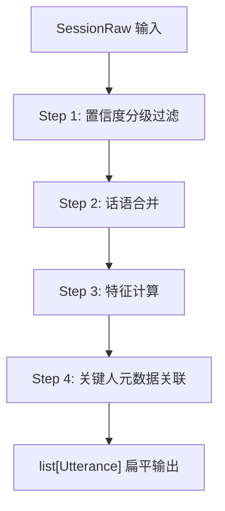
```mermaid
flowchart TD
    A[SessionRaw 输入] --> B[Step 1: 置信度分级过滤]
    B --> C[Step 2: 话语合并]
    C --> D[Step 3: 特征计算]
    D --> E[Step 4: 关键人元数据关联]
    E --> F["list[Utterance] 扁平输出"]
```

预处理层的输入为校验通过的 `SessionRaw`，输出为扁平的 `list[Utterance]`（引用 `models/types.py` 中的统一 Utterance）。会话检测不在此处执行，统一由下游 Module 2 的 `SessionDetector` 负责。

```python
class Preprocessor:
    def __init__(self, config: PreprocessorConfig, key_people: KeyPeopleConfig):
        self.config = config
        self.key_people = key_people

    def process(self, session: SessionRaw) -> list[Utterance]:
        # Step 1: 置信度过滤（需要关键人信息做分级）
        cleaned = self._filter_by_confidence(session.segments)
        # Step 2: 话语合并
        utterances = self._merge_utterances(cleaned)
        # Step 3: 特征计算
        enriched = self._compute_features(utterances, session)
        # Step 4: 关键人元数据关联
        linked = self._link_key_people(enriched)
        return linked
```

<!-- FIXED: BLOCK-5 — 原 Step 1（对话会话检测）已移除，会话检测统一由 Module 2 的 SessionDetector 执行。 -->

### 2.1 Step 1：置信度分级过滤

#### 2.1.1 目标

根据说话人的关键人等级，分级过滤低置信度片段。关键人的发言采用更宽松的阈值，避免丢失嘈杂环境下的关键指令。

#### 2.1.2 算法

```
输入: segments: List[Segment], key_people: KeyPeopleConfig
输出: filtered: List[Segment]

# 阈值映射表
CONFIDENCE_THRESHOLDS = {
    "P0": 0.35,
    "P1": 0.40,
    "P2": 0.50,
    "P3": 0.60,    # 非关键人同级
    "UNKNOWN": 0.60,
}

for seg in segments:
    level = lookup_speaker_level(seg.speaker_id, key_people)
    # level 为 "P0" | "P1" | "P2" | "P3" | "UNKNOWN"
    threshold = CONFIDENCE_THRESHOLDS[level]

    if seg.asr_confidence >= threshold:
        filtered.append(seg)
    else:
        # 记录被过滤的片段（含原因）到 filter_log
        filter_log.append(FilteredRecord(seg, reason="low_asr_confidence",
                                          threshold=threshold, level=level))
```

**注意**：此步骤需要提前执行一次粗粒度的说话人-关键人匹配（仅 L1 精确匹配），以获得说话人等级。完整的四级匹配在 Step 4 执行。若 L1 匹配不到，视为 `UNKNOWN`，使用最严格阈值 0.60。

#### 2.1.3 关键参数

| 参数 | 默认值 | 说明 |
|:---|:---|:---|
| `P0_ASR_THRESHOLD` | 0.35 | P0 关键人 ASR 置信度阈值 |
| `P1_ASR_THRESHOLD` | 0.40 | P1 关键人 ASR 置信度阈值 |
| `P2_ASR_THRESHOLD` | 0.50 | P2 关键人 ASR 置信度阈值 |
| `DEFAULT_ASR_THRESHOLD` | 0.60 | P3 及未知说话人 ASR 置信度阈值 |
| `COLD_START_THRESHOLD_OVERRIDE` | 0.25 | 冷启动期（Day 1-5）全局覆盖阈值 |

#### 2.1.4 异常处理

| 场景 | 处理 |
|:---|:---|
| 过滤后片段列表为空 | 返回空的 `list[Utterance]`，记录 WARNING |
| 过滤比例 >80% | 记录 WARNING，可能表明录音环境极差或设备故障 |

---

### 2.2 Step 2：话语合并

#### 2.2.1 目标

将同一说话人的连续短碎片聚合为语义连贯的 `Utterance`，减少碎片化，同时通过时长上限保证下游分片的灵活性。

#### 2.2.2 算法

<!-- FIXED: 话语合并增加空列表检查 -->
```
输入: segments: List[Segment]（已过滤）
输出: utterances: List[Utterance]

if not segments:
    return []      # 空列表直接返回，不进入合并逻辑

current_group = [segments[0]]

for i in range(1, len(segments)):
    prev = segments[i - 1]
    curr = segments[i]
    gap_ms = curr.start_ms - prev.end_ms
    same_speaker = curr.speaker_id == prev.speaker_id
    group_duration_ms = curr.end_ms - current_group[0].start_ms

    can_merge = (
        same_speaker
        and gap_ms <= MERGE_GAP_THRESHOLD_MS
        and group_duration_ms <= MERGE_MAX_DURATION_MS
    )

    if can_merge:
        current_group.append(curr)
    else:
        utterances.append(build_utterance(current_group))
        current_group = [curr]

utterances.append(build_utterance(current_group))  # 最后一组
```

<!-- FIXED: BLOCK-1 — build_utterance 输出统一 Utterance（引用 models/types.py） -->
**`build_utterance` 合并逻辑**：

```python
from models.types import Utterance, AlignmentQuality
import tiktoken

_encoder = tiktoken.encoding_for_model("gpt-4")  # 或项目统一的 tokenizer

def build_utterance(group: list[Segment], seq_id: int) -> Utterance:
    merged_text = " ".join(seg.text for seg in group)
    return Utterance(
        utterance_id=f"utt_{group[0].start_ms}_{seq_id:04d}",
        speaker_id=group[0].speaker_id,
        speaker_name=group[0].speaker_name,          # 取首条 Segment 的姓名
        text=merged_text,
        start_time=group[0].start_ms / 1000.0,       # 毫秒 → 秒
        end_time=group[-1].end_ms / 1000.0,           # 毫秒 → 秒
        asr_confidence=mean(seg.asr_confidence for seg in group),  # 取 avg
        speaker_confidence=mean(seg.speaker_confidence for seg in group),
        alignment_quality=min(
            (seg.alignment_quality for seg in group), key=quality_rank
        ),
        token_count=len(_encoder.encode(merged_text)),
        match_result=None,              # Step 4 关键人关联后填充
        features=None,                  # Step 3 特征计算后填充
        segment_count=len(group),
    )
```

#### 2.2.3 Utterance 数据结构（统一定义）

<!-- FIXED: BLOCK-1 — 统一 Utterance 数据结构，定义于 models/types.py，Module 1 生产，Module 2 消费 -->

```python
# 定义于 models/types.py，全局唯一
@dataclass(frozen=True)
class Utterance:
    utterance_id: str           # 唯一标识
    speaker_id: str             # 说话人ID
    speaker_name: Optional[str] # 说话人姓名（可能为空）
    text: str                   # 合并后的文本
    start_time: float           # 开始时间（秒）
    end_time: float             # 结束时间（秒）
    asr_confidence: float       # ASR 置信度（取 avg）
    speaker_confidence: float   # 说话人归属置信度
    alignment_quality: AlignmentQuality
    token_count: int            # token 数量
    match_result: Optional[MatchResult]  # 关键人匹配结果
    features: Optional[UtteranceFeatures]  # 特征（Module 1 计算）
    segment_count: int          # 合并的原始 segment 数量

    @property
    def duration(self) -> float:
        return self.end_time - self.start_time
```

> **注意**：`frozen=True` 保证 Utterance 不可变。Step 3（特征计算）和 Step 4（关键人关联）通过 `dataclasses.replace()` 返回新实例来填充 `features` 和 `match_result` 字段。

#### 2.2.4 关键参数

| 参数 | 默认值 | 说明 |
|:---|:---|:---|
| `MERGE_GAP_THRESHOLD_MS` | 4,000 (4s) | 同一说话人片段间隔 <=此值则合并（PRD 范围 3-5s，取中值） |
| `MERGE_MAX_DURATION_MS` | 120,000 (120s) | 单个 Utterance 时长上限，超过强制拆分 |

#### 2.2.5 异常处理

| 场景 | 处理 |
|:---|:---|
| 单个原始 Segment 已超过 120s | 按 120s 边界强制切分，切分点选取最近的句号/问号/感叹号位置 |
| 合并后文本为空（全部 Segment 文本为空白） | 丢弃该 Utterance，记录 WARNING |

---

### 2.3 Step 3：特征计算

#### 2.3.1 目标

为每个 `Utterance` 附加结构化特征，供下游智能分层和重要性评估使用。

#### 2.3.2 特征字段定义

```python
@dataclass
class UtteranceFeatures:
    # ---- 时间特征 ----
    duration_sec: float              # 时长（秒）
    start_time_of_day: str           # 绝对时间标记，如 "14:30"
    time_period: str                 # 时段标记："morning" | "afternoon" | "evening"
    position_in_session: float       # 在当前会话中的相对位置 [0.0, 1.0]

    # ---- 说话人特征 ----
    speaker_id: str                  # 说话人标识
    turn_index: int                  # 在当前会话中的轮次序号（从 1 开始）
    speaker_turn_count: int          # 该说话人在本会话中的累计发言次数
    speaker_duration_ratio: float    # 该说话人在本会话中的时长占比

    # ---- 文本统计特征 ----
    char_count: int                  # 文本字符数
    char_rate: float                 # 语速（字/秒）
    sentence_count: int              # 句子数（按句号/问号/感叹号切分）

    # ---- 内容特征 ----
    keyword_density: float           # 关键词命中密度（命中数 / 字符数）
    contains_question: bool          # 是否包含疑问句
    contains_action_word: bool       # 是否包含行动词（"决定""安排""要求""通知"等）
    scene_guess: Optional[str]       # 场景推测："meeting" | "call" | "dictation" | None
```

#### 2.3.3 计算逻辑伪代码

```python
def _compute_features(
    self,
    utterances: list[Utterance],
    session: SessionRaw,
) -> list[Utterance]:

    # 预计算全局统计（注意：此时尚无会话边界，统计基于全部 utterance）
    total_duration_sec = session.total_duration_ms / 1000.0
    speaker_durations: dict[str, float] = defaultdict(float)
    speaker_turn_counters: dict[str, int] = defaultdict(int)

    for utt in utterances:
        speaker_durations[utt.speaker_id] += utt.duration  # duration 单位为秒

    result = []
    for idx, utt in enumerate(utterances):
        speaker_turn_counters[utt.speaker_id] += 1

        features = UtteranceFeatures(
            duration_sec=utt.duration,
            start_time_of_day=format_time(session.session_start, utt.start_time),
            time_period=classify_time_period(session.session_start, utt.start_time),
            position_in_session=utt.start_time / max(0.1, total_duration_sec),
            speaker_id=utt.speaker_id,
            turn_index=idx + 1,
            speaker_turn_count=speaker_turn_counters[utt.speaker_id],
            speaker_duration_ratio=(
                speaker_durations[utt.speaker_id] / max(0.1, sum(speaker_durations.values()))
            ),
            char_count=len(utt.text),
            char_rate=len(utt.text) / max(0.1, utt.duration),
            sentence_count=count_sentences(utt.text),
            keyword_density=compute_keyword_density(utt.text, KEYWORD_LIST),
            contains_question="？" in utt.text or "吗" in utt.text,
            contains_action_word=any(w in utt.text for w in ACTION_WORDS),
            scene_guess=guess_scene(utt.text),
        )
        # frozen=True，通过 replace 返回新实例
        result.append(dataclasses.replace(utt, features=features))
    return result
```

#### 2.3.4 关键参数与辅助常量

<!-- FIXED: 去掉对未定义的 config/keywords.yaml 的引用，KEYWORD_LIST 直接硬编码在代码中 -->

| 参数 | 默认值 | 说明 |
|:---|:---|:---|
| `KEYWORD_LIST` | 硬编码列表 | 业务关键词列表：`["预算", "决策", "风险", "合同", "KPI", "营收", "利润", "战略", "竞品", "融资", "股东", "董事会"]`。后续版本可迁移至配置中心统一管理。 |
| `ACTION_WORDS` | `["决定", "安排", "要求", "通知", "确认", "同意", "否决", "推迟"]` | 行动词集合 |
| `TIME_PERIOD_BOUNDARIES` | `{"morning": (6,12), "afternoon": (12,18), "evening": (18,24)}` | 时段划分边界（小时） |

#### 2.3.5 `classify_time_period` 逻辑

```
hour = (session_start + timedelta(seconds=offset_sec)).hour
if 6 <= hour < 12:  return "morning"
if 12 <= hour < 18: return "afternoon"
return "evening"
```

<!-- FIXED: 补充 guess_scene 函数的判断规则 -->
#### 2.3.6 `guess_scene` 场景推测规则

```python
SCENE_RULES: list[tuple[str, list[str], int]] = [
    # (场景标签, 关键词列表, 最低命中数)
    ("meeting",    ["会议", "议题", "纪要", "参会", "讨论", "决议", "表决"], 2),
    ("call",       ["电话", "打给", "接听", "通话", "挂断", "拨打"], 1),
    ("dictation",  ["记录一下", "备忘", "口述", "帮我记", "语音备忘"], 1),
]

def guess_scene(text: str) -> Optional[str]:
    """基于关键词命中规则推测 utterance 所属场景。

    规则：按 SCENE_RULES 顺序匹配，首个满足最低命中数的场景胜出。
    若无命中则返回 None。
    """
    for scene, keywords, min_hits in SCENE_RULES:
        hits = sum(1 for kw in keywords if kw in text)
        if hits >= min_hits:
            return scene
    return None
```

---

### 2.4 Step 4：关键人元数据关联

#### 2.4.1 目标

将每个 Utterance 的 `speaker_id` 关联到关键人配置，输出匹配结果与匹配层级。

#### 2.4.2 处理顺序：L1 → L1.5 → L2 → L3 逐层递进

<!-- FIXED: BLOCK-9 — 统一使用 MatchResult + MatchType 枚举，L2 使用 fuzzy（替代 alias），未匹配使用 none -->
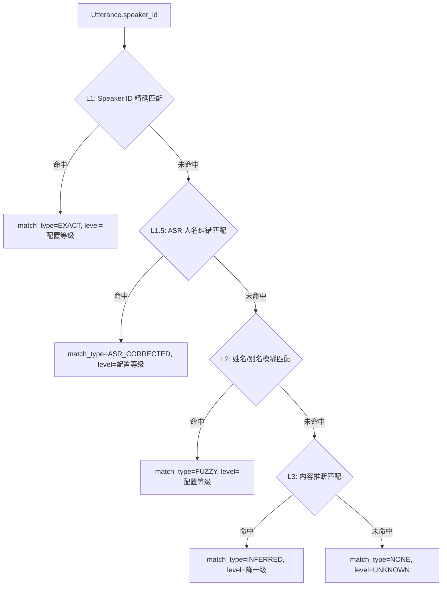
```mermaid
flowchart TD
    S[Utterance.speaker_id] --> L1{L1: Speaker ID 精确匹配}
    L1 -- 命中 --> R1[match_type=EXACT, level=配置等级]
    L1 -- 未命中 --> L15{L1.5: ASR 人名纠错匹配}
    L15 -- 命中 --> R15[match_type=ASR_CORRECTED, level=配置等级]
    L15 -- 未命中 --> L2{L2: 姓名/别名模糊匹配}
    L2 -- 命中 --> R2[match_type=FUZZY, level=配置等级]
    L2 -- 未命中 --> L3{L3: 内容推断匹配}
    L3 -- 命中 --> R3["match_type=INFERRED, level=降一级"]
    L3 -- 未命中 --> RN[match_type=NONE, level=UNKNOWN]
```

#### 2.4.3 各层匹配逻辑

<!-- FIXED: BLOCK-9 — 所有匹配逻辑统一返回 MatchResult，使用 MatchType 枚举 -->

**L1 — Speaker ID 精确匹配**：
```
for person in key_people:
    if utterance.speaker_id in person.speaker_ids:
        return MatchResult(person_id=person.id, person_name=person.name,
                           level=person.level, original_level=person.level,
                           match_type=MatchType.EXACT, confidence=0.98)
```

**L1.5 — ASR 人名纠错匹配**：
```
extracted_names = extract_names_from_text(utterance.text)
for name in extracted_names:
    for correction in asr_corrections:
        if name in correction.variants:
            person = find_person_by_name(correction.target)
            if person:
                return MatchResult(person_id=person.id, person_name=person.name,
                                   level=person.level, original_level=person.level,
                                   match_type=MatchType.ASR_CORRECTED, confidence=0.92)
```

**L2 — 姓名/别名模糊匹配**：
```
# 利用 speaker_name（AI听记提供）或文本中的自报姓名
candidate_name = utterance.speaker_name or extract_self_introduction(utterance.text)
if candidate_name:
    for person in key_people:
        if fuzzy_match(candidate_name, person.name, person.aliases, threshold=0.8):
            return MatchResult(person_id=person.id, person_name=person.name,
                               level=person.level, original_level=person.level,
                               match_type=MatchType.FUZZY, confidence=0.87)
```

**L3 — 内容推断匹配**：
```
# 基于上下文语义推断：如"总裁指示..."中虽无直呼姓名但可推断
inferred_person = infer_speaker_from_context(utterance.text, key_people)
if inferred_person:
    effective_level = downgrade_level(inferred_person.level)  # P0→P1, P1→P2, P2→P3
    return MatchResult(person_id=inferred_person.id, person_name=inferred_person.name,
                       level=effective_level, original_level=inferred_person.level,
                       match_type=MatchType.INFERRED, confidence=0.75)
```

#### 2.4.4 匹配结果数据结构（统一定义）

<!-- FIXED: BLOCK-9 — 统一 MatchResult，定义于 models/types.py -->

```python
# 定义于 models/types.py，全局唯一

class MatchType(str, Enum):
    EXACT = "exact"
    ASR_CORRECTED = "asr_corrected"
    FUZZY = "fuzzy"           # 统一，替代原 "alias"
    INFERRED = "inferred"
    NONE = "none"             # 统一，替代原 "unknown"

@dataclass(frozen=True)
class MatchResult:
    person_id: Optional[str]     # 关键人 ID，未匹配时为 None
    person_name: Optional[str]   # 关键人姓名
    level: str                   # 有效等级："P0" | "P1" | "P2" | "P3" | "UNKNOWN"
    original_level: Optional[str]  # 原始等级（仅 INFERRED 时与 level 不同）
    match_type: MatchType        # 使用 MatchType 枚举
    confidence: float            # 匹配置信度
```

#### 2.4.5 异常处理

| 场景 | 处理 |
|:---|:---|
| 同一 speaker_id 在不同 Utterance 匹配到不同关键人 | 取置信度最高的匹配结果全局统一，记录 WARNING |
| L3 推断匹配到多个候选人 | 取置信度最高者，若差距 <0.1 则标记 `ambiguous`，不做匹配 |
| 关键人配置为空 | 所有 Utterance 的 `match_result.match_type` 均为 `MatchType.NONE`，正常继续 |

---

### 2.5 预处理层最终输出

<!-- FIXED: BLOCK-5 — 输出改为扁平 list[Utterance]，不再包装 ProcessedSession -->

预处理层的最终输出为 **扁平的 `list[Utterance]`**，每个 Utterance 已包含 `features` 和 `match_result` 字段。会话切分由下游 Module 2 的 `SessionDetector` 负责。

```python
# 预处理层输出签名
def process(self, session: SessionRaw) -> list[Utterance]:
    ...

# 输出示例（伪）：
# [
#     Utterance(utterance_id="utt_0_0001", speaker_id="spk_001", ...,
#               features=UtteranceFeatures(...), match_result=MatchResult(...)),
#     Utterance(utterance_id="utt_3200_0002", speaker_id="spk_002", ...,
#               features=UtteranceFeatures(...), match_result=MatchResult(...)),
#     ...
# ]
```

> **元信息说明**：原 `SessionMetadata`（如 `dominant_speaker_id`、`scene_guess`、`avg_asr_confidence`）不再由 Module 1 计算。这些统计信息在 Module 2 完成会话检测后按 Session 粒度计算。

---

### 2.6 配置汇总（PreprocessorConfig）

<!-- FIXED: BLOCK-5 — 移除 Step 1 会话检测配置；FIXED: 去掉 config/keywords.yaml 引用 -->

```python
@dataclass
class PreprocessorConfig:
    # Step 1: 置信度过滤
    p0_asr_threshold: float = 0.35
    p1_asr_threshold: float = 0.40
    p2_asr_threshold: float = 0.50
    default_asr_threshold: float = 0.60
    cold_start_threshold: float = 0.25
    is_cold_start: bool = False               # 冷启动模式开关

    # Step 2: 话语合并
    merge_gap_threshold_ms: int = 4_000       # 4 秒
    merge_max_duration_ms: int = 120_000      # 120 秒

    # Step 3: 特征计算
    time_period_boundaries: dict[str, tuple[int, int]] = field(
        default_factory=lambda: {
            "morning": (6, 12),
            "afternoon": (12, 18),
            "evening": (18, 24),
        }
    )

    # Step 4: 关键人匹配
    asr_corrections_path: str = "config/asr_name_corrections.yaml"
    fuzzy_match_threshold: float = 0.80       # L2 模糊匹配相似度阈值
    inferred_match_min_confidence: float = 0.70  # L3 推断匹配最低置信度
```

---

### 2.8 全局异常处理策略

| 层级 | 策略 | 说明 |
|:---|:---|:---|
| 单个 Segment 异常 | 跳过该 Segment，记录日志 | 不影响其余数据处理 |
| 单个 ConversationSession 全部被过滤 | 标记 `LOW_QUALITY`，保留元信息但不输出 Utterance | 日报中备注"存在低质量录音段" |
| 预处理层整体异常（如配置加载失败） | 阻止流水线启动，返回明确错误 | 不产出任何结果，避免静默失败 |
| 关键人配置加载失败 | 使用上一次成功加载的配置继续处理 | 记录 ERROR 日志，通知运维 |


---

# 架构详设：会话检测 + 碎片聚合 + 分片引擎

> 本文档覆盖模块 3（会话检测器）、模块 4（碎片聚合器）、模块 5（分片引擎）的详细设计。
> 对应 PRD §1.2.2 分片策略引擎。

---

## 目录

1. [共享数据结构定义](#1-共享数据结构定义)
2. [模块 3：会话检测器 `core/session_detector.py`](#2-模块-3会话检测器)
3. [模块 4：碎片聚合器 `core/fragment_aggregator.py`](#3-模块-4碎片聚合器)
4. [模块 5：分片引擎 `core/chunking_engine.py`](#4-模块-5分片引擎)
5. [关键参数汇总表](#5-关键参数汇总表)

---

## 1. 共享数据结构定义

<!-- FIXED: BLOCK-1 — 统一引用 models/types.py 中的 Utterance 数据结构，与 Module 1 保持一致 -->
<!-- FIXED: BLOCK-9 — 统一使用 MatchResult + MatchType 枚举 -->

以下类型贯穿三个模块，统一定义于 `models/types.py`（而非 `core/types.py`），确保 Module 1 生产、Module 2 消费的 Utterance 完全一致。

```python
from __future__ import annotations
from dataclasses import dataclass, field
from enum import Enum
from typing import Optional, Sequence

# ── 基础枚举 ─────────────────────────────────────────

class AlignmentQuality(str, Enum):
    HIGH = "high"
    MEDIUM = "medium"
    LOW = "low"

class MatchType(str, Enum):
    EXACT = "exact"
    ASR_CORRECTED = "asr_corrected"
    FUZZY = "fuzzy"
    INFERRED = "inferred"
    NONE = "none"

# ── 匹配结果 ─────────────────────────────────────────

@dataclass(frozen=True)
class MatchResult:
    person_id: Optional[str]
    person_name: Optional[str]
    level: str                            # "P0" | "P1" | "P2" | "P3" | "UNKNOWN"
    original_level: Optional[str]
    match_type: MatchType
    confidence: float

# ── 特征结构 ─────────────────────────────────────────

@dataclass
class UtteranceFeatures:
    duration_sec: float
    start_time_of_day: str
    time_period: str
    position_in_session: float
    speaker_id: str
    turn_index: int
    speaker_turn_count: int
    speaker_duration_ratio: float
    char_count: int
    char_rate: float
    sentence_count: int
    keyword_density: float
    contains_question: bool
    contains_action_word: bool
    scene_guess: Optional[str]

# ── 输入层核心结构 ───────────────────────────────────

@dataclass(frozen=True)
class Utterance:
    """预处理后的最小对话单元（合并后的话语段）。
    由 Module 1 生产，Module 2 消费。定义于 models/types.py，全局唯一。
    """
    utterance_id: str                     # 全局唯一标识，如 "utt_20260327_093012_001"
    speaker_id: str                       # 说话人标识
    speaker_name: Optional[str]           # ASR / 配置推断的姓名
    text: str                             # ASR 识别文本
    start_time: float                     # 起始时间戳（秒，相对录音起点）
    end_time: float                       # 结束时间戳（秒）
    asr_confidence: float                 # ASR 置信度 0.0-1.0（合并时取 avg）
    speaker_confidence: float             # 说话人归属置信度 0.0-1.0
    alignment_quality: AlignmentQuality   # 对齐质量，Enum: HIGH/MEDIUM/LOW
    token_count: int                      # 预计算的 token 数
    match_result: Optional[MatchResult]   # 关键人匹配结果（Module 1 Step 4 填充）
    features: Optional[UtteranceFeatures] # 特征（Module 1 Step 3 填充）
    segment_count: int                    # 合并的原始 segment 数量

    @property
    def duration(self) -> float:
        return self.end_time - self.start_time

    @property
    def key_person_level(self) -> Optional[str]:
        """便捷属性：从 match_result 中提取关键人等级。"""
        if self.match_result and self.match_result.match_type != MatchType.NONE:
            return self.match_result.level
        return None

# ── 会话检测输出 ─────────────────────────────────────

@dataclass
class Session:
    """自然对话会话——L0 硬约束边界单元。"""
    session_id: str                       # 如 "sess_001"
    utterances: list[Utterance]           # 包含的有序 utterance 列表
    start_time: float                     # 第一条 utterance.start_time
    end_time: float                       # 最后一条 utterance.end_time
    total_tokens: int                     # 所有 utterance token 之和
    speaker_set: set[str]                 # 出现过的说话人 ID 集合
    has_key_person: bool                  # 是否包含 P0/P1 关键人
    gap_before: Optional[float]           # 与前一个 Session 之间的静默时长（秒）

    @property
    def duration(self) -> float:
        return self.end_time - self.start_time

# ── 碎片聚合输出 ─────────────────────────────────────

@dataclass
class AggregatedPack:
    """碎片聚合包——将多个短 Session 打包为一个处理单元。"""
    pack_id: str                          # 如 "pack_003"
    sessions: list[Session]               # 被聚合的 Session 列表
    start_time: float
    end_time: float
    total_tokens: int
    is_aggregated: bool = True            # 标记是否为聚合产物

    @property
    def duration(self) -> float:
        return self.end_time - self.start_time

# ── 分片引擎输出 ─────────────────────────────────────

@dataclass
class Chunk:
    """最终分片——送入 LLM 的处理单元。"""
    chunk_id: str                         # 如 "chunk_001"
    sessions: list[Session]               # 包含的 Session（可能含 AggregatedPack 展开后的 Session）
    utterances: list[Utterance]           # 扁平化的全部 utterance
    start_time: float
    end_time: float
    total_tokens: int
    strategy_used: str                    # 产生此 chunk 的策略名，如 "L1_key_person"
    label: Optional[str]                  # 可读标签，如 "战略研讨会-第2部分，共4部分"
    tail_context_summary: Optional[str]   # 尾部上下文摘要（200-300 字）
    key_persons_involved: list[str]       # 涉及的关键人 ID 列表
    boundary_score: float                 # 边界质量评分 0.0-1.0

@dataclass
class ChunkingResult:
    """分片引擎总输出。"""
    chunks: list[Chunk]
    mode: str                             # "short_day" | "long_day"
    total_tokens: int
    metadata: dict                        # 策略选择日志、边界统计等
```

---

## 2. 模块 3：会话检测器

> 文件：`core/session_detector.py`
> 职责：识别全天录音中的自然对话边界，产出 Session 列表，作为后续所有分片策略的 **L0 硬约束**。

### 2.1 输入 / 输出

```python
# 输入
utterances: list[Utterance]   # 按 start_time 升序排列的预处理后 utterance 列表

# 输出
sessions: list[Session]       # 按时间排序的 Session 列表
```

### 2.2 双条件门控算法

核心检测条件：**静默 > 3 分钟** AND **说话人变化**（双条件同时满足才切分）。

设计意图：
- 仅用静默阈值会将"单人长时间思考后继续发言"误切为两段。
- 仅用说话人变化会在快速轮换对话中产生过多切分。
- 双条件门控在两者交集处切分，精准识别"一段对话结束、另一段对话开始"。

**说话人变化的定义**：比较静默前后各 N 条 utterance（默认 N=3）的说话人集合，若 Jaccard 距离 > 0.5 则认定发生变化。当静默前后仅有 1 条 utterance 时，直接比较 speaker_id 是否不同。

### 2.3 核心算法伪代码

```python
class SessionDetector:
    """会话检测器——双条件门控。"""

    def __init__(
        self,
        silence_threshold: float = 180.0,       # 静默阈值（秒），默认 3 分钟
        speaker_window: int = 3,                 # 说话人变化检测窗口大小
        jaccard_threshold: float = 0.5,          # 说话人集合 Jaccard 距离阈值
        max_session_duration: float = 7200.0,    # 最大会话时长（秒），默认 2 小时
        monologue_silence_threshold: float = 600.0,  # 独白场景静默阈值（秒），默认 10 分钟
    ):
        ...

    def detect(self, utterances: list[Utterance]) -> list[Session]:
        if not utterances:
            return []

        boundaries: list[int] = []  # 存储切分点的 utterance 索引

        for i in range(1, len(utterances)):
            gap = utterances[i].start_time - utterances[i - 1].end_time

            if gap <= self.silence_threshold:
                continue

            # 条件 1：静默超过阈值 ✓
            # 条件 2：检测说话人变化
            speakers_before = self._get_speaker_set(utterances, end=i, window=self.speaker_window)
            speakers_after  = self._get_speaker_set(utterances, start=i, window=self.speaker_window)
            speaker_changed = self._jaccard_distance(speakers_before, speakers_after) > self.jaccard_threshold

            if speaker_changed:
                boundaries.append(i)
            elif gap > self.monologue_silence_threshold:
                # 边界 case：超长静默（>10min）即使同一说话人也强制切分
                boundaries.append(i)

        # 后处理：超长 Session 内部强制切分
        sessions = self._split_by_boundaries(utterances, boundaries)
        sessions = self._enforce_max_duration(sessions)

        return sessions

    def _get_speaker_set(self, utterances, start=None, end=None, window=3) -> set[str]:
        """取指定范围内最近 window 条 utterance 的说话人集合。"""
        if end is not None:
            segment = utterances[max(0, end - window):end]
        else:
            segment = utterances[start:start + window]
        return {u.speaker_id for u in segment}

    @staticmethod
    def _jaccard_distance(set_a: set, set_b: set) -> float:
        if not set_a and not set_b:
            return 0.0
        union = set_a | set_b
        intersection = set_a & set_b
        return 1.0 - len(intersection) / len(union)

    def _enforce_max_duration(self, sessions: list[Session]) -> list[Session]:
        """超过 max_session_duration 的 Session 按时间均分再切。"""
        result = []
        for session in sessions:
            if session.duration <= self.max_session_duration:
                result.append(session)
            else:
                # 在最大静默间隔处切分，退化为等时间窗口切分
                sub_sessions = self._split_long_session(session)
                result.extend(sub_sessions)
        return result
```

### 2.4 边界 Case 处理

| 场景 | 检测行为 | 处理策略 |
|:---|:---|:---|
| **单人长时间独白**（如 2 小时讲座） | 静默>3min 条件可能满足，但说话人不变，门控不触发 | 若静默>10min（`monologue_silence_threshold`）强制切分；若 Session 超过 `max_session_duration` 则在内部最大静默点切分 |
| **全天无明显静默** | 所有 gap < 3min，不产生任何切分点 | 整天作为单个 Session；交由分片引擎 L1-L3 策略处理内部切分 |
| **频繁短静默**（如嘈杂环境） | gap 分布均匀但都 < 3min | 不触发切分，保持完整会话 |
| **录音中断恢复**（gap 极大，如数小时） | gap >> 3min 且大概率说话人变化 | 自然触发切分 |
| **仅 1 条 utterance** | 无 gap 可计算 | 返回包含单条 utterance 的 Session |
| **空输入** | 无 utterance | 返回空列表 |

### 2.5 流程图

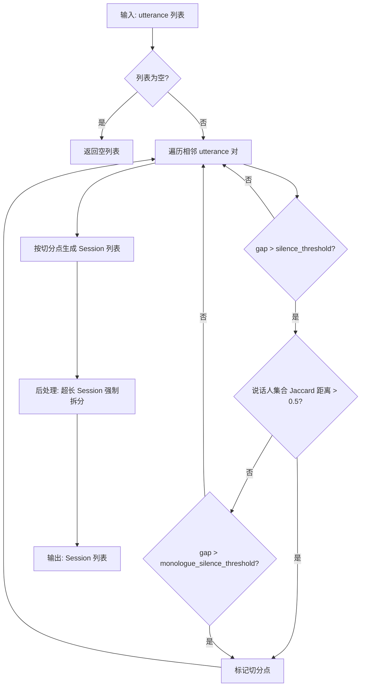
```mermaid
flowchart TD
    A[输入: utterance 列表] --> B{列表为空?}
    B -- 是 --> C[返回空列表]
    B -- 否 --> D[遍历相邻 utterance 对]
    D --> E{gap > silence_threshold?}
    E -- 否 --> D
    E -- 是 --> F{说话人集合 Jaccard 距离 > 0.5?}
    F -- 是 --> G[标记切分点]
    F -- 否 --> H{gap > monologue_silence_threshold?}
    H -- 是 --> G
    H -- 否 --> D
    G --> D
    D --> I[按切分点生成 Session 列表]
    I --> J[后处理: 超长 Session 强制拆分]
    J --> K[输出: Session 列表]
```

---

## 3. 模块 4：碎片聚合器

> 文件：`core/fragment_aggregator.py`
> 职责：将 <5 分钟的非关键人短对话 Session 按时间邻近性聚合打包，避免碎片化浪费 LLM 调用。

### 3.1 输入 / 输出

```python
# 输入
sessions: list[Session]          # 会话检测器输出的 Session 列表（按时间排序）

# 输出
processing_units: list[Session | AggregatedPack]
# 返回混合列表：不需要聚合的 Session 原样保留，被聚合的 Session 打包为 AggregatedPack
```

### 3.2 聚合规则

| 规则 | 阈值 | 说明 |
|:---|:---|:---|
| 候选条件 | `duration < 300s`（5 分钟） | 仅对短 Session 执行聚合 |
| 关键人排除 | `has_key_person == False` | 含 P0/P1 关键人的 Session 不参与聚合 |
| 聚合包上限 | `pack_duration <= 900s`（15 分钟） | 单个聚合包总时长不超过 15 分钟 |
| 时间邻近性 | `gap <= 600s`（10 分钟） | 相邻候选 Session 间隔不超过 10 分钟才可聚合 |

### 3.3 时间邻近性分组算法

```python
class FragmentAggregator:
    """碎片聚合器——按时间邻近性打包非关键人短对话。"""

    def __init__(
        self,
        short_session_threshold: float = 300.0,   # 短 Session 阈值（秒）
        pack_duration_limit: float = 900.0,        # 聚合包时长上限（秒）
        proximity_threshold: float = 600.0,        # 时间邻近阈值（秒）
        min_aggregation_count: int = 2,            # 至少聚合 2 个 Session 才打包
    ):
        ...

    def aggregate(self, sessions: list[Session]) -> list[Session | AggregatedPack]:
        result: list[Session | AggregatedPack] = []
        pending: list[Session] = []       # 待聚合缓冲区
        pending_duration: float = 0.0     # 缓冲区累计时长

        for session in sessions:
            if not self._is_aggregation_candidate(session):
                # 非候选：先 flush 缓冲区，再原样输出当前 Session
                self._flush_pending(pending, result)
                pending, pending_duration = [], 0.0
                result.append(session)
                continue

            # 检查是否可以加入当前缓冲区
            if pending and not self._is_proximate(pending[-1], session):
                # 时间不邻近：flush 并开启新缓冲区
                self._flush_pending(pending, result)
                pending, pending_duration = [], 0.0

            # 检查加入后是否超限
            candidate_duration = pending_duration + session.duration
            if candidate_duration > self.pack_duration_limit and pending:
                # 超限：flush 当前缓冲区，当前 Session 开启新缓冲区
                self._flush_pending(pending, result)
                pending, pending_duration = [], 0.0

            pending.append(session)
            pending_duration += session.duration

        # 处理末尾缓冲区
        self._flush_pending(pending, result)
        return result

    def _is_aggregation_candidate(self, session: Session) -> bool:
        return (
            session.duration < self.short_session_threshold
            and not session.has_key_person
        )

    def _is_proximate(self, prev: Session, curr: Session) -> bool:
        gap = curr.start_time - prev.end_time
        return gap <= self.proximity_threshold

    def _flush_pending(
        self,
        pending: list[Session],
        result: list[Session | AggregatedPack],
    ) -> None:
        if not pending:
            return
        if len(pending) < self.min_aggregation_count:
            # 不足 2 个，不聚合，原样输出
            result.extend(pending)
        else:
            pack = AggregatedPack(
                pack_id=self._generate_pack_id(),
                sessions=list(pending),
                start_time=pending[0].start_time,
                end_time=pending[-1].end_time,
                total_tokens=sum(s.total_tokens for s in pending),
            )
            result.append(pack)
```

### 3.4 流程图

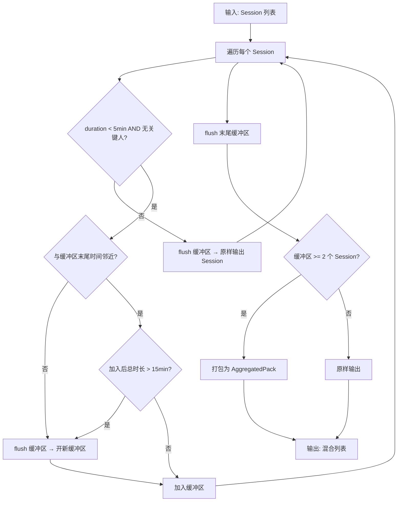
```mermaid
flowchart TD
    A[输入: Session 列表] --> B[遍历每个 Session]
    B --> C{duration < 5min AND 无关键人?}
    C -- 否 --> D[flush 缓冲区 → 原样输出 Session]
    C -- 是 --> E{与缓冲区末尾时间邻近?}
    E -- 否 --> F[flush 缓冲区 → 开新缓冲区]
    E -- 是 --> G{加入后总时长 > 15min?}
    G -- 是 --> F
    G -- 否 --> H[加入缓冲区]
    F --> H
    D --> B
    H --> B
    B --> I[flush 末尾缓冲区]
    I --> J{缓冲区 >= 2 个 Session?}
    J -- 是 --> K[打包为 AggregatedPack]
    J -- 否 --> L[原样输出]
    K --> M[输出: 混合列表]
    L --> M
```

---

## 4. 模块 5：分片引擎

> 文件：`core/chunking_engine.py`
> 职责：将会话检测 + 碎片聚合后的处理单元，按照 L0→L1→L2→L3 四级分层策略切分为最终 Chunk，送入 LLM 摘要生成。

<!-- FIXED: BLOCK-10 — 明确区分 80K（摘要模式切换阈值）与 200K（单 Chunk token 上限） -->

> **重要阈值区分**：
> - `short_day_threshold = 80,000 tokens`：由上游 `SummaryOrchestrator` 判断日类型（短日/长日）。当全天总 token < 80K 时走短日模式（全量单次输入 LLM），分片引擎**不被调用**。
> - `chunk_token_budget = 200,000 tokens`：分片引擎内部参数，单个 Chunk 的最大 token 容量。仅在 long_day 模式（全天 >= 80K）或 degraded 模式下，分片引擎才被调用，此时每个 Chunk 上限为 200K。
> - 分片引擎仅在 **long_day / degraded** 模式下被调用，短日模式下整条流水线跳过分片直接进入摘要生成。

### 4.1 插件化架构设计

分片引擎采用 **策略模式（Strategy Pattern）** + **责任链（Chain of Responsibility）** 混合架构。每一层策略实现统一的抽象接口，引擎按优先级顺序逐层应用。

#### 4.1.1 策略接口定义（抽象类）

```python
from abc import ABC, abstractmethod
from dataclasses import dataclass

@dataclass
class ChunkingContext:
    """策略执行上下文——在策略链中传递的共享状态。"""
    token_budget: int                          # 单 Chunk 目标 token 上限
    total_tokens: int                          # 全天总 token 数
    key_person_config: dict                    # 关键人配置
    sessions: list[Session]                    # L0 会话检测结果（不可变引用）
    processing_units: list[Session | AggregatedPack]  # 聚合后的处理单元

@dataclass
class BoundaryCandidate:
    """候选切分边界。"""
    position_time: float                       # 候选边界时间点（秒）
    score: float                               # 边界质量评分 0.0-1.0
    source: str                                # 来源策略标识
    utterance_index: int                       # 最近的 utterance 索引
    is_session_boundary: bool                  # 是否恰好在 Session 边界上

class ChunkingStrategy(ABC):
    """分片策略抽象接口——所有策略层必须实现。"""

    @property
    @abstractmethod
    def name(self) -> str:
        """策略名称标识，如 'L0_session', 'L1_key_person'。"""
        ...

    @property
    @abstractmethod
    def priority(self) -> int:
        """优先级，数值越小越优先。L0=0, L1=1, L2=2, L3=3。"""
        ...

    @abstractmethod
    def find_boundaries(
        self,
        units: list[Session | AggregatedPack],
        context: ChunkingContext,
    ) -> list[BoundaryCandidate]:
        """识别候选切分边界。

        Args:
            units: 待切分的处理单元序列。
            context: 策略执行上下文。

        Returns:
            候选边界列表，按 position_time 升序。
        """
        ...

    @abstractmethod
    def validate_chunk(self, chunk: Chunk, context: ChunkingContext) -> bool:
        """校验生成的 Chunk 是否满足本策略的约束。"""
        ...
```

#### 4.1.2 引擎主控逻辑

```python
class ChunkingEngine:
    """分片引擎主控——协调四级策略链。"""

    def __init__(
        self,
        strategies: list[ChunkingStrategy] | None = None,
        token_budget: int = 200_000,
        soft_boundary_range: tuple[float, float] = (60.0, 90.0),
    ):
        # 默认策略链
        self.strategies = sorted(
            strategies or [
                L0SessionStrategy(),
                L1KeyPersonStrategy(),
                L2TopicBoundaryStrategy(),
                L3TimeWindowStrategy(),
            ],
            key=lambda s: s.priority,
        )
        self.token_budget = token_budget
        self.soft_boundary_range = soft_boundary_range

    def chunk(
        self,
        sessions: list[Session],
        processing_units: list[Session | AggregatedPack],
        key_person_config: dict,
    ) -> ChunkingResult:
        total_tokens = sum(s.total_tokens for s in sessions)

        context = ChunkingContext(
            token_budget=self.token_budget,
            total_tokens=total_tokens,
            key_person_config=key_person_config,
            sessions=sessions,
            processing_units=processing_units,
        )

        <!-- FIXED: BLOCK-10 — 此处 token_budget=200K 是单 Chunk 容量上限，非短日阈值（80K）。
             短日/长日模式切换由上游 SummaryOrchestrator 判断（80K 阈值），
             分片引擎仅在 long_day/degraded 模式下被调用。
             若全天 token 恰好 < 200K（但 >= 80K），仍打包为单个 Chunk。 -->
        # 全天总 token 低于单 Chunk 容量：打包为单个 Chunk
        if total_tokens <= self.token_budget:
            return self._build_single_chunk(sessions, context)

        # 长日路径：逐层收集边界候选
        all_boundaries = self._collect_boundaries(context)

        # 边界融合与去重
        merged = self._merge_boundaries(all_boundaries)

        # 软边界搜索优化
        optimized = [self._optimize_boundary(b, sessions) for b in merged]

        # 按边界切分生成 Chunk
        chunks = self._split_into_chunks(sessions, optimized, context)

        # 生成尾部上下文摘要
        self._attach_tail_context(chunks)

        return ChunkingResult(
            chunks=chunks,
            mode="long_day",
            total_tokens=total_tokens,
            metadata={"boundaries": optimized, "strategy_chain": [s.name for s in self.strategies]},
        )
```

### 4.2 L0 会话检测策略（硬约束）

L0 不额外产生新边界——它确立一条铁律：**任何 Chunk 不得跨越 Session 边界**。所有上游 Session 边界自动成为不可违反的切分点。

```python
class L0SessionStrategy(ChunkingStrategy):
    name = "L0_session"
    priority = 0

    def find_boundaries(self, units, context) -> list[BoundaryCandidate]:
        boundaries = []
        for i in range(1, len(context.sessions)):
            prev = context.sessions[i - 1]
            curr = context.sessions[i]
            boundaries.append(BoundaryCandidate(
                position_time=curr.start_time,
                score=1.0,                       # 硬约束，评分满分
                source=self.name,
                utterance_index=self._find_utterance_index(curr),
                is_session_boundary=True,
            ))
        return boundaries

    def validate_chunk(self, chunk, context) -> bool:
        # 校验：Chunk 中的所有 utterance 必须属于同一组连续 Session
        session_ids = {self._get_session_id(u, context) for u in chunk.utterances}
        return self._are_consecutive(session_ids, context)
```

### 4.3 L1 关键人保护策略（优先约束）

#### 4.3.1 保护区定义

"关键人保护区"是指 **P0/P1 关键人连续参与对话的时间段**。保护区内的内容不被切分（除非超过 60 分钟触发内部再细分）。

```python
@dataclass
class ProtectionZone:
    """关键人保护区。"""
    zone_id: str
    key_person_ids: list[str]             # 涉及的关键人
    key_person_level: str                 # 最高等级，如 "P0"（来自 Utterance.key_person_level）
    start_time: float
    end_time: float
    utterances: list[Utterance]
    total_tokens: int

    @property
    def duration(self) -> float:
        return self.end_time - self.start_time
```

#### 4.3.2 优先约束实现逻辑

```python
class L1KeyPersonStrategy(ChunkingStrategy):
    name = "L1_key_person"
    priority = 1

    KEY_PERSON_GAP_THRESHOLD = 120.0       # 关键人对话间隔超过 2min 认为保护区结束
    MAX_ZONE_DURATION = 3600.0             # 保护区上限 60min，超过则内部再细分
    BOUNDARY_TOLERANCE = 90.0              # 与其他策略边界吻合容差（秒）

    def find_boundaries(self, units, context) -> list[BoundaryCandidate]:
        # Step 1: 扫描所有 utterance，识别关键人保护区
        zones = self._detect_protection_zones(context.sessions, context.key_person_config)

        boundaries = []
        for zone in zones:
            # Step 2: 保护区边界作为优先约束边界
            boundaries.append(BoundaryCandidate(
                position_time=zone.start_time,
                score=0.9,                       # 高分但非 1.0（为 L0 保留）
                source=self.name,
                utterance_index=...,
                is_session_boundary=False,
            ))
            boundaries.append(BoundaryCandidate(
                position_time=zone.end_time,
                score=0.9,
                source=self.name,
                utterance_index=...,
                is_session_boundary=False,
            ))

            # Step 3: 超长保护区内部切分
            if zone.duration > self.MAX_ZONE_DURATION:
                inner_boundaries = self._subdivide_zone(zone, context)
                boundaries.extend(inner_boundaries)

        return boundaries

    def _detect_protection_zones(
        self,
        sessions: list[Session],
        key_person_config: dict,
    ) -> list[ProtectionZone]:
        """扫描 utterance 序列，将 P0/P1 关键人连续参与的区间标记为保护区。

        算法：
        1. 遍历所有 utterance（跨 Session 不合并，因 L0 硬约束）
        2. 当遇到 P0/P1 关键人 utterance，开始或延续保护区
        3. 当连续 KEY_PERSON_GAP_THRESHOLD 秒无关键人发言，关闭保护区
        """
        zones = []
        current_zone_utts: list[Utterance] = []
        last_kp_time = -float("inf")

        for session in sessions:
            for utt in session.utterances:
                is_kp = utt.key_person_level in ("P0", "P1")
                if is_kp:
                    if utt.start_time - last_kp_time > self.KEY_PERSON_GAP_THRESHOLD and current_zone_utts:
                        zones.append(self._build_zone(current_zone_utts))
                        current_zone_utts = []
                    current_zone_utts.append(utt)
                    last_kp_time = utt.end_time
                else:
                    # 非关键人 utterance：若在保护区窗口内，也纳入保护区
                    if current_zone_utts and (utt.start_time - last_kp_time <= self.KEY_PERSON_GAP_THRESHOLD):
                        current_zone_utts.append(utt)

            # Session 边界处强制关闭保护区（L0 硬约束）
            if current_zone_utts:
                zones.append(self._build_zone(current_zone_utts))
                current_zone_utts = []
                last_kp_time = -float("inf")

        return zones

    <!-- FIXED: _subdivide_zone 补充伪代码 -->
    def _subdivide_zone(self, zone: ProtectionZone, context: ChunkingContext) -> list[BoundaryCandidate]:
        """超长保护区（>60min）内部再细分。

        策略：优先使用 L2 主题边界；若无合适主题边界则退化为时间窗口等分。
        切分后每段标注关联性标签，如 "战略研讨会-第2部分，共4部分"。
        """
        # Step 1: 尝试用 L2 主题边界策略在保护区内部寻找自然切分点
        l2 = L2TopicBoundaryStrategy()
        # 构造仅含保护区 utterance 的虚拟处理单元
        virtual_session = Session(
            session_id=f"{zone.zone_id}_virtual",
            utterances=zone.utterances,
            start_time=zone.start_time,
            end_time=zone.end_time,
            total_tokens=zone.total_tokens,
            speaker_set={u.speaker_id for u in zone.utterances},
            has_key_person=True,
            gap_before=None,
        )
        inner_candidates = l2.find_boundaries(
            [virtual_session],
            context,
        )

        # Step 2: 筛选——仅保留能将保护区切为 <= MAX_ZONE_DURATION 段的边界
        target_parts = math.ceil(zone.duration / self.MAX_ZONE_DURATION)
        if len(inner_candidates) >= target_parts - 1:
            # 按分数降序取前 target_parts - 1 个，再按时间排序
            selected = sorted(inner_candidates, key=lambda b: -b.score)[:target_parts - 1]
            selected.sort(key=lambda b: b.position_time)
        else:
            # Step 3: L2 边界不足，退化为等时间窗口切分
            window = zone.duration / target_parts
            selected = []
            for k in range(1, target_parts):
                t = zone.start_time + window * k
                selected.append(BoundaryCandidate(
                    position_time=t,
                    score=0.5,           # 中等分数，低于 L1 但高于 L3
                    source=f"{self.name}_subdivide",
                    utterance_index=self._nearest_utterance_in_zone(t, zone),
                    is_session_boundary=False,
                ))

        # Step 4: 为每段标注关联性标签
        total_parts = len(selected) + 1
        for idx, boundary in enumerate(selected):
            boundary.label = f"第{idx + 1}部分，共{total_parts}部分"

        return selected

    def validate_chunk(self, chunk, context) -> bool:
        # 校验：P0/P1 关键人的连续对话不被割裂（除非超长再细分）
        ...
```

#### 4.3.3 优先约束冲突解决

当 L1 保护区边界与 L2/L3 边界冲突时：

| 冲突场景 | 解决规则 |
|:---|:---|
| L2 主题边界在保护区**内部** | 忽略 L2 边界，保护区完整保留 |
| L2 边界与保护区边界偏差 < 90s | 采用 L2 边界（更自然的切分点） |
| L2 边界与保护区边界偏差 >= 90s | 保留 L1 保护区边界 |
| L3 时间窗口切入保护区内部 | 忽略 L3，保护区完整保留 |

```python
def _resolve_conflict(
    self,
    l1_boundary: BoundaryCandidate,
    other_boundary: BoundaryCandidate,
) -> BoundaryCandidate:
    distance = abs(l1_boundary.position_time - other_boundary.position_time)
    if distance < self.BOUNDARY_TOLERANCE:
        # 高度吻合：采用另一策略的边界（更自然）
        other_boundary.score = max(other_boundary.score, l1_boundary.score)
        return other_boundary
    else:
        # 不吻合：L1 优先
        return l1_boundary
```

### 4.4 L2 主题边界策略（多信号融合）

#### 4.4.1 三信号融合算法

| 信号 | 权重 | 检测方式 | 实现细节 |
|:---|:---|:---|:---|
| 说话人切换 | **0.35** | 滑动窗口（5min）内说话人集合 Jaccard 距离 > 0.5 | 前后各取 5min 窗口比较 |
| 静默间隔 | **0.35** | 当前 gap 超过局部均值 2 倍标准差 | 局部窗口 = 前后 10min 内的所有 gap |
<!-- FIXED: 说明 embedding 模型选型和缓存策略 -->
| 语义辅助 | **0.30** | 相邻文本窗口 embedding 余弦相似度低于阈值 | **text2vec-base-chinese**（shibing624/text2vec-base-chinese），窗口 500 字。Embedding 在 Module 1 预处理阶段按 500 字滑动窗口预计算并缓存（以 utterance_id + 窗口偏移为 key 存入内存 dict），分片引擎直接查表，避免重复推理。 |

**融合公式**：

$$
\text{BoundaryScore}(t) = 0.35 \times S_{\text{speaker}}(t) + 0.35 \times S_{\text{silence}}(t) + 0.30 \times S_{\text{semantic}}(t)
$$

当 $\text{BoundaryScore}(t) > \theta$（默认 $\theta = 0.55$）时，判定为主题边界候选。

#### 4.4.2 各信号评分计算

```python
class L2TopicBoundaryStrategy(ChunkingStrategy):
    name = "L2_topic_boundary"
    priority = 2

    SPEAKER_WEIGHT = 0.35
    SILENCE_WEIGHT = 0.35
    SEMANTIC_WEIGHT = 0.30
    BOUNDARY_THRESHOLD = 0.55              # 融合分数阈值
    SPEAKER_WINDOW_SECONDS = 300.0         # 说话人检测窗口 5min
    SILENCE_LOCAL_WINDOW = 600.0           # 静默统计局部窗口 10min
    SEMANTIC_TEXT_WINDOW = 500              # 语义比较文本窗口（字符数）
    SEMANTIC_SIMILARITY_FLOOR = 0.45       # 余弦相似度低于此值得满分
    SEMANTIC_SIMILARITY_CEIL = 0.75        # 高于此值得零分
    MIN_BOUNDARY_INTERVAL = 120.0          # 相邻边界最小间隔（秒）

    def find_boundaries(self, units, context) -> list[BoundaryCandidate]:
        all_utterances = self._flatten_utterances(units)
        candidates = []

        # 在每个 utterance 间隙处计算三信号融合分数
        for i in range(1, len(all_utterances)):
            t = all_utterances[i].start_time

            s_speaker = self._speaker_switch_score(all_utterances, i)
            s_silence = self._silence_score(all_utterances, i)
            s_semantic = self._semantic_score(all_utterances, i)

            score = (
                self.SPEAKER_WEIGHT * s_speaker
                + self.SILENCE_WEIGHT * s_silence
                + self.SEMANTIC_WEIGHT * s_semantic
            )

            if score > self.BOUNDARY_THRESHOLD:
                candidates.append(BoundaryCandidate(
                    position_time=t,
                    score=score,
                    source=self.name,
                    utterance_index=i,
                    is_session_boundary=False,
                ))

        # 后处理：合并过近的候选边界（保留得分最高者）
        return self._merge_nearby(candidates, self.MIN_BOUNDARY_INTERVAL)

    def _speaker_switch_score(self, utterances: list[Utterance], idx: int) -> float:
        """说话人切换信号评分。

        取 idx 前后各 SPEAKER_WINDOW_SECONDS 范围内的说话人集合，
        计算 Jaccard 距离。距离 > 0.5 → 1.0，距离 0.0 → 0.0，中间线性插值。
        """
        t = utterances[idx].start_time
        before = {u.speaker_id for u in utterances if t - self.SPEAKER_WINDOW_SECONDS <= u.start_time < t}
        after  = {u.speaker_id for u in utterances if t <= u.start_time <= t + self.SPEAKER_WINDOW_SECONDS}

        if not before or not after:
            return 0.0

        jd = 1.0 - len(before & after) / len(before | after)
        return min(1.0, jd / 0.5)  # 归一化：Jaccard=0.5 映射到 1.0

    def _silence_score(self, utterances: list[Utterance], idx: int) -> float:
        """静默间隔信号评分。

        当前 gap 与局部窗口内 gap 均值 + 2*标准差比较。
        超过 2σ → 1.0，低于均值 → 0.0，中间线性插值。
        """
        current_gap = utterances[idx].start_time - utterances[idx - 1].end_time
        t = utterances[idx].start_time

        # 收集局部窗口内的所有 gap
        local_gaps = []
        for j in range(1, len(utterances)):
            if abs(utterances[j].start_time - t) <= self.SILENCE_LOCAL_WINDOW:
                local_gaps.append(utterances[j].start_time - utterances[j - 1].end_time)

        if len(local_gaps) < 3:
            return 0.5  # 样本不足，给予中性分

        mean_gap = sum(local_gaps) / len(local_gaps)
        std_gap = (sum((g - mean_gap) ** 2 for g in local_gaps) / len(local_gaps)) ** 0.5

        if std_gap < 0.01:
            return 0.0

        z_score = (current_gap - mean_gap) / std_gap
        return max(0.0, min(1.0, z_score / 2.0))  # z=2 映射到 1.0

    def _semantic_score(self, utterances: list[Utterance], idx: int) -> float:
        """语义辅助信号评分。

        取 idx 前后各 SEMANTIC_TEXT_WINDOW 字符的文本，
        分别计算 embedding，用余弦相似度评估主题连续性。
        相似度越低 → 分数越高（主题变化越大）。
        """
        text_before = self._collect_text(utterances, end_idx=idx, char_limit=self.SEMANTIC_TEXT_WINDOW)
        text_after  = self._collect_text(utterances, start_idx=idx, char_limit=self.SEMANTIC_TEXT_WINDOW)

        if not text_before or not text_after:
            return 0.0

        # _get_embedding 从预计算缓存中查表（key = 文本哈希），
        # 缓存在 Module 1 预处理阶段由 EmbeddingPrecomputer 填充。
        sim = self._cosine_similarity(
            self._get_embedding(text_before),
            self._get_embedding(text_after),
        )

        # 线性映射：sim <= FLOOR → 1.0, sim >= CEIL → 0.0
        if sim <= self.SEMANTIC_SIMILARITY_FLOOR:
            return 1.0
        if sim >= self.SEMANTIC_SIMILARITY_CEIL:
            return 0.0
        return (self.SEMANTIC_SIMILARITY_CEIL - sim) / (self.SEMANTIC_SIMILARITY_CEIL - self.SEMANTIC_SIMILARITY_FLOOR)
```

### 4.5 L3 时间窗口策略（保底）

当 L1、L2 未产生足够切分点时，L3 作为保底按固定窗口切分。

<!-- FIXED: L3 时间窗口说明——30-60min 为正常保底策略，120min 为极端场景上限 -->

> **L3 时间窗口范围说明**：
> - **30-60 分钟**（`MIN_WINDOW` ~ `MAX_WINDOW`）：常规保底策略的自适应范围。`_adaptive_window` 根据 token 密度在此区间内动态选择窗口大小——密集对话缩短至 30min，稀疏对话拉长至 60min。
> - **120 分钟**：PRD 中提及的极端场景上限（如全天仅 1 个超长独白 Session，且 L1/L2 均无有效边界）。此时 L3 的 `MAX_WINDOW` 可由 `ChunkingConfig` 覆盖为 120min，作为最终兜底。默认配置下不启用 120min 窗口。

```python
class L3TimeWindowStrategy(ChunkingStrategy):
    name = "L3_time_window"
    priority = 3

    DEFAULT_WINDOW = 2700.0                # 默认窗口 45 分钟
    MIN_WINDOW = 1800.0                    # 最小 30 分钟
    MAX_WINDOW = 3600.0                    # 最大 60 分钟（极端场景可由配置覆盖为 7200.0 即 120 分钟）

    def find_boundaries(self, units, context) -> list[BoundaryCandidate]:
        total_duration = context.sessions[-1].end_time - context.sessions[0].start_time
        window = self._adaptive_window(total_duration, context.total_tokens, context.token_budget)

        boundaries = []
        t = context.sessions[0].start_time + window
        end_t = context.sessions[-1].end_time

        while t < end_t:
            boundaries.append(BoundaryCandidate(
                position_time=t,
                score=0.3,                       # 低分，仅作保底
                source=self.name,
                utterance_index=self._nearest_utterance(t, context),
                is_session_boundary=False,
            ))
            t += window

        return boundaries

    def _adaptive_window(self, total_duration: float, total_tokens: int, budget: int) -> float:
        """自适应窗口：根据 token 密度调整。

        token 密度高（说话密集）→ 缩短窗口；密度低 → 拉长窗口。
        """
        if total_duration <= 0:
            return self.DEFAULT_WINDOW

        tokens_per_second = total_tokens / total_duration
        target_tokens_per_chunk = budget * 0.8          # 目标每 chunk 填充 80% budget
        window = target_tokens_per_chunk / max(tokens_per_second, 0.1)

        return max(self.MIN_WINDOW, min(self.MAX_WINDOW, window))
```

### 4.6 软边界搜索

所有策略产出的候选边界都经过软边界搜索优化——在 **+/-60~90 秒** 范围内寻找最自然的切分点。

```python
def _optimize_boundary(
    self,
    candidate: BoundaryCandidate,
    sessions: list[Session],
) -> BoundaryCandidate:
    """在候选边界附近搜索最佳切分点。

    搜索范围：candidate.position_time ± [60, 90] 秒
    优先级：Session 边界 > 长静默间隔 > 说话人轮换 > 自然句末
    """
    search_start = candidate.position_time - self.soft_boundary_range[1]  # -90s
    search_end   = candidate.position_time + self.soft_boundary_range[1]  # +90s

    all_utterances = self._flatten_all_utterances(sessions)
    best_point = candidate
    best_quality = -1.0

    for i in range(1, len(all_utterances)):
        t = all_utterances[i].start_time
        if t < search_start or t > search_end:
            continue

        quality = 0.0

        # 信号 1：是否处于 Session 边界（最高优先）
        if self._is_session_boundary(t, sessions):
            quality += 10.0

        # 信号 2：静默间隔长度（归一化）
        gap = all_utterances[i].start_time - all_utterances[i - 1].end_time
        quality += min(gap / 30.0, 1.0) * 3.0

        # 信号 3：说话人是否切换
        if all_utterances[i].speaker_id != all_utterances[i - 1].speaker_id:
            quality += 2.0

        # 信号 4：前一句是否以句末标点结尾
        if all_utterances[i - 1].text.rstrip().endswith(("。", "！", "？", ".", "!", "?")):
            quality += 1.0

        # 信号 5：距离原始候选点的偏移惩罚
        offset = abs(t - candidate.position_time)
        quality -= offset / self.soft_boundary_range[1] * 0.5

        if quality > best_quality:
            best_quality = quality
            best_point = BoundaryCandidate(
                position_time=t,
                score=candidate.score,
                source=candidate.source,
                utterance_index=i,
                is_session_boundary=self._is_session_boundary(t, sessions),
            )

    best_point.boundary_score = min(1.0, best_quality / 10.0)
    return best_point
```

### 4.7 边界融合与去重

多策略可能在相近位置产生候选边界，需合并去重。

```python
def _merge_boundaries(
    self,
    all_boundaries: list[BoundaryCandidate],
    merge_window: float = 90.0,
) -> list[BoundaryCandidate]:
    """合并 merge_window 秒内的候选边界。

    规则：
    1. 按 position_time 排序
    2. 在 merge_window 内取 score 最高者
    3. L0（Session 边界）永远保留，不被合并替代
    """
    if not all_boundaries:
        return []

    sorted_b = sorted(all_boundaries, key=lambda b: b.position_time)
    merged = [sorted_b[0]]

    for b in sorted_b[1:]:
        prev = merged[-1]
        if b.position_time - prev.position_time < merge_window:
            # 在合并窗口内：保留硬约束或更高分者
            if prev.is_session_boundary:
                continue  # L0 不被替代
            if b.is_session_boundary or b.score > prev.score:
                merged[-1] = b
        else:
            merged.append(b)

    return merged
```

### 4.8 尾部上下文摘要生成

每个 Chunk（除最后一个）附带 `tail_context_summary` 字段，供下一 Chunk 或合并阶段参考，实现跨片段连贯性。

```python
def _attach_tail_context(self, chunks: list[Chunk]) -> None:
    """为每个 Chunk（除末尾）生成 200-300 字的尾部上下文摘要。

    生成方式：规则提取（非 LLM），从 Chunk 尾部内容中抽取关键信息。
    """
    for i in range(len(chunks) - 1):
        chunk = chunks[i]

        # 取 Chunk 最后 15% 的 utterance 作为上下文窗口
        tail_count = max(3, len(chunk.utterances) // 7)
        tail_utts = chunk.utterances[-tail_count:]

        # 提取摘要要素
        speakers = list({u.speaker_name or u.speaker_id for u in tail_utts})
        key_persons = [u.speaker_name or u.speaker_id for u in tail_utts
                                      if u.key_person_level in ("P0", "P1")]
        last_text = " ".join(u.text for u in tail_utts[-3:])  # 最后 3 句原文
        time_range = f"{self._format_time(tail_utts[0].start_time)}-{self._format_time(tail_utts[-1].end_time)}"

        summary = (
            f"[上下文接力] 时段{time_range}，"
            f"参与者: {', '.join(speakers[:5])}。"
            f"{'关键人 ' + ', '.join(key_persons) + ' 参与讨论。' if key_persons else ''}"
            f"末尾话题: {last_text[:200]}"
        )

        <!-- FIXED: 尾部上下文摘要截断改为 300 字，与 PRD 200-300 字要求对齐 -->
        chunk.tail_context_summary = summary[:300]  # 硬截断 300 字
```

**完整阶段增强方案**（MVP 后）：尾部上下文摘要可替换为轻量级 LLM 调用（`max_tokens=200`），生成更精炼的语义摘要而非规则拼接。

### 4.9 引擎完整流程图

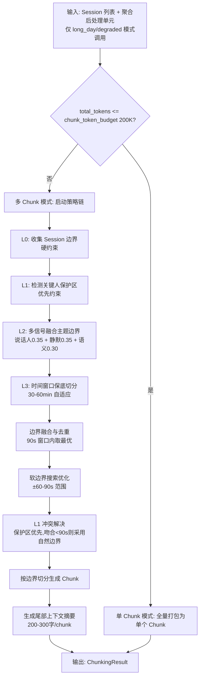
```mermaid
flowchart TD
    A[输入: Session 列表 + 聚合后处理单元<br>仅 long_day/degraded 模式调用] --> B{total_tokens <= chunk_token_budget 200K?}
    B -- 是 --> C[单 Chunk 模式: 全量打包为单个 Chunk]
    B -- 否 --> D[多 Chunk 模式: 启动策略链]

    D --> E[L0: 收集 Session 边界<br>硬约束]
    E --> F[L1: 检测关键人保护区<br>优先约束]
    F --> G[L2: 多信号融合主题边界<br>说话人0.35 + 静默0.35 + 语义0.30]
    G --> H[L3: 时间窗口保底切分<br>30-60min 自适应]

    H --> I[边界融合与去重<br>90s 窗口内取最优]
    I --> J[软边界搜索优化<br>±60-90s 范围]
    J --> K[L1 冲突解决<br>保护区优先,吻合<90s则采用自然边界]
    K --> L[按边界切分生成 Chunk]
    L --> M[生成尾部上下文摘要<br>200-300字/chunk]
    M --> N[输出: ChunkingResult]

    C --> N
```

---

## 5. 关键参数汇总表

| 模块 | 参数 | 默认值 | 说明 |
|:---|:---|:---|:---|
| **会话检测器** | `silence_threshold` | 180s（3min） | 静默阈值，低于此不切分 |
| | `speaker_window` | 3 | 说话人变化检测窗口（utterance 数） |
| | `jaccard_threshold` | 0.5 | 说话人集合 Jaccard 距离阈值 |
| | `max_session_duration` | 7200s（2h） | 超长 Session 强制切分 |
| | `monologue_silence_threshold` | 600s（10min） | 独白场景下静默切分阈值 |
| **碎片聚合器** | `short_session_threshold` | 300s（5min） | 短 Session 判定阈值 |
| | `pack_duration_limit` | 900s（15min） | 聚合包时长上限 |
| | `proximity_threshold` | 600s（10min） | 时间邻近性阈值 |
| | `min_aggregation_count` | 2 | 最少聚合 Session 数 |
| **分片引擎** | `token_budget` | 200,000 | 单 Chunk token 上限（`chunk_token_budget`）。注意：短日模式阈值 80K 由 SummaryOrchestrator 管理，分片引擎不涉及 |
| | `soft_boundary_range` | (60s, 90s) | 软边界搜索范围 |
| **L1 关键人保护** | `KEY_PERSON_GAP_THRESHOLD` | 120s（2min） | 关键人对话间隔容忍 |
| | `MAX_ZONE_DURATION` | 3600s（60min） | 保护区上限 |
| | `BOUNDARY_TOLERANCE` | 90s | 边界吻合容差 |
| **L2 主题边界** | `SPEAKER_WEIGHT` | 0.35 | 说话人切换信号权重 |
| | `SILENCE_WEIGHT` | 0.35 | 静默间隔信号权重 |
| | `SEMANTIC_WEIGHT` | 0.30 | 语义辅助信号权重 |
| | `BOUNDARY_THRESHOLD` | 0.55 | 融合分数阈值 |
| | `SPEAKER_WINDOW_SECONDS` | 300s | 说话人比较窗口 |
| | `SILENCE_LOCAL_WINDOW` | 600s | 静默统计局部窗口 |
| | `SEMANTIC_TEXT_WINDOW` | 500 字符 | 语义比较文本窗口 |
| | `SEMANTIC_SIMILARITY_FLOOR` | 0.45 | 语义相似度低分阈值 |
| | `SEMANTIC_SIMILARITY_CEIL` | 0.75 | 语义相似度高分阈值 |
| | `MIN_BOUNDARY_INTERVAL` | 120s | 相邻边界最小间隔 |
| **L3 时间窗口** | `DEFAULT_WINDOW` | 2700s（45min） | 默认切分窗口 |
| | `MIN_WINDOW` | 1800s（30min） | 最小窗口 |
| | `MAX_WINDOW` | 3600s（60min） | 最大窗口（极端场景可配置覆盖为 7200s/120min） |

---

> **文档版本**：v1.0 | **对应 PRD 版本**：Qwen3-Max 修订版 §1.2.2


---

# 模块6：重要性评估器 详细设计

> **对应源文件**：`core/importance_evaluator.py` + `models/scoring.py`
>
> **PRD 依据**：§4 重要性评估模型全章

---

## 6.1 数据模型（models/scoring.py）

<!-- FIXED: BLOCK-2 — 评分模块直接使用分片引擎输出的 Chunk 类型，不再使用未定义的 Segment -->

### 6.1.0 Chunk 类型说明与 LLMClient / match_speaker_to_key_person 接口

评分模块的输入片段类型统一为分片引擎输出的 `Chunk`（定义于 `models/types.py`）。
原文档中的 `Segment` 即 `Chunk`，不再单独定义 `Segment` 类型。

```python
from models.types import Chunk
# 评分模块中所有"片段"均为 Chunk，关键字段映射：
#   chunk.chunk_id   — 片段唯一标识（原 segment.id）
#   chunk.text       — 拼接后的文本（原 segment.text）
#   chunk.speakers   — 说话人列表（原 segment.speakers）
#   chunk.start_time — 片段起始时间，float 秒（原 segment.start_time）
#   chunk.end_time   — 片段结束时间，float 秒
#   chunk.total_tokens — 片段 token 数
```

<!-- FIXED: 补充 LLMClient 接口定义，指向 ModelClient 协议 -->

**LLMClient 接口**：评分模块中引用的 `LLMClient` 实际对应 API 层定义的 `ModelClient` 协议
（定义于 `core/model_client.py`）。评分模块通过依赖注入获取该客户端实例：

```python
from typing import Protocol

class ModelClient(Protocol):
    """模型客户端协议（定义于 core/model_client.py）。
    评分模块中的 LLMClient 即此协议。"""

    async def chat_completion(
        self,
        messages: list[dict],
        max_tokens: int = 2048,
        temperature: float = 0.7,
        enable_thinking: bool = False,
    ) -> "ChatCompletionResponse": ...
```

<!-- FIXED: 补充 match_speaker_to_key_person 函数签名 -->

**match_speaker_to_key_person 函数**：由配置模块的 `KeyPersonMatcher` 提供
（定义于 `core/key_person_matcher.py`）：

```python
from models.types import MatchResult

def match_speaker_to_key_person(
    speaker: str,
    key_people_config: dict,
) -> MatchResult | None:
    """将说话人名称匹配至关键人配置。

    Returns:
        MatchResult(level="P0"~"P3", match_type="exact"|"alias"|"fuzzy"|"inferred")
        若无匹配返回 None。
    详见配置模块 KeyPersonMatcher 实现。
    """
    ...
```

### 6.1.1 ScoringPhase 枚举

标识当前评分器所处的实施阶段，决定评分公式选型与字段填充策略。

```python
from enum import Enum

class ScoringPhase(str, Enum):
    """评分阶段枚举。
    MVP 阶段仅使用 KeyPersonBaseScore + LLMScore；
    FULL 阶段引入 DurationScore、ContextScore、TimePeriodCoeff 及回归权重。
    """
    MVP = "mvp"
    FULL = "full"
```

### 6.1.2 ScoringConfig 数据类

集中管理评分流程中所有可调参数，支持从 YAML 配置文件加载并在运行时覆盖。

```python
from dataclasses import dataclass, field
from typing import Optional

@dataclass(frozen=True)
class ScoringConfig:
    """评分可配置参数。frozen=True 确保运行期间不可变。"""

    # ---- 阶段 ----
    phase: ScoringPhase = ScoringPhase.MVP

    # ---- 关键人基础分映射 ----
    key_person_base_scores: dict[str, int] = field(
        default_factory=lambda: {"P0": 80, "P1": 50, "P2": 20, "P3": 0}
    )

    # ---- L3 疑似降级映射（原始等级 -> 等效等级） ----
    inferred_level_downgrade: dict[str, str] = field(
        default_factory=lambda: {"P0": "P1", "P1": "P2", "P2": "P3", "P3": "P3"}
    )

    # ---- LLM 批量调用 ----
    llm_batch_size: int = 8              # 每批片段数（5-10，默认 8）
    llm_max_tokens: int = 64
    llm_temperature: float = 0.0
    llm_enable_thinking: bool = False    # MVP 使用非思考模式
    llm_default_score: int = 5           # 解析失败时的降级默认分
    llm_score_multiplier: int = 10       # LLMScore 放大系数

    # ---- 连续性保护 ----
    continuity_decay: float = 0.3        # 传播衰减系数
    continuity_max_interval: float = 5.0 # 最大有效间隔（分钟）
    continuity_max_hops: int = 1         # 最多传播跳数
    continuity_score_cap: int = 180      # bonus 叠加后上限

    # ---- 阈值与 Top-K ----
    threshold: int = 60                  # 最低分阈值
    top_k: int = 20                      # 最多保留片段数

    # ---- 完整阶段权重（FULL 阶段生效） ----
    weight_key_person: float = 1.0
    weight_llm: float = 1.0
    weight_duration: float = 0.3
    weight_context: float = 0.2
    weight_time_period: float = 0.1

    # ---- DurationScore 饱和参考点 ----
    duration_saturation_minutes: float = 30.0

    # ---- Token 预算联动 ----
    token_budget: Optional[int] = None         # 总 token 预算
    avg_segment_tokens: Optional[int] = None   # 片段平均 token 数
```

### 6.1.3 ScoreBreakdown 数据类

每个片段保留完整的评分分解记录，服务于调试、可解释性和后续模型迭代。

```python
from dataclasses import dataclass
from typing import Optional
from datetime import datetime

@dataclass
class ScoreBreakdown:
    """单个片段的评分分解记录。"""

    segment_id: str                      # 对应 Chunk.chunk_id

    # ---- 关键人维度 ----
    key_person_level: Optional[str]      # "P0" / "P1" / "P2" / "P3" / None
    match_type: Optional[str]            # "exact" / "alias" / "asr_corrected" / "fuzzy" / "inferred"
    effective_level: Optional[str]       # 疑似降级后的等效等级（若 match_type=="inferred"）
    key_person_base_score: int = 0

    # ---- LLM 语义维度 ----
    llm_score: int = 5                   # 原始 1-10 分
    llm_score_weighted: int = 50         # llm_score × multiplier

    # ---- 连续性保护 ----
    continuity_bonus: float = 0.0
    continuity_source_segment_id: Optional[str] = None  # bonus 来源片段

    # ---- 完整阶段维度（MVP 时为 None） ----
    duration_score: Optional[float] = None
    context_score: Optional[float] = None
    time_period_coeff: Optional[float] = None

    # ---- 最终得分 ----
    final_score: float = 0.0

    # ---- 筛选结果 ----
    threshold_applied: int = 60
    passed_threshold: bool = False
    rank_in_topk: Optional[int] = None

    # ---- 元数据 ----
    speakers: list[str] = field(default_factory=list)
    duration_seconds: Optional[float] = None
    timestamp: Optional[datetime] = None
    phase: ScoringPhase = ScoringPhase.MVP
```

<!-- FIXED: BLOCK-3 — 新增 ScoringResult 数据类，替代裸 tuple 返回 -->

### 6.1.4 ScoringResult 数据类

评分模块的统一输出容器，替代原有的裸 `tuple` 返回。同时提供"按分数降序"和"按时间升序"两个视图。

```python
from dataclasses import dataclass
from models.types import Chunk, SummaryMode

@dataclass
class ScoringResult:
    """评分模块统一输出。evaluate() 返回此类型而非裸 tuple。"""

    all_chunks: list[Chunk]                # 全量片段，按时间升序
    all_breakdowns: list[ScoreBreakdown]   # 全量评分记录，与 all_chunks 一一对应
    filtered_chunks: list[Chunk]           # Top-K 筛选后，按分数降序
    filtered_breakdowns: list[ScoreBreakdown]  # 与 filtered_chunks 一一对应
    mode: SummaryMode                      # SHORT_DAY / LONG_DAY / DEGRADED

    def filtered_by_time(self) -> tuple[list[Chunk], list[ScoreBreakdown]]:
        """返回筛选后片段按时间升序排列的视图（摘要生成模块需要此顺序）。"""
        paired = list(zip(self.filtered_chunks, self.filtered_breakdowns))
        paired.sort(key=lambda pair: pair[0].start_time)
        return [c for c, _ in paired], [b for _, b in paired]
```

> **输出视图说明**：
> - `filtered_chunks` / `filtered_breakdowns`：按 FinalScore **降序**，用于调试和重要性展示。
> - `filtered_by_time()`：按 `start_time` **升序**，用于摘要生成模块按时间线拼接文本。
> - `all_chunks` / `all_breakdowns`：全量数据按时间升序，SHORT_DAY 模式下 `filtered_chunks == all_chunks`。

### 6.1.5 数据模型关系图

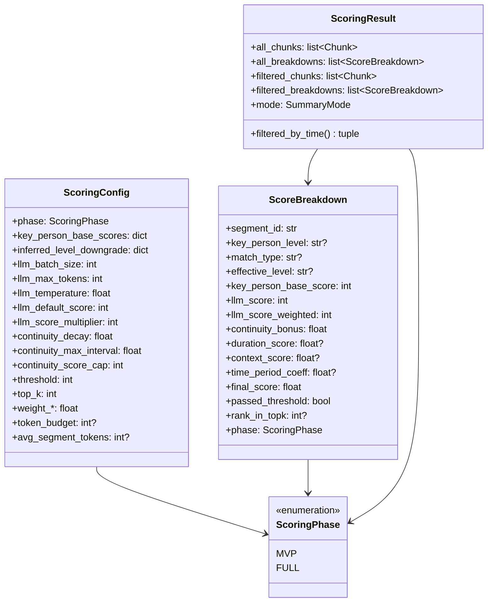
```mermaid
classDiagram
    class ScoringPhase {
        <<enumeration>>
        MVP
        FULL
    }

    class ScoringConfig {
        +phase: ScoringPhase
        +key_person_base_scores: dict
        +inferred_level_downgrade: dict
        +llm_batch_size: int
        +llm_max_tokens: int
        +llm_temperature: float
        +llm_default_score: int
        +llm_score_multiplier: int
        +continuity_decay: float
        +continuity_max_interval: float
        +continuity_score_cap: int
        +threshold: int
        +top_k: int
        +weight_*: float
        +token_budget: int?
        +avg_segment_tokens: int?
    }

    class ScoreBreakdown {
        +segment_id: str
        +key_person_level: str?
        +match_type: str?
        +effective_level: str?
        +key_person_base_score: int
        +llm_score: int
        +llm_score_weighted: int
        +continuity_bonus: float
        +duration_score: float?
        +context_score: float?
        +time_period_coeff: float?
        +final_score: float
        +passed_threshold: bool
        +rank_in_topk: int?
        +phase: ScoringPhase
    }

    class ScoringResult {
        +all_chunks: list~Chunk~
        +all_breakdowns: list~ScoreBreakdown~
        +filtered_chunks: list~Chunk~
        +filtered_breakdowns: list~ScoreBreakdown~
        +mode: SummaryMode
        +filtered_by_time() tuple
    }

    ScoringConfig --> ScoringPhase
    ScoreBreakdown --> ScoringPhase
    ScoringResult --> ScoreBreakdown
    ScoringResult --> ScoringPhase
```

---

## 6.2 MVP 评分器（core/importance_evaluator.py）

### 6.2.1 总体流程

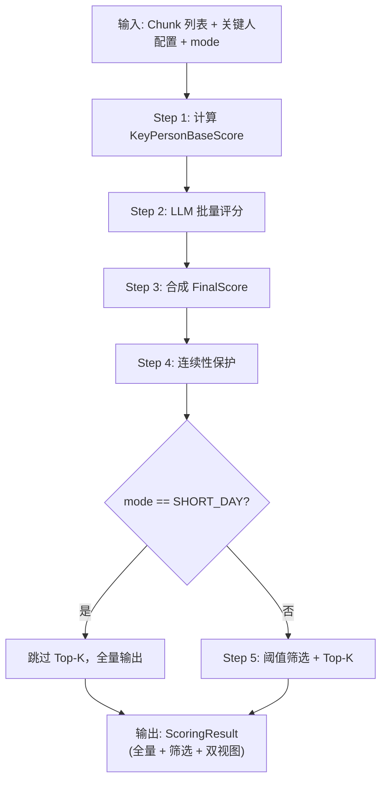
```mermaid
flowchart TD
    A["输入: Chunk 列表 + 关键人配置 + mode"] --> B[Step 1: 计算 KeyPersonBaseScore]
    B --> C[Step 2: LLM 批量评分]
    C --> D[Step 3: 合成 FinalScore]
    D --> E[Step 4: 连续性保护]
    E --> F{"mode == SHORT_DAY?"}
    F -- 是 --> G["跳过 Top-K，全量输出"]
    F -- 否 --> H["Step 5: 阈值筛选 + Top-K"]
    G --> I["输出: ScoringResult<br/>(全量 + 筛选 + 双视图)"]
    H --> I
```

### 6.2.2 KeyPersonBaseScore 计算逻辑

每个片段可包含多个说话人。取所有参与者中最高等级的关键人作为该片段的代表等级，映射为基础分。当最高等级来自 L3 疑似匹配时，按降级表处理。

```python
def compute_key_person_base_score(
    chunk: Chunk,
    key_people_config: dict,
    config: ScoringConfig,
) -> tuple[int, str | None, str | None, str | None]:
    """计算单个片段的 KeyPersonBaseScore。

    Returns:
        (base_score, level, match_type, effective_level)
    """
    best_level: str | None = None
    best_match_type: str | None = None
    best_priority = 999  # 越小越高优先

    LEVEL_PRIORITY = {"P0": 0, "P1": 1, "P2": 2, "P3": 3}

    for speaker in chunk.speakers:
        match = match_speaker_to_key_person(speaker, key_people_config)
        if match is None:
            continue
        level = match.level           # "P0" ~ "P3"
        match_type = match.match_type # "exact" / "alias" / ... / "inferred"

        priority = LEVEL_PRIORITY.get(level, 999)
        if priority < best_priority:
            best_priority = priority
            best_level = level
            best_match_type = match_type

    if best_level is None:
        # 未匹配到任何关键人 → 等同 P3
        return 0, None, None, None

    # L3 疑似降级处理
    effective_level = best_level
    if best_match_type == "inferred":
        effective_level = config.inferred_level_downgrade.get(best_level, best_level)

    base_score = config.key_person_base_scores[effective_level]
    return base_score, best_level, best_match_type, effective_level
```

**L3 疑似降级映射表**：

| 原始等级 | match_type | effective_level | KeyPersonBaseScore |
|:---------|:-----------|:----------------|:-------------------|
| P0       | inferred   | P1              | 50                 |
| P1       | inferred   | P2              | 20                 |
| P2       | inferred   | P3              | 0                  |
| P3       | inferred   | P3              | 0                  |
| P0       | exact      | P0              | 80                 |
| P1       | alias      | P1              | 50                 |
| -        | -（未匹配）| -               | 0                  |

### 6.2.3 LLMScore 批量调用

#### 分批逻辑

```python
def batch_segments(segments: list[Chunk], batch_size: int) -> list[list[Chunk]]:
    """将片段列表按 batch_size 切分为多个批次。"""
    return [
        segments[i : i + batch_size]
        for i in range(0, len(segments), batch_size)
    ]
```

#### Prompt 模板

```python
LLM_SCORING_PROMPT_TEMPLATE = """请评估以下 {n} 个对话片段的重要性。考虑维度：决策/指令/承诺/争议/紧急事项/任务分配/信息稀缺性。
对每个片段输出 1-10 分整数。

{segments_text}

请按顺序输出 {n} 个分数，用逗号分隔，仅输出数字。"""

def build_scoring_prompt(batch: list[Chunk]) -> str:
    """构造单批次的评分 Prompt。"""
    parts = []
    for i, seg in enumerate(batch, 1):
        speaker_info = "、".join(seg.speakers) if seg.speakers else "未知"
        parts.append(f"【片段{i}】[说话人: {speaker_info}] {seg.text}")
    segments_text = "\n".join(parts)
    return LLM_SCORING_PROMPT_TEMPLATE.format(n=len(batch), segments_text=segments_text)
```

#### 调用参数与解析逻辑

```python
import logging

logger = logging.getLogger(__name__)

async def call_llm_for_scores(
    batch: list[Chunk],
    llm_client: ModelClient,
    config: ScoringConfig,
) -> list[int]:
    """调用 LLM 对一批片段进行语义评分。

    调用参数：
      - enable_thinking: False（非思考模式）
      - max_tokens: 64
      - temperature: 0
    返回长度与 batch 一致的分数列表（1-10 整数）。
    """
    prompt = build_scoring_prompt(batch)

    # <!-- FIXED: BLOCK-2 — llm_client.complete() → chat_completion()，与 ModelClient 协议一致 -->
    response = await llm_client.chat_completion(
        messages=[{"role": "user", "content": prompt}],
        max_tokens=config.llm_max_tokens,       # 64
        temperature=config.llm_temperature,      # 0.0
        enable_thinking=config.llm_enable_thinking,  # False
    )

    return parse_llm_scores(response.text, len(batch), config)


def parse_llm_scores(
    raw_text: str,
    expected_count: int,
    config: ScoringConfig,
) -> list[int]:
    """解析 LLM 返回的逗号分隔分数字符串。

    解析规则：
      1. 按逗号分隔，strip 空白
      2. 每个 token 尝试转为 int
      3. 值域裁剪至 [1, 10]
      4. 数量不足时用 default_score 补齐
      5. 数量超出时截断至 expected_count
      6. 整体解析异常时全部降级为 default_score
    """
    default = config.llm_default_score  # 5

    try:
        tokens = [t.strip() for t in raw_text.strip().split(",")]
        scores = []
        for t in tokens:
            try:
                val = int(t)
                val = max(1, min(10, val))  # 裁剪至 [1, 10]
                scores.append(val)
            except ValueError:
                logger.warning("LLM 返回非整数 token: '%s'，使用默认分 %d", t, default)
                scores.append(default)

        # 数量修正
        if len(scores) < expected_count:
            logger.warning(
                "LLM 返回分数数量 %d < 期望 %d，用默认分 %d 补齐",
                len(scores), expected_count, default,
            )
            scores.extend([default] * (expected_count - len(scores)))
        elif len(scores) > expected_count:
            logger.warning(
                "LLM 返回分数数量 %d > 期望 %d，截断",
                len(scores), expected_count,
            )
            scores = scores[:expected_count]

        return scores

    except Exception as e:
        logger.error("LLM 评分解析整体失败: %s，全部降级为默认分 %d", e, default)
        return [default] * expected_count
```

#### LLM 批量评分完整流程图

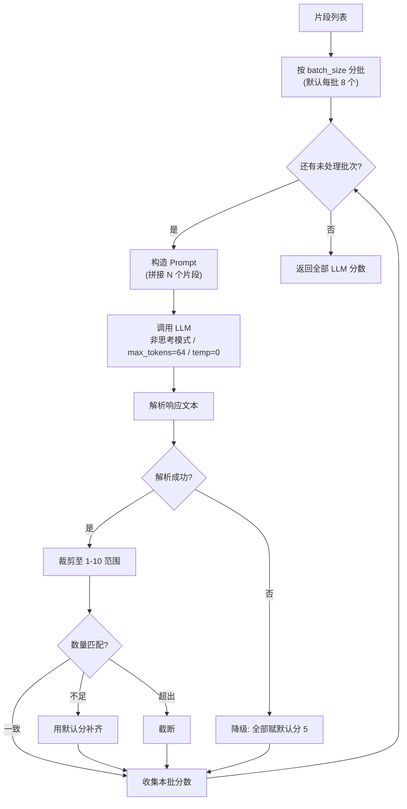
```mermaid
flowchart TD
    A[片段列表] --> B["按 batch_size 分批<br/>(默认每批 8 个)"]
    B --> C{还有未处理批次?}
    C -- 是 --> D["构造 Prompt<br/>(拼接 N 个片段)"]
    D --> E["调用 LLM<br/>非思考模式 / max_tokens=64 / temp=0"]
    E --> F[解析响应文本]
    F --> G{解析成功?}
    G -- 是 --> H[裁剪至 1-10 范围]
    G -- 否 --> I["降级: 全部赋默认分 5"]
    H --> J{数量匹配?}
    J -- 不足 --> K[用默认分补齐]
    J -- 超出 --> L[截断]
    J -- 一致 --> M[收集本批分数]
    K --> M
    L --> M
    I --> M
    M --> C
    C -- 否 --> N[返回全部 LLM 分数]
```

### 6.2.4 FinalScore 合成

```python
def compute_mvp_final_score(
    base_score: int,
    llm_score: int,
    config: ScoringConfig,
) -> float:
    """MVP 阶段最终分 = KeyPersonBaseScore + LLMScore × 10"""
    return base_score + llm_score * config.llm_score_multiplier
```

| 场景示例                    | KeyPersonBaseScore | LLMScore | FinalScore |
|:---------------------------|:-------------------|:---------|:-----------|
| P0 精确匹配 + 高语义       | 80                 | 8        | 160        |
| P0 疑似匹配(→P1) + 中语义  | 50                 | 5        | 100        |
| P1 精确匹配 + 低语义       | 50                 | 2        | 70         |
| P3 / 未匹配 + 极高语义     | 0                  | 9        | 90         |
| P3 / 未匹配 + 低语义       | 0                  | 3        | 30（被过滤）|

---

## 6.3 连续性保护

### 6.3.1 设计目标

高分片段的前后相邻片段获得加成，形成"重要会话簇"，避免关键讨论的上下文被截断。

### 6.3.2 Bonus 计算公式

$$\text{bonus} = \text{neighbor\_score} \times 0.3 \times \max\left(0,\ 1 - \frac{\text{interval}}{5}\right)$$

其中：
- `neighbor_score`：相邻高分片段的 FinalScore
- `interval`：两片段之间的时间间隔（分钟）
- `0.3`：传播衰减系数（`config.continuity_decay`）
- `5`：最大有效间隔分钟数（`config.continuity_max_interval`）

### 6.3.3 传播规则

1. **仅向低分方向传播**：高分片段不从低分邻居获得加成。具体地，只有当 neighbor_score > 当前片段 FinalScore 时，才计算 bonus。
2. **最多一跳**：bonus 不会从 A 传到 B 再传到 C。仅原始 FinalScore 参与 bonus 计算，不使用已叠加 bonus 后的分数。
3. **单片段取较大值**：一个片段最多从前、后各一个邻居获得 bonus，取其中较大的一个。
4. **上限 180**：bonus 叠加后的总分 `min(final_score + bonus, config.continuity_score_cap)`。

### 6.3.4 算法伪代码

<!-- FIXED: .total_seconds() 类型错误 — start_time/end_time 已经是 float 秒，直接做差除以 60 -->

```python
def apply_continuity_protection(
    chunks: list[Chunk],
    breakdowns: list[ScoreBreakdown],
    config: ScoringConfig,
) -> list[ScoreBreakdown]:
    """对已计算 FinalScore 的片段列表应用连续性保护。

    前提：chunks 和 breakdowns 按时间顺序一一对应。
    """
    n = len(chunks)
    # 记录每个片段的原始 FinalScore（不含 bonus），用于传播计算
    original_scores = [bd.final_score for bd in breakdowns]

    for i in range(n):
        best_bonus = 0.0
        best_source_id = None

        for neighbor_idx in [i - 1, i + 1]:
            if neighbor_idx < 0 or neighbor_idx >= n:
                continue

            neighbor_score = original_scores[neighbor_idx]

            # 规则 1: 仅向低分方向传播
            if neighbor_score <= original_scores[i]:
                continue

            # 计算时间间隔（分钟）
            # NOTE: start_time / end_time 均为 float（秒），直接做差即可，无需 .total_seconds()
            interval = abs(
                chunks[i].start_time - chunks[neighbor_idx].end_time
            ) / 60.0

            # 超过最大间隔则不传播
            if interval >= config.continuity_max_interval:
                continue

            # 计算 bonus
            bonus = (
                neighbor_score
                * config.continuity_decay
                * max(0.0, 1.0 - interval / config.continuity_max_interval)
            )

            if bonus > best_bonus:
                best_bonus = bonus
                best_source_id = breakdowns[neighbor_idx].segment_id

        # 应用 bonus 并限制上限
        if best_bonus > 0:
            breakdowns[i].continuity_bonus = best_bonus
            breakdowns[i].continuity_source_segment_id = best_source_id
            breakdowns[i].final_score = min(
                original_scores[i] + best_bonus,
                config.continuity_score_cap,
            )

    return breakdowns
```

### 6.3.5 连续性保护流程图

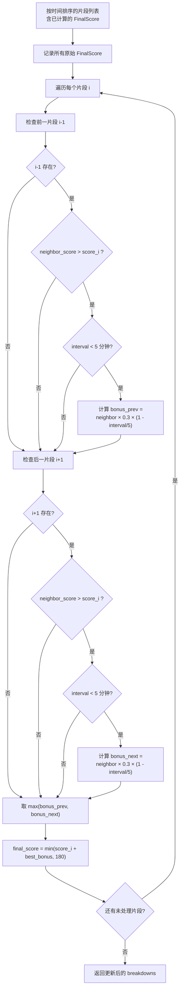
```mermaid
flowchart TD
    A[按时间排序的片段列表<br/>含已计算的 FinalScore] --> B[记录所有原始 FinalScore]
    B --> C[遍历每个片段 i]
    C --> D["检查前一片段 i-1"]
    D --> E{i-1 存在?}
    E -- 否 --> F["检查后一片段 i+1"]
    E -- 是 --> G{"neighbor_score > score_i ?"}
    G -- 否 --> F
    G -- 是 --> H{"interval < 5 分钟?"}
    H -- 否 --> F
    H -- 是 --> I["计算 bonus_prev =<br/>neighbor × 0.3 × (1 - interval/5)"]
    I --> F
    F --> J{i+1 存在?}
    J -- 否 --> K["取 max(bonus_prev, bonus_next)"]
    J -- 是 --> L{"neighbor_score > score_i ?"}
    L -- 否 --> K
    L -- 是 --> M{"interval < 5 分钟?"}
    M -- 否 --> K
    M -- 是 --> N["计算 bonus_next =<br/>neighbor × 0.3 × (1 - interval/5)"]
    N --> K
    K --> O["final_score = min(score_i + best_bonus, 180)"]
    O --> P{还有未处理片段?}
    P -- 是 --> C
    P -- 否 --> Q[返回更新后的 breakdowns]
```

### 6.3.6 示例

| 片段 | 原始 FinalScore | 间隔（到前一片段） | bonus 来源 | bonus 值 | 最终 FinalScore |
|:-----|:----------------|:------------------|:-----------|:---------|:----------------|
| A    | 150             | -                 | -          | 0        | 150             |
| B    | 40              | 2 min             | A          | 150 × 0.3 × (1 - 2/5) = 27 | 67 |
| C    | 30              | 6 min（距 B）     | -          | 0（超过 5 分钟） | 30       |

---

## 6.4 Top-K 与阈值筛选

### 6.4.1 筛选策略

执行顺序：**先过阈值，再取 Top-K**（两道筛选串联）。

### 6.4.2 K_effective 与 Token 预算联动

当配置了 `token_budget` 和 `avg_segment_tokens` 时，计算有效 K 值以避免超出 token 预算：

$$K_{\text{effective}} = \min\left(K,\ \left\lfloor \frac{\text{token\_budget}}{\text{avg\_segment\_tokens}} \right\rfloor \right)$$

### 6.4.3 实现伪代码

```python
import math
from typing import Optional

def filter_and_rank(
    chunks: list[Chunk],
    breakdowns: list[ScoreBreakdown],
    config: ScoringConfig,
) -> tuple[list[Chunk], list[ScoreBreakdown]]:
    """阈值筛选 + Top-K 排序。

    Returns:
        筛选后的 (片段列表, 评分记录列表)，按 FinalScore 降序。
    """
    # Step 1: 阈值筛选
    candidates = [
        (chunk, bd)
        for chunk, bd in zip(chunks, breakdowns)
        if bd.final_score >= config.threshold
    ]

    # 标记通过阈值的片段
    for _, bd in candidates:
        bd.passed_threshold = True
        bd.threshold_applied = config.threshold

    # Step 2: 按 FinalScore 降序排序
    candidates.sort(key=lambda pair: pair[1].final_score, reverse=True)

    # Step 3: 计算 K_effective
    k = config.top_k
    k_effective = k

    if config.token_budget is not None and config.avg_segment_tokens is not None:
        token_based_k = math.floor(config.token_budget / config.avg_segment_tokens)
        k_effective = min(k, token_based_k)
        if k_effective < k:
            logger.info(
                "Token 预算限制: K=%d -> K_effective=%d "
                "(budget=%d, avg_tokens=%d)",
                k, k_effective, config.token_budget, config.avg_segment_tokens,
            )

    # Step 4: 截断至 K_effective
    selected = candidates[:k_effective]

    # Step 5: 标记排名
    for rank, (_, bd) in enumerate(selected, 1):
        bd.rank_in_topk = rank

    result_chunks = [chunk for chunk, _ in selected]
    result_breakdowns = [bd for _, bd in selected]

    logger.info(
        "筛选完成: 总数=%d, 过阈值=%d, Top-K=%d, K_effective=%d, 最终保留=%d",
        len(chunks), len(candidates), k, k_effective, len(selected),
    )

    return result_chunks, result_breakdowns
```

### 6.4.4 筛选流程图

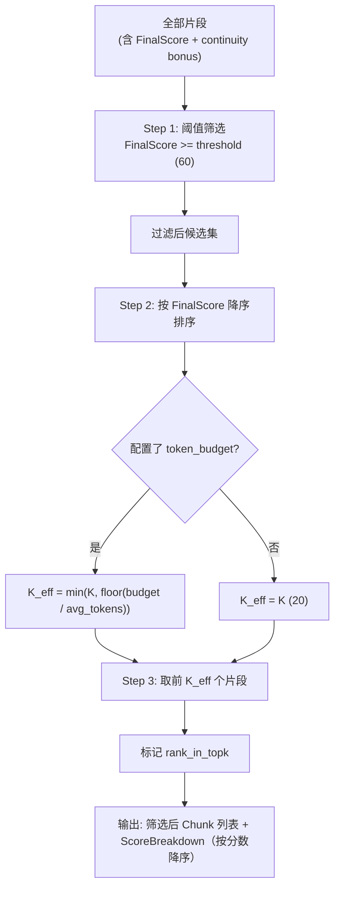
```mermaid
flowchart TD
    A["全部片段<br/>(含 FinalScore + continuity bonus)"] --> B["Step 1: 阈值筛选<br/>FinalScore >= threshold (60)"]
    B --> C["过滤后候选集"]
    C --> D["Step 2: 按 FinalScore 降序排序"]
    D --> E{"配置了 token_budget?"}
    E -- 是 --> F["K_eff = min(K, floor(budget / avg_tokens))"]
    E -- 否 --> G["K_eff = K (20)"]
    F --> H["Step 3: 取前 K_eff 个片段"]
    G --> H
    H --> I["标记 rank_in_topk"]
    I --> J["输出: 筛选后 Chunk 列表 + ScoreBreakdown（按分数降序）"]
```

---

## 6.5 完整阶段评分器（预留接口）

### 6.5.1 继承关系

完整阶段评分器继承 MVP 评分器，在其基础上扩展三个新维度并引入权重配置。

<!-- FIXED: BLOCK-3 — evaluate() 返回 ScoringResult 而非裸 tuple -->
<!-- FIXED: BLOCK-4 — evaluate() 增加 mode: SummaryMode 参数，SHORT_DAY 跳过 Top-K -->
<!-- FIXED: 补充 LLMClient 指向 ModelClient 协议 -->

```python
import math
from models.types import SummaryMode

class MVPImportanceEvaluator:
    """MVP 阶段重要性评估器。"""

    def __init__(self, config: ScoringConfig, llm_client: ModelClient):
        """
        Args:
            config: 评分配置
            llm_client: 模型客户端，实现 ModelClient 协议（定义于 core/model_client.py）
        """
        self.config = config
        self.llm_client = llm_client

    async def evaluate(
        self,
        chunks: list[Chunk],
        key_people_config: dict,
        mode: SummaryMode = SummaryMode.LONG_DAY,
    ) -> ScoringResult:
        """完整评估流程：基础分 → LLM评分 → 合成 → 连续性 → 筛选。

        Args:
            chunks: 分片引擎输出的 Chunk 列表（按时间升序）
            key_people_config: 关键人配置字典
            mode: 摘要模式。SHORT_DAY 跳过 Top-K 筛选，全量输出；
                  LONG_DAY / DEGRADED 执行正常的阈值 + Top-K 筛选。

        Returns:
            ScoringResult 包含全量和筛选后的两组数据，以及模式标记。
        """
        breakdowns = []

        # Step 1: KeyPersonBaseScore
        for chunk in chunks:
            base_score, level, match_type, eff_level = (
                compute_key_person_base_score(chunk, key_people_config, self.config)
            )
            bd = ScoreBreakdown(
                segment_id=chunk.chunk_id,  # Chunk.chunk_id 作为片段唯一标识
                key_person_level=level,
                match_type=match_type,
                effective_level=eff_level,
                key_person_base_score=base_score,
                phase=self.config.phase,
            )
            breakdowns.append(bd)

        # Step 2: LLM 批量评分
        llm_scores = await self._batch_llm_scoring(chunks)
        for bd, score in zip(breakdowns, llm_scores):
            bd.llm_score = score
            bd.llm_score_weighted = score * self.config.llm_score_multiplier

        # Step 3: 合成 FinalScore
        for bd in breakdowns:
            bd.final_score = self._compute_final_score(bd)

        # Step 4: 连续性保护
        breakdowns = apply_continuity_protection(chunks, breakdowns, self.config)

        # Step 5: 阈值 + Top-K（根据 mode 决定是否跳过）
        if mode == SummaryMode.SHORT_DAY:
            # 短日模式：跳过 Top-K 筛选，评分仅用于排序展示，不裁剪内容
            # filtered = all（全量），但仍按分数降序排列以便展示
            sorted_pairs = sorted(
                zip(chunks, breakdowns),
                key=lambda pair: pair[1].final_score,
                reverse=True,
            )
            filtered_chunks = [c for c, _ in sorted_pairs]
            filtered_breakdowns = [b for _, b in sorted_pairs]
            for rank, bd in enumerate(filtered_breakdowns, 1):
                bd.passed_threshold = True
                bd.rank_in_topk = rank
        else:
            # LONG_DAY / DEGRADED：执行正常的阈值 + Top-K 筛选
            filtered_chunks, filtered_breakdowns = filter_and_rank(
                chunks, breakdowns, self.config
            )

        return ScoringResult(
            all_chunks=chunks,                       # 按时间升序（原始顺序）
            all_breakdowns=breakdowns,               # 与 all_chunks 一一对应
            filtered_chunks=filtered_chunks,         # 按分数降序
            filtered_breakdowns=filtered_breakdowns, # 与 filtered_chunks 一一对应
            mode=mode,
        )

    def _compute_final_score(self, bd: ScoreBreakdown) -> float:
        """MVP: FinalScore = KeyPersonBaseScore + LLMScore × 10"""
        return bd.key_person_base_score + bd.llm_score_weighted

    async def _batch_llm_scoring(self, chunks: list[Chunk]) -> list[int]:
        """分批调用 LLM 获取所有片段的语义评分。"""
        all_scores: list[int] = []
        batches = batch_segments(chunks, self.config.llm_batch_size)
        for batch in batches:
            scores = await call_llm_for_scores(batch, self.llm_client, self.config)
            all_scores.extend(scores)
        return all_scores


class FullImportanceEvaluator(MVPImportanceEvaluator):
    """完整阶段重要性评估器。继承 MVP，新增三个评分维度 + 权重配置。"""

    def __init__(
        self,
        config: ScoringConfig,
        llm_client: ModelClient,
        time_period_config: list[dict] | None = None,
    ):
        super().__init__(config, llm_client)
        self.time_period_config = time_period_config or []

    def _compute_final_score(self, bd: ScoreBreakdown) -> float:
        """完整公式：加权求和五个维度。

        FinalScore = w1 × KeyPersonBaseScore
                   + w2 × LLMScore × 10
                   + w3 × DurationScore
                   + w4 × ContextScore
                   + w5 × TimePeriodCoeff
        """
        c = self.config
        return (
            c.weight_key_person * bd.key_person_base_score
            + c.weight_llm * bd.llm_score_weighted
            + c.weight_duration * (bd.duration_score or 0.0)
            + c.weight_context * (bd.context_score or 0.0)
            + c.weight_time_period * (bd.time_period_coeff or 0.0)
        )

    def _compute_duration_score(self, duration_seconds: float) -> float:
        """DurationScore: 对数饱和曲线。

        DurationScore = 100 × ln(1 + duration_min) / ln(1 + saturation_min)
        """
        duration_min = duration_seconds / 60.0
        saturation = self.config.duration_saturation_minutes  # 30
        return 100.0 * math.log(1 + duration_min) / math.log(1 + saturation)

    def _compute_context_score(self, chunk: Chunk) -> float:
        """ContextScore: 结构特征评分（预留接口）。

        可参考特征：对话轮次数、发言人数量、发言比例均衡度等。
        具体实现在回归分析确定特征集后补充。
        """
        raise NotImplementedError("ContextScore 待回归分析后实现")

    def _compute_time_period_coeff(self, timestamp: datetime) -> float:
        """TimePeriodCoeff: 时段系数查表。

        从 time_period_config 中查找 timestamp 所在时段的 coefficient。
        若未匹配任何时段，返回 1.0（不加成不惩罚）。
        """
        time_of_day = timestamp.time()
        for period in self.time_period_config:
            start = period["start"]  # datetime.time
            end = period["end"]
            # 处理跨午夜时段（如 21:00 ~ 08:00）
            if start <= end:
                if start <= time_of_day < end:
                    return period["coefficient"]
            else:
                if time_of_day >= start or time_of_day < end:
                    return period["coefficient"]
        return 1.0
```

### 6.5.2 DurationScore 对数饱和曲线

| 时长       | DurationScore | 计算过程                    |
|:-----------|:--------------|:---------------------------|
| 1 分钟     | ~20           | 100 × ln(2) / ln(31)       |
| 5 分钟     | ~52           | 100 × ln(6) / ln(31)       |
| 15 分钟    | ~81           | 100 × ln(16) / ln(31)      |
| 30 分钟    | 100           | 100 × ln(31) / ln(31)      |
| 60 分钟    | ~113          | 100 × ln(61) / ln(31)      |
| 120 分钟   | ~127          | 100 × ln(121) / ln(31)     |

### 6.5.3 完整阶段类继承关系图

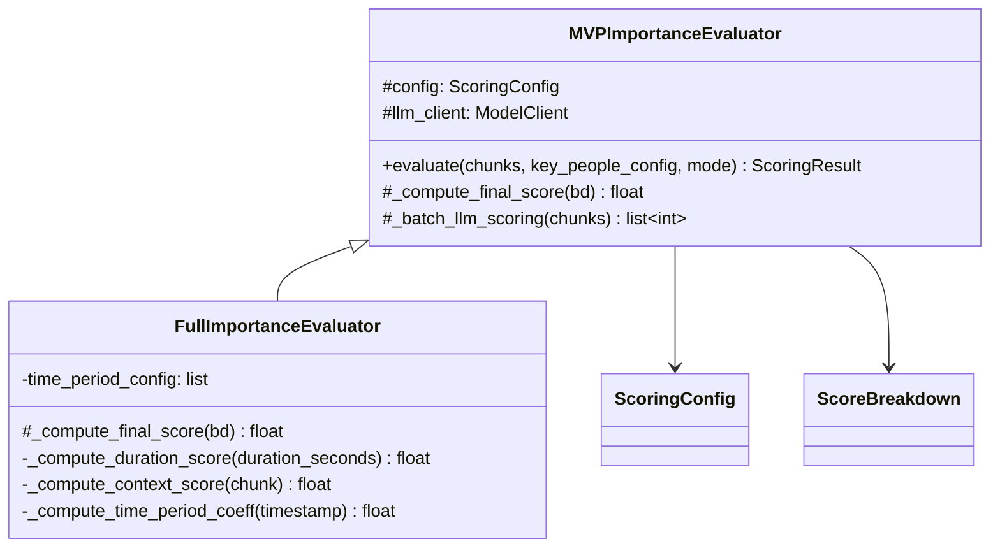
```mermaid
classDiagram
    class MVPImportanceEvaluator {
        #config: ScoringConfig
        #llm_client: ModelClient
        +evaluate(chunks, key_people_config, mode) ScoringResult
        #_compute_final_score(bd) float
        #_batch_llm_scoring(chunks) list~int~
    }

    class FullImportanceEvaluator {
        -time_period_config: list
        #_compute_final_score(bd) float
        -_compute_duration_score(duration_seconds) float
        -_compute_context_score(chunk) float
        -_compute_time_period_coeff(timestamp) float
    }

    MVPImportanceEvaluator <|-- FullImportanceEvaluator

    MVPImportanceEvaluator --> ScoringConfig
    MVPImportanceEvaluator --> ScoreBreakdown
```

### 6.5.4 完整阶段评分流程图

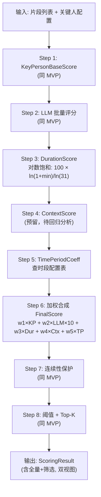
```mermaid
flowchart TD
    A[输入: 片段列表 + 关键人配置] --> B["Step 1: KeyPersonBaseScore<br/>(同 MVP)"]
    B --> C["Step 2: LLM 批量评分<br/>(同 MVP)"]
    C --> D["Step 3: DurationScore<br/>对数饱和: 100 × ln(1+min)/ln(31)"]
    D --> E["Step 4: ContextScore<br/>(预留，待回归分析)"]
    E --> F["Step 5: TimePeriodCoeff<br/>查时段配置表"]
    F --> G["Step 6: 加权合成 FinalScore<br/>w1×KP + w2×LLM×10 + w3×Dur + w4×Ctx + w5×TP"]
    G --> H["Step 7: 连续性保护<br/>(同 MVP)"]
    H --> I["Step 8: 阈值 + Top-K<br/>(同 MVP)"]
    I --> J["输出: ScoringResult<br/>(含全量+筛选, 双视图)"]
```

---

## 附录 A：模块接口汇总

| 函数/类 | 文件 | 职责 |
|:--------|:-----|:-----|
| `ScoringPhase` | `models/scoring.py` | 评分阶段枚举 |
| `ScoringConfig` | `models/scoring.py` | 评分参数配置 |
| `ScoreBreakdown` | `models/scoring.py` | 评分分解记录 |
| `ScoringResult` | `models/scoring.py` | 评分模块统一输出容器（含全量+筛选两组数据） <!-- FIXED: BLOCK-3 --> |
| `compute_key_person_base_score()` | `core/importance_evaluator.py` | 计算关键人基础分（输入 `Chunk`） |
| `batch_segments()` | `core/importance_evaluator.py` | 片段分批 |
| `build_scoring_prompt()` | `core/importance_evaluator.py` | 构造 LLM 评分 Prompt |
| `call_llm_for_scores()` | `core/importance_evaluator.py` | 单批次 LLM 调用（通过 `ModelClient` 协议） |
| `parse_llm_scores()` | `core/importance_evaluator.py` | 解析 LLM 响应 |
| `apply_continuity_protection()` | `core/importance_evaluator.py` | 连续性保护 |
| `filter_and_rank()` | `core/importance_evaluator.py` | 阈值 + Top-K 筛选 |
| `MVPImportanceEvaluator` | `core/importance_evaluator.py` | MVP 评分器主类（`evaluate()` 返回 `ScoringResult`，支持 `mode` 参数） |
| `FullImportanceEvaluator` | `core/importance_evaluator.py` | 完整阶段评分器（预留） |
| `match_speaker_to_key_person()` | `core/key_person_matcher.py` | 说话人→关键人匹配（由配置模块 KeyPersonMatcher 提供） |
| `ModelClient` (协议) | `core/model_client.py` | LLM 客户端协议（原文档中的 LLMClient） |


---

# 模块7：摘要生成器 详细设计

> 对应源码：`core/summarizer.py`、`models/summary.py`、`prompts/`
> 依据 PRD §5 多级摘要生成流程

<!-- FIXED: BLOCK-6 — 统一导入声明 -->
> **关键类型导入**（全模块统一）：
> ```python
> from models.types import ChatMessage, ChatCompletionResponse
> from core.model_client import ModelClient          # async 协议
> from core.token_budget import TokenBudgetController # 动态 token 预算
> from core.batch_client import BatchClient           # Batch API 客户端
> from core.retry_handler import RetryHandler         # 已内置于 ModelClient
> from exceptions import QwenExhaustedError
> ```

---

## 7.1 SummaryOrchestrator -- 核心调度器

### 7.1.1 职责概述

`SummaryOrchestrator` 是摘要生成层的唯一入口，负责：

1. 根据数据规模与模型能力选择处理模式（short_day / long_day / degraded）
2. 调度对应路径的生成流程
3. 统一输出为 `DailyReport` 对象

### 7.1.2 select_mode() 决策逻辑

```python
class SummaryOrchestrator:
    """摘要生成核心调度器。"""

    # <!-- FIXED: BLOCK-7 — 注入 TokenBudgetController 依赖 -->
    def __init__(
        self,
        model_client: ModelClient,
        config: SummaryConfig,
        token_budget_ctrl: TokenBudgetController,
        use_batch: bool = False,           # <!-- FIXED: 补充 Batch API 集成参数 -->
    ):
        self.model_client = model_client   # ModelClient 内部已包含 RetryHandler，摘要模块无需显式调用 <!-- FIXED: 明确 RetryHandler 集成方式 -->
        self.config = config
        self.token_budget_ctrl = token_budget_ctrl
        self.use_batch = use_batch
        self.batch_client: BatchClient | None = BatchClient(model_client) if use_batch else None
        self.short_day_handler = ShortDayHandler(model_client, config, token_budget_ctrl)
        self.long_day_handler = LongDayHandler(model_client, config, token_budget_ctrl)
        self.degraded_handler = DegradedHandler(model_client, config)

    def select_mode(
        self,
        total_tokens: int,
        model_context_limit: int,
    ) -> Literal["short_day", "long_day", "degraded"]:
        """
        三条件判定摘要路径。

        判定优先级：
          1. 模型能力不足 → degraded
          2. 数据量 < 80K → short_day
          3. 数据量 80K-250K → long_day
          4. 数据量 > 250K → degraded（超长回退）
        """
        if model_context_limit < 64_000:
            return "degraded"       # 小模型：三级架构
        if total_tokens < 80_000:
            return "short_day"      # ~90% 工作日
        if total_tokens <= 250_000:
            return "long_day"       # ~10% 高密度工作日
        return "degraded"           # 超长数据：回退三级

    async def generate(
        self,
        preprocessed: PreprocessedData,
        scoring_result: ScoringResult,
        model_config: ModelConfig,
    ) -> DailyReport:
        """统一入口：选路 → 调度 → 返回 DailyReport。"""
        total_tokens = preprocessed.total_token_count
        mode = self.select_mode(total_tokens, model_config.context_limit)

        # <!-- FIXED: 补充 Batch API 集成方案 -->
        if self.use_batch and self.batch_client is not None:
            return await self.batch_client.submit(
                mode=mode,
                preprocessed=preprocessed,
                scoring_result=scoring_result,
                model_config=model_config,
            )

        # <!-- FIXED: BLOCK-11 — 补充 QwenExhaustedError 处理 -->
        partial_results: list[SessionSummary] = []
        try:
            if mode == "short_day":
                result = await self.short_day_handler.run(
                    preprocessed, scoring_result, model_config
                )
            elif mode == "long_day":
                result = await self.long_day_handler.run(
                    preprocessed, scoring_result, model_config,
                    partial_results=partial_results,   # 收集已完成的时段结果
                )
            else:
                result = await self.degraded_handler.run(
                    preprocessed, scoring_result, model_config
                )
        except QwenExhaustedError as e:
            # 所有模型（主模型 + 降级模型）均已耗尽，推入人工队列
            logger.error(f"QwenExhaustedError in mode={mode}: {e}")
            return self._build_partial_report(partial_results, error=e)

        result.metadata.generation_mode = mode
        return result

    def _build_partial_report(
        self,
        partial_results: list[SessionSummary],
        error: QwenExhaustedError,
    ) -> DailyReport:
        """
        构建部分结果报告：将已完成的时段摘要合并为不完整日报，
        标记错误信息，并推入人工审核队列。
        """
        report = DailyReport(
            executive_summary="[自动生成中断] 部分时段摘要已完成，请人工补充。",
            key_meetings=[],
            action_items=[],
        )
        # 归集已完成时段的内容
        for session in partial_results:
            for topic in session.topics:
                report.key_meetings.append(
                    KeyMeeting.from_session_topic(session, topic)
                )
                report.action_items.extend(topic.action_items)
        report.metadata.generation_mode = "partial_failure"
        report.metadata.error_message = str(error)
        # 推入人工审核队列
        HumanReviewQueue.enqueue(report, reason="QwenExhaustedError")
        return report
```

**决策参数说明**

| 参数 | 来源 | 说明 |
|:---|:---|:---|
| `total_tokens` | `PreprocessedData.total_token_count` | 预处理后全量对话文本的 token 计数 |
| `model_context_limit` | `ModelConfig.context_limit` | 当前可用模型的上下文窗口大小 |

**阈值设计理据**

| 阈值 | 值 | 理由 |
|:---|:---|:---|
| 模型能力下限 | 64,000 | 低于此值无法在单次调用中容纳时段级数据+系统提示词+输出预留 |
| 短日/长日分界 | 80,000 | 为系统提示词(~2K) + 关键人(~500) + 输出预留(~32K) + 安全余量(~20K) 留出空间后，80K 有效内容恰好填满 262K 上下文 |
| 长日/降级分界 | 250,000 | 262K 上下文扣除系统开销后的理论上限 |

### 7.1.3 三条路径调度流程

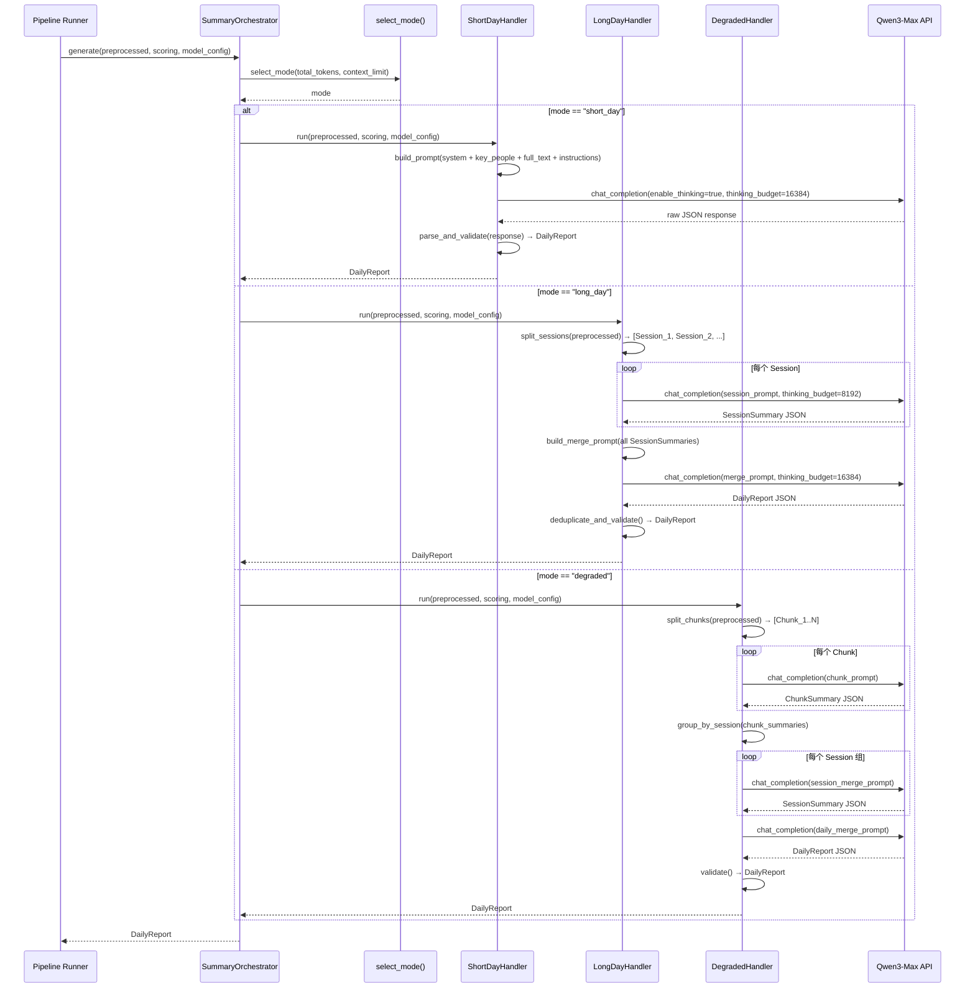
```mermaid
sequenceDiagram
    participant Caller as Pipeline Runner
    participant Orch as SummaryOrchestrator
    participant SM as select_mode()
    participant SD as ShortDayHandler
    participant LD as LongDayHandler
    participant DG as DegradedHandler
    participant LLM as Qwen3-Max API

    Caller->>Orch: generate(preprocessed, scoring, model_config)
    Orch->>SM: select_mode(total_tokens, context_limit)
    SM-->>Orch: mode

    alt mode == "short_day"
        Orch->>SD: run(preprocessed, scoring, model_config)
        SD->>SD: build_prompt(system + key_people + full_text + instructions)
        SD->>LLM: chat_completion(enable_thinking=true, thinking_budget=16384)
        LLM-->>SD: raw JSON response
        SD->>SD: parse_and_validate(response) → DailyReport
        SD-->>Orch: DailyReport

    else mode == "long_day"
        Orch->>LD: run(preprocessed, scoring, model_config)
        LD->>LD: split_sessions(preprocessed) → [Session_1, Session_2, ...]
        loop 每个 Session
            LD->>LLM: chat_completion(session_prompt, thinking_budget=8192)
            LLM-->>LD: SessionSummary JSON
        end
        LD->>LD: build_merge_prompt(all SessionSummaries)
        LD->>LLM: chat_completion(merge_prompt, thinking_budget=16384)
        LLM-->>LD: DailyReport JSON
        LD->>LD: deduplicate_and_validate() → DailyReport
        LD-->>Orch: DailyReport

    else mode == "degraded"
        Orch->>DG: run(preprocessed, scoring, model_config)
        DG->>DG: split_chunks(preprocessed) → [Chunk_1..N]
        loop 每个 Chunk
            DG->>LLM: chat_completion(chunk_prompt)
            LLM-->>DG: ChunkSummary JSON
        end
        DG->>DG: group_by_session(chunk_summaries)
        loop 每个 Session 组
            DG->>LLM: chat_completion(session_merge_prompt)
            LLM-->>DG: SessionSummary JSON
        end
        DG->>LLM: chat_completion(daily_merge_prompt)
        LLM-->>DG: DailyReport JSON
        DG->>DG: validate() → DailyReport
        DG-->>Orch: DailyReport
    end

    Orch-->>Caller: DailyReport
```

### 7.1.4 输入/输出规格

**输入**

| 字段 | 类型 | 说明 |
|:---|:---|:---|
| `preprocessed` | `PreprocessedData` | 预处理后的时间-说话人-内容三元组序列，含会话边界、特征、元数据 |
| `scoring_result` | `ScoringResult` | 片段重要性评分，含 key_person_base_score + llm_score |
| `model_config` | `ModelConfig` | 模型名称、context_limit、API 端点、thinking 模式开关等 |

**输出**

| 字段 | 类型 | 说明 |
|:---|:---|:---|
| 返回值 | `DailyReport` | 统一格式日报对象（详见 7.5） |

---

## 7.2 短日模式实现

### 7.2.1 处理流程

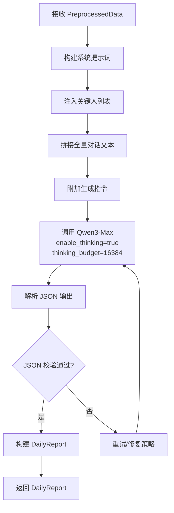
```mermaid
flowchart TD
    A[接收 PreprocessedData] --> B[构建系统提示词]
    B --> C[注入关键人列表]
    C --> D[拼接全量对话文本]
    D --> E[附加生成指令]
    E --> F[调用 Qwen3-Max<br/>enable_thinking=true<br/>thinking_budget=16384]
    F --> G[解析 JSON 输出]
    G --> H{JSON 校验通过?}
    H -->|是| I[构建 DailyReport]
    H -->|否| J[重试/修复策略]
    J --> F
    I --> K[返回 DailyReport]
```

### 7.2.2 输入构造：Prompt 拼接逻辑

```python
class ShortDayHandler:
    """短日模式：单次调用直出全天日报。"""

    # <!-- FIXED: BLOCK-7 — 去掉硬编码 TOKEN_BUDGET，改为通过 TokenBudgetController 动态分配 -->
    def __init__(
        self,
        model_client: ModelClient,
        config: SummaryConfig,
        token_budget_ctrl: TokenBudgetController,
    ):
        self.model_client = model_client
        self.config = config
        self.token_budget_ctrl = token_budget_ctrl

    async def run(
        self,
        preprocessed: PreprocessedData,
        scoring: ScoringResult,
        model_config: ModelConfig,
    ) -> DailyReport:
        # 动态获取 token 预算分配
        budget = self.token_budget_ctrl.allocate(
            total_tokens=preprocessed.total_token_count,
            mode="short_day",
        )
        # budget 返回: {"system_prompt": ..., "key_people": ..., "conversation": ...,
        #               "instructions": ..., "output_reserved": ..., "safety_margin": ...}

        # <!-- FIXED: BLOCK-6 — 使用 await + list[ChatMessage] 参数类型 -->
        messages = self._build_messages(preprocessed, scoring)
        response: ChatCompletionResponse = await self.model_client.chat_completion(
            model=model_config.model_name,
            messages=messages,
            enable_thinking=True,
            thinking_budget=16384,
        )
        return self._parse_response(response)

    # <!-- FIXED: BLOCK-6 — 返回类型改为 list[ChatMessage]，不再用 dict -->
    def _build_messages(
        self,
        preprocessed: PreprocessedData,
        scoring: ScoringResult,
    ) -> list[ChatMessage]:
        """构建 ChatMessage 列表。从 models/types.py 导入 ChatMessage。"""
        system_content = self._load_system_prompt("short_day_system.txt")
        user_content = self._assemble_user_content(preprocessed, scoring)
        return [
            ChatMessage(role="system", content=system_content),
            ChatMessage(role="user", content=user_content),
        ]

    def _assemble_user_content(
        self,
        preprocessed: PreprocessedData,
        scoring: ScoringResult,
    ) -> str:
        """
        拼接顺序（严格按序）：
          1. 关键人列表区段
          2. 全量对话文本区段
          3. 生成指令区段

        <!-- FIXED: 明确 scoring 在短日模式的使用方式 -->
        注意：短日模式下 scoring 不注入 prompt，仅用于后处理阶段：
        - key_meetings 按 FinalScore 降序排序
        - 不影响 prompt 内容构建
        """
        parts = [
            self._format_key_people_section(preprocessed.key_people),
            "---",
            self._format_conversation_section(preprocessed.utterances),
            "---",
            self._load_instruction_prompt("short_day_instructions.txt"),
        ]
        return "\n".join(parts)
```

    # <!-- FIXED: 明确 scoring 在短日模式的后处理使用方式 -->
    def _parse_response(self, response: ChatCompletionResponse) -> DailyReport:
        """解析响应并按 FinalScore 排序 key_meetings。"""
        report = self.parser.parse_daily_report(response)
        # 后处理：key_meetings 按评分的 FinalScore 降序排序
        report.key_meetings.sort(
            key=lambda m: self._get_max_score(m), reverse=True
        )
        return report
```

**拼接区段详解**

| 序号 | 区段 | 内容要素 | Token 预算 |
|:---|:---|:---|:---|
| 1 | 系统提示词（system role） | 角色定义 + 输出格式约束 + 反幻觉规则 + 校验清单 | 1,500-2,000 |
| 2 | 关键人列表（user 最前端） | 姓名、职务、关注领域、优先级标记 | 200-500 |
| 3 | 全量对话文本 | `[HH:MM:SS] 说话人: 内容` 按时间顺序排列 | ≤ 75,000 |
| 4 | 生成指令（user 末尾） | 输出 JSON 结构要求 + 直通通道规则 + 校验约束 | 200-300 |

### 7.2.3 思考模式调用参数

<!-- FIXED: BLOCK-6 — messages 在代码中为 list[ChatMessage]，此处展示序列化后的 API 请求体 -->
```python
# API 请求体（ChatMessage 序列化后的等效 JSON）
{
    "model": "qwen3-max",
    "enable_thinking": True,
    "thinking_budget": 16384,       # 16K tokens 推理空间（PRD 统一为 16,384） <!-- FIXED: thinking_budget 统一为 16,384 -->
    "messages": [
        {"role": "system", "content": "<系统提示词>"},
        {"role": "user",   "content": "<关键人列表>\n---\n<全量对话文本>\n---\n<生成指令>"},
    ],
}
```

| 参数 | 值 | 设计理由 |
|:---|:---|:---|
| `enable_thinking` | `true` | 启用内部推理链，提升主题聚类与去重质量 |
| `thinking_budget` | `16384` | 全天级推理需完成主题识别、跨时段关联、去重判断、排序等复杂任务，需要充足空间 |

### 7.2.4 关键事实直通通道 Prompt 设计

直通通道通过提示词中的显式指令实现，确保三类高价值信息不被压缩或改写：

```
【关键事实直通规则】
对于以下三类信息，你必须保留原始表述，不得改写或概括：

1. 决策（Decision）：含"决定""确认""批准""通过"等动词 + 具体对象
   → 输出格式：原文引用，附时间戳与决策人
   → 示例：{"content": "...", "decision_maker": "张三",
            "source_ref": "[原文(置信度0.95)：'Q3预算最终定500万']"}

2. 行动项（Action Item）：含责任人 + 任务描述 + 截止时间/优先级
   → 输出格式：结构化提取，保留原始表述
   → 示例：{"task": "...", "owner": "李四", "deadline": "本周五"}

3. 关键数据（Key Data）：数字、金额、百分比、日期等量化信息
   → 输出格式：原文引用，标注 ASR 置信度
   → 示例：[原文(置信度0.92)：'成本降低了15%']

引用标注格式：[原文(置信度X.XX)：'原始文本']
当 ASR 置信度 < 0.70 时，使用：[ASR识别不清晰，内容待确认：'原始文本']
```

### 7.2.5 JSON 输出解析与校验

```python
class ResponseParser:
    """解析并校验 LLM 输出的 JSON。"""

    MAX_RETRIES = 2

    # <!-- FIXED: BLOCK-6 — 入参改为 ChatCompletionResponse 对象，从 .content 提取 JSON -->
    def parse_daily_report(self, response: ChatCompletionResponse) -> DailyReport:
        """
        解析流程：
          1. 从 ChatCompletionResponse.content 提取原始文本
          2. 提取 JSON（处理 markdown 代码块包裹等情况）
          3. 结构校验（必填字段检查）
          4. 业务校验（交叉一致性）
          5. 构建 DailyReport 对象
        """
        raw_text = response.content      # 从响应对象提取文本
        json_str = self._extract_json(raw_text)
        data = json.loads(json_str)
        self._validate_structure(data)
        self._validate_business_rules(data)
        return DailyReport.from_dict(data)

    def parse_session_summary(self, response: ChatCompletionResponse) -> SessionSummary:
        """解析时段摘要响应。"""
        raw_text = response.content
        json_str = self._extract_json(raw_text)
        data = json.loads(json_str)
        return SessionSummary.from_dict(data)

    def parse_chunk_summary(self, response: ChatCompletionResponse) -> ChunkSummary:
        """解析片段摘要响应。"""
        raw_text = response.content
        json_str = self._extract_json(raw_text)
        data = json.loads(json_str)
        return ChunkSummary.from_dict(data)

    def _extract_json(self, raw: str) -> str:
        """处理 LLM 输出可能的包裹格式（```json ... ```）。"""
        # 尝试匹配 markdown 代码块
        match = re.search(r"```(?:json)?\s*\n?(.*?)\n?```", raw, re.DOTALL)
        if match:
            return match.group(1).strip()
        # 尝试直接解析整体
        return raw.strip()

    def _validate_structure(self, data: dict) -> None:
        """必填字段校验。"""
        required_fields = ["executive_summary", "key_meetings", "action_items"]
        for field in required_fields:
            if field not in data:
                raise ValidationError(f"缺少必填字段: {field}")

        for meeting in data.get("key_meetings", []):
            if "title" not in meeting or "decisions" not in meeting:
                raise ValidationError("key_meetings 条目缺少 title 或 decisions")

        for item in data.get("action_items", []):
            if "owner" not in item or "task" not in item:
                raise ValidationError("action_item 缺少 owner 或 task")

    def _validate_business_rules(self, data: dict) -> None:
        """业务规则校验。"""
        # 校验 executive_summary 长度（不超过 100 字）
        summary = data.get("executive_summary", "")
        if len(summary) > 150:  # 预留 50% 容差
            logger.warning(f"executive_summary 超长: {len(summary)} 字")

        # 校验 decision 必须含 source_ref
        for meeting in data.get("key_meetings", []):
            for decision in meeting.get("decisions", []):
                if "source_ref" not in decision:
                    raise ValidationError(
                        f"decision 缺少 source_ref: {decision.get('content', '')[:30]}"
                    )
```

---

## 7.3 长日模式实现

### 7.3.1 整体流程

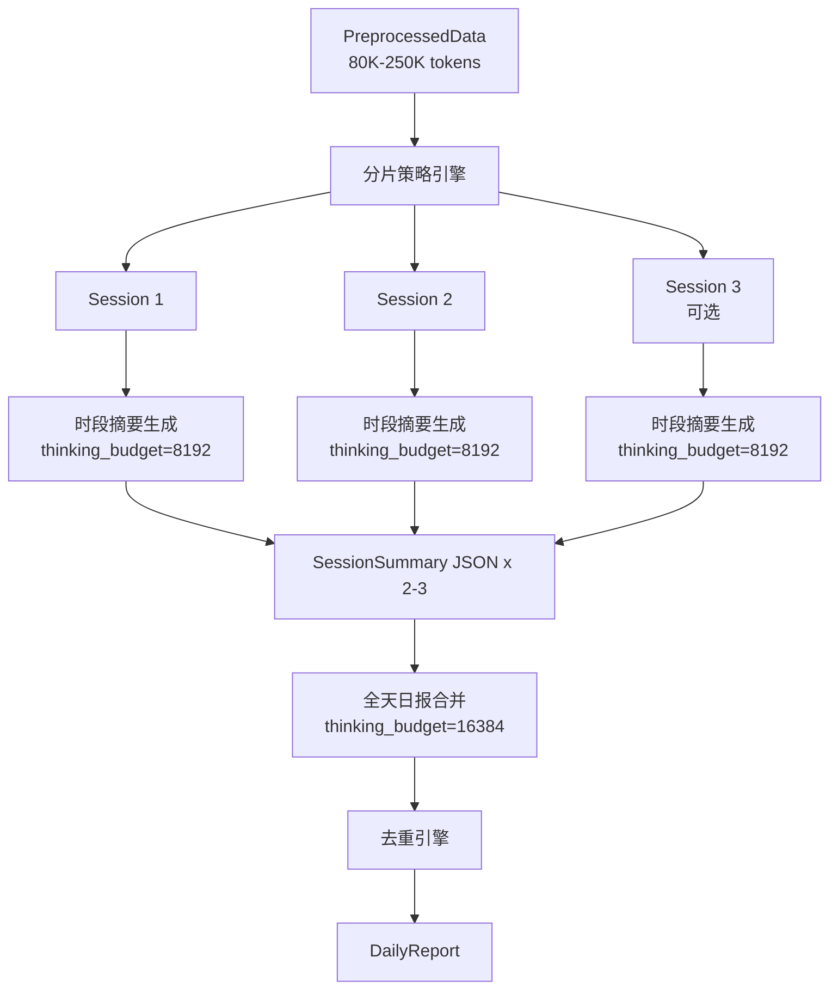
```mermaid
flowchart TD
    A[PreprocessedData<br/>80K-250K tokens] --> B[分片策略引擎]
    B --> C1[Session 1]
    B --> C2[Session 2]
    B --> C3[Session 3<br/>可选]

    C1 --> D1[时段摘要生成<br/>thinking_budget=8192]
    C2 --> D2[时段摘要生成<br/>thinking_budget=8192]
    C3 --> D3[时段摘要生成<br/>thinking_budget=8192]

    D1 --> E[SessionSummary JSON x 2-3]
    D2 --> E
    D3 --> E

    E --> F[全天日报合并<br/>thinking_budget=16384]
    F --> G[去重引擎]
    G --> H[DailyReport]
```

### 7.3.2 分片策略

分片由 `SessionSplitter` 负责，按优先级递减应用三条策略：

```python
class SessionSplitter:
    """将全天对话按时段切分为 2-3 个 session。"""

    MAX_SESSION_TOKENS = 80_000
    SILENCE_THRESHOLD_MINUTES = 30

    def split(self, preprocessed: PreprocessedData) -> list[Session]:
        """
        分片策略优先级：
          1. 自然间断优先：≥30 分钟静默间隔
          2. 时段均衡兜底：上午/下午/晚间
          3. 主题完整性约束：不在主题中间切分
        """
        # 第一步：检测自然间断点
        split_points = self._find_natural_breaks(preprocessed.utterances)

        if self._is_valid_split(split_points, preprocessed):
            return self._apply_split(preprocessed, split_points)

        # 第二步：按时段均衡切分
        split_points = self._time_period_split(preprocessed.utterances)

        # 第三步：回退至最近的话题切换点（主题完整性约束）
        split_points = self._adjust_for_topic_integrity(
            split_points, preprocessed.utterances
        )

        return self._apply_split(preprocessed, split_points)

    def _find_natural_breaks(
        self, utterances: list[Utterance]
    ) -> list[int]:
        """查找 ≥30 分钟的静默间隔作为候选切分点。"""
        breaks = []
        for i in range(1, len(utterances)):
            gap = utterances[i].start_time - utterances[i - 1].end_time
            if gap.total_seconds() >= self.SILENCE_THRESHOLD_MINUTES * 60:
                breaks.append(i)
        return breaks

    def _time_period_split(
        self, utterances: list[Utterance]
    ) -> list[int]:
        """按上午(~12:00)/下午(~18:00)/晚间划分。"""
        boundaries = [time(12, 0), time(18, 0)]
        split_points = []
        for boundary in boundaries:
            idx = self._find_nearest_utterance(utterances, boundary)
            if idx is not None:
                split_points.append(idx)
        return split_points

    def _adjust_for_topic_integrity(
        self,
        split_points: list[int],
        utterances: list[Utterance],
    ) -> list[int]:
        """
        确保切分点不落在同一讨论主题中间。
        向前回退至最近的话题切换点（speaker 变化 + 间隔 > 3min）。
        """
        adjusted = []
        for point in split_points:
            adjusted_point = self._retreat_to_topic_boundary(
                point, utterances
            )
            adjusted.append(adjusted_point)
        return adjusted
```

**分片策略决策表**

| 优先级 | 策略 | 切分依据 | 回退条件 |
|:---|:---|:---|:---|
| 1 | 自然间断优先 | ≥30 分钟静默间隔 | 无足够间断点，或切分后某片 > 80K tokens |
| 2 | 时段均衡兜底 | 12:00 / 18:00 时间边界 | 某时段无数据 |
| 3 | 主题完整性约束 | 说话人切换 + 间隔 > 3 分钟 | 作用于前两步的切分点进行微调 |

### 7.3.3 第一级：时段摘要生成

```python
class LongDayHandler:
    """长日模式：两级弹性摘要。"""

    def __init__(
        self,
        model_client: ModelClient,
        config: SummaryConfig,
        token_budget_ctrl: TokenBudgetController,
    ):
        self.model_client = model_client
        self.config = config
        self.token_budget_ctrl = token_budget_ctrl
        self.splitter = SessionSplitter()
        self.parser = ResponseParser()
        self.deduplicator = Deduplicator()

    async def run(
        self,
        preprocessed: PreprocessedData,
        scoring: ScoringResult,
        model_config: ModelConfig,
        partial_results: list[SessionSummary] | None = None,
    ) -> DailyReport:
        # 第一步：分片
        sessions = self.splitter.split(preprocessed)

        # <!-- FIXED: BLOCK-7 — 通过 TokenBudgetController 获取动态预算 -->
        budget = self.token_budget_ctrl.allocate(
            total_tokens=preprocessed.total_token_count,
            mode="long_day",
        )

        # <!-- FIXED: BLOCK-11 — 单个时段摘要失败时跳过该时段并标记，不中断整个流程 -->
        # 第二步：逐时段生成摘要，单个失败不中断
        session_summaries: list[SessionSummary] = []
        skipped_sessions: list[dict] = []
        for session in sessions:
            try:
                summary = await self._generate_session_summary(
                    session, scoring, model_config
                )
                session_summaries.append(summary)
                if partial_results is not None:
                    partial_results.append(summary)  # 供外层异常处理收集
            except QwenExhaustedError as e:
                logger.warning(
                    f"时段 {session.session_id} 摘要生成失败，跳过: {e}"
                )
                skipped_sessions.append({
                    "session_id": session.session_id,
                    "error": str(e),
                })
                continue

        if not session_summaries:
            raise QwenExhaustedError("所有时段摘要均失败")

        # 第三步：合并生成全天日报
        report = await self._merge_to_daily_report(
            session_summaries, scoring, model_config
        )
        # 标记跳过的时段
        if skipped_sessions:
            report.metadata.skipped_sessions = skipped_sessions
        return report

    async def _generate_session_summary(
        self,
        session: Session,
        scoring: ScoringResult,
        model_config: ModelConfig,
    ) -> SessionSummary:
        # <!-- FIXED: BLOCK-6 — messages 使用 list[ChatMessage] -->
        messages: list[ChatMessage] = self._build_session_messages(session, scoring)
        # <!-- FIXED: BLOCK-6 — await async chat_completion，返回 ChatCompletionResponse -->
        response: ChatCompletionResponse = await self.model_client.chat_completion(
            model=model_config.model_name,
            messages=messages,
            enable_thinking=True,
            thinking_budget=8192,     # 时段级推理复杂度较低
        )
        return self.parser.parse_session_summary(response)
```

**时段摘要输出 JSON 结构**

```json
{
  "session_id": "session_morning",
  "time_range": "09:00-12:30",
  "session_theme": "产品评审与Q3预算",
  "participants": ["张三(产品总监)", "李四(财务)", "王五(研发)"],
  "topics": [
    {
      "topic_id": "topic_001",
      "title": "Q3预算分配方案",
      "duration_minutes": 45,
      "discussion_flow": "背景 -> 方案对比 -> 争议点 -> 最终决策",
      "key_points": ["要点1", "要点2"],
      "decisions": [
        {
          "content": "Q3研发预算确定为500万",
          "decision_maker": "张三",
          "source_ref": "[原文(置信度0.95)：'Q3预算最终定500万']",
          "timestamp": "10:32"
        }
      ],
      "action_items": [
        {
          "task": "输出Q3预算明细表",
          "owner": "李四",
          "deadline": "本周五",
          "priority": "high",
          "source_ref": "seg_042"
        }
      ],
      "status": "concluded"
    }
  ],
  "pending_topics": [
    {
      "topic_id": "topic_002",
      "reason": "参会者对优先级未达成一致",
      "next_step": "张三整理各方意见后重新组织讨论"
    }
  ],
  "critical_facts": [
    {
      "type": "key_data",
      "content": "Q3预算500万",
      "source_ref": "[原文(置信度0.95)：'Q3预算最终定500万']"
    }
  ],
  "source_refs": {
    "segment_range": ["seg_001", "seg_058"],
    "total_segments": 58
  }
}
```

**字段职责一览**

| 字段 | 类型 | 说明 | 下游用途 |
|:---|:---|:---|:---|
| `topic_id` | `str` | 格式 `topic_XXX`，时段内唯一 | 跨时段关联、输出溯源 |
| `pending_topics` | `list[PendingTopic]` | 未决议题，含原因与下一步 | 合并阶段归集至扩展层 |
| `critical_facts` | `list[CriticalFact]` | 直通内容，不经压缩 | 合并阶段原样传递至最终日报 |
| `source_refs` | `SourceRefRange` | 本时段覆盖的原始片段范围 | 溯源链构建 |
| `status` | `enum` | `concluded` / `pending` / `ongoing` | 驱动扩展层 pending_topics 生成 |

### 7.3.4 第二级：全天日报合并

```python
    async def _merge_to_daily_report(
        self,
        session_summaries: list[SessionSummary],
        scoring: ScoringResult,
        model_config: ModelConfig,
    ) -> DailyReport:
        # 预处理：跨时段 topic_id 关联
        topic_map = self._build_topic_map(session_summaries)

        # 预处理：归集 critical_facts
        all_critical_facts = self._collect_critical_facts(session_summaries)

        # 构建合并 prompt
        # <!-- FIXED: BLOCK-6 — messages 使用 list[ChatMessage] -->
        messages: list[ChatMessage] = self._build_merge_messages(
            session_summaries, topic_map, all_critical_facts
        )

        # <!-- FIXED: BLOCK-6 — await async chat_completion，返回 ChatCompletionResponse -->
        response: ChatCompletionResponse = await self.model_client.chat_completion(
            model=model_config.model_name,
            messages=messages,
            enable_thinking=True,
            thinking_budget=16384,    # 全天级合并需要充足推理空间
        )

        report = self.parser.parse_daily_report(response)

        # 后处理：去重
        report = self.deduplicator.deduplicate(report)

        return report
```

<!-- FIXED: 明确长日模式中 scoring 的消费方式 -->
> **长日模式 scoring 使用方式**：scoring 结果用于时段内内容排序（高分片段优先出现在 prompt 中）和 key_meetings 优先级排定（按 FinalScore 降序）。不用于内容裁剪。

#### topic_id 跨时段关联实现

```python
class TopicLinker:
    """跨时段 topic_id 关联引擎。"""

    SIMILARITY_THRESHOLD = 0.90

    def build_topic_map(
        self, session_summaries: list[SessionSummary]
    ) -> dict[str, list[str]]:
        """
        构建 topic_id 关联映射。
        返回: {canonical_topic_id: [related_topic_ids]}

        关联策略:
          1. topic_id 完全匹配（同一 topic 跨时段出现）
          2. 主题标题语义相似度 >= 0.90
          3. 参与人重合度 >= 60%
        """
        all_topics = self._extract_all_topics(session_summaries)
        topic_map: dict[str, list[str]] = {}

        for i, topic_a in enumerate(all_topics):
            for topic_b in all_topics[i + 1:]:
                if self._should_link(topic_a, topic_b):
                    canonical = topic_a.topic_id
                    topic_map.setdefault(canonical, [canonical])
                    topic_map[canonical].append(topic_b.topic_id)

        return topic_map

    def _should_link(self, a: TopicInfo, b: TopicInfo) -> bool:
        """判断两个 topic 是否为同一议题。"""
        # 相同 topic_id 直接关联
        if a.topic_id == b.topic_id:
            return True

        # 标题语义相似度
        similarity = self.embedding_model.cosine_similarity(a.title, b.title)
        if similarity < self.SIMILARITY_THRESHOLD:
            return False

        # 参与人重合度辅助验证
        participant_overlap = self._participant_overlap_ratio(a, b)
        return participant_overlap >= 0.6
```

#### 去重逻辑

```python
class Deduplicator:
    """语义相似度 + 实体级校验双重去重。"""

    SEMANTIC_THRESHOLD = 0.91       # 0.90-0.92 区间中值
    ENTITY_OVERLAP_THRESHOLD = 0.80

    def deduplicate(self, report: DailyReport) -> DailyReport:
        """对 DailyReport 中的信息项执行去重。"""
        report.action_items = self._dedup_action_items(report.action_items)
        for meeting in report.key_meetings:
            meeting.decisions = self._dedup_decisions(meeting.decisions)
        return report

    def _dedup_action_items(
        self, items: list[ActionItem]
    ) -> list[ActionItem]:
        """
        行动项去重：责任人相同 + 任务相似度 >= 0.90。
        合并后保留最完整版本（含最明确的截止日期与优先级）。
        """
        unique: list[ActionItem] = []
        for item in items:
            duplicate_idx = self._find_duplicate_action(item, unique)
            if duplicate_idx is not None:
                unique[duplicate_idx] = self._merge_actions(
                    unique[duplicate_idx], item
                )
            else:
                unique.append(item)
        return unique

    def _is_semantic_duplicate(self, text_a: str, text_b: str) -> bool:
        """语义相似度判定。"""
        similarity = self.embedding_model.cosine_similarity(text_a, text_b)
        return similarity >= self.SEMANTIC_THRESHOLD

    def _is_entity_match(self, text_a: str, text_b: str) -> bool:
        """实体级校验：核心实体（人名、数字、日期）重合率 >= 80%。"""
        entities_a = self.ner_extractor.extract(text_a)
        entities_b = self.ner_extractor.extract(text_b)
        if not entities_a and not entities_b:
            return True
        overlap = len(entities_a & entities_b)
        total = max(len(entities_a), len(entities_b))
        return (overlap / total) >= self.ENTITY_OVERLAP_THRESHOLD if total > 0 else True
```

**去重策略汇总**

| 维度 | 方法 | 阈值 | 向量模型 |
|:---|:---|:---|:---|
| 语义相似度 | 句向量余弦相似度 | 0.90-0.92 | text2vec-base-chinese 或 m3e-large |
| 实体级校验 | NER 提取 + 实体集合重合率 | 核心实体重合 ≥ 80% | -- |
| 行动项去重 | 责任人匹配 + 任务相似度 | 责任人相同 + 相似度 ≥ 0.90 | 同上 |

#### critical_facts 归集

```python
    def _collect_critical_facts(
        self, session_summaries: list[SessionSummary]
    ) -> list[CriticalFact]:
        """
        从各时段摘要中归集 critical_facts。
        直通内容不经压缩，按时间顺序排列后注入合并 prompt。
        """
        all_facts: list[CriticalFact] = []
        for session in session_summaries:
            for fact in session.critical_facts:
                fact.source_session = session.session_id
                all_facts.append(fact)

        # 去重：相同 source_ref 视为同一事实
        return self._dedup_facts(all_facts)
```

---

## 7.4 降级模式实现

### 7.4.1 三级串联流程

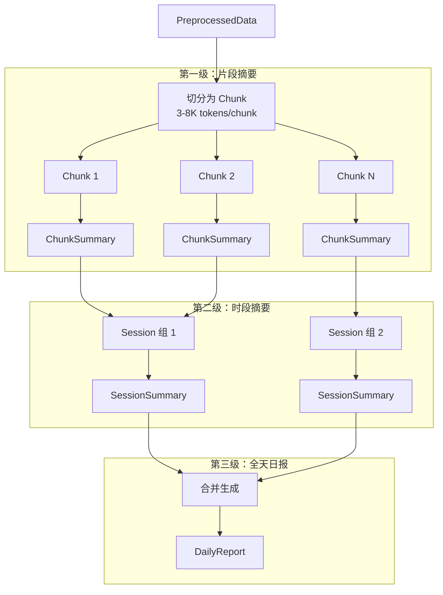
```mermaid
flowchart TD
    A[PreprocessedData] --> B[切分为 Chunk<br/>3-8K tokens/chunk]

    subgraph "第一级：片段摘要"
        B --> C1[Chunk 1]
        B --> C2[Chunk 2]
        B --> CN[Chunk N]
        C1 --> D1[ChunkSummary]
        C2 --> D2[ChunkSummary]
        CN --> DN[ChunkSummary]
    end

    subgraph "第二级：时段摘要"
        D1 --> E1[Session 组 1]
        D2 --> E1
        DN --> E2[Session 组 2]
        E1 --> F1[SessionSummary]
        E2 --> F2[SessionSummary]
    end

    subgraph "第三级：全天日报"
        F1 --> G[合并生成]
        F2 --> G
        G --> H[DailyReport]
    end
```

### 7.4.2 实现伪代码

```python
class DegradedHandler:
    """降级模式：三级渐进压缩架构。"""

    CHUNK_TOKEN_LIMIT = 8_000       # 单片段 token 上限
    SESSION_TOKEN_LIMIT = 24_000    # 时段合并 token 上限
    DAILY_TOKEN_LIMIT = 24_000      # 全天合并 token 上限

    async def run(
        self,
        preprocessed: PreprocessedData,
        scoring: ScoringResult,
        model_config: ModelConfig,
    ) -> DailyReport:
        # ---- 第一级：片段摘要 ----
        chunks = self._split_to_chunks(preprocessed)
        chunk_summaries = await asyncio.gather(
            *[self._summarize_chunk(chunk, model_config) for chunk in chunks]
        )

        # ---- 第二级：时段摘要 ----
        session_groups = self._group_chunks_by_session(chunk_summaries)
        session_summaries = await asyncio.gather(
            *[
                self._merge_session(group, model_config)
                for group in session_groups
            ]
        )

        # ---- 第三级：全天日报 ----
        report = await self._merge_daily(session_summaries, model_config)
        return report

    async def _summarize_chunk(
        self,
        chunk: Chunk,
        model_config: ModelConfig,
    ) -> ChunkSummary:
        """片段级摘要。不启用思考模式（小模型不支持或效果不佳）。"""
        # <!-- FIXED: BLOCK-6 — messages 使用 list[ChatMessage]，response 为 ChatCompletionResponse -->
        messages: list[ChatMessage] = self._build_chunk_messages(chunk)
        response: ChatCompletionResponse = await self.model_client.chat_completion(
            model=model_config.model_name,
            messages=messages,
            enable_thinking=False,
        )
        return self.parser.parse_chunk_summary(response)

    async def _merge_session(
        self,
        chunk_summaries: list[ChunkSummary],
        model_config: ModelConfig,
    ) -> SessionSummary:
        """将同一时段的片段摘要合并为时段摘要（同 5.2.2 格式）。"""
        messages: list[ChatMessage] = self._build_session_merge_messages(chunk_summaries)
        response: ChatCompletionResponse = await self.model_client.chat_completion(
            model=model_config.model_name,
            messages=messages,
            enable_thinking=False,
        )
        return self.parser.parse_session_summary(response)

    async def _merge_daily(
        self,
        session_summaries: list[SessionSummary],
        model_config: ModelConfig,
    ) -> DailyReport:
        """将各时段摘要合并为全天日报（同 5.4 格式）。"""
        messages: list[ChatMessage] = self._build_daily_merge_messages(session_summaries)
        response: ChatCompletionResponse = await self.model_client.chat_completion(
            model=model_config.model_name,
            messages=messages,
            enable_thinking=False,
        )
        return self.parser.parse_daily_report(response)
```

**降级模式各级 Token 预算**

| 级别 | 输入上限 | 输出上限 | thinking |
|:---|:---|:---|:---|
| 第一级：片段摘要 | 3-8K tokens（单片段） | ≤ 12K | 不启用 |
| 第二级：时段摘要 | 同一时段的片段摘要集合 | ≤ 24K | 不启用 |
| 第三级：全天日报 | 各时段摘要集合 | ≤ 24K | 不启用 |

**片段级摘要输出结构**

```json
{
  "chunk_id": "chunk_012",
  "summary": "200字内核心摘要",
  "key_points": ["要点1", "要点2", "要点3"],
  "action_items": [
    {"task": "任务描述", "owner": "责任人", "deadline": "截止日期", "priority": "high"}
  ],
  "key_people_involved": ["张三", "李四"],
  "importance_score": 85,
  "importance_rationale": "P0级关键人参与，涉及战略决策",
  "source_refs": ["seg_001", "seg_002"]
}
```

---

## 7.5 输出模型（models/summary.py）

### 7.5.1 DailyReport 数据类

```python
@dataclass
class DailyReport:
    """
    全天日报统一输出模型。
    无论 short_day / long_day / degraded 模式，最终均输出此结构。
    分为核心层（必生成）+ 扩展层（可选）。
    """

    # ========== 核心层（必生成） ==========
    executive_summary: str
    """执行摘要，3-5 句话概述全天核心结论，50-100 字。"""

    key_meetings: list["KeyMeeting"]
    """关键会议/讨论回顾，按重要性排序，3-5 个，各 200-300 字。"""

    action_items: list["ActionItem"]
    """行动事项总表，按责任人组织。"""

    # ========== 扩展层（可选） ==========
    pending_topics: list["PendingTopic"] | None = None
    """悬置议题列表。存在 status=pending 的议题时生成。"""

    follow_up: list["FollowUp"] | None = None
    """跟进建议。存在行动项或悬置议题时生成。"""

    tomorrow_known_schedule: list["ScheduleItem"] | None = None
    """明日已知安排。仅基于对话中明确提及的时间承诺，不做推断。"""

    # ========== 元数据 ==========
    metadata: "ReportMetadata" = field(default_factory=ReportMetadata)

    # ========== 阅读视图生成 ==========
    def to_30s_view(self) -> str:
        """30 秒速览版：~100 字。"""
        return self._truncate(self.executive_summary, max_chars=100)

    def to_3min_view(self) -> str:
        """3 分钟标准版：500-800 字。"""
        parts = [self.executive_summary]
        for meeting in self.key_meetings:
            parts.append(f"## {meeting.title}")
            for d in meeting.decisions:
                parts.append(f"  - 决策: {d.content}")
        parts.append("## 行动事项")
        for item in self.action_items:
            parts.append(f"  - [{item.priority}] {item.owner}: {item.task}")
        return "\n".join(parts)

    def to_full_view(self) -> str:
        """完整存档版：1,500-3,000 字，含全部核心层 + 扩展层 + 溯源引用。"""
        parts = [self.to_3min_view()]
        if self.pending_topics:
            parts.append("## 悬置议题")
            for pt in self.pending_topics:
                parts.append(f"  - {pt.title}: {pt.reason}")
        if self.follow_up:
            parts.append("## 跟进建议")
            for fu in self.follow_up:
                parts.append(f"  - {fu.suggestion}")
        if self.tomorrow_known_schedule:
            parts.append("## 明日已知安排")
            for s in self.tomorrow_known_schedule:
                parts.append(f"  - {s.time}: {s.description}")
        return "\n".join(parts)

    @classmethod
    def from_dict(cls, data: dict) -> "DailyReport":
        """从 JSON dict 构建 DailyReport 实例。"""
        return cls(
            executive_summary=data["executive_summary"],
            key_meetings=[KeyMeeting.from_dict(m) for m in data["key_meetings"]],
            action_items=[ActionItem.from_dict(a) for a in data["action_items"]],
            pending_topics=(
                [PendingTopic.from_dict(p) for p in data["pending_topics"]]
                if data.get("pending_topics") else None
            ),
            follow_up=(
                [FollowUp.from_dict(f) for f in data["follow_up"]]
                if data.get("follow_up") else None
            ),
            tomorrow_known_schedule=(
                [ScheduleItem.from_dict(s) for s in data["tomorrow_known_schedule"]]
                if data.get("tomorrow_known_schedule") else None
            ),
        )
```

### 7.5.2 子结构定义

```python
@dataclass
class KeyMeeting:
    """关键会议/讨论条目。"""
    title: str
    time_range: str                         # "10:00-11:30"
    participants: list[str]
    summary: str                            # 200-300 字
    decisions: list["Decision"]
    topic_ids: list[str]                    # 关联的 topic_id 列表
    source_refs: list[str]                  # ["seg_020", "seg_045"]

    @classmethod
    def from_dict(cls, data: dict) -> "KeyMeeting":
        return cls(
            title=data["title"],
            time_range=data.get("time_range", ""),
            participants=data.get("participants", []),
            summary=data.get("summary", ""),
            decisions=[Decision.from_dict(d) for d in data.get("decisions", [])],
            topic_ids=data.get("topic_ids", []),
            source_refs=data.get("source_refs", []),
        )


@dataclass
class Decision:
    """决策记录。"""
    content: str                            # 决策内容
    decision_maker: str                     # 决策人
    source_ref: str                         # "[原文(置信度0.95)：'...']"
    timestamp: str | None = None            # "10:32"

    @classmethod
    def from_dict(cls, data: dict) -> "Decision":
        return cls(
            content=data["content"],
            decision_maker=data["decision_maker"],
            source_ref=data["source_ref"],
            timestamp=data.get("timestamp"),
        )


@dataclass
class ActionItem:
    """行动事项。"""
    task: str                               # 任务描述
    owner: str                              # 责任人
    deadline: str | None = None             # 截止日期
    priority: str = "medium"                # high / medium / low
    source_ref: str | None = None           # 溯源引用

    @classmethod
    def from_dict(cls, data: dict) -> "ActionItem":
        return cls(
            task=data["task"],
            owner=data["owner"],
            deadline=data.get("deadline"),
            priority=data.get("priority", "medium"),
            source_ref=data.get("source_ref"),
        )


@dataclass
class PendingTopic:
    """悬置议题。"""
    topic_id: str
    title: str
    reason: str                             # 未决原因
    next_step: str                          # 建议下一步

    @classmethod
    def from_dict(cls, data: dict) -> "PendingTopic":
        return cls(
            topic_id=data.get("topic_id", ""),
            title=data.get("title", ""),
            reason=data["reason"],
            next_step=data["next_step"],
        )


@dataclass
class FollowUp:
    """跟进建议。"""
    suggestion: str
    related_action_ids: list[str] = field(default_factory=list)
    related_topic_ids: list[str] = field(default_factory=list)

    @classmethod
    def from_dict(cls, data: dict) -> "FollowUp":
        return cls(
            suggestion=data["suggestion"],
            related_action_ids=data.get("related_action_ids", []),
            related_topic_ids=data.get("related_topic_ids", []),
        )


@dataclass
class ScheduleItem:
    """明日已知安排（仅基于对话中明确提及的时间承诺）。"""
    time: str                               # "14:00"
    description: str
    source_ref: str | None = None           # 溯源至原始对话

    @classmethod
    def from_dict(cls, data: dict) -> "ScheduleItem":
        return cls(
            time=data["time"],
            description=data["description"],
            source_ref=data.get("source_ref"),
        )


@dataclass
class CriticalFact:
    """关键事实直通内容。"""
    type: str                               # "decision" / "action_item" / "key_data"
    content: str
    source_ref: str
    source_session: str | None = None       # 来源时段 session_id


@dataclass
class ReportMetadata:
    """日报元数据。"""
    generation_mode: str = ""               # "short_day" / "long_day" / "degraded" / "partial_failure"
    report_date: str = ""                   # "2026-03-27"
    total_tokens_processed: int = 0
    api_calls_count: int = 0
    generation_time_seconds: float = 0.0
    model_name: str = ""
    error_message: str | None = None        # <!-- FIXED: BLOCK-11 — 记录 QwenExhaustedError 信息 -->
    skipped_sessions: list[dict] | None = None  # <!-- FIXED: BLOCK-11 — 记录跳过的时段 -->
```

### 7.5.3 三级阅读体验生成方法

| 视图 | 方法 | 内容来源 | 目标长度 | 实现方式 |
|:---|:---|:---|:---|:---|
| 30 秒速览版 | `to_30s_view()` | `executive_summary` 截取 | ~100 字 | 字符截断 + 句末对齐 |
| 3 分钟标准版 | `to_3min_view()` | executive_summary + key_meetings 标题与决策 + action_items | 500-800 字 | 字段拼接模板 |
| 完整存档版 | `to_full_view()` | 全部核心层 + 扩展层 + 溯源引用 | 1,500-3,000 字 | 全字段渲染 |

> 30 秒速览版不额外调用 API，由 `to_30s_view()` 对 `executive_summary` 进行规则截取实现。

### 7.5.4 溯源链（source_refs）数据结构

```mermaid
graph TD
    A["DailyReport.key_meetings[0].source_refs<br/>['seg_020', 'seg_045']"] --> B["SessionSummary.topics[0].source_refs<br/>{segment_range: ['seg_020', 'seg_045'],<br/>total_segments: 58}"]
    B --> C["原始片段 seg_020<br/>音频时间戳 10:02:15 - 10:05:30"]
    B --> D["原始片段 seg_045<br/>音频时间戳 11:15:00 - 11:18:22"]

    A2["DailyReport.key_meetings[0].decisions[0].source_ref<br/>'[原文(置信度0.95)：Q3预算最终定500万]'"] --> C
```

**溯源链层级关系**

| 层级 | source_refs 类型 | 内容 | 指向 |
|:---|:---|:---|:---|
| DailyReport.key_meetings | `list[str]` | 片段 ID 列表 | SessionSummary / 原始片段 |
| DailyReport.decisions | `str` | 含 ASR 置信度的原文引用 | 原始对话片段 |
| DailyReport.action_items | `str` | 片段 ID | 原始对话片段 |
| SessionSummary.source_refs | `SourceRefRange` | segment_range + total_segments | 原始片段范围 |
| ChunkSummary.source_refs | `list[str]` | 片段 ID 列表 | 原始对话片段 |

```python
@dataclass
class SourceRefRange:
    """时段级溯源范围。"""
    segment_range: tuple[str, str]          # ("seg_001", "seg_058") 起止片段
    total_segments: int                     # 覆盖片段总数

    def contains(self, seg_id: str) -> bool:
        """判断某片段 ID 是否在本范围内。"""
        start_num = int(self.segment_range[0].split("_")[1])
        end_num = int(self.segment_range[1].split("_")[1])
        target_num = int(seg_id.split("_")[1])
        return start_num <= target_num <= end_num
```

---

## 7.6 提示词模板（prompts/）

### 7.6.1 模板文件组织

```
prompts/
  short_day_system.txt          # 短日模式系统提示词
  short_day_instructions.txt    # 短日模式生成指令
  long_day_session_system.txt   # 长日模式-时段摘要系统提示词
  long_day_session_instructions.txt  # 长日模式-时段摘要生成指令
  long_day_merge_system.txt     # 长日模式-合并系统提示词
  long_day_merge_instructions.txt    # 长日模式-合并生成指令
  degraded_chunk_system.txt     # 降级模式-片段摘要系统提示词
  degraded_session_system.txt   # 降级模式-时段合并系统提示词
  degraded_daily_system.txt     # 降级模式-全天合并系统提示词
  _partials/
    role_definition.txt         # 共享：角色定义
    anti_hallucination.txt      # 共享：反幻觉规则
    output_format.txt           # 共享：输出格式约束
    critical_fact_rules.txt     # 共享：关键事实直通规则
    validation_checklist.txt    # 共享：校验清单
```

### 7.6.2 各模板核心结构

#### short_day_system.txt

```
{role_definition}

【输出格式】
{output_format_daily_report}

【反幻觉规则】
{anti_hallucination_rules}

【关键事实直通规则】
{critical_fact_rules}

【输出校验清单】
{validation_checklist}
```

**关键占位符**

| 占位符 | 来源 | 说明 |
|:---|:---|:---|
| `{role_definition}` | `_partials/role_definition.txt` | 系统角色定义 |
| `{output_format_daily_report}` | `_partials/output_format.txt` | JSON 输出结构约束 |
| `{anti_hallucination_rules}` | `_partials/anti_hallucination.txt` | 反幻觉三条规则 |
| `{critical_fact_rules}` | `_partials/critical_fact_rules.txt` | 决策/行动项/关键数据直通规则 |
| `{validation_checklist}` | `_partials/validation_checklist.txt` | 输出前逐项检查清单 |

#### short_day_instructions.txt（用户消息末尾）

```
请基于以上对话记录，生成结构化全天日报。

要求：
1. 输出严格 JSON 格式，包含 executive_summary / key_meetings / action_items
2. key_meetings 按重要性排序，每个条目含 decisions 子字段
3. 所有决策和关键数据必须附带 source_ref 原文引用
4. executive_summary 控制在 100 字以内
5. {pending_topics_instruction}
6. {tomorrow_schedule_instruction}
```

| 占位符 | 说明 |
|:---|:---|
| `{pending_topics_instruction}` | 存在未决议题时的处理指令 |
| `{tomorrow_schedule_instruction}` | 明日安排提取指令（仅基于明确时间承诺） |

#### long_day_session_system.txt

```
{role_definition}

你正在处理全天对话的【{session_name}】时段（{time_range}）。
本时段是全天 {total_sessions} 个时段中的第 {session_index} 个。

【输出格式】
{output_format_session_summary}

【反幻觉规则】
{anti_hallucination_rules}

【关键事实直通规则】
{critical_fact_rules}

{previous_session_context}
```

**附加占位符**

| 占位符 | 说明 |
|:---|:---|
| `{session_name}` | 时段名称（"上午" / "下午" / "晚间"） |
| `{time_range}` | 时段时间范围（"09:00-12:30"） |
| `{total_sessions}` | 全天总时段数 |
| `{session_index}` | 当前时段序号 |
| `{output_format_session_summary}` | SessionSummary JSON 结构约束 |
| `{previous_session_context}` | 前一时段的 200-300 字上下文接力摘要（首个时段为空） |

#### long_day_merge_system.txt

```
{role_definition}

你将收到 {session_count} 个时段摘要的 JSON 输出，请合并生成全天日报。

【合并任务】
1. 通过 topic_id 识别跨时段同一议题，合并讨论脉络
2. 去重：合并重复的行动项与决策，保留最完整版本
3. 全局排序：按重要性而非时间顺序组织输出
4. 归集各时段的 critical_facts 至最终日报

【输出格式】
{output_format_daily_report}

【反幻觉规则】
{anti_hallucination_rules}

【校验清单】
{validation_checklist}
```

| 占位符 | 说明 |
|:---|:---|
| `{session_count}` | 时段摘要数量 |

#### 关键人列表区段（动态生成，非模板文件）

```
【关键人列表】
{key_people_formatted}

请在摘要中优先关注以上人员的发言、决策与行动项。
---
```

| 占位符 | 说明 |
|:---|:---|
| `{key_people_formatted}` | 格式化的关键人信息，每行一人：`- 姓名｜职务｜关注：领域1、领域2` |

### 7.6.3 变量替换机制

```python
class PromptTemplate:
    """提示词模板引擎。"""

    TEMPLATE_DIR = Path("prompts/")
    PARTIALS_DIR = TEMPLATE_DIR / "_partials"

    def __init__(self):
        self._partial_cache: dict[str, str] = {}

    def render(self, template_name: str, **variables) -> str:
        """
        加载模板文件并执行变量替换。

        替换流程（两遍）：
          1. 第一遍：展开 partial 引用 {partial_name} → 加载 _partials/partial_name.txt
          2. 第二遍：替换运行时变量 {variable_name} → variables[variable_name]
        """
        raw = self._load_template(template_name)

        # 第一遍：展开 partials
        expanded = self._expand_partials(raw)

        # 第二遍：替换运行时变量
        rendered = expanded
        for key, value in variables.items():
            rendered = rendered.replace(f"{{{key}}}", str(value))

        # 校验：检查是否有未替换的占位符
        unreplaced = re.findall(r"\{(\w+)\}", rendered)
        if unreplaced:
            logger.warning(f"模板 {template_name} 中存在未替换变量: {unreplaced}")

        return rendered

    def _expand_partials(self, template: str) -> str:
        """展开 partial 引用。{xxx} 如果对应 _partials/xxx.txt 则替换为文件内容。"""
        def replace_partial(match: re.Match) -> str:
            name = match.group(1)
            partial_path = self.PARTIALS_DIR / f"{name}.txt"
            if partial_path.exists():
                return self._load_partial(name)
            return match.group(0)   # 非 partial，保留原样供第二遍替换

        return re.sub(r"\{(\w+)\}", replace_partial, template)

    def _load_template(self, name: str) -> str:
        path = self.TEMPLATE_DIR / name
        return path.read_text(encoding="utf-8")

    def _load_partial(self, name: str) -> str:
        if name not in self._partial_cache:
            path = self.PARTIALS_DIR / f"{name}.txt"
            self._partial_cache[name] = path.read_text(encoding="utf-8")
        return self._partial_cache[name]
```

**两遍替换示意**

```
第一遍 (partial 展开):
  "{role_definition}" → 加载 _partials/role_definition.txt 内容
  "{anti_hallucination_rules}" → 加载 _partials/anti_hallucination.txt 内容
  "{session_name}" → 无对应 partial 文件，保留原样

第二遍 (运行时变量替换):
  "{session_name}" → "上午"
  "{time_range}" → "09:00-12:30"
```

---

## 附录 A：模式间差异对照表

| 维度 | 短日模式 | 长日模式 | 降级模式 |
|:---|:---|:---|:---|
| 触发条件 | tokens < 80K | 80K-250K tokens | 模型 context < 64K 或 tokens > 250K |
| API 调用次数 | 1 | 3-4 | 10+ |
| thinking 模式 | 启用 (16384) | 时段 8192 / 合并 16384 | 不启用 |
| 分片 | 无 | 2-3 个时段 | 多片段 -> 时段 -> 全天 |
| 去重 | 模型内部完成 | 语义相似度 + 实体校验 | 同长日模式 |
| topic_id | 模型单次内部分配 | 时段分配 + 跨时段关联 | 片段分配 + 逐级传递 |
| scoring 使用 | 不注入 prompt，仅后处理排序 <!-- FIXED: 明确 scoring 使用 --> | 时段内容排序 + key_meetings 优先级 | 同长日模式 |
| Token 预算 | `TokenBudgetController.allocate(mode="short_day")` <!-- FIXED: BLOCK-7 --> | `TokenBudgetController.allocate(mode="long_day")` | 固定值（降级模型 context 有限） |
| 错误处理 | 捕获 QwenExhaustedError → 人工队列 <!-- FIXED: BLOCK-11 --> | 单时段失败跳过并标记 | 捕获 QwenExhaustedError → 人工队列 |
| 输出格式 | DailyReport | DailyReport | DailyReport |

## 附录 B：关键配置参数汇总

| 参数 | 默认值 | 所在配置 | 说明 |
|:---|:---|:---|:---|
| `short_day_threshold` | 80,000 | `SummaryConfig` | 短日/长日分界 token 数 |
| `long_day_max` | 250,000 | `SummaryConfig` | 长日/降级分界 token 数 |
| `model_context_min` | 64,000 | `SummaryConfig` | 最低模型上下文要求 |
| `thinking_budget_full` | 16,384 | `SummaryConfig` | 全天级推理 token 预算 |
| `thinking_budget_session` | 8,192 | `SummaryConfig` | 时段级推理 token 预算 |
| `silence_threshold_min` | 30 | `SessionSplitter` | 自然间断判定（分钟） |
| `semantic_dedup_threshold` | 0.91 | `Deduplicator` | 语义去重相似度阈值 |
| `entity_overlap_threshold` | 0.80 | `Deduplicator` | 实体重合率阈值 |
| `chunk_token_limit` | 8,000 | `DegradedHandler` | 降级模式单片段上限 |
| `max_parse_retries` | 2 | `ResponseParser` | JSON 解析重试次数 |
| `use_batch` | `false` | `SummaryOrchestrator` | 是否通过 Batch API 提交 <!-- FIXED: 补充 Batch API 参数 --> |

---

<!-- FIXED: 补充 Batch API 集成方案 -->
## 附录 C：Batch API 集成方案

`SummaryOrchestrator` 构造函数新增 `use_batch: bool` 参数（默认 `False`）。当 `use_batch=True` 时：

1. 不走实时 `chat_completion` 路径，改为通过 `BatchClient.submit()` 提交异步批量任务
2. `BatchClient` 封装 Qwen Batch API，将 messages 序列化为 JSONL 并提交
3. 返回值为 `DailyReport`（异步轮询获取结果后解析）
4. 适用于非实时场景（如夜间批量生成历史日报）

```python
class BatchClient:
    """Batch API 客户端，封装异步批量提交。"""

    def __init__(self, model_client: ModelClient):
        self.model_client = model_client

    async def submit(
        self,
        mode: str,
        preprocessed: PreprocessedData,
        scoring_result: ScoringResult,
        model_config: ModelConfig,
    ) -> DailyReport:
        """提交批量任务并异步等待结果。"""
        # 1. 根据 mode 构建完整 messages
        # 2. 序列化为 JSONL 格式
        # 3. 调用 Batch API 提交
        # 4. 轮询等待完成
        # 5. 解析结果并返回 DailyReport
        ...
```

---

<!-- FIXED: 明确 RetryHandler 集成方式 -->
## 附录 D：RetryHandler 集成说明

`ModelClient` 内部已集成 `RetryHandler`，摘要模块 **无需显式调用** 重试逻辑。具体行为：

| 层级 | 重试职责 | 说明 |
|:---|:---|:---|
| `ModelClient` | 网络级重试 | 连接超时、429 限流、500 服务端错误，按指数退避重试 |
| `ModelClient` | 模型降级 | 主模型失败后自动切换降级模型（如 qwen3-max -> qwen3-plus） |
| `ModelClient` | 异常上抛 | 所有模型均失败时抛出 `QwenExhaustedError` |
| `SummaryOrchestrator` | 业务级处理 | 捕获 `QwenExhaustedError`，构建部分结果并推入人工队列 |
| `ResponseParser` | 解析级重试 | JSON 解析失败时重试（`MAX_RETRIES=2`），属于摘要模块内部逻辑 |

摘要模块只需关注 `QwenExhaustedError` 的捕获处理，不应绕过或重复 `ModelClient` 的重试机制。


---

# 架构详设：API 接口层（模块 8–11）

> 对应 PRD §7.1 `api/` 目录，覆盖实时客户端、Batch 客户端、重试处理器、Token 预算控制器四个子模块。

---

## 模块 8：实时 API 客户端（`api/qwen_client.py`）

### 8.1 职责概述

基于 OpenAI Compatible API 封装 Qwen3-Max 的实时单条调用能力，提供统一的 `chat_completion` 接口，屏蔽底层 HTTP 细节，集成 Token 精确计数与超时控制。

### 8.2 类/函数签名

```python
from dataclasses import dataclass, field
from typing import Optional, Protocol
from enum import Enum


<!-- FIXED: BLOCK-6 — 增加 ModelClient Protocol 定义 -->
class ModelClient(Protocol):
    """模型客户端协议——摘要模块依赖此抽象，不直接依赖 QwenClient"""
    async def chat_completion(
        self, messages: list["ChatMessage"], *,
        model: Optional[str] = None,
        enable_thinking: bool = False,
        thinking_budget: Optional[int] = None,
        max_tokens: Optional[int] = None,
        temperature: Optional[float] = None,
    ) -> "ChatCompletionResponse": ...


class ThinkingMode(Enum):
    DISABLED = "disabled"
    ENABLED = "enabled"


@dataclass
class ChatMessage:
    role: str          # "system" | "user" | "assistant"
    content: str


@dataclass
class TokenUsage:
    prompt_tokens: int
    completion_tokens: int
    total_tokens: int
    thinking_tokens: int = 0           # 思考模式下的思维链 token 数


@dataclass
class ChatCompletionResponse:
    """统一响应结构——Batch 客户端复用同一数据类"""
    content: str                        # 模型生成的回答文本
    usage: TokenUsage
    model: str                          # 实际使用的模型标识
    thinking_content: Optional[str] = None   # 思考模式下的思维链原文
    request_id: str = ""                # 阿里云请求 ID，用于排查
    finish_reason: str = "stop"         # stop | length | content_filter


@dataclass
class QwenClientConfig:
    """由 config/model_params.yaml 加载，运行时不可变"""
    api_base: str = "https://dashscope.aliyuncs.com/compatible-mode/v1"
    model: str = "qwen3-max-2026-01-23"      # <!-- FIXED: BLOCK-8 --> 默认锁定快照版本
    fallback_model: str = "qwen3-plus"       # <!-- FIXED: BLOCK-8 --> 对齐 PRD 2.4.2
    api_key_env: str = "QWEN_API_KEY"        # 从环境变量读取，不硬编码
    default_temperature: float = 0.3         # <!-- FIXED: 对齐配置模块场景默认值 -->
    default_max_tokens: int = 32_768         # <!-- FIXED: BLOCK-7 --> 对齐思考模式最大输出
    timeout_normal: int = 30                 # 秒，普通请求
    timeout_large: int = 120                 # 秒，大窗口请求（>100K tokens）
    large_window_threshold: int = 100_000    # 输入 tokens 超过此值使用大超时


class QwenClient:
    """实时 API 客户端"""

    def __init__(self, config: QwenClientConfig):
        """
        初始化：
        1. 从环境变量加载 API Key
        2. 初始化 OpenAI 兼容客户端（openai.OpenAI）
        3. 加载 Qwen3 tokenizer（用于精确计数）
        """
        ...

    <!-- FIXED: BLOCK-6 — chat_completion 改为 async def -->
    async def chat_completion(
        self,
        messages: list[ChatMessage],
        *,
        model: Optional[str] = None,
        enable_thinking: bool = False,
        thinking_budget: Optional[int] = None,
        max_tokens: Optional[int] = None,
        temperature: Optional[float] = None,
    ) -> ChatCompletionResponse:
        """
        核心入口：发送 Chat Completion 请求并返回统一响应。

        参数:
            messages        - 消息列表（system + user）
            model           - 覆盖默认模型
            enable_thinking - 启用思考模式
            thinking_budget - 思维链 token 上限（仅 enable_thinking=True 时生效）
            max_tokens      - 输出 token 上限
            temperature     - 采样温度

        返回:
            ChatCompletionResponse

        异常:
            QwenAPIError          - 不可重试的 API 错误
            QwenRetryableError    - 可重试的 API 错误（由 retry_handler 捕获）
        """
        ...

    def count_tokens(self, text: str) -> int:
        """使用 Qwen3 tokenizer 精确计算 token 数"""
        ...

    def count_messages_tokens(self, messages: list[ChatMessage]) -> int:
        """计算完整 messages 列表的 token 数（含 role 标记开销）"""
        ...

    def _build_request_body(
        self,
        messages: list[ChatMessage],
        model: str,
        enable_thinking: bool,
        thinking_budget: Optional[int],
        max_tokens: int,
        temperature: float,
    ) -> dict:
        """
        组装 OpenAI 兼容请求体。
        思考模式时追加 enable_thinking / thinking_budget 字段。
        """
        ...

    def _parse_response(self, raw_response) -> ChatCompletionResponse:
        """
        从 openai 库返回的 ChatCompletion 对象中提取：
        - content：choices[0].message.content
        - thinking_content：choices[0].message.thinking_content（如有）
        - usage：prompt_tokens / completion_tokens / thinking_tokens
        - request_id、finish_reason
        """
        ...

    def _select_timeout(self, input_tokens: int) -> int:
        """输入 tokens > large_window_threshold 时返回 timeout_large，否则 timeout_normal"""
        ...
```

### 8.3 核心流程 Sequence Diagram

```mermaid
sequenceDiagram
    participant Caller as SummaryOrchestrator
    participant QC as QwenClient
    participant TB as TokenBudgetController
    participant API as Dashscope API

    Caller->>QC: chat_completion(messages, enable_thinking, ...)
    QC->>TB: count_messages_tokens(messages)
    TB-->>QC: input_tokens
    QC->>QC: _select_timeout(input_tokens)
    QC->>QC: _build_request_body(...)
    QC->>API: POST /chat/completions (timeout=30s|120s)
    alt 成功 (200)
        API-->>QC: ChatCompletion response
        QC->>QC: _parse_response(raw)
        QC-->>Caller: ChatCompletionResponse
    else 可重试错误 (429/500/Timeout)
        API-->>QC: Error
        QC-->>Caller: raise QwenRetryableError
    else 不可重试错误 (400/401)
        API-->>QC: Error
        QC-->>Caller: raise QwenAPIError
    end
```

### 8.4 配置参数

| 参数 | 来源 | 默认值 | 说明 |
|:---|:---|:---|:---|
| `api_base` | `config/model_params.yaml` | `https://dashscope.aliyuncs.com/compatible-mode/v1` | OpenAI 兼容端点 |
| `model` | `config/model_params.yaml` | `qwen3-max-2026-01-23`（快照版本） | 模型标识 <!-- FIXED: BLOCK-8 --> |
| `api_key` | 环境变量 `QWEN_API_KEY` | — | **禁止硬编码** |
| `timeout_normal` | `config/model_params.yaml` | 30s | 普通请求超时 |
| `timeout_large` | `config/model_params.yaml` | 120s | 大窗口请求超时 |
| `large_window_threshold` | `config/model_params.yaml` | 100,000 tokens | 切换至大超时的阈值 |
| `default_temperature` | `config/model_params.yaml` | 0.3 | 默认采样温度 <!-- FIXED: 对齐配置模块 --> |
| `default_max_tokens` | `config/model_params.yaml` | 32,768 | 默认最大输出 tokens <!-- FIXED: BLOCK-7 --> |

### 8.5 错误处理矩阵

| 错误类型 | HTTP 状态码 | 异常类 | 是否可重试 | 处理方式 |
|:---|:---|:---|:---|:---|
| Rate Limit | 429 | `QwenRetryableError` | 是 | 交由 `retry_handler` 指数退避 |
| Server Error | 500/502/503 | `QwenRetryableError` | 是 | 交由 `retry_handler` 指数退避 |
| 请求超时 | — | `QwenRetryableError` | 是 | 交由 `retry_handler` 指数退避 |
| Bad Request | 400 | `QwenAPIError` | 否 | 立即抛出，记录请求体摘要 |
| Unauthorized | 401 | `QwenAPIError` | 否 | 立即抛出，告警通知 |
| Content Filter | 200 (finish_reason=content_filter) | `QwenContentFilterError` | 否 | 记录并标记，跳过该片段 |
| 输出截断 | 200 (finish_reason=length) | — | 视情况 | 记录警告；若为 JSON 输出触发修复流程 |
| 网络连接失败 | — | `QwenRetryableError` | 是 | 交由 `retry_handler` 指数退避 |

---

## 模块 9：Batch API 客户端（`api/batch_client.py`）

### 9.1 职责概述

封装阿里云百炼 Batch API 的"提交 → 轮询 → 获取结果"完整生命周期，用于非实时场景（日终全量日报、历史回刷），**节省 50% API 费用**。返回与实时客户端相同的 `ChatCompletionResponse` 数据结构。

### 9.2 类/函数签名

```python
from dataclasses import dataclass
from typing import Optional
from enum import Enum


class BatchJobStatus(Enum):
    PENDING = "pending"
    RUNNING = "running"
    COMPLETED = "completed"
    FAILED = "failed"
    EXPIRED = "expired"
    CANCELLED = "cancelled"


@dataclass
class BatchTask:
    """单个 Batch 任务描述"""
    custom_id: str                      # 调用方自定义 ID，用于结果关联
    messages: list[ChatMessage]
    model: Optional[str] = None
    enable_thinking: bool = False
    thinking_budget: Optional[int] = None
    max_tokens: Optional[int] = None
    temperature: Optional[float] = None


@dataclass
class BatchJobInfo:
    """Batch 作业元信息"""
    job_id: str
    status: BatchJobStatus
    total_tasks: int
    completed_tasks: int = 0
    failed_tasks: int = 0
    created_at: str = ""
    completed_at: Optional[str] = None


@dataclass
class BatchResult:
    """单个 Batch 任务结果"""
    custom_id: str
    response: Optional[ChatCompletionResponse]   # 成功时填充
    error: Optional[str] = None                   # 失败时填充


@dataclass
class BatchClientConfig:
    api_base: str = "https://dashscope.aliyuncs.com/compatible-mode/v1"
    api_key_env: str = "QWEN_API_KEY"
    model: str = "qwen3-max"
    poll_interval: int = 30              # 轮询间隔（秒）
    poll_timeout: int = 3600             # 最大等待时间（秒），超时降级
    max_tasks_per_batch: int = 100       # 单批次最大任务数


class BatchClient:
    """Batch API 客户端"""

    def __init__(self, config: BatchClientConfig, qwen_client: QwenClient):
        """
        初始化：
        1. 加载配置
        2. 注入 QwenClient 实例（降级时回退到实时调用）
        """
        ...

    async def submit_batch(self, tasks: list[BatchTask]) -> BatchJobInfo:
        """
        提交 Batch 作业：
        1. 将 tasks 转换为 JSONL 格式的输入文件
        2. 上传输入文件
        3. 创建 Batch 作业
        4. 返回作业元信息
        """
        ...

    async def poll_until_complete(self, job_id: str) -> BatchJobInfo:
        """
        轮询作业状态直到完成或超时。
        每隔 poll_interval 秒查询一次。
        超过 poll_timeout 秒抛出 BatchTimeoutError。
        """
        ...

    async def get_results(self, job_id: str) -> list[BatchResult]:
        """
        下载完成作业的输出文件，解析为 BatchResult 列表。
        每个 BatchResult.response 与实时 API 返回结构一致。
        """
        ...

    async def submit_and_wait(
        self, tasks: list[BatchTask]
    ) -> list[BatchResult]:
        """
        便捷方法：提交 → 轮询 → 获取结果，一步到位。
        超时或全部失败时自动降级到实时逐条调用。
        """
        ...

    async def _fallback_to_realtime(
        self, tasks: list[BatchTask]
    ) -> list[BatchResult]:
        """
        降级路径：Batch API 不可用时，逐条调用 QwenClient.chat_completion。
        返回相同的 BatchResult 结构。
        """
        ...

    def _build_jsonl(self, tasks: list[BatchTask]) -> str:
        """
        将任务列表转换为 Batch API 要求的 JSONL 格式。
        每行一个 JSON 对象：
        {"custom_id": "...", "method": "POST", "url": "/v1/chat/completions", "body": {...}}
        """
        ...

    def _parse_output_jsonl(self, raw_jsonl: str) -> list[BatchResult]:
        """解析 Batch API 输出 JSONL，映射到 BatchResult"""
        ...

    async def cancel_batch(self, job_id: str) -> bool:
        """取消正在执行的 Batch 作业"""
        ...

    async def list_jobs(
        self, limit: int = 20, status: Optional[BatchJobStatus] = None
    ) -> list[BatchJobInfo]:
        """查询历史 Batch 作业列表"""
        ...
```

### 9.3 核心流程 Sequence Diagram

```mermaid
sequenceDiagram
    participant Orch as SummaryOrchestrator
    participant BC as BatchClient
    participant API as Dashscope Batch API
    participant QC as QwenClient

    Orch->>BC: submit_and_wait(tasks)
    BC->>BC: _build_jsonl(tasks)
    BC->>API: Upload input file (JSONL)
    API-->>BC: file_id
    BC->>API: Create batch job (file_id, model, ...)
    API-->>BC: job_id, status=pending

    loop 每隔 poll_interval 秒
        BC->>API: GET /batches/{job_id}
        API-->>BC: BatchJobInfo(status)
        alt status == completed
            BC->>API: Download output file
            API-->>BC: output JSONL
            BC->>BC: _parse_output_jsonl(raw)
            BC-->>Orch: list[BatchResult]
        else status == failed
            BC->>BC: _fallback_to_realtime(tasks)
            BC->>QC: chat_completion(task) [逐条]
            QC-->>BC: ChatCompletionResponse
            BC-->>Orch: list[BatchResult]
        end
    end

    alt 轮询超时 (> poll_timeout)
        BC->>BC: cancel_batch(job_id)
        BC->>BC: _fallback_to_realtime(tasks)
        BC-->>Orch: list[BatchResult]
    end
```

### 9.4 配置参数

| 参数 | 来源 | 默认值 | 说明 |
|:---|:---|:---|:---|
| `poll_interval` | `config/model_params.yaml` | 30s | 轮询间隔 |
| `poll_timeout` | `config/model_params.yaml` | 3600s (1h) | 最大等待，超时触发降级 |
| `max_tasks_per_batch` | `config/model_params.yaml` | 100 | 单批最大任务数 |
| `model` | `config/model_params.yaml` | `qwen3-max` | Batch 使用的模型 |

### 9.5 错误处理矩阵

| 错误类型 | 触发条件 | 处理方式 |
|:---|:---|:---|
| 文件上传失败 | 网络异常 / 鉴权失败 | 重试 1 次后降级到实时调用 |
| Batch 创建失败 | 参数错误 / 配额耗尽 | 降级到实时调用，告警通知 |
| 轮询超时 | 超过 `poll_timeout` | 取消作业，降级到实时调用 |
| 作业状态 failed | 服务端处理失败 | 降级到实时调用 |
| 作业状态 expired | 作业过期未处理 | 降级到实时调用 |
| 部分任务失败 | 个别 task 返回 error | 成功的直接返回；失败的走实时补调 |
| 输出解析失败 | JSONL 格式异常 | 记录原始内容，降级到实时调用 |

---

## 模块 10：重试处理器（`api/retry_handler.py`）

### 10.1 职责概述

为所有 API 调用提供统一的指数退避重试、降级切换与成本监控能力。作为装饰器 / 上下文管理器使用，与 `QwenClient` 解耦。

### 10.2 类/函数签名

```python
from dataclasses import dataclass, field
from typing import Callable, Optional, TypeVar, Any
import time

T = TypeVar("T")


<!-- FIXED: BLOCK-8 — 统一 retry 字段名为 backoff_base / backoff_multiplier / max_retries / max_delay -->
@dataclass
class RetryConfig:
    """重试策略配置"""
    max_retries: int = 3
    backoff_base: float = 1.0            # 初始退避（秒）
    max_delay: float = 8.0              # 最大退避（秒）
    backoff_multiplier: float = 2.0      # 退避乘数：1s → 2s → 4s → 8s
    retryable_status_codes: tuple = (429, 500, 502, 503)
    fallback_model: str = "qwen3-plus"   # <!-- FIXED: BLOCK-8 --> 降级模型对齐 PRD 2.4.2


@dataclass
class CostRecord:
    """单次调用的成本记录"""
    timestamp: float
    model: str
    prompt_tokens: int
    completion_tokens: int
    thinking_tokens: int = 0
    estimated_cost_yuan: float = 0.0
    is_fallback: bool = False            # 是否降级调用


class CostTracker:
    """成本监控——按调用累计 token 消耗与预估费用"""

    def __init__(self):
        self._records: list[CostRecord] = []

    def record(self, usage: TokenUsage, model: str, is_fallback: bool = False) -> CostRecord:
        """记录一次调用的 token 消耗，估算费用"""
        ...

    def get_daily_summary(self) -> dict:
        """
        返回当日汇总：
        {
            "total_prompt_tokens": int,
            "total_completion_tokens": int,
            "total_thinking_tokens": int,
            "total_estimated_cost": float,
            "call_count": int,
            "fallback_count": int,
            "by_model": { model: {...} }
        }
        """
        ...

    def check_budget_alert(self, daily_limit_yuan: float) -> bool:
        """当日累计费用超过阈值时返回 True"""
        ...


class RetryHandler:
    """重试处理器"""

    def __init__(self, config: RetryConfig, cost_tracker: CostTracker):
        ...

    def execute_with_retry(
        self,
        fn: Callable[..., ChatCompletionResponse],
        *args,
        fallback_fn: Optional[Callable[..., ChatCompletionResponse]] = None,
        **kwargs,
    ) -> ChatCompletionResponse:
        """
        执行 fn 并在可重试错误时进行指数退避重试。

        流程:
        1. 调用 fn(*args, **kwargs)
        2. 成功 → 记录成本，返回结果
        3. 可重试错误 → sleep(delay)，delay *= backoff_factor，重试
        4. 达到 max_retries → 调用 fallback_fn（降级模型），记录降级标记
        5. 降级也失败 → 抛出 QwenExhaustedError

        返回:
            ChatCompletionResponse（含实际使用模型信息）
        """
        ...

    def _is_retryable(self, error: Exception) -> bool:
        """
        判断错误是否可重试：
        - QwenRetryableError（429/500/502/503/Timeout）→ True
        - QwenAPIError（400/401）→ False
        - 其他未知异常 → False
        """
        ...

    def _calculate_delay(self, attempt: int) -> float:
        """
        计算第 attempt 次重试的等待时间：
        delay = min(backoff_base * (backoff_multiplier ** attempt), max_delay)
        即：1s, 2s, 4s, 8s
        """
        ...


def with_retry(config: Optional[RetryConfig] = None):
    """
    装饰器形式——简化调用方使用。

    @with_retry()
    def call_model(...):
        return qwen_client.chat_completion(...)
    """
    ...
```

### 10.3 核心流程 Sequence Diagram

```mermaid
sequenceDiagram
    participant Caller as SummaryOrchestrator
    participant RH as RetryHandler
    participant QC as QwenClient
    participant CT as CostTracker
    participant FQC as QwenClient (fallback)

    Caller->>RH: execute_with_retry(fn=qc.chat_completion, ...)

    loop attempt = 0..max_retries (0,1,2)
        RH->>QC: chat_completion(messages, model=qwen3-max)
        alt 成功
            QC-->>RH: ChatCompletionResponse
            RH->>CT: record(usage, model, is_fallback=False)
            RH-->>Caller: ChatCompletionResponse
        else 可重试错误 (429/500/Timeout)
            QC-->>RH: QwenRetryableError
            RH->>RH: sleep(_calculate_delay(attempt))
            Note over RH: 1s → 2s → 4s → 8s
        else 不可重试错误 (400/401)
            QC-->>RH: QwenAPIError
            RH-->>Caller: raise QwenAPIError（立即终止）
        end
    end

    Note over RH: 3 次重试均失败，触发降级
    RH->>FQC: chat_completion(messages, model=qwen3-plus)
    alt 降级成功
        FQC-->>RH: ChatCompletionResponse
        RH->>CT: record(usage, model=qwen3-plus, is_fallback=True)
        RH-->>Caller: ChatCompletionResponse
    else 降级也失败
        FQC-->>RH: Error
        RH-->>Caller: raise QwenExhaustedError
    end
```

### 10.4 配置参数

| 参数 | 来源 | 默认值 | 说明 |
|:---|:---|:---|:---|
| `max_retries` | `config/model_params.yaml` | 3 | 最大重试次数 |
| `backoff_base` | `config/model_params.yaml` | 1.0s | 首次退避延迟 <!-- FIXED: BLOCK-8 --> |
| `max_delay` | `config/model_params.yaml` | 8.0s | 退避上限 |
| `backoff_multiplier` | `config/model_params.yaml` | 2.0 | 指数退避乘数 <!-- FIXED: BLOCK-8 --> |
| `fallback_model` | `config/model_params.yaml` | `qwen3-plus` | 降级模型 <!-- FIXED: BLOCK-8 --> |
| `daily_cost_limit` | `config/model_params.yaml` | 10.0 (元) | 日预算告警阈值 |

### 10.5 错误处理矩阵

| 错误类型 | HTTP 状态码 | 可重试 | 重试策略 | 最终降级 |
|:---|:---|:---|:---|:---|
| Rate Limit | 429 | 是 | 指数退避 1→2→4→8s | 切换 qwen3-plus |
| Server Error | 500 | 是 | 指数退避 | 切换 qwen3-plus |
| Bad Gateway | 502 | 是 | 指数退避 | 切换 qwen3-plus |
| Service Unavailable | 503 | 是 | 指数退避 | 切换 qwen3-plus |
| 请求超时 | — | 是 | 指数退避 | 切换 qwen3-plus |
| Bad Request | 400 | **否** | 立即终止 | 抛出异常，不降级 |
| Unauthorized | 401 | **否** | 立即终止 | 抛出异常，告警通知 |
| 降级模型也失败 | any | **否** | — | 抛出 `QwenExhaustedError`，进入人工队列 |

### 10.6 成本估算逻辑

```python
# 阶梯计价表（元/百万 tokens）
INPUT_PRICING = [(32_000, 2.5), (128_000, 4.0), (252_000, 7.0)]
OUTPUT_PRICING_NORMAL = [(32_000, 10.0), (128_000, 16.0), (252_000, 28.0)]
OUTPUT_PRICING_THINKING = 28.0  # 思考模式统一价

def estimate_cost(prompt_tokens: int, completion_tokens: int,
                  thinking_tokens: int, model: str) -> float:
    """
    按 PRD §2.1.3 阶梯计价规则计算单次调用费用。
    - 输入按阶梯累计
    - 输出区分思考模式/非思考模式
    - qwen-plus 按其独立价格体系计算
    """
    ...
```

---

## 模块 11：Token 预算控制器（`api/token_budget.py`）

### 11.1 职责概述

管理单次 API 调用的 Token 预算分配，实现弹性预算策略（PRD §2.3）：系统提示词 → 内容载荷 → 输出预留的三段式分配；超限时自动触发分片或压缩。

### 11.2 类/函数签名

```python
from dataclasses import dataclass
from typing import Optional
from enum import Enum


class PromptVersion(Enum):
    FULL = "full"           # 完整版（含示例、详细格式说明）
    COMPACT = "compact"     # 精简版（去除示例，仅保留核心指令）


@dataclass
class BudgetAllocation:
    """单次调用的 Token 预算分配结果"""
    system_prompt_tokens: int       # 系统提示词实际 token 数
    key_people_tokens: int          # 关键人配置注入 token 数
    content_payload_tokens: int     # 有效内容载荷 token 数
    output_reserved_tokens: int     # 输出预留 token 数
    total_tokens: int               # 总计（应 ≤ 模型上下文上限）
    prompt_version: PromptVersion   # 使用的提示词版本
    within_budget: bool             # 是否在预算范围内
    overflow_tokens: int = 0        # 超出的 token 数（>0 时需要分片）


@dataclass
class ChunkPlan:
    """分片方案"""
    num_chunks: int
    target_tokens_per_chunk: int    # 每片目标 token 数
    overflow_tokens: int            # 触发分片的溢出量


<!-- FIXED: BLOCK-7 — 修正 Token 预算参数，对齐 PRD ≥20,000 安全余量 & 思考模式最大输出 32,768 -->
@dataclass
class TokenBudgetConfig:
    model_context_limit: int = 262_144
    system_prompt_full_tokens: int = 1_500       # 完整提示词预估
    system_prompt_compact_tokens: int = 800      # 精简提示词预估
    key_people_tokens: int = 500                 # 关键人配置注入上限
    output_tokens_segment: int = 4_000           # 片段级输出预留
    output_tokens_session: int = 6_000           # 时段级输出预留
    output_tokens_daily: int = 32_768            # 全天级输出预留（对齐思考模式最大输出）
    thinking_budget_default: int = 16_384        # 思考模式默认预算
    compact_prompt_threshold: int = 190_000      # 内容载荷超此值切换精简提示词
    chunking_trigger_threshold: int = 200_000    # 超此值触发分片
    safety_margin_tokens: int = 20_000           # 安全余量（对齐 PRD ≥20,000）


class TokenBudgetController:
    """Token 预算控制器"""

    def __init__(self, config: TokenBudgetConfig, qwen_client: QwenClient):
        """
        初始化：注入 QwenClient 以使用其 count_tokens 方法。
        """
        ...

    def allocate(
        self,
        content_text: str,
        *,
        summary_level: str = "daily",         # "segment" | "session" | "daily"
        enable_thinking: bool = False,
        thinking_budget: Optional[int] = None,
    ) -> BudgetAllocation:
        """
        核心方法：为一次调用计算 Token 预算分配。

        流程：
        1. 精确计算 content_text 的 token 数
        2. 确定输出预留（按 summary_level）
        3. 若启用思考模式，额外预留 thinking_budget
        4. 选择提示词版本（内容 ≤190K → full，否则 compact）
        5. 计算总需求，判断是否超限
        """
        ...

    def check_and_plan(
        self,
        content_text: str,
        *,
        summary_level: str = "daily",
        enable_thinking: bool = False,
    ) -> tuple[BudgetAllocation, Optional[ChunkPlan]]:
        """
        预算检查 + 自动分片规划。

        返回：
        - BudgetAllocation：当前文本的预算分配（可能 within_budget=False）
        - ChunkPlan | None：需要分片时返回分片方案
        """
        ...

    def plan_chunks(self, overflow_tokens: int, total_content_tokens: int) -> ChunkPlan:
        """
        计算分片方案：
        - target_per_chunk = chunking_trigger_threshold - safety_margin
        - num_chunks = ceil(total_content_tokens / target_per_chunk)
        - 每片控制在 180K tokens 以内（PRD §2.3）
        """
        ...

    def select_prompt_version(self, content_tokens: int) -> PromptVersion:
        """
        弹性提示词选择：
        - content_tokens ≤ 190K → FULL
        - content_tokens > 190K → COMPACT
        """
        ...

    def get_output_reserve(
        self,
        summary_level: str,
        enable_thinking: bool,
        thinking_budget: Optional[int] = None,
    ) -> int:
        """
        <!-- FIXED: BLOCK-7 — 按场景区分输出预留 -->
        计算输出预留 tokens：
        - 基础预留：segment=4,000 / session=6,000 / daily=32,768
        - 思考模式：额外加 thinking_budget（默认 16,384）
        """
        ...
```

### 11.3 核心流程 Sequence Diagram

```mermaid
sequenceDiagram
    participant Orch as SummaryOrchestrator
    participant TBC as TokenBudgetController
    participant QC as QwenClient (tokenizer)
    participant CE as ChunkingEngine

    Orch->>TBC: check_and_plan(content_text, summary_level="daily", enable_thinking=True)
    TBC->>QC: count_tokens(content_text)
    QC-->>TBC: content_tokens = 95,000

    TBC->>TBC: select_prompt_version(95,000) → FULL
    TBC->>TBC: get_output_reserve("daily", True, 16384) → 49,152
    TBC->>TBC: total = 1,500 + 500 + 95,000 + 49,152 + 20,000 = 166,152
    TBC->>TBC: 166,152 ≤ 262,144 → within_budget = True

    TBC-->>Orch: (BudgetAllocation(within_budget=True), None)
    Note over Orch: 无需分片，直接单次调用

    rect rgb(255, 240, 240)
        Note over Orch: 替代路径——超限场景
        Orch->>TBC: check_and_plan(huge_text, ...)
        TBC->>QC: count_tokens(huge_text)
        QC-->>TBC: content_tokens = 220,000
        TBC->>TBC: select_prompt_version(220,000) → COMPACT
        TBC->>TBC: total = 800 + 500 + 220,000 + 49,152 + 20,000 = 290,452
        TBC->>TBC: content > chunking_trigger_threshold(200K) → 需要分片
        TBC->>TBC: plan_chunks(overflow=20,000, total=220,000)
        TBC-->>Orch: (BudgetAllocation(within_budget=False), ChunkPlan(num_chunks=2, target=180,000))
        Orch->>CE: execute_chunking(content, ChunkPlan)
    end
```

### 11.4 配置参数

| 参数 | 来源 | 默认值 | 说明 |
|:---|:---|:---|:---|
| `model_context_limit` | `config/model_params.yaml` | 262,144 | 模型上下文窗口 |
| `system_prompt_full_tokens` | `config/model_params.yaml` | 1,500 | 完整提示词预估 token 数 |
| `system_prompt_compact_tokens` | `config/model_params.yaml` | 800 | 精简提示词预估 token 数 |
| `key_people_tokens` | `config/model_params.yaml` | 500 | 关键人注入上限 |
| `output_tokens_segment` | `config/model_params.yaml` | 4,000 | 片段级输出预留 <!-- FIXED: BLOCK-7 --> |
| `output_tokens_session` | `config/model_params.yaml` | 6,000 | 时段级输出预留 <!-- FIXED: BLOCK-7 --> |
| `output_tokens_daily` | `config/model_params.yaml` | 32,768 | 全天级输出预留（对齐思考模式最大输出）<!-- FIXED: BLOCK-7 --> |
| `thinking_budget_default` | `config/model_params.yaml` | 16,384 | 默认思维链预算 |
| `compact_prompt_threshold` | `config/model_params.yaml` | 190,000 | 切换精简提示词的内容阈值 |
| `chunking_trigger_threshold` | `config/model_params.yaml` | 200,000 | 触发分片的内容阈值 |
| `safety_margin_tokens` | `config/model_params.yaml` | 20,000 | 安全余量（对齐 PRD ≥20,000）<!-- FIXED: BLOCK-7 --> |

### 11.5 错误处理矩阵

| 场景 | 检测方式 | 处理策略 | 降级路径 |
|:---|:---|:---|:---|
| 内容 ≤ 190K tokens | `allocate()` 自动判定 | 使用完整版提示词，单次调用 | — |
| 190K < 内容 ≤ 200K | `allocate()` 自动判定 | 切换精简版提示词，单次调用 | — |
| 200K < 内容 ≤ 250K | `check_and_plan()` 返回 `ChunkPlan` | 触发分片，每片 ≤ 180K | 由 `ChunkingEngine` 执行 |
| 内容 > 250K tokens | `check_and_plan()` | 多片分片 + 三级架构 | 片段→时段→全天 |
| Tokenizer 不可用 | 初始化时捕获异常 | 回退到字符数估算（÷1.5） | 精度下降但流程不中断 |
| 输出实际超预留 | `finish_reason == "length"` | 记录警告，触发 JSON 修复或重试 | 增大 `max_tokens` 重试一次 |

---

## 附录：统一异常类层次

```python
class QwenBaseError(Exception):
    """API 层基础异常"""
    pass

class QwenAPIError(QwenBaseError):
    """不可重试的 API 错误（400/401 等）"""
    def __init__(self, status_code: int, message: str, request_id: str = ""):
        self.status_code = status_code
        self.request_id = request_id
        super().__init__(f"[{status_code}] {message} (req_id={request_id})")

class QwenRetryableError(QwenBaseError):
    """可重试的 API 错误（429/500/Timeout）"""
    def __init__(self, status_code: int, message: str, request_id: str = ""):
        self.status_code = status_code
        self.request_id = request_id
        super().__init__(f"[Retryable {status_code}] {message}")

class QwenContentFilterError(QwenBaseError):
    """内容被安全过滤"""
    pass

class QwenExhaustedError(QwenBaseError):
    """所有重试与降级均失败"""
    pass

class BatchTimeoutError(QwenBaseError):
    """Batch 作业轮询超时"""
    pass

class TokenBudgetExceededError(QwenBaseError):
    """Token 预算超限且无法自动分片"""
    pass
```

---

<!-- FIXED: BLOCK-8 — 附录 YAML 改为引用配置模块的统一定义，此处仅保留 API 层视角的快速参考 -->
## 附录：`config/model_params.yaml` 快速参考

> **权威定义**位于配置模块（模块 12）的 `ModelParamsConfig` Pydantic 模型。以下为 API 层消费的关键字段摘要，完整 Schema 以配置模块为准。

```yaml
# config/model_params.yaml — 统一 Schema（权威定义见配置模块 12.6）
model:
  name: "qwen3-max-2026-01-23"            # 快照版本（统一使用单一 name 字段）
  fallback: "qwen3-plus"                   # 降级模型（对齐 PRD 2.4.2）
  api_base: "https://dashscope.aliyuncs.com/compatible-mode/v1"
  api_key_env: "QWEN_API_KEY"
  thinking_budget_default: 16384
  batch_api_enabled: true

# 超时配置
timeout:
  normal: 30                              # 秒
  large_window: 120                       # 秒
  large_window_threshold: 100000          # tokens

# 各场景调用参数
calls:
  segment_summary:
    max_tokens: 4000
    enable_thinking: false
    temperature: 0.3
  period_summary:
    max_tokens: 6000
    enable_thinking: false
    temperature: 0.3
  daily_report:
    max_tokens: 32768                     # 对齐思考模式最大输出
    enable_thinking: true
    thinking_budget: 16384
    temperature: 0.3
  importance_eval:
    max_tokens: 64
    enable_thinking: false
    temperature: 0
    batch_size: 10

# Token 预算
token_budget:
  model_context_limit: 262144
  system_prompt_full_tokens: 1500
  system_prompt_compact_tokens: 800
  key_people_tokens: 500
  output_tokens:
    segment: 4000
    session: 6000
    daily: 32768                          # 对齐思考模式最大输出
  compact_prompt_threshold: 190000
  chunking_trigger_threshold: 200000
  safety_margin: 20000                    # 对齐 PRD ≥20,000
  short_day_threshold: 80000
  long_day_max: 250000
  system_prompt_budget: 2000
  key_people_inject_budget: 600

# 重试策略（统一字段名）
retry:
  max_retries: 3
  backoff_base: 1.0
  backoff_multiplier: 2.0
  max_delay: 8.0
  retryable_status_codes: [429, 500, 502, 503]

# Batch API
batch:
  enabled: true
  poll_interval: 30
  poll_timeout: 3600
  max_tasks_per_batch: 100

# 成本监控
cost:
  daily_limit_yuan: 10.0
  monthly_limit_yuan: 200.0
  alert_threshold_pct: 80
```


---

# 模块 12-14：配置管理、关键人匹配器、匹配结果

---

## 模块 12：配置管理器（config/）

### 12.1 架构总览

配置管理器采用"启动加载 + 手动 Reload"的轻量化方案，所有配置文件纳入 Git 仓库统一版本管理。核心设计原则：**不可变对象 + 原子替换**，确保运行期读取零锁开销。

```mermaid
graph TD
    A[服务启动] --> B[ConfigManager.load_all]
    B --> C{Schema 校验通过?}
    C -->|是| D[构建不可变 ConfigSnapshot]
    C -->|否| E[启动阻断 / Reload 保留旧配置]
    D --> F[原子替换 _current_snapshot]
    F --> G[运行期：读操作直接引用 snapshot]

    H[POST /admin/reload-config] --> I[ConfigManager.reload]
    I --> J[重新读取 YAML 文件]
    J --> K{Schema 校验通过?}
    K -->|是| L[构建新 ConfigSnapshot]
    K -->|否| M[返回错误详情, 保留旧配置]
    L --> N[获取写锁]
    N --> O[原子替换 _current_snapshot]
    O --> P[释放写锁]
    P --> Q[记录变更 diff 日志]
```

### 12.2 ConfigManager 类设计

```python
import threading
from datetime import datetime
from pathlib import Path
from dataclasses import dataclass, field
from typing import Optional
import yaml
import logging

logger = logging.getLogger(__name__)


@dataclass(frozen=True)
class ConfigSnapshot:
    """不可变配置快照——frozen=True 确保运行期无法被意外修改"""
    key_people: "KeyPeopleConfig"
    asr_corrections: "ASRCorrectionsConfig"
    time_periods: "TimePeriodConfig"
    model_params: "ModelParamsConfig"
    chunking_strategy: "ChunkingStrategyConfig"  # <!-- FIXED: 增加 chunking_strategy.yaml 加载 -->
    loaded_at: datetime = field(default_factory=datetime.now)
    version_hash: str = ""  # 配置内容的 MD5，用于变更检测


class ConfigManager:
    """
    配置管理器：启动加载 + 手动 Reload + 并发安全

    并发模型：
    - 读操作：直接读取 _current 引用，无需加锁（Python 引用赋值是原子的）
    - 写操作（Reload）：通过 _reload_lock 序列化，构建新 snapshot 后原子替换引用
    """

    def __init__(self, config_dir: Path):
        self._config_dir = config_dir
        self._current: Optional[ConfigSnapshot] = None
        self._reload_lock = threading.Lock()  # 仅 Reload 写操作使用

    # ── 启动加载 ──────────────────────────────────────────
    def load_all(self) -> None:
        """
        启动时调用。校验失败抛出异常，阻止服务启动。
        """
        snapshot = self._build_snapshot()
        self._current = snapshot
        logger.info(
            "Config loaded: version_hash=%s, %d key_people, %d asr_corrections",
            snapshot.version_hash,
            len(snapshot.key_people.people),
            sum(len(c.variants) for c in snapshot.asr_corrections.corrections),
        )

    # ── 手动 Reload ───────────────────────────────────────
    def reload(self) -> dict:
        """
        手动触发重新加载。
        返回 {"status": "ok", "diff": ...} 或 {"status": "error", "detail": ...}
        """
        with self._reload_lock:
            try:
                new_snapshot = self._build_snapshot()
            except ConfigValidationError as e:
                logger.warning("Reload failed, keeping old config: %s", e)
                return {"status": "error", "detail": str(e)}

            old_snapshot = self._current
            self._current = new_snapshot  # 原子替换

            diff = self._compute_diff(old_snapshot, new_snapshot)
            logger.info("Config reloaded: %s", diff)
            return {"status": "ok", "diff": diff}

    # ── 运行期读取（无锁） ──────────────────────────────
    @property
    def snapshot(self) -> ConfigSnapshot:
        """运行期读取，直接返回当前不可变快照引用"""
        return self._current

    @property
    def key_people(self) -> "KeyPeopleConfig":
        return self._current.key_people

    @property
    def asr_corrections(self) -> "ASRCorrectionsConfig":
        return self._current.asr_corrections

    # ── 内部构建逻辑 ──────────────────────────────────────
    def _build_snapshot(self) -> ConfigSnapshot:
        <!-- FIXED: 增加 chunking_strategy.yaml 的加载 -->
        """读取所有 YAML -> Pydantic 校验 -> 构建不可变快照"""
        raw_kp = self._load_yaml("key_people.yaml")
        raw_asr = self._load_yaml("asr_name_corrections.yaml")
        raw_tp = self._load_yaml("time_period_config.yaml")
        raw_mp = self._load_yaml("model_params.yaml")
        raw_cs = self._load_yaml("chunking_strategy.yaml")

        # Pydantic 校验（校验失败自动抛出 ValidationError）
        kp_config = KeyPeopleConfig(**raw_kp)
        asr_config = ASRCorrectionsConfig(**raw_asr)
        tp_config = TimePeriodConfig(**raw_tp)
        mp_config = ModelParamsConfig(**raw_mp)
        cs_config = ChunkingStrategyConfig(**raw_cs)

        # 构建查找索引（预计算，提升匹配性能）
        kp_config.build_lookup_indices()

        version_hash = self._compute_hash(raw_kp, raw_asr, raw_tp, raw_mp, raw_cs)

        return ConfigSnapshot(
            key_people=kp_config,
            asr_corrections=asr_config,
            time_periods=tp_config,
            model_params=mp_config,
            chunking_strategy=cs_config,
            version_hash=version_hash,
        )

    def _load_yaml(self, filename: str) -> dict:
        path = self._config_dir / filename
        if not path.exists():
            raise ConfigValidationError(f"Config file not found: {path}")
        with open(path, "r", encoding="utf-8") as f:
            return yaml.safe_load(f)

    def _compute_hash(self, *raw_configs) -> str:
        import hashlib, json
        combined = json.dumps(raw_configs, ensure_ascii=False, sort_keys=True)
        return hashlib.md5(combined.encode()).hexdigest()[:12]

    def _compute_diff(self, old: ConfigSnapshot, new: ConfigSnapshot) -> dict:
        """对比新旧配置，生成人可读的变更摘要"""
        diff = {}
        if old is None:
            return {"type": "initial_load"}
        if old.key_people != new.key_people:
            old_ids = {p.id for p in old.key_people.people}
            new_ids = {p.id for p in new.key_people.people}
            diff["key_people"] = {
                "added": list(new_ids - old_ids),
                "removed": list(old_ids - new_ids),
                "modified_count": len(old_ids & new_ids),  # 简化：仅计数
            }
        if old.version_hash != new.version_hash:
            diff["version_hash"] = {"old": old.version_hash, "new": new.version_hash}
        return diff


class ConfigValidationError(Exception):
    """配置校验失败"""
    pass
```

### 12.3 key_people.yaml 的 Pydantic 模型定义

#### 12.3.1 YAML 文件结构示例

```yaml
# config/key_people.yaml
version: "2026-03-27"
people:
  - id: "kp001"
    name: "张三"
    aliases: ["张总", "总裁", "CEO"]
    level: "P0"
    speaker_ids: ["spk_017"]
    short_dialog_protection: true
    always_include: true
  - id: "kp002"
    name: "李四"
    aliases: ["李总监"]
    level: "P1"
    speaker_ids: ["spk_042"]
    short_dialog_protection: false
    always_include: false
  - id: "kp003"
    name: "王五"
    aliases: ["王经理", "老王"]
    level: "P2"
    speaker_ids: []
    short_dialog_protection: false
    always_include: false
```

#### 12.3.2 Pydantic 模型

```python
from pydantic import BaseModel, Field, field_validator, model_validator
from enum import Enum
from typing import Optional


class PersonLevel(str, Enum):
    P0 = "P0"
    P1 = "P1"
    P2 = "P2"
    P3 = "P3"


# ── 等级 → 基础保障分映射 ───────────────────────────────
LEVEL_BASE_SCORE: dict[PersonLevel, int] = {
    PersonLevel.P0: 80,
    PersonLevel.P1: 50,
    PersonLevel.P2: 20,
    PersonLevel.P3: 0,
}

# ── 等级 → ASR 置信度阈值映射 ────────────────────────────
LEVEL_CONFIDENCE_THRESHOLD: dict[PersonLevel, float] = {
    PersonLevel.P0: 0.35,
    PersonLevel.P1: 0.40,
    PersonLevel.P2: 0.50,
    PersonLevel.P3: 0.60,
}


class KeyPerson(BaseModel):
    """单个关键人配置"""
    id: str = Field(..., description="全局唯一标识", pattern=r"^kp\d{3,}$")
    name: str = Field(..., min_length=1, description="正式姓名")
    level: PersonLevel
    aliases: list[str] = Field(default_factory=list, description="别名、昵称、职务称谓")
    speaker_ids: list[str] = Field(default_factory=list, description="关联 ASR Speaker ID")
    short_dialog_protection: bool = Field(default=False, description="短对话保护开关")
    always_include: bool = Field(default=False, description="无条件包含标记")

    @field_validator("short_dialog_protection")
    @classmethod
    def validate_short_dialog_protection(cls, v, info):
        """short_dialog_protection 仅 P0/P1 有效"""
        if v and info.data.get("level") not in (PersonLevel.P0, PersonLevel.P1):
            raise ValueError("short_dialog_protection only valid for P0/P1")
        return v

    @property
    def base_score(self) -> int:
        return LEVEL_BASE_SCORE[self.level]

    @property
    def confidence_threshold(self) -> float:
        return LEVEL_CONFIDENCE_THRESHOLD[self.level]


class KeyPeopleConfig(BaseModel):
    """关键人配置根模型"""
    version: str = Field(..., description="配置版本号（日期格式推荐）")
    people: list[KeyPerson] = Field(..., min_length=1)

    # ── 预计算查找索引（非序列化字段） ─────────────────
    _name_index: dict[str, KeyPerson] = {}
    _alias_index: dict[str, KeyPerson] = {}
    _speaker_id_index: dict[str, KeyPerson] = {}

    @model_validator(mode="after")
    def validate_unique_ids(self):
        ids = [p.id for p in self.people]
        if len(ids) != len(set(ids)):
            raise ValueError("Duplicate person IDs detected")
        return self

    def build_lookup_indices(self) -> None:
        """构建 O(1) 查找索引，在 ConfigManager._build_snapshot 中调用"""
        self._name_index = {}
        self._alias_index = {}
        self._speaker_id_index = {}

        for person in self.people:
            # 姓名索引（精确匹配用）
            self._name_index[person.name] = person
            # 别名索引
            for alias in person.aliases:
                self._alias_index[alias] = person
            # Speaker ID 索引
            for sid in person.speaker_ids:
                self._speaker_id_index[sid] = person

    def find_by_name(self, name: str) -> Optional[KeyPerson]:
        return self._name_index.get(name) or self._alias_index.get(name)

    def find_by_speaker_id(self, speaker_id: str) -> Optional[KeyPerson]:
        return self._speaker_id_index.get(speaker_id)

    def all_names_and_aliases(self) -> list[str]:
        """返回全部姓名+别名列表，用于模糊匹配候选集"""
        result = []
        for p in self.people:
            result.append(p.name)
            result.extend(p.aliases)
        return result
```

### 12.4 asr_name_corrections.yaml 的数据结构

#### 12.4.1 YAML 文件结构

```yaml
# config/asr_name_corrections.yaml
corrections:
  - target: "张总"
    variants: ["章总", "张宗", "掌总", "张总监"]
  - target: "李明"
    variants: ["黎明", "李鸣", "里明"]
  - target: "王五"
    variants: ["王武", "汪五"]
```

#### 12.4.2 Pydantic 模型

```python
class ASRCorrectionEntry(BaseModel):
    """单条纠错映射"""
    target: str = Field(..., min_length=1, description="正确的目标名称（须存在于 key_people 的 name 或 aliases 中）")
    variants: list[str] = Field(..., min_length=1, description="ASR 常见误识别变体列表")


class ASRCorrectionsConfig(BaseModel):
    """ASR 人名纠错配置"""
    corrections: list[ASRCorrectionEntry] = Field(default_factory=list)

    # ── 预计算查找索引 ────────────────────────────────
    _variant_to_target: dict[str, str] = {}

    def build_lookup_index(self) -> None:
        """构建 variant → target 的反向索引"""
        self._variant_to_target = {}
        for entry in self.corrections:
            for variant in entry.variants:
                self._variant_to_target[variant] = entry.target

    def correct(self, raw_name: str) -> Optional[str]:
        """
        查找纠错映射。
        返回修正后的名称，若无匹配返回 None。
        """
        return self._variant_to_target.get(raw_name)

    @model_validator(mode="after")
    def validate_no_duplicate_variants(self):
        all_variants = []
        for entry in self.corrections:
            all_variants.extend(entry.variants)
        if len(all_variants) != len(set(all_variants)):
            raise ValueError("Duplicate variants detected across correction entries")
        return self
```

### 12.5 time_period_config.yaml 的数据结构

#### 12.5.1 YAML 文件结构

```yaml
# config/time_period_config.yaml
time_periods:
  - name: "早间会议"
    start: "08:00"
    end: "09:00"
    coefficient: 1.2
    description: "晨会、战略对齐"
  - name: "核心工作时段"
    start: "09:00"
    end: "12:00"
    coefficient: 1.1
  - name: "午后工作时段"
    start: "14:00"
    end: "18:00"
    coefficient: 1.1
  - name: "晚间加班"
    start: "18:00"
    end: "21:00"
    coefficient: 0.9
  - name: "深夜"
    start: "21:00"
    end: "08:00"
    coefficient: 0.7
```

#### 12.5.2 Pydantic 模型

```python
from datetime import time


class TimePeriodEntry(BaseModel):
    """单个时段定义"""
    name: str = Field(..., min_length=1)
    start: str = Field(..., pattern=r"^\d{2}:\d{2}$")
    end: str = Field(..., pattern=r"^\d{2}:\d{2}$")
    coefficient: float = Field(..., ge=0.1, le=5.0, description="时段系数")
    description: str = ""

    @property
    def start_time(self) -> time:
        h, m = self.start.split(":")
        return time(int(h), int(m))

    @property
    def end_time(self) -> time:
        h, m = self.end.split(":")
        return time(int(h), int(m))

    def contains(self, t: time) -> bool:
        """判断时刻 t 是否落在本时段内（支持跨午夜）"""
        if self.start_time <= self.end_time:
            return self.start_time <= t < self.end_time
        else:
            # 跨午夜：如 21:00 → 08:00
            return t >= self.start_time or t < self.end_time


class TimePeriodConfig(BaseModel):
    """时段系数配置"""
    time_periods: list[TimePeriodEntry] = Field(..., min_length=1)

    def get_coefficient(self, t: time) -> float:
        """根据时刻返回对应的时段系数，未命中任何时段则返回 1.0"""
        for period in self.time_periods:
            if period.contains(t):
                return period.coefficient
        return 1.0
```

### 12.6 model_params.yaml 的数据结构

#### 12.6.1 YAML 文件结构

<!-- FIXED: BLOCK-8 — 合并为统一 Schema，补充 timeout / cost 区块；BLOCK-7 — daily_report max_tokens 对齐 32768；thinking_budget_default 统一为 16384 -->
```yaml
# config/model_params.yaml — 统一权威定义
model:
  name: "qwen3-max-2026-01-23"       # 快照版本（统一单一 name 字段）
  fallback: "qwen3-plus"              # 降级模型（对齐 PRD 2.4.2）
  api_base: "https://dashscope.aliyuncs.com/compatible-mode/v1"
  api_key_env: "QWEN_API_KEY"
  thinking_budget_default: 16384      # 统一为 16,384
  batch_api_enabled: true

# 超时配置
timeout:
  normal: 30                          # 秒，普通请求
  large_window: 120                   # 秒，大窗口请求（>100K tokens）
  large_window_threshold: 100000      # tokens

calls:
  segment_summary:
    max_tokens: 4000
    enable_thinking: false
    temperature: 0.3
  period_summary:
    max_tokens: 6000
    enable_thinking: false
    temperature: 0.3
  daily_report:
    max_tokens: 32768                 # 对齐思考模式最大输出
    enable_thinking: true
    thinking_budget: 16384
    temperature: 0.3
  importance_eval:
    max_tokens: 64
    enable_thinking: false
    temperature: 0
    batch_size: 10

token_budget:
  short_day_threshold: 80000     # 短日模式上限（tokens）
  long_day_max: 250000           # 长日模式上限
  system_prompt_budget: 2000
  key_people_inject_budget: 600
  safety_margin: 20000

retry:
  max_retries: 3
  backoff_base: 1.0              # 指数退避基数（秒）
  backoff_multiplier: 2.0        # 1s → 2s → 4s → 8s
  max_delay: 8.0                 # <!-- FIXED: BLOCK-8 --> 最大退避（秒）
  retryable_status_codes: [429, 500, 502, 503]

# <!-- FIXED: BLOCK-8 — 增加 timeout 和 cost 配置区块 -->
timeout:
  normal: 30                     # 秒，普通请求
  large_window: 120              # 秒，大窗口请求（>100K tokens）
  large_window_threshold: 100000 # tokens

cost:
  daily_limit_yuan: 10.0
  monthly_limit_yuan: 200.0
  alert_threshold_pct: 80
```

#### 12.6.2 Pydantic 模型

```python
class CallParams(BaseModel):
    """单个 LLM 调用场景的参数"""
    max_tokens: int = Field(..., ge=1)
    enable_thinking: bool = False
    thinking_budget: int = Field(default=0, ge=0)
    temperature: float = Field(default=0.3, ge=0.0, le=2.0)
    batch_size: int = Field(default=1, ge=1, description="批量调用时每批片段数")


<!-- FIXED: BLOCK-8 — thinking_budget_default 统一为 16384；模型名统一为 qwen3-max-2026-01-23；降级模型统一为 qwen3-plus -->
class ModelSpec(BaseModel):
    name: str = Field(default="qwen3-max-2026-01-23", description="模型快照版本")
    fallback: str = Field(default="qwen3-plus", description="降级模型（对齐 PRD 2.4.2）")
    api_base: str = Field(default="https://dashscope.aliyuncs.com/compatible-mode/v1")
    api_key_env: str = Field(default="QWEN_API_KEY", description="API Key 环境变量名")
    thinking_budget_default: int = Field(default=16384, ge=0)
    batch_api_enabled: bool = True


class TokenBudget(BaseModel):
    short_day_threshold: int = 80000
    long_day_max: int = 250000
    system_prompt_budget: int = 2000
    key_people_inject_budget: int = 600
    safety_margin: int = 20000


<!-- FIXED: BLOCK-8 — retry 字段统一为 backoff_base/backoff_multiplier/max_retries/max_delay -->
class RetryConfig(BaseModel):
    max_retries: int = Field(default=3, ge=0)
    backoff_base: float = Field(default=1.0, ge=0)
    backoff_multiplier: float = Field(default=2.0, ge=1.0)
    max_delay: float = Field(default=8.0, ge=0, description="最大退避（秒）")
    retryable_status_codes: list[int] = Field(default=[429, 500, 502, 503])


<!-- FIXED: BLOCK-8 — 配置模块增加 timeout 和 cost Pydantic 模型 -->
class TimeoutConfig(BaseModel):
    """超时配置"""
    normal: int = Field(default=30, ge=1, description="普通请求超时（秒）")
    large_window: int = Field(default=120, ge=1, description="大窗口请求超时（秒）")
    large_window_threshold: int = Field(default=100000, ge=1, description="切换大超时的输入 token 阈值")


class CostConfig(BaseModel):
    """成本监控配置"""
    daily_limit_yuan: float = Field(default=10.0, ge=0, description="日预算上限（元）")
    monthly_limit_yuan: float = Field(default=200.0, ge=0, description="月预算上限（元）")
    alert_threshold_pct: int = Field(default=80, ge=0, le=100, description="预算告警阈值百分比")


class ModelParamsConfig(BaseModel):
    """模型参数配置根模型"""
    model: ModelSpec
    calls: dict[str, CallParams] = Field(
        ..., description="各调用场景参数，key 为场景标识"
    )
    token_budget: TokenBudget = Field(default_factory=TokenBudget)
    retry: RetryConfig = Field(default_factory=RetryConfig)
    timeout: TimeoutConfig = Field(default_factory=TimeoutConfig)   # <!-- FIXED: BLOCK-8 — 增加 timeout 配置 -->
    cost: CostConfig = Field(default_factory=CostConfig)           # <!-- FIXED: BLOCK-8 — 增加 cost 配置 -->

    def get_call_params(self, scenario: str) -> CallParams:
        if scenario not in self.calls:
            raise KeyError(f"Unknown call scenario: {scenario}")
        return self.calls[scenario]
```

### 12.7 配置加载完整流程图

```mermaid
sequenceDiagram
    participant App as 应用主进程
    participant CM as ConfigManager
    participant FS as 文件系统 (YAML)
    participant PD as Pydantic 校验

    Note over App: === 启动阶段 ===
    App->>CM: load_all()
    CM->>FS: 读取 5 个 YAML 文件
    FS-->>CM: raw dict
    CM->>PD: 校验 KeyPeopleConfig / ASRCorrectionsConfig / ...
    alt 校验通过
        PD-->>CM: validated models
        CM->>CM: build_lookup_indices()
        CM->>CM: 构建 ConfigSnapshot(frozen=True)
        CM-->>App: 启动成功
    else 校验失败
        PD-->>CM: ValidationError
        CM-->>App: 抛出异常，阻止启动
    end

    Note over App: === 运行期 Reload ===
    App->>CM: reload() [via API/CLI]
    CM->>CM: 获取 _reload_lock
    CM->>FS: 重新读取 YAML
    CM->>PD: 校验
    alt 校验通过
        CM->>CM: 原子替换 _current
        CM->>CM: 记录 diff 日志
        CM-->>App: {"status": "ok", "diff": {...}}
    else 校验失败
        CM-->>App: {"status": "error", "detail": "..."}
        Note over CM: 保留旧配置不变
    end
```

---

## 模块 13：关键人匹配器

### 13.1 四层匹配流水线总览

```mermaid
flowchart TD
    INPUT["输入: speaker_id + speaker_name_hint (ASR提供)"]
    L1{"L1: Speaker ID<br/>精确匹配"}
    L15{"L1.5: ASR 人名<br/>纠错查找"}
    L2{"L2: 姓名/别名<br/>模糊匹配"}
    L3{"L3: 内容推断<br/>LLM 辅助"}
    MISS["未匹配:<br/>标记为 NONE"]

    INPUT --> L1
    L1 -->|命中| R1["MatchResult(type=exact, confidence≥0.95)"]
    L1 -->|未命中| L15
    L15 -->|命中| R15["MatchResult(type=asr_corrected, confidence=0.90~0.95)"]
    L15 -->|未命中| L2
    L2 -->|命中| R2["MatchResult(type=fuzzy, confidence=0.85~0.90)"]
    L2 -->|未命中| L3
    L3 -->|命中| R3["MatchResult(type=inferred, confidence=0.70~0.85)"]
    L3 -->|未命中| MISS
```

### 13.2 KeyPersonMatcher 类设计

```python
import re
from dataclasses import dataclass, field
from enum import Enum
from typing import Optional


<!-- FIXED: BLOCK-9 — MatchType 枚举：L2 保持 FUZZY，未匹配从 UNKNOWN 改为 NONE -->
class MatchType(str, Enum):
    EXACT = "exact"                # L1: Speaker ID / 姓名精确
    ASR_CORRECTED = "asr_corrected"  # L1.5: ASR 纠错
    FUZZY = "fuzzy"                # L2: 模糊匹配（PRD 4.6 规范值）
    INFERRED = "inferred"          # L3: 内容推断（疑似）
    NONE = "none"                  # 未匹配


# ── 疑似匹配等级降级映射 ─────────────────────────────────
INFERRED_LEVEL_DOWNGRADE: dict[PersonLevel, PersonLevel] = {
    PersonLevel.P0: PersonLevel.P1,  # P0 疑似 → 按 P1 处理
    PersonLevel.P1: PersonLevel.P2,  # P1 疑似 → 按 P2 处理
    PersonLevel.P2: PersonLevel.P3,  # P2 疑似 → 按 P3 处理
    PersonLevel.P3: PersonLevel.P3,  # P3 维持
}


@dataclass
class MatchResult:
    """单个说话人的匹配结果"""
    matched_person: Optional[KeyPerson]     # None 表示未匹配
    match_type: MatchType
    confidence: float                        # 0.0 ~ 1.0
    raw_speaker_id: str                      # 原始 Speaker ID
    raw_speaker_name: str                    # ASR 提供的名称提示

    @property
    def effective_level(self) -> PersonLevel:
        """
        有效等级：疑似匹配自动降级一档。
        exact / asr_corrected / fuzzy → 原始等级
        inferred → 降级后等级
        none → P3
        """
        if self.matched_person is None:
            return PersonLevel.P3
        original_level = self.matched_person.level
        if self.match_type == MatchType.INFERRED:
            return INFERRED_LEVEL_DOWNGRADE[original_level]
        return original_level

    @property
    def effective_base_score(self) -> int:
        return LEVEL_BASE_SCORE[self.effective_level]

    @property
    def is_suspected(self) -> bool:
        return self.match_type == MatchType.INFERRED


class KeyPersonMatcher:
    """
    关键人匹配器：L1 → L1.5 → L2 → L3 四层流水线

    使用方式：
        matcher = KeyPersonMatcher(config_manager.snapshot)
        result = matcher.match(speaker_id="spk_017", speaker_name="张总")
    """

    <!-- FIXED: 增加 max_level 参数，限制匹配的最大层级；llm_client 类型改为 ModelClient Protocol -->
    def __init__(
        self,
        config: ConfigSnapshot,
        llm_client: Optional["ModelClient"] = None,  # <!-- FIXED: L3 LLM 接口改为 ModelClient Protocol -->
        cold_start_mode: bool = False,
        max_level: int = 3,                           # <!-- FIXED: 增加 max_level 参数，1=仅L1, 2=L1+L1.5+L2, 3=全部含L3 -->
    ):
        self._kp_config = config.key_people
        self._asr_config = config.asr_corrections
        self._llm_client = llm_client
        self._cold_start_mode = cold_start_mode
        self._max_level = max_level

        # Speaker ID 映射管理器
        self._sid_mapper = SpeakerIDMapper()

        # 预编译 L2 正则模式
        self._fuzzy_patterns = self._build_fuzzy_patterns()

    # ── 主入口 ─────────────────────────────────────────
    def match(
        self,
        speaker_id: str,
        speaker_name: str = "",
        utterance_text: str = "",
    ) -> MatchResult:
        """
        对单个说话人执行四层匹配。
        speaker_name: ASR 设备提供的名称提示（可能为空）
        utterance_text: 该说话人的代表性发言文本（L3 推断用）
        """
        <!-- FIXED: 增加 max_level 控制；冷启动阈值 0.25 在 match() 中实际生效过滤低置信度结果 -->
        # L1: Speaker ID 精确匹配
        result = self._match_l1(speaker_id, speaker_name)
        if result and self._check_confidence(result):
            return result

        # L1.5: ASR 人名纠错（max_level ≥ 2 时执行）
        if self._max_level >= 2:
            result = self._match_l1_5(speaker_id, speaker_name)
            if result and self._check_confidence(result):
                return result

        # L2: 模糊匹配（姓名/别名/职务称谓正则，max_level ≥ 2 时执行）
        if self._max_level >= 2:
            result = self._match_l2(speaker_id, speaker_name)
            if result and self._check_confidence(result):
                return result

        # L3: 内容推断（LLM 辅助，仅 max_level ≥ 3 且有 utterance_text 且配置了 LLM 时触发）
        if self._max_level >= 3 and utterance_text and self._llm_client:
            result = self._match_l3(speaker_id, speaker_name, utterance_text)
            if result and self._check_confidence(result):
                return result

        # 未匹配
        self._sid_mapper.record_unmatched(speaker_id, speaker_name)
        return MatchResult(
            matched_person=None,
            match_type=MatchType.NONE,
            confidence=0.0,
            raw_speaker_id=speaker_id,
            raw_speaker_name=speaker_name,
        )

    def _check_confidence(self, result: MatchResult) -> bool:
        """
        <!-- FIXED: 冷启动阈值 0.25 在此处实际生效 -->
        检查匹配结果的置信度是否超过阈值。
        冷启动期统一使用 0.25；稳定期按关键人等级分级。
        """
        threshold = self.get_confidence_threshold(result.matched_person)
        return result.confidence >= threshold

    # ── L1: Speaker ID + 姓名精确匹配 ─────────────────
    def _match_l1(self, speaker_id: str, speaker_name: str) -> Optional[MatchResult]:
        # 优先通过 Speaker ID 查找
        person = self._kp_config.find_by_speaker_id(speaker_id)
        if person:
            # 命中已知 Speaker ID → 高置信度
            return MatchResult(
                matched_person=person,
                match_type=MatchType.EXACT,
                confidence=0.98,
                raw_speaker_id=speaker_id,
                raw_speaker_name=speaker_name,
            )

        # 其次通过姓名/别名精确查找
        if speaker_name:
            person = self._kp_config.find_by_name(speaker_name)
            if person:
                # 记录新的 Speaker ID 映射关系（待人工确认）
                self._sid_mapper.record_candidate(speaker_id, person, source="l1_name")
                return MatchResult(
                    matched_person=person,
                    match_type=MatchType.EXACT,
                    confidence=0.95,
                    raw_speaker_id=speaker_id,
                    raw_speaker_name=speaker_name,
                )
        return None

    # ── L1.5: ASR 人名纠错 ─────────────────────────────
    def _match_l1_5(self, speaker_id: str, speaker_name: str) -> Optional[MatchResult]:
        if not speaker_name:
            return None

        corrected_name = self._asr_config.correct(speaker_name)
        if corrected_name is None:
            return None

        person = self._kp_config.find_by_name(corrected_name)
        if person:
            self._sid_mapper.record_candidate(speaker_id, person, source="l1.5_asr_correction")
            return MatchResult(
                matched_person=person,
                match_type=MatchType.ASR_CORRECTED,
                confidence=0.92,
                raw_speaker_id=speaker_id,
                raw_speaker_name=speaker_name,
            )
        return None

    # ── L2: 模糊匹配（职务称谓正则） ──────────────────
    def _match_l2(self, speaker_id: str, speaker_name: str) -> Optional[MatchResult]:
        if not speaker_name:
            return None

        for pattern, person in self._fuzzy_patterns:
            if pattern.search(speaker_name):
                self._sid_mapper.record_candidate(speaker_id, person, source="l2_fuzzy")
                return MatchResult(
                    matched_person=person,
                    match_type=MatchType.FUZZY,
                    confidence=0.87,
                    raw_speaker_id=speaker_id,
                    raw_speaker_name=speaker_name,
                )
        return None

    def _build_fuzzy_patterns(self) -> list[tuple[re.Pattern, "KeyPerson"]]:
        """
        为每个关键人构建正则模式：
        - 姓 + 职务后缀：如 "张" + r"(总|总裁|董事长)" → 匹配"张总"
        - 全名模糊：允许中间插入1字（ASR误插）
        """
        patterns = []
        title_suffixes = r"(总|总裁|董事长|总监|经理|主管|院长|主任|部长|组长|老师)"

        for person in self._kp_config.people:
            surname = person.name[0]  # 取姓氏
            # 姓 + 职务称谓
            p = re.compile(rf"^{re.escape(surname)}{title_suffixes}$")
            patterns.append((p, person))

            # 全名允许1字偏差：如 "张三" → "张.?三"
            if len(person.name) >= 2:
                chars = [re.escape(c) for c in person.name]
                fuzzy_name = ".?".join(chars)
                p2 = re.compile(rf"^{fuzzy_name}$")
                patterns.append((p2, person))

        return patterns

    # ── L3: 内容推断匹配（LLM 辅助） ──────────────────
    def _match_l3(
        self, speaker_id: str, speaker_name: str, utterance_text: str
    ) -> Optional[MatchResult]:
        """
        通过 LLM 分析发言内容，推断说话人身份。
        触发条件：L1/L1.5/L2 均未命中 且 存在发言文本 且 LLM 可用。
        """
        # 构建关键人候选列表
        candidates = [
            f"- {p.name}（{p.level.value}）: {', '.join(p.aliases)}"
            for p in self._kp_config.people
        ]
        candidates_text = "\n".join(candidates)

        prompt = f"""以下是某位说话人的发言片段，请根据发言内容、语气、涉及的职责范围，
判断该说话人最可能是以下哪位关键人。

## 关键人列表
{candidates_text}

## 说话人信息
- Speaker ID: {speaker_id}
- ASR 提供的名称: {speaker_name or '(无)'}

## 发言内容（取前500字）
{utterance_text[:500]}

## 输出要求
如果能推断出身份，输出 JSON: {{"person_id": "kpXXX", "reason": "..."}}
如果无法判断，输出 JSON: {{"person_id": null, "reason": "无法确定"}}
仅输出 JSON，不要输出其他内容。"""

        try:
            # <!-- FIXED: L3 LLM 接口改为 ModelClient Protocol 的 chat_completion -->
            import asyncio
            messages = [
                ChatMessage(role="system", content="你是一个说话人身份推断助手。仅输出 JSON，不要输出其他内容。"),
                ChatMessage(role="user", content=prompt),
            ]
            response = asyncio.get_event_loop().run_until_complete(
                self._llm_client.chat_completion(
                    messages=messages,
                    max_tokens=128,
                    temperature=0,
                    enable_thinking=False,
                )
            )
            result_json = self._parse_l3_response(response.content)

            if result_json and result_json.get("person_id"):
                person = self._find_person_by_id(result_json["person_id"])
                if person:
                    self._sid_mapper.record_candidate(
                        speaker_id, person, source="l3_inferred"
                    )
                    return MatchResult(
                        matched_person=person,
                        match_type=MatchType.INFERRED,
                        confidence=0.75,
                        raw_speaker_id=speaker_id,
                        raw_speaker_name=speaker_name,
                    )
        except Exception:
            # LLM 调用失败不阻断流程
            pass
        return None

    def _parse_l3_response(self, response: str) -> Optional[dict]:
        import json
        try:
            return json.loads(response.strip())
        except json.JSONDecodeError:
            return None

    def _find_person_by_id(self, person_id: str) -> Optional[KeyPerson]:
        for p in self._kp_config.people:
            if p.id == person_id:
                return p
        return None
```

### 13.3 四层匹配详细流程图

```mermaid
flowchart TD
    START(["match(speaker_id, speaker_name, utterance_text)"])

    subgraph L1 ["L1: 精确匹配"]
        L1_SID["speaker_id_index.get(speaker_id)"]
        L1_SID_HIT{命中?}
        L1_NAME["name_index.get(speaker_name)<br/>alias_index.get(speaker_name)"]
        L1_NAME_HIT{命中?}
    end

    subgraph L15 ["L1.5: ASR 纠错"]
        L15_CORR["variant_to_target.get(speaker_name)"]
        L15_HIT{纠错命中?}
        L15_RESOLVE["name_index.get(corrected_name)"]
        L15_RESOLVE_HIT{解析命中?}
    end

    subgraph L2 ["L2: 模糊匹配"]
        L2_REGEX["遍历 fuzzy_patterns<br/>正则匹配 speaker_name"]
        L2_HIT{命中?}
    end

    subgraph L3 ["L3: 内容推断"]
        L3_CHECK{"有 utterance_text<br/>且 LLM 可用?"}
        L3_LLM["调用 LLM 推断身份"]
        L3_PARSE["解析 JSON 响应"]
        L3_HIT{推断出身份?}
    end

    START --> L1_SID
    L1_SID --> L1_SID_HIT
    L1_SID_HIT -->|是| R_EXACT["return EXACT, conf=0.98"]
    L1_SID_HIT -->|否| L1_NAME
    L1_NAME --> L1_NAME_HIT
    L1_NAME_HIT -->|是| REC1["记录 SID 候选映射"]
    REC1 --> R_EXACT2["return EXACT, conf=0.95"]
    L1_NAME_HIT -->|否| L15_CORR

    L15_CORR --> L15_HIT
    L15_HIT -->|否| L2_REGEX
    L15_HIT -->|是| L15_RESOLVE
    L15_RESOLVE --> L15_RESOLVE_HIT
    L15_RESOLVE_HIT -->|是| R_ASR["return ASR_CORRECTED, conf=0.92"]
    L15_RESOLVE_HIT -->|否| L2_REGEX

    L2_REGEX --> L2_HIT
    L2_HIT -->|是| R_FUZZY["return FUZZY, conf=0.87"]
    L2_HIT -->|否| L3_CHECK

    L3_CHECK -->|否| R_NONE["return NONE, conf=0.0"]
    L3_CHECK -->|是| L3_LLM
    L3_LLM --> L3_PARSE
    L3_PARSE --> L3_HIT
    L3_HIT -->|是| R_INFERRED["return INFERRED, conf=0.75"]
    L3_HIT -->|否| R_NONE
```

### 13.4 Speaker ID 映射管理

#### 13.4.1 数据结构

```python
from dataclasses import dataclass, field
from datetime import datetime, date
from collections import defaultdict


@dataclass
class SpeakerIDCandidate:
    """Speaker ID 的关键人候选映射记录"""
    speaker_id: str
    person_id: str               # 关联的 KeyPerson.id
    person_name: str
    source: str                  # 来源层级：l1_name / l1.5_asr_correction / l2_fuzzy / l3_inferred
    occurrences: int = 1         # 该映射出现的次数
    first_seen: datetime = field(default_factory=datetime.now)
    last_seen: datetime = field(default_factory=datetime.now)
    confirmed: bool = False      # 是否已人工确认


@dataclass
class UnmatchedSpeaker:
    """未匹配到关键人的 Speaker ID 记录"""
    speaker_id: str
    speaker_name_hints: list[str] = field(default_factory=list)
    representative_utterances: list[str] = field(default_factory=list)
    occurrence_count: int = 0
    first_seen: datetime = field(default_factory=datetime.now)


class SpeakerIDMapper:
    """
    Speaker ID 映射管理器

    职责：
    1. 记录匹配过程中发现的 Speaker ID → KeyPerson 候选关系
    2. 记录未匹配的 Speaker ID（含代表性发言）
    3. 冷启动期（Day 1-5）的特殊行为
    4. 生成 Speaker ID 确认报告
    """

    def __init__(self, deploy_date: Optional[date] = None):
        self._candidates: dict[str, list[SpeakerIDCandidate]] = defaultdict(list)
        self._unmatched: dict[str, UnmatchedSpeaker] = {}
        self._deploy_date = deploy_date or date.today()

    @property
    def is_cold_start(self) -> bool:
        """判断当前是否处于冷启动期（部署后 5 天内）"""
        days_since_deploy = (date.today() - self._deploy_date).days
        return days_since_deploy < 5

    @property
    def cold_start_day(self) -> int:
        """返回冷启动第几天（1-5），非冷启动期返回 0"""
        days = (date.today() - self._deploy_date).days + 1
        return days if days <= 5 else 0

    # ── 记录候选映射 ──────────────────────────────────
    def record_candidate(
        self, speaker_id: str, person: KeyPerson, source: str
    ) -> None:
        existing = self._find_candidate(speaker_id, person.id)
        if existing:
            existing.occurrences += 1
            existing.last_seen = datetime.now()
        else:
            self._candidates[speaker_id].append(
                SpeakerIDCandidate(
                    speaker_id=speaker_id,
                    person_id=person.id,
                    person_name=person.name,
                    source=source,
                )
            )

    # ── 记录未匹配 ───────────────────────────────────
    def record_unmatched(
        self, speaker_id: str, speaker_name: str, utterance: str = ""
    ) -> None:
        if speaker_id not in self._unmatched:
            self._unmatched[speaker_id] = UnmatchedSpeaker(speaker_id=speaker_id)
        entry = self._unmatched[speaker_id]
        entry.occurrence_count += 1
        if speaker_name and speaker_name not in entry.speaker_name_hints:
            entry.speaker_name_hints.append(speaker_name)
        if utterance and len(entry.representative_utterances) < 3:
            # 最多保留3条代表性发言
            entry.representative_utterances.append(utterance[:200])

    # ── 查找候选 ─────────────────────────────────────
    def _find_candidate(
        self, speaker_id: str, person_id: str
    ) -> Optional[SpeakerIDCandidate]:
        for c in self._candidates.get(speaker_id, []):
            if c.person_id == person_id:
                return c
        return None

    # ── 生成确认报告 ─────────────────────────────────
    def generate_confirmation_report(self) -> dict:
        """
        生成 Speaker ID 确认报告，附加在每日摘要末尾。
        冷启动期每日生成；稳定期仅在有新未确认映射时生成。
        """
        report = {
            "date": date.today().isoformat(),
            "is_cold_start": self.is_cold_start,
            "cold_start_day": self.cold_start_day,
            "pending_confirmations": [],
            "unmatched_speakers": [],
        }

        # 待确认的映射关系
        for sid, candidates in self._candidates.items():
            for c in candidates:
                if not c.confirmed:
                    report["pending_confirmations"].append({
                        "speaker_id": sid,
                        "suggested_person": c.person_name,
                        "person_id": c.person_id,
                        "match_source": c.source,
                        "occurrences": c.occurrences,
                        "first_seen": c.first_seen.isoformat(),
                    })

        # 未匹配的 Speaker ID
        for sid, entry in self._unmatched.items():
            report["unmatched_speakers"].append({
                "speaker_id": sid,
                "name_hints": entry.speaker_name_hints,
                "occurrence_count": entry.occurrence_count,
                "sample_utterances": entry.representative_utterances,
            })

        return report
```

#### 13.4.2 冷启动期行为差异

```mermaid
flowchart TD
    CHECK{"当前日期 - 部署日期 < 5天?"}
    CHECK -->|是: 冷启动期| COLD["冷启动模式"]
    CHECK -->|否: 稳定期| STABLE["正常模式"]

    subgraph COLD_BEHAVIOR ["冷启动期 (Day 1-5) 行为"]
        C1["匹配过滤阈值降至 0.25<br/>(正常为按等级分级)"]
        C2["未匹配片段标记为'待确认'<br/>而非直接过滤"]
        C3["每日生成 Speaker ID<br/>映射建议报告"]
        C4["摘要末尾附加<br/>'Speaker ID 确认请求'"]
    end

    subgraph STABLE_BEHAVIOR ["稳定期 (Day 6+) 行为"]
        S1["恢复分级置信度阈值<br/>P0/P1=0.35~0.40, P2=0.50, P3=0.60"]
        S2["未匹配片段正常过滤"]
        S3["仅在有新映射时生成报告"]
        S4["关闭额外确认提示"]
    end

    COLD --> COLD_BEHAVIOR
    STABLE --> STABLE_BEHAVIOR
```

#### 13.4.3 映射确认流程

```python
def confirm_mapping(self, speaker_id: str, person_id: str) -> bool:
    """
    人工确认 Speaker ID 映射。
    确认后应写入 key_people.yaml 的 speaker_ids 字段并触发 Reload。
    """
    candidate = self._find_candidate(speaker_id, person_id)
    if candidate:
        candidate.confirmed = True
        return True
    return False

def export_confirmed_for_config(self) -> dict[str, list[str]]:
    """
    导出已确认映射，格式为 {person_id: [speaker_ids...]}。
    用于批量更新 key_people.yaml。
    """
    result: dict[str, list[str]] = defaultdict(list)
    for sid, candidates in self._candidates.items():
        for c in candidates:
            if c.confirmed:
                result[c.person_id].append(sid)
    return dict(result)
```

### 13.5 置信度阈值分级实现

```python
def get_confidence_threshold(
    self, person: Optional[KeyPerson]
) -> float:
    """
    根据关键人等级和冷启动状态返回置信度阈值。
    低于此阈值的 ASR 片段将被过滤。
    """
    if self._cold_start_mode or (
        hasattr(self, '_sid_mapper') and self._sid_mapper.is_cold_start
    ):
        return 0.25  # 冷启动期统一降低阈值

    if person is None:
        return 0.60  # 非关键人

    return person.confidence_threshold
    # P0 → 0.35, P1 → 0.40, P2 → 0.50, P3 → 0.60
```

### 13.6 疑似标记机制详细流程

```mermaid
flowchart TD
    MR["MatchResult 生成"]
    IS_INF{match_type == INFERRED?}
    MR --> IS_INF

    IS_INF -->|否| USE_ORIG["使用原始等级<br/>effective_level = person.level"]
    IS_INF -->|是| DOWNGRADE["等级降级<br/>P0→P1, P1→P2, P2→P3"]

    DOWNGRADE --> CALC_SCORE["effective_base_score =<br/>LEVEL_BASE_SCORE[降级后等级]"]
    USE_ORIG --> CALC_SCORE2["effective_base_score =<br/>LEVEL_BASE_SCORE[原始等级]"]

    CALC_SCORE --> TAG["评分记录中标注<br/>match_type: inferred<br/>供人工复查"]
    CALC_SCORE2 --> FINAL["进入重要性评分流程"]
    TAG --> FINAL

    subgraph 降级映射表
        D1["P0 疑似 → P1 (base_score: 80→50)"]
        D2["P1 疑似 → P2 (base_score: 50→20)"]
        D3["P2 疑似 → P3 (base_score: 20→0)"]
        D4["P3 疑似 → P3 (base_score: 0→0)"]
    end
```

---

## 模块 14：关键人匹配结果

### 14.1 MatchResult 数据类完整定义

```python
@dataclass
class MatchResult:
    """
    关键人匹配结果数据类

    核心字段说明：
    - matched_person: 匹配到的关键人配置对象，None 表示未匹配
    - match_type: 匹配层级标识（exact/asr_corrected/fuzzy/inferred/none）
    - confidence: 匹配置信度，0.0~1.0
    - effective_level: 计算属性，疑似匹配自动降级后的有效等级
    """
    matched_person: Optional[KeyPerson]
    match_type: MatchType
    confidence: float
    raw_speaker_id: str
    raw_speaker_name: str

    @property
    def effective_level(self) -> PersonLevel:
        if self.matched_person is None:
            return PersonLevel.P3
        original = self.matched_person.level
        if self.match_type == MatchType.INFERRED:
            return INFERRED_LEVEL_DOWNGRADE[original]
        return original

    @property
    def effective_base_score(self) -> int:
        return LEVEL_BASE_SCORE[self.effective_level]

    @property
    def is_suspected(self) -> bool:
        return self.match_type == MatchType.INFERRED

    @property
    def person_name(self) -> str:
        if self.matched_person:
            return self.matched_person.name
        return self.raw_speaker_name or self.raw_speaker_id

    @property
    def short_dialog_protection(self) -> bool:
        """短对话保护仅在非疑似匹配且配置开启时生效"""
        if self.matched_person is None:
            return False
        if self.is_suspected:
            return False  # 疑似匹配不享受短对话保护
        return self.matched_person.short_dialog_protection

    @property
    def always_include(self) -> bool:
        """无条件包含仅在非疑似匹配且配置开启时生效"""
        if self.matched_person is None:
            return False
        if self.is_suspected:
            return False  # 疑似匹配不享受无条件包含
        return self.matched_person.always_include

    def to_dict(self) -> dict:
        """序列化为字典，用于日志和评分记录"""
        return {
            "person_id": self.matched_person.id if self.matched_person else None,
            "person_name": self.person_name,
            "match_type": self.match_type.value,
            "confidence": self.confidence,
            "original_level": self.matched_person.level.value if self.matched_person else None,
            "effective_level": self.effective_level.value,
            "effective_base_score": self.effective_base_score,
            "is_suspected": self.is_suspected,
            "raw_speaker_id": self.raw_speaker_id,
            "raw_speaker_name": self.raw_speaker_name,
        }
```

### 14.2 多人对话的优先级判定逻辑

PRD 要求：多人对话取所有参与者中的**最高等级**，避免"平均效应"稀释关键人。疑似匹配按降级后的等效等级参与比较。

```python
# ── 等级优先级排序（数值越小优先级越高） ──────────────
LEVEL_PRIORITY: dict[PersonLevel, int] = {
    PersonLevel.P0: 0,
    PersonLevel.P1: 1,
    PersonLevel.P2: 2,
    PersonLevel.P3: 3,
}


@dataclass
class SegmentMatchSummary:
    """
    对话片段级别的匹配汇总结果

    一个对话片段可能包含多位说话人，此类汇总全部匹配结果，
    计算片段的有效等级和基础分。
    """
    segment_id: str
    speaker_results: list[MatchResult]

    @property
    def highest_effective_level(self) -> PersonLevel:
        """取所有参与者中的最高有效等级"""
        if not self.speaker_results:
            return PersonLevel.P3
        return min(
            (r.effective_level for r in self.speaker_results),
            key=lambda lv: LEVEL_PRIORITY[lv],
        )

    @property
    def effective_base_score(self) -> int:
        """基于最高有效等级计算基础分"""
        return LEVEL_BASE_SCORE[self.highest_effective_level]

    @property
    def has_key_person(self) -> bool:
        """是否包含关键人（P0/P1/P2）"""
        return self.highest_effective_level in (
            PersonLevel.P0, PersonLevel.P1, PersonLevel.P2,
        )

    @property
    def has_suspected_only(self) -> bool:
        """最高等级是否仅来自疑似匹配"""
        best_level = self.highest_effective_level
        for r in self.speaker_results:
            if r.effective_level == best_level and not r.is_suspected:
                return False
        return True

    @property
    def short_dialog_protection(self) -> bool:
        """任一参与者启用短对话保护即生效"""
        return any(r.short_dialog_protection for r in self.speaker_results)

    @property
    def always_include(self) -> bool:
        """任一参与者启用无条件包含即生效"""
        return any(r.always_include for r in self.speaker_results)

    def key_person_names(self) -> list[str]:
        """返回所有已匹配关键人的姓名列表（去重）"""
        names = []
        seen = set()
        for r in self.speaker_results:
            if r.matched_person and r.person_name not in seen:
                names.append(r.person_name)
                seen.add(r.person_name)
        return names
```

### 14.3 多人对话优先级判定流程图

```mermaid
flowchart TD
    SEG["对话片段<br/>包含 N 位说话人"]
    MATCH["对每位说话人执行<br/>KeyPersonMatcher.match()"]
    COLLECT["收集 N 个 MatchResult"]

    CALC_EFF["计算每个 result 的<br/>effective_level<br/>(疑似自动降级)"]
    FIND_MAX["取 highest_effective_level<br/>= min(LEVEL_PRIORITY)"]
    SCORE["effective_base_score<br/>= LEVEL_BASE_SCORE[最高等级]"]

    SEG --> MATCH --> COLLECT --> CALC_EFF --> FIND_MAX --> SCORE

    SCORE --> EXAMPLE

    subgraph EXAMPLE ["示例: P0 + P2 + P3 的三人对话"]
        E1["张三: L1 exact → P0, effective=P0 (score=80)"]
        E2["王五: L2 fuzzy → P2, effective=P2 (score=20)"]
        E3["赵六: unknown → P3, effective=P3 (score=0)"]
        E4["片段 highest = P0, base_score = 80"]
    end

    SCORE --> EXAMPLE2

    subgraph EXAMPLE2 ["示例: P0疑似 + P2 的两人对话"]
        F1["张三: L3 inferred → P0, effective=P1 (score=50)"]
        F2["王五: L1 exact → P2, effective=P2 (score=20)"]
        F3["片段 highest = P1, base_score = 50"]
    end
```

### 14.4 匹配结果与下游模块集成

```mermaid
graph LR
    subgraph 配置层
        KP[key_people.yaml]
        ASR[asr_name_corrections.yaml]
    end

    subgraph 匹配器
        KPM[KeyPersonMatcher]
    end

    subgraph 匹配结果
        MR[MatchResult]
        SMS[SegmentMatchSummary]
    end

    subgraph 下游消费者
        IE["重要性评估<br/>(importance_evaluator)"]
        CE["分片引擎<br/>(chunking_engine)"]
        SG["摘要生成<br/>(summarizer)"]
        RPT["Speaker ID<br/>确认报告"]
    end

    KP --> KPM
    ASR --> KPM
    KPM --> MR
    MR --> SMS

    SMS -->|effective_base_score| IE
    SMS -->|short_dialog_protection| CE
    SMS -->|key_person_names| SG
    MR -->|SID 候选映射| RPT
```

匹配结果流向下游的关键接口：

| 下游模块 | 消费字段 | 用途 |
|:---|:---|:---|
| 重要性评估 | `effective_base_score` | 作为 FinalScore 公式中的 KeyPersonBaseScore |
| 分片引擎 | `short_dialog_protection`, `has_key_person` | 关键人保护区划定 |
| 摘要生成 | `key_person_names()`, `effective_level` | Prompt 中注入关键人上下文 |
| 置信度过滤 | `confidence`, `effective_level` | 分级阈值决定 ASR 片段保留/丢弃 |
| Speaker ID 报告 | `SpeakerIDMapper` 内部状态 | 冷启动期每日确认报告 |


---

