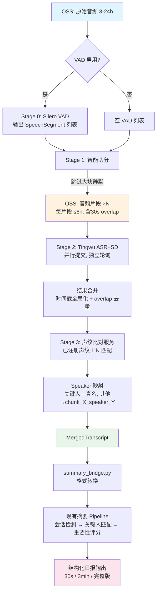

# 全天录音智能摘要系统 — 完整 Pipeline 框架设计

> 生成日期：2026-03-30 | 基于团队 6 人 2 轮讨论共识

---

## 讨论记录

### 第 1 轮：各角色核心设计要点与开放问题

---

#### 🎤 音频工程师（VAD + 音频切分）

**Silero VAD 技术特性：**

- Silero VAD v5 支持 8kHz 和 16kHz 采样率，推荐 16kHz 以获得最佳效果。若原始录音非 16kHz 需先做 resample。
- 关键参数三件套：
  - `threshold`（语音概率阈值）：默认 0.5，范围 0.0-1.0。降低阈值保留更多语音但引入噪声，升高则更激进过滤。
  - `min_speech_duration_ms`：最小语音段长度，建议 250ms，低于此的语音段会被丢弃。
  - `min_silence_duration_ms`：最小静默段长度，建议 300-500ms，用于合并临近语音段。
- Silero VAD 是轻量模型（~2MB ONNX），CPU 即可运行，处理速度远快于实时。一个 24h 音频的 VAD 推理在普通服务器上约 2-3 分钟。

**VAD 开启/关闭对下游的影响差异：**

- **关闭 VAD**：原始音频直接进入切分阶段，Tingwu 处理全量音频（含静默段），成本最高但信息无损。
- **开启 VAD**：过滤静默段后，需要重新拼接有效音频片段。有两种策略：
  - 策略 A：物理拼接——将有效片段拼成新音频文件，需维护时间戳映射表。
  - 策略 B：仅标记——不修改音频，只输出 VAD 时间段列表，供切分阶段参考切分点。
- **我推荐策略 B**。原因：物理拼接会破坏原始时间轴，后续所有时间戳都需要逆映射，复杂度高且容易出错。VAD 的输出作为切分的辅助信息更合理。

**6 小时切分的切分点选择策略：**

- 优先级排序：
  1. **VAD 静默段**（>2s 的静默期间是天然的切分点）
  2. **说话人变化点**（如果有预处理能力检测到的话，但此阶段尚无 SD 结果）
  3. **时间均衡兜底**（距离 6h 上限前 5 分钟窗口内寻找最近的静默段）
- 产品经理有成熟方案，此处不深入。

**Overlap 策略：**

- 我建议在切分点前后各加 **30 秒 overlap**。原因：
  - Tingwu ASR 模型在音频起始/结尾处准确率略低（缺少上下文）
  - overlap 区可用于跨片段说话人匹配的声纹提取
  - 合并时去重 overlap 区的 ASR 结果即可
- **开放问题**：overlap 会增加 Tingwu 计费时长，需要和成本分析师讨论 trade-off。

---

#### 📡 API 集成师（Tingwu 调用）

**Tingwu 调用流程：**

```
1. 准备 OSS URL（切分后的音频片段已在 OSS 上）
2. 提交任务：POST /tasks → 返回 task_id
3. 轮询状态：GET /tasks/{task_id} → RUNNING / COMPLETED / FAILED
4. 获取结果：从 completed 响应中提取 ASR + SD 结果
```

- 轮询间隔建议：首次 30s，之后指数递增至最大 60s，6h 音频预计处理时间 15-30 分钟。

**多段音频并行提交策略：**

- 所有切分片段**同时提交**，充分利用 Tingwu 无并发限制的优势。
- 使用 `asyncio` + `semaphore` 控制并发数（建议上限 10），避免给 API 造成不必要压力。
- 每个片段独立轮询，先完成的先处理，无需等待全部完成。

**结果合并——时间戳对齐和拼接：**

- 每个片段的 ASR 结果时间戳是相对于片段起始的，需要加上该片段在原始音频中的 offset。
- 公式：`global_timestamp = chunk_offset + local_timestamp`
- 如果有 overlap 区域，需要去重：
  - 按时间戳检测 overlap 区间
  - 保留前一片段尾部的结果（因为它有更多前文上下文），丢弃后一片段头部的 overlap 结果
- SD 结果合并更复杂：Tingwu 为每个片段独立分配 speaker_id（如 speaker_0, speaker_1），不同片段的 speaker_0 **不是**同一个人。这必须交给下游的说话人映射阶段处理。

**错误处理：**

- 单段失败策略：重试 3 次（指数退避），仍失败则标记该片段为 `FAILED`。
- 全局策略：非关键片段失败不阻塞流程。最终输出中标记缺失片段的时间范围，下游摘要时注明"该时段音频处理失败"。
- **开放问题**：如果首尾片段失败，是否需要更积极的重试策略？

---

#### 🔊 声纹工程师（跨片段说话人映射）

**已注册声纹——声纹比对服务：**

- 调用时机：在 Tingwu ASR+SD 结果返回后，对每个片段的每个 speaker 提取代表性音频片段，调用声纹比对服务进行 1:N 匹配。
- 对于每个 Tingwu 输出的 speaker，提取其 3-5 个最长发言段的音频，分别做比对，取投票/平均结果。
- 匹配成功的 speaker 直接替换为真实人名（关键人 ID）。

**未注册声纹——三个方案分析：**

| 方案 | 描述 | 优点 | 缺点 |
|:-----|:-----|:-----|:-----|
| A: 跨片段声纹聚类 | 使用 speaker embedding 模型（如 ECAPA-TDNN/WeSpeaker）提取每个 speaker 的 embedding，跨片段做聚类 | 准确率高，不依赖外部服务 | 需要自建 embedding 提取 + 聚类，计算成本 |
| B: 利用 Tingwu SD 输出的 embedding | 检查 Tingwu API 是否返回 speaker embedding | 零额外计算 | Tingwu 大概率不暴露 embedding，需确认 |
| C: LLM 辅助推断 | 让 LLM 根据对话内容、称呼、语境推断跨片段 speaker 对应关系 | 利用语义信息，某些场景下比声纹更准 | 不可靠，依赖对话内容质量 |

**MVP 推荐：方案 A 的简化版。**

理由：
- Tingwu 不太可能暴露 embedding（方案 B 基本排除）
- 方案 C 在无明确称呼的场景下几乎不可用
- 方案 A 使用开源 WeSpeaker 模型提取 embedding，对同一 speaker 在不同片段中的 embedding 做余弦相似度匹配，阈值 0.7 以上视为同一人
- MVP 阶段可以简化为：只做已注册声纹匹配，未匹配的 speaker 保留 `unknown_speaker_1` 等编号，**不做跨片段聚类**
- V2 阶段再加入跨片段聚类

**开放问题**：
- 是否需要在 overlap 区域提取声纹用于跨片段匹配？（与音频工程师的 overlap 策略相关）
- 未注册声纹的跨片段聚类是否为 MVP 必须？还是可以接受"同一个未注册人在不同片段中有不同编号"？

---

#### 🧮 数据工程师（数据流设计）

**完整数据流：**

```
OSS 原始音频（3-24h）
    │
    ▼
[Stage 0: VAD 预过滤（可选）]
    │ 输入：OSS audio URL
    │ 输出：List[SpeechSegment(start_ms, end_ms, confidence)]
    ▼
[Stage 1: 智能切分]
    │ 输入：OSS audio URL + VAD segments（可选）
    │ 输出：List[AudioChunk(chunk_id, oss_url, offset_ms, duration_ms)]
    ▼
[Stage 2: Tingwu ASR+SD]
    │ 输入：List[AudioChunk]
    │ 输出：List[ChunkResult(chunk_id, sentences[], speakers[])]
    ▼
[Stage 3: 说话人映射]
    │ 输入：List[ChunkResult] + 声纹库
    │ 输出：MergedTranscript(sentences with global_speaker_id, timestamps)
    ▼
[Stage 4: 摘要总结 Pipeline（现有系统）]
    │ 输入：MergedTranscript（等价于现有 ASR+Diar 结果格式）
    │ 输出：结构化日报
```

**各阶段输入/输出数据格式：**

```python
# Stage 0 输出
@dataclass
class SpeechSegment:
    start_ms: int
    end_ms: int
    confidence: float

# Stage 1 输出
@dataclass
class AudioChunk:
    chunk_id: str          # e.g., "recording_001_chunk_0"
    oss_url: str           # 切分后上传到 OSS 的 URL
    offset_ms: int         # 在原始音频中的起始偏移
    duration_ms: int
    overlap_prev_ms: int   # 与前一片段的 overlap 长度
    overlap_next_ms: int   # 与后一片段的 overlap 长度

# Stage 2 输出
@dataclass
class ChunkTranscript:
    chunk_id: str
    sentences: List[Sentence]  # (text, start_ms, end_ms, local_speaker_id)
    speakers: List[SpeakerInfo]  # (local_speaker_id, speech_duration_ms)

# Stage 3 输出
@dataclass
class MergedTranscript:
    recording_id: str
    sentences: List[Sentence]  # 时间戳已转为全局，speaker_id 已映射
    speakers: List[SpeakerProfile]  # (global_id, name_or_unknown, is_key_person)
```

**中间产物存储策略：**

| 产物 | 存储方式 | 理由 |
|:-----|:---------|:-----|
| VAD segments | 内存 / JSON 文件（本地临时） | 数据量小（KB 级），无需持久化 |
| 切分后音频片段 | **OSS 临时目录** | Tingwu 需要 OSS URL 输入，必须上传；设置 7 天过期自动清理 |
| Tingwu 原始结果 | **OSS 归档目录** | 用于调试和重跑，保留 30 天 |
| 合并后 transcript | **本地 JSON + 数据库记录** | 作为摘要 pipeline 的输入，同时入库追溯 |

**Pipeline 编排方式：**

- 推荐**有限状态机（FSM）**：
  - 状态：`INIT → VAD_PROCESSING → SPLITTING → ASR_SUBMITTED → ASR_POLLING → SPEAKER_MAPPING → SUMMARY → DONE / FAILED`
  - 每个状态转换有明确的输入/输出契约
  - 支持断点续跑（如 ASR 轮询中途服务重启，可从 `ASR_POLLING` 状态恢复）
- 不需要 DAG——因为 pipeline 本质是线性的（Stage 2 内部有并行，但 stage 间是顺序的）

**开放问题**：切分后的音频片段上传 OSS 是否会成为瓶颈？24h 音频切成 4 个 6h 片段，每个约 350MB（16kHz 16bit mono），上传耗时需评估。

---

#### 💰 成本分析师（成本 trade-off）

**Tingwu 计费模型假设：**

- 按音频时长计费，假设 ¥0.3/小时（实际以官方价格为准）
- 24h 录音 Tingwu 成本：24 × 0.3 = ¥7.2
- 每月 22 个工作日：¥158.4

**VAD 开启 vs 关闭的成本对比：**

| 场景 | 原始时长 | VAD 后有效时长 | Tingwu 成本 | 节省 |
|:-----|:---------|:--------------|:-----------|:-----|
| 短日（3h，会议密集） | 3h | 2.5h（17% 静默） | ¥0.75 vs ¥0.90 | 17% |
| 中日（8h，普通工作日） | 8h | 5h（37% 静默） | ¥1.50 vs ¥2.40 | 37% |
| 长日（16h，含大量空闲） | 16h | 6h（62% 静默） | ¥1.80 vs ¥4.80 | 62% |
| 超长日（24h，含夜间） | 24h | 8h（67% 静默） | ¥2.40 vs ¥7.20 | 67% |

**分析：**

- 录音越长，VAD 节省越显著。对于 8h+ 的录音，节省比例在 37%-67% 之间。
- **但**，如果音频工程师采用"策略 B：仅标记不物理拼接"，那么 VAD 不会直接减少 Tingwu 计费时长——除非切分阶段利用 VAD 信息跳过纯静默段。
- 需要明确：VAD 的成本节省路径是什么？
  - 路径 1：VAD 标记 → 切分时跳过纯静默区间 → 切分后的片段不含长静默 → Tingwu 处理时长减少
  - 路径 2：VAD 标记 → 物理裁剪静默段 → 拼接有效段 → Tingwu 处理时长减少

**VAD 误删的信息成本：**

- 低声交谈、叹气、环境中的远场对话等可能被 VAD 误判为静默
- 在"全天录音"场景中，走廊对话、电话响起前的低声讨论可能包含关键信息
- **建议 threshold = 0.35**（比默认 0.5 更宽松），宁可多保留：
  - 多保留 10% 的静默段，成本增加很小
  - 但避免丢失潜在的有效信息

**开放问题**：VAD "仅标记"策略是否真的能节省 Tingwu 成本？需要音频工程师和架构师确认切分后的片段是否会跳过纯静默区间。

---

#### 🏗️ 架构师（整体 Pipeline 框架）

**模块边界与接口定义：**

```
pipeline/
├── stages/
│   ├── vad_filter.py          # Stage 0: VAD 预过滤
│   ├── audio_splitter.py      # Stage 1: 智能切分
│   ├── tingwu_asr.py          # Stage 2: Tingwu ASR+SD 调用
│   ├── speaker_mapper.py      # Stage 3: 说话人映射
│   └── summary_bridge.py      # Stage 4: 衔接现有摘要 pipeline
├── orchestrator.py            # Pipeline 编排（状态机）
├── models/
│   ├── audio_models.py        # SpeechSegment, AudioChunk 等
│   └── transcript_models.py   # ChunkTranscript, MergedTranscript 等
├── config/
│   └── pipeline_config.yaml   # 全局配置
└── utils/
    ├── oss_client.py          # OSS 读写封装
    └── metrics.py             # 可观测性指标
```

**与现有 architecture.md 的衔接点：**

- 现有系统的入口是"设备录音 ASR+Diar"结果。Stage 3 输出的 `MergedTranscript` 需要转换为现有系统的 `ASR结果` 数据模型。
- `summary_bridge.py` 负责：
  1. 将 `MergedTranscript` 转换为现有 `models/` 中定义的 ASR 数据结构
  2. 触发现有 `core/session_detector.py` 开始处理
- 现有系统无需修改——新 pipeline 只是替换了数据源。

**配置管理（pipeline_config.yaml）：**

```yaml
vad:
  enabled: true                    # 全局开关
  model: "silero_vad_v5"
  threshold: 0.35                  # 讨论后的推荐值
  min_speech_duration_ms: 250
  min_silence_duration_ms: 500
  sampling_rate: 16000

splitting:
  max_chunk_duration_s: 21600      # 6 小时 = 21600 秒
  overlap_s: 30                    # 切分点前后 overlap
  min_silence_for_split_ms: 2000   # 切分点最小静默长度

tingwu:
  api_endpoint: "https://..."
  api_key_secret_ref: "vault://tingwu-api-key"
  max_concurrent: 10
  poll_interval_initial_s: 30
  poll_interval_max_s: 60
  max_retries: 3

speaker_mapping:
  voiceprint_service_url: "https://..."
  similarity_threshold: 0.70
  enable_cross_chunk_clustering: false  # MVP 关闭

storage:
  oss_temp_bucket: "pipeline-temp"
  oss_temp_expiry_days: 7
  oss_archive_bucket: "pipeline-archive"
  oss_archive_expiry_days: 30
```

**可观测性：**

每阶段需上报：
- 耗时（wall-clock + CPU time）
- 音频时长统计（原始 / VAD 后 / 各片段）
- Tingwu API 调用次数、成功率、响应时间
- 声纹匹配率（已注册匹配 / 未匹配 / 总 speaker 数）
- 成本估算（基于 Tingwu 实际处理时长）
- 状态机转换日志（含异常和重试）

**开放问题**：
- 是否需要 Web UI 监控 pipeline 运行状态？还是日志 + 告警即可？
- 状态机的持久化存储用什么？SQLite / Redis / PostgreSQL？

---

### 第 2 轮：交叉回应，解决分歧，形成共识

---

#### 议题 1：VAD 阈值（音频工程师 vs 成本分析师）

**成本分析师**：我建议 threshold = 0.35，宽松保留。

**音频工程师**：同意 0.35 作为默认值。补充几点：
- 0.35 在 Silero VAD 的表现是：绝大多数连续语音段被保留，只有完全无人声的长静默（如空房间噪声、设备底噪）被过滤。
- 同时将 `min_speech_duration_ms` 设为 250ms 而不是更低值，避免把瞬间噪声误判为语音。
- 建议在配置中增加一个 `vad_mode` 枚举：`conservative`（0.35）/ `balanced`（0.5）/ `aggressive`（0.65），方便未来调整。

**共识**：**默认 threshold = 0.35（conservative 模式）**，配置支持三档预设。

---

#### 议题 2：Overlap 是否需要（音频工程师 vs API 集成师）

**音频工程师**：我建议 30 秒 overlap，保证边界连续性和声纹提取。

**API 集成师**：overlap 会增加 Tingwu 计费。以 4 个片段为例，3 个切分点 × 60 秒 overlap = 3 分钟额外音频，成本约 ¥0.015——**几乎可以忽略不计**。合并时我在 overlap 区做时间戳比对去重即可。

**成本分析师**：确认成本影响可忽略，30 秒 overlap 的成本 trade-off 完全可以接受。

**声纹工程师**：overlap 对我非常重要——在 overlap 区域，前后两个片段会对同一段语音独立做 speaker diarization，这为跨片段说话人匹配提供了天然的对照样本。

**共识**：**切分点前后各 30 秒 overlap**，合并时以前一片段结果为准去重。

---

#### 议题 3：未注册声纹的 MVP 方案（声纹工程师 vs 架构师）

**声纹工程师**：MVP 建议只做已注册声纹匹配，未注册的保留编号不做跨段聚类。

**架构师**：同意 MVP 简化。但有一个顾虑——如果同一个未注册的人在不同片段中被编号为 `unknown_1` 和 `unknown_3`，下游摘要 pipeline 的"关键人匹配"阶段会受影响。不过看了现有架构文档，关键人匹配依赖的是**名字**而非 speaker_id，所以未注册声纹的编号不一致对关键人匹配影响有限。

**声纹工程师**：对，关键人本身是已注册声纹的，一定会被匹配到。未注册声纹只影响"普通参与者"的跨片段连续性，这在 MVP 阶段可以接受。

**数据工程师**：从数据模型角度，我建议在 `SpeakerProfile` 中增加 `chunk_local_ids: List[str]` 字段，记录该 speaker 在各片段中的原始编号。这样 V2 做跨段聚类时可以追溯，也方便调试。

**共识**：**MVP 只做已注册声纹匹配**，未注册的 speaker 保留片段内编号（如 `chunk_0_speaker_1`）。数据模型预留 `chunk_local_ids` 字段。V2 加入跨段声纹聚类。

---

#### 议题 4：中间产物存储（数据工程师 vs 架构师）

**数据工程师**：切分后音频必须上传 OSS（Tingwu 需要），VAD 结果存本地，Tingwu 结果归档到 OSS。

**架构师**：大体同意。补充：
- 切分后上传 OSS 的耗时问题——24h 音频 4 个 6h 片段，每个 ~350MB，总共 1.4GB。假设上传带宽 50MB/s，约 28 秒，完全可接受。
- 建议所有中间产物统一用一个 `recording_id` 作为 key，在 OSS 上的路径结构为 `pipeline-temp/{recording_id}/{stage}/{filename}`，方便清理和追溯。
- 状态机持久化：MVP 用 **SQLite**（单机部署足够），记录 `(recording_id, current_stage, stage_metadata_json, created_at, updated_at)`。

**数据工程师**：同意。补充一点：Tingwu 原始结果建议同时保存到 OSS archive 和本地 SQLite（只存 metadata + OSS path），方便回溯查询。

**共识**：
- **OSS 路径规范**：`{bucket}/{recording_id}/{stage}/`
- **状态机持久化**：SQLite（MVP），预留迁移到 PostgreSQL 的接口
- **Tingwu 结果**：OSS 归档（30 天）+ SQLite metadata

---

#### 议题 5：VAD "仅标记"策略的成本节省路径（成本分析师追问）

**成本分析师**：我在第 1 轮提出疑问——如果 VAD 只做标记不物理裁剪，怎么节省 Tingwu 成本？

**音频工程师**：好问题。澄清一下切分阶段的工作方式：
- 切分阶段会利用 VAD 标记来确定切分点，但核心目的是**限制片段在 6 小时以内**。
- 对于**纯静默段超过 30 分钟**的情况（如夜间录音、午休时段），切分阶段可以直接**跳过该段**，不将其包含在任何片段中。
- 这才是 VAD 节省成本的真正路径：不是压缩每个片段内的静默，而是**跳过大块无效时段**。

**架构师**：也就是说，VAD 的成本节省主要来自"跳过大块静默"，而非"压缩小段停顿"。这对于 24h 录音（含 8-10h 夜间静默）节省非常显著。

**成本分析师**：明白了。修正我的成本模型：
- 24h 录音含 ~8h 夜间静默：跳过后 Tingwu 只处理 16h → 节省 33%
- 加上日间零散静默段的跳过（保守估计再减 2h）：14h → 节省 42%
- 这个节省幅度值得开启 VAD。

**共识**：**VAD 的成本节省路径是"跳过大块静默时段"**，由切分阶段在生成片段时实现。VAD 标记策略（不物理裁剪）是正确的。

---

## 框架设计文档

---

### 1. Pipeline 总览

**一句话**：OSS 原始音频经 VAD 预标记、智能切分、Tingwu ASR+SD、声纹比对后，输出统一的结构化转写结果，无缝对接现有摘要总结 Pipeline 生成日报。

```
┌───────────┐    ┌───────────┐    ┌───────────────┐    ┌────────────┐    ┌───────────────┐    ┌───────────┐
│  OSS 原始  │    │ Stage 0   │    │   Stage 1     │    │  Stage 2   │    │   Stage 3     │    │ Stage 4   │
│  音频上传  │───▶│ VAD 预过滤 │───▶│  智能切分     │───▶│ Tingwu     │───▶│  说话人映射   │───▶│ 摘要总结   │
│  (3-24h)  │    │ (可选)    │    │  (≤6h/片段)   │    │ ASR+SD     │    │  (声纹比对)   │    │ Pipeline  │
└───────────┘    └───────────┘    └───────────────┘    └────────────┘    └───────────────┘    └───────────┘
                  输出: VAD标记     输出: 音频片段        输出: 各段ASR+SD   输出: 统一转写       输出: 结构化日报
                  (时间段列表)      (OSS URLs)           结果              (全局speaker+时间戳)
```

---

### 2. Stage 0: VAD 预过滤（可选）

**功能**：对原始音频进行语音活动检测，输出有效语音时间段列表，供下游切分参考。

**输入/输出**：
- 输入：原始音频 OSS URL
- 输出：`List[SpeechSegment(start_ms, end_ms, confidence)]`

**关键参数**：

| 参数 | 默认值 | 说明 |
|:-----|:-------|:-----|
| `enabled` | `true` | 全局开关 |
| `threshold` | `0.35` | 语音概率阈值（conservative 模式） |
| `min_speech_duration_ms` | `250` | 最小语音段，低于此长度丢弃 |
| `min_silence_duration_ms` | `500` | 最小静默段，用于合并临近语音段 |
| `sampling_rate` | `16000` | 采样率，非 16kHz 输入自动 resample |

**开关机制**：
- `vad.enabled = false` 时，Stage 0 被跳过，Stage 1 收到空的 VAD 段列表，按纯时间策略切分。
- 三档预设模式：`conservative`(0.35) / `balanced`(0.5) / `aggressive`(0.65)

**设计要点**：
- 仅做标记，不物理裁剪音频，避免破坏原始时间轴。
- Silero VAD v5 ONNX 模型，CPU 推理，24h 音频约 2-3 分钟完成。

---

### 3. Stage 1: 智能切分

**功能**：将超过 6 小时的原始音频切分为多个不超过 6 小时的片段，上传至 OSS 供 Tingwu 处理。

**切分策略**（产品经理有成熟方案，此处仅列框架）：
- 切分点优先级：VAD 静默段（>2s） > 时间均衡兜底
- 利用 VAD 标记跳过大块纯静默区间（>30min），这些区间不包含在任何片段中
- 切分点前后各 30 秒 overlap，保证边界连续性
- 短于 6 小时的音频不切分，直接作为单一片段

**输入/输出**：
- 输入：原始音频 OSS URL + `List[SpeechSegment]`（VAD 输出，可选）
- 输出：`List[AudioChunk(chunk_id, oss_url, offset_ms, duration_ms, overlap_prev_ms, overlap_next_ms)]`

**设计要点**：
- 切分后的音频片段上传至 OSS 临时目录，7 天过期自动清理。
- 音频文件较大（每个片段 ~350MB），但服务器上传带宽充足，不构成瓶颈。

---

### 4. Stage 2: Tingwu ASR+SD

**调用流程**：

```
1. 对 List[AudioChunk] 并行提交 Tingwu 任务
2. 每个任务独立轮询（初始 30s，指数递增至 60s 上限）
3. 任务完成后获取 ASR + Speaker Diarization 结果
4. 合并所有片段结果：时间戳全局化 + overlap 区去重
```

**并行策略**：
- 所有片段同时提交，`asyncio.Semaphore(10)` 控制并发上限。
- 先完成的片段先进入结果缓存，无需等待全部完成。

**结果合并**：
- 时间戳转换：`global_timestamp = chunk.offset_ms + local_timestamp`
- Overlap 区去重：保留前一片段尾部结果，丢弃后一片段头部 overlap 内容。
- Speaker ID 不合并——每个片段内的 speaker_id 保持独立（如 `chunk_0_speaker_1`），交给 Stage 3 处理。

**错误处理**：
- 单片段失败：重试 3 次（指数退避），仍失败则标记该时段为 `FAILED`。
- 非关键片段失败不阻塞全流程，最终输出中标注缺失时段。

**输入/输出**：
- 输入：`List[AudioChunk]`
- 输出：`List[ChunkTranscript(chunk_id, sentences[], speakers[])]`

---

### 5. Stage 3: 说话人映射

**已注册声纹流程**：

```
1. 对每个片段的每个 speaker，提取 3-5 个最长发言段的音频
2. 调用声纹比对服务做 1:N 匹配
3. 匹配成功（similarity ≥ 0.70）→ 替换为关键人 ID / 真实姓名
4. 匹配失败 → 保留片段内编号（如 chunk_0_speaker_1）
```

**未注册声纹 MVP 方案**：

- **MVP（当前）**：不做跨片段聚类。未注册 speaker 保留片段内编号，同一个人在不同片段中可能有不同编号。这对下游摘要 pipeline 影响有限——关键人已通过声纹匹配，非关键人的编号不一致不影响核心输出。
- **V2（后续）**：引入 WeSpeaker 提取 speaker embedding，跨片段做余弦相似度匹配（阈值 0.70），实现未注册声纹的跨片段统一编号。

**数据模型预留**：
- `SpeakerProfile` 包含 `chunk_local_ids: List[str]` 字段，记录原始片段内编号，为 V2 跨段聚类和调试提供追溯能力。

**输入/输出**：
- 输入：`List[ChunkTranscript]` + 声纹库
- 输出：`MergedTranscript(recording_id, sentences[], speakers[])`

---

### 6. Stage 4: 摘要总结 Pipeline（现有系统衔接）

**衔接点**：

Stage 3 输出的 `MergedTranscript` 等价于现有架构中"设备录音 ASR+Diar"的输出。由 `summary_bridge.py` 模块完成格式转换：

```
MergedTranscript → 现有 models/ 中的 ASR 数据结构 → session_detector.py 入口
```

**转换内容**：
- `sentences` 转为现有系统期望的 utterance 格式（含 text, start_time, end_time, speaker）
- `speakers` 转为关键人 profile 格式（含 name, is_key_person, role 等）
- `recording_id` 映射为现有系统的任务 ID

**现有系统无需修改**——新 pipeline 只是替换了数据源，从"设备直接输出 ASR 结果"变为"pipeline 生成的统一转写结果"。

---

### 7. 数据流全景



---

### 8. 成本模型

**假设**：Tingwu 计费 ¥0.3/小时（以官方实际价格为准）

| 场景 | 原始时长 | VAD 关闭<br/>Tingwu 处理时长 | VAD 开启<br/>Tingwu 处理时长 | VAD 关闭<br/>日成本 | VAD 开启<br/>日成本 | 节省率 |
|:-----|:---------|:----------------------------|:----------------------------|:-------------------|:-------------------|:-------|
| 短日（会议密集） | 3h | 3h | 2.5h | ¥0.90 | ¥0.75 | 17% |
| 中日（普通工作日） | 8h | 8h | 5h | ¥2.40 | ¥1.50 | 37% |
| 长日（含空闲时段） | 16h | 16h | 8h | ¥4.80 | ¥2.40 | 50% |
| 超长日（含夜间） | 24h | 24h | 10h | ¥7.20 | ¥3.00 | 58% |

**关键说明**：
- VAD 节省主要来自**跳过大块静默时段**（夜间、午休等），而非压缩片段内短停顿。
- VAD 本身的计算成本极低（CPU 推理，2-3 分钟/24h），不计入上表。
- Overlap 额外成本（每个切分点约 1 分钟）可忽略不计。
- **建议**：默认开启 VAD（conservative 模式），对大多数场景带来显著成本节省且信息损失极低。

---

### 9. 配置项清单

```yaml
# pipeline_config.yaml

pipeline:
  recording_id_prefix: "rec"       # 录音 ID 前缀

# Stage 0: VAD
vad:
  enabled: true                     # 全局开关
  mode: "conservative"              # conservative(0.35) / balanced(0.5) / aggressive(0.65)
  threshold: 0.35                   # 语音概率阈值（mode 覆盖此值）
  min_speech_duration_ms: 250       # 最小语音段长度
  min_silence_duration_ms: 500      # 最小静默段（合并临近语音段）
  sampling_rate: 16000              # 采样率
  skip_silence_threshold_min: 30    # 超过此长度的静默段，切分时跳过

# Stage 1: 智能切分
splitting:
  max_chunk_duration_s: 21600       # 6 小时上限
  overlap_s: 30                     # 切分点前后 overlap
  min_silence_for_split_ms: 2000    # 切分候选点最小静默长度

# Stage 2: Tingwu ASR+SD
tingwu:
  api_endpoint: "https://tingwu.aliyuncs.com"
  api_key_secret_ref: "vault://tingwu-api-key"
  max_concurrent: 10                # 最大并发任务数
  poll_interval_initial_s: 30       # 首次轮询间隔
  poll_interval_max_s: 60           # 最大轮询间隔
  max_retries: 3                    # 单任务最大重试次数
  retry_backoff_base_s: 10          # 重试退避基数

# Stage 3: 说话人映射
speaker_mapping:
  voiceprint_service_url: "https://..."
  similarity_threshold: 0.70        # 声纹匹配阈值
  max_samples_per_speaker: 5        # 每 speaker 取样上限
  enable_cross_chunk_clustering: false  # V2 开启

# 存储
storage:
  oss_endpoint: "https://oss-cn-xxx.aliyuncs.com"
  oss_temp_bucket: "pipeline-temp"
  oss_temp_expiry_days: 7
  oss_archive_bucket: "pipeline-archive"
  oss_archive_expiry_days: 30
  oss_path_template: "{bucket}/{recording_id}/{stage}/"

# 状态机
state:
  backend: "sqlite"                 # sqlite / postgresql
  sqlite_path: "./pipeline_state.db"

# 可观测性
observability:
  log_level: "INFO"
  metrics_enabled: true
  report_stage_duration: true       # 每阶段耗时
  report_audio_stats: true          # 音频时长统计
  report_cost_estimate: true        # 成本估算
```

---

### 10. 开放问题

| # | 问题 | 相关角色 | 优先级 |
|:--|:-----|:---------|:-------|
| 1 | Tingwu API 是否暴露 speaker embedding？如果是，可简化 V2 跨段聚类 | 声纹工程师 / API 集成师 | P1 |
| 2 | 产品经理的"成熟切分方案"具体细节——切分策略需要对齐后更新 Stage 1 设计 | 音频工程师 / 产品经理 | P0 |
| 3 | 状态机持久化方案：MVP 用 SQLite，何时需要迁移到 PostgreSQL？取决于部署规模 | 架构师 / 数据工程师 | P2 |
| 4 | 是否需要 pipeline 运行状态的 Web UI 监控？还是日志 + 告警足够？ | 架构师 | P2 |
| 5 | Tingwu 实际计费价格确认——成本模型中使用 ¥0.3/h 为假设值 | 成本分析师 | P0 |
| 6 | 首尾片段 ASR 失败是否需要更积极的重试策略？（首尾片段可能包含重要的开始/结束上下文） | API 集成师 / 架构师 | P1 |
| 7 | V2 跨段声纹聚类的 WeSpeaker 模型选型和性能评估 | 声纹工程师 | P1 |
| 8 | 录音上传 OSS 的触发机制——是录音结束后自动上传，还是定时批量上传？影响 pipeline 调度策略 | 架构师 / 数据工程师 | P1 |
