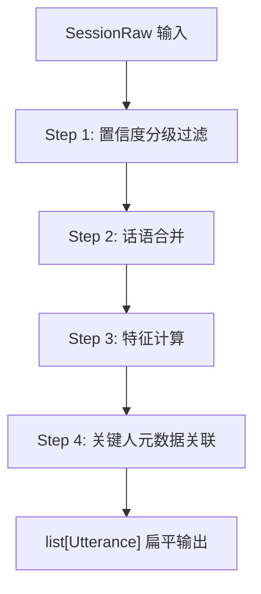
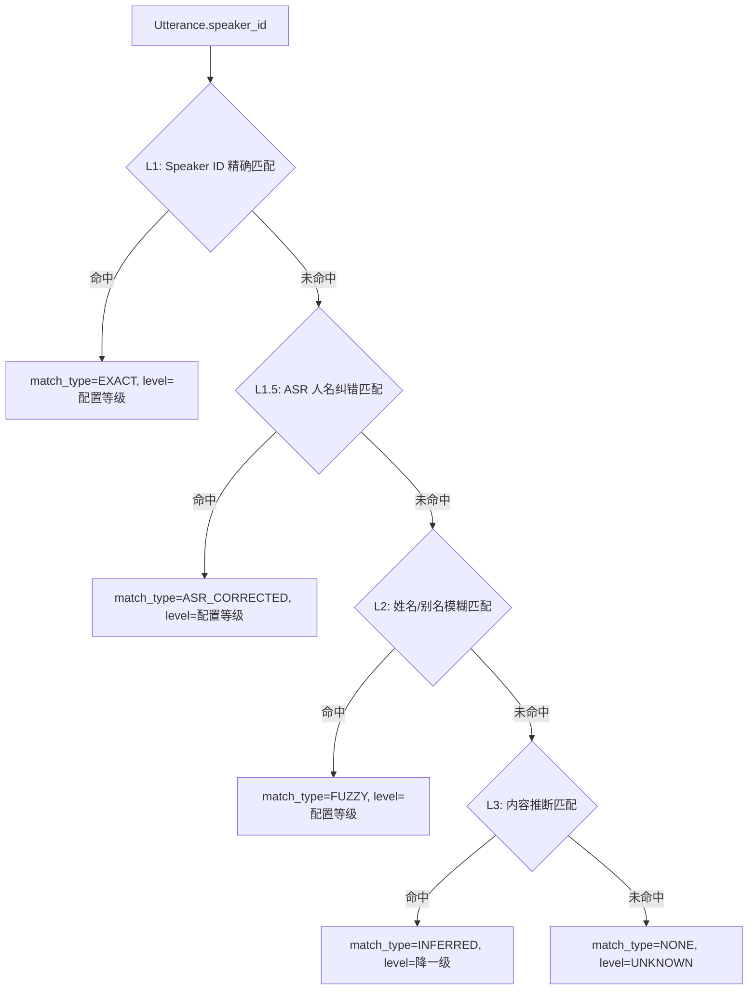

# 数据输入层与预处理层 — 模块详细设计

> 对应 PRD §1.1.1（数据输入层）与 §1.1.2（预处理层）。
> 涉及文件：`models/asr_result.py`、`core/preprocessor.py`

---

## 一、数据输入层（models/asr_result.py）

### 1.1 核心数据模型

#### 1.1.1 Segment — 最小粒度片段

```python
from __future__ import annotations
from dataclasses import dataclass, field
from enum import Enum
from typing import Optional

class AlignmentQuality(str, Enum):
    HIGH = "high"
    MEDIUM = "medium"
    LOW = "low"

@dataclass(frozen=True)
class Segment:
    """ASR + Speaker Diarization 对齐后的最小粒度片段。"""
    start_ms: int                    # 片段起始时间（毫秒，相对于 session_start）
    end_ms: int                      # 片段结束时间（毫秒）
    speaker_id: str                  # 说话人标识，如 "spk_001"
    text: str                        # ASR 识别文本
    asr_confidence: float            # ASR 识别置信度，0.0-1.0
    speaker_confidence: float        # 说话人归属置信度，0.0-1.0
    alignment_quality: AlignmentQuality  # ASR 与说话人分离的时间对齐质量
    # ---- 以下为可选扩展字段 ----
    speaker_name: Optional[str] = None   # 仅 AI听记 提供的说话人姓名推测
    is_overlap: bool = False             # 仅 AI听记 提供的重叠标记

    @property
    def duration_ms(self) -> int:
        return self.end_ms - self.start_ms
```

**字段约束**：

| 字段 | 约束 | 违规处理 |
|:---|:---|:---|
| `start_ms` / `end_ms` | `0 <= start_ms < end_ms` | 抛出 `ValidationError` |
| `asr_confidence` | `[0.0, 1.0]` | 截断至边界值并记录 WARNING |
| `speaker_confidence` | `[0.0, 1.0]` | 截断至边界值并记录 WARNING |
| `text` | 非空，去除前后空白后 `len > 0` | 标记为空段，后续清洗阶段丢弃 |

#### 1.1.2 SessionRaw — 单次录音会话

```python
from datetime import datetime

@dataclass
class SessionRaw:
    """一次完整录音会话的原始数据容器。"""
    device_id: str                   # 设备标识，如 "dingtalk_a1_0032"
    device_type: str                 # 设备类型："dingtalk_a1" | "ai_tingji"
    session_start: datetime          # 会话起始时间（UTC+8）
    session_end: datetime            # 会话结束时间（UTC+8）
    segments: list[Segment]          # 按 start_ms 升序排列的片段列表
    source_file: Optional[str] = None  # 原始文件路径，用于溯源

    @property
    def total_duration_ms(self) -> int:
        return int((self.session_end - self.session_start).total_seconds() * 1000)

    @property
    def segment_count(self) -> int:
        return len(self.segments)
```

### 1.2 设备适配器接口

#### 1.2.1 基类定义

```python
from abc import ABC, abstractmethod
from pathlib import Path

class DeviceAdapter(ABC):
    """设备适配器基类。将异构设备输出转换为统一 SessionRaw。"""

    @abstractmethod
    def parse(self, raw_data: dict | str | Path) -> SessionRaw:
        """
        解析设备原始输出，返回标准化 SessionRaw。

        Args:
            raw_data: 设备原始数据（JSON dict、文件路径或原始字符串）。
        Returns:
            SessionRaw 实例。
        Raises:
            DeviceParseError: 数据格式不符合预期时抛出。
        """
        ...

    @abstractmethod
    def device_type(self) -> str:
        """返回设备类型标识字符串。"""
        ...
```

#### 1.2.2 DingTalk A1 适配器

```python
class DingTalkA1Adapter(DeviceAdapter):
    """
    DingTalk A1 输出格式：
    {
      "device_id": "...",
      "session_start": "2026-03-27T09:00:00+08:00",
      "session_end": "2026-03-27T17:30:00+08:00",
      "segments": [
        {
          "start_ms": 0, "end_ms": 3200,
          "speaker_id": "spk_001",
          "text": "...",
          "asr_confidence": 0.87,
          "speaker_confidence": 0.92
        }, ...
      ]
    }
    """

    def device_type(self) -> str:
        return "dingtalk_a1"

    def parse(self, raw_data: dict) -> SessionRaw:
        # 1. 校验顶层必填字段
        # 2. 逐条解析 segments，缺失 alignment_quality 时默认 MEDIUM
        # 3. 按 start_ms 排序
        # 4. 返回 SessionRaw
        ...
```

**DingTalk A1 格式要点**：

- `alignment_quality` 字段可能缺失，默认填充 `AlignmentQuality.MEDIUM`。
- `speaker_confidence` 可能缺失，默认填充 `0.5`。

#### 1.2.3 AI听记适配器

```python
class AITingjiAdapter(DeviceAdapter):
    """
    AI听记额外字段：speaker_name（姓名推测）、is_overlap（重叠标记）。
    格式与 DingTalk A1 类似，但 segments 内多出上述两个字段。
    """

    def device_type(self) -> str:
        return "ai_tingji"

    def parse(self, raw_data: dict) -> SessionRaw:
        # 1. 校验顶层必填字段
        # 2. 逐条解析 segments，保留 speaker_name、is_overlap
        # 3. 对 is_overlap=True 的片段标记 alignment_quality = LOW
        # 4. 按 start_ms 排序
        # 5. 返回 SessionRaw
        ...
```

**AI听记格式要点**：

- `speaker_name` 为推测值，仅用于后续 L2 模糊匹配的输入线索，不可直接作为最终说话人标识。
- `is_overlap=True` 的片段自动将 `alignment_quality` 降级为 `LOW`。

#### 1.2.4 适配器注册与分发

```python
# 适配器工厂，根据 device_type 字符串分发
_ADAPTER_REGISTRY: dict[str, type[DeviceAdapter]] = {
    "dingtalk_a1": DingTalkA1Adapter,
    "ai_tingji": AITingjiAdapter,
}

def get_adapter(device_type: str) -> DeviceAdapter:
    cls = _ADAPTER_REGISTRY.get(device_type)
    if cls is None:
        raise UnsupportedDeviceError(f"未知设备类型: {device_type}")
    return cls()
```

### 1.3 输入校验规则

校验在 `SessionRaw` 构建完成后、进入预处理层之前执行。

```python
@dataclass
class ValidationResult:
    is_valid: bool
    warnings: list[str] = field(default_factory=list)
    errors: list[str] = field(default_factory=list)

def validate_session(session: SessionRaw) -> ValidationResult:
    """执行三项核心校验，返回校验结果。"""
    ...
```

#### 1.3.1 时间线连续性检查

```
对于 segments[i] 与 segments[i+1]:
  gap = segments[i+1].start_ms - segments[i].end_ms
  若 gap < -500ms:   → ERROR: 严重时间倒退
  若 -500ms <= gap < 0: → WARNING: 微小重叠，自动修正（见 1.3.2）
  若 gap > 300_000ms (5min): → WARNING: 存在长静默，记录日志
```

**参数**：

| 参数 | 默认值 | 说明 |
|:---|:---|:---|
| `MAX_BACKWARD_TOLERANCE_MS` | 500 | 允许的最大时间倒退量（毫秒） |
| `LONG_SILENCE_THRESHOLD_MS` | 300,000 | 超过此值记录长静默警告 |

#### 1.3.2 段落重叠检测与修正

```
对于 segments[i] 与 segments[i+1]:
  overlap = segments[i].end_ms - segments[i+1].start_ms
  若 overlap > 0 且 overlap <= 500ms:
    → 自动修正: segments[i].end_ms = segments[i+1].start_ms（截断前段尾部）
    → 记录 WARNING
  若 overlap > 500ms:
    → 标记为 ERROR: 严重重叠，可能是数据异常
    → 不自动修正，交由人工处理或丢弃该 session
```

#### 1.3.3 总时长校验

```
declared_duration = session.total_duration_ms
actual_span = segments[-1].end_ms - segments[0].start_ms
deviation = abs(declared_duration - actual_span) / declared_duration

若 deviation > 0.1 (10%): → WARNING: 声明时长与实际跨度偏差较大
若 declared_duration > 14 * 3600 * 1000 (14小时): → WARNING: 超长录音
若 declared_duration < 60 * 1000 (1分钟): → WARNING: 过短录音
若 len(segments) == 0: → ERROR: 空会话
```

### 1.4 异常处理策略

| 异常类型 | 处理方式 | 后续动作 |
|:---|:---|:---|
| `DeviceParseError` | 适配器无法解析原始数据 | 记录错误日志，跳过该文件，通知运维 |
| `UnsupportedDeviceError` | 未知设备类型 | 拒绝处理，返回明确错误信息 |
| `ValidationError`（ERROR 级） | 数据存在不可自动修复的严重问题 | 跳过该 session，写入异常队列待人工处理 |
| `ValidationResult.warnings` | 数据存在可容忍的轻微问题 | 记录日志，继续处理 |

---

## 二、预处理层（core/preprocessor.py）

### 2.0 预处理流水线总览

<!-- FIXED: BLOCK-5 — 会话检测去重：移除原 Step 1（会话检测），会话检测统一由 Module 2 的 SessionDetector 执行。预处理流水线从五步改为四步。 -->



预处理层的输入为校验通过的 `SessionRaw`，输出为扁平的 `list[Utterance]`（引用 `models/types.py` 中的统一 Utterance）。会话检测不在此处执行，统一由下游 Module 2 的 `SessionDetector` 负责。

```python
class Preprocessor:
    def __init__(self, config: PreprocessorConfig, key_people: KeyPeopleConfig):
        self.config = config
        self.key_people = key_people

    def process(self, session: SessionRaw) -> list[Utterance]:
        # Step 1: 置信度过滤（需要关键人信息做分级）
        cleaned = self._filter_by_confidence(session.segments)
        # Step 2: 话语合并
        utterances = self._merge_utterances(cleaned)
        # Step 3: 特征计算
        enriched = self._compute_features(utterances, session)
        # Step 4: 关键人元数据关联
        linked = self._link_key_people(enriched)
        return linked
```

<!-- FIXED: BLOCK-5 — 原 Step 1（对话会话检测）已移除，会话检测统一由 Module 2 的 SessionDetector 执行。 -->

### 2.1 Step 1：置信度分级过滤

#### 2.1.1 目标

根据说话人的关键人等级，分级过滤低置信度片段。关键人的发言采用更宽松的阈值，避免丢失嘈杂环境下的关键指令。

#### 2.1.2 算法

```
输入: segments: List[Segment], key_people: KeyPeopleConfig
输出: filtered: List[Segment]

# 阈值映射表
CONFIDENCE_THRESHOLDS = {
    "P0": 0.35,
    "P1": 0.40,
    "P2": 0.50,
    "P3": 0.60,    # 非关键人同级
    "UNKNOWN": 0.60,
}

for seg in segments:
    level = lookup_speaker_level(seg.speaker_id, key_people)
    # level 为 "P0" | "P1" | "P2" | "P3" | "UNKNOWN"
    threshold = CONFIDENCE_THRESHOLDS[level]

    if seg.asr_confidence >= threshold:
        filtered.append(seg)
    else:
        # 记录被过滤的片段（含原因）到 filter_log
        filter_log.append(FilteredRecord(seg, reason="low_asr_confidence",
                                          threshold=threshold, level=level))
```

**注意**：此步骤需要提前执行一次粗粒度的说话人-关键人匹配（仅 L1 精确匹配），以获得说话人等级。完整的四级匹配在 Step 4 执行。若 L1 匹配不到，视为 `UNKNOWN`，使用最严格阈值 0.60。

#### 2.1.3 关键参数

| 参数 | 默认值 | 说明 |
|:---|:---|:---|
| `P0_ASR_THRESHOLD` | 0.35 | P0 关键人 ASR 置信度阈值 |
| `P1_ASR_THRESHOLD` | 0.40 | P1 关键人 ASR 置信度阈值 |
| `P2_ASR_THRESHOLD` | 0.50 | P2 关键人 ASR 置信度阈值 |
| `DEFAULT_ASR_THRESHOLD` | 0.60 | P3 及未知说话人 ASR 置信度阈值 |
| `COLD_START_THRESHOLD_OVERRIDE` | 0.25 | 冷启动期（Day 1-5）全局覆盖阈值 |

#### 2.1.4 异常处理

| 场景 | 处理 |
|:---|:---|
| 过滤后片段列表为空 | 返回空的 `list[Utterance]`，记录 WARNING |
| 过滤比例 >80% | 记录 WARNING，可能表明录音环境极差或设备故障 |

---

### 2.2 Step 2：话语合并

#### 2.2.1 目标

将同一说话人的连续短碎片聚合为语义连贯的 `Utterance`，减少碎片化，同时通过时长上限保证下游分片的灵活性。

#### 2.2.2 算法

<!-- FIXED: 话语合并增加空列表检查 -->
```
输入: segments: List[Segment]（已过滤）
输出: utterances: List[Utterance]

if not segments:
    return []      # 空列表直接返回，不进入合并逻辑

current_group = [segments[0]]

for i in range(1, len(segments)):
    prev = segments[i - 1]
    curr = segments[i]
    gap_ms = curr.start_ms - prev.end_ms
    same_speaker = curr.speaker_id == prev.speaker_id
    group_duration_ms = curr.end_ms - current_group[0].start_ms

    can_merge = (
        same_speaker
        and gap_ms <= MERGE_GAP_THRESHOLD_MS
        and group_duration_ms <= MERGE_MAX_DURATION_MS
    )

    if can_merge:
        current_group.append(curr)
    else:
        utterances.append(build_utterance(current_group))
        current_group = [curr]

utterances.append(build_utterance(current_group))  # 最后一组
```

<!-- FIXED: BLOCK-1 — build_utterance 输出统一 Utterance（引用 models/types.py） -->
**`build_utterance` 合并逻辑**：

```python
from models.types import Utterance, AlignmentQuality
import tiktoken

_encoder = tiktoken.encoding_for_model("gpt-4")  # 或项目统一的 tokenizer

def build_utterance(group: list[Segment], seq_id: int) -> Utterance:
    merged_text = " ".join(seg.text for seg in group)
    return Utterance(
        utterance_id=f"utt_{group[0].start_ms}_{seq_id:04d}",
        speaker_id=group[0].speaker_id,
        speaker_name=group[0].speaker_name,          # 取首条 Segment 的姓名
        text=merged_text,
        start_time=group[0].start_ms / 1000.0,       # 毫秒 → 秒
        end_time=group[-1].end_ms / 1000.0,           # 毫秒 → 秒
        asr_confidence=mean(seg.asr_confidence for seg in group),  # 取 avg
        speaker_confidence=mean(seg.speaker_confidence for seg in group),
        alignment_quality=min(
            (seg.alignment_quality for seg in group), key=quality_rank
        ),
        token_count=len(_encoder.encode(merged_text)),
        match_result=None,              # Step 4 关键人关联后填充
        features=None,                  # Step 3 特征计算后填充
        segment_count=len(group),
    )
```

#### 2.2.3 Utterance 数据结构（统一定义）

<!-- FIXED: BLOCK-1 — 统一 Utterance 数据结构，定义于 models/types.py，Module 1 生产，Module 2 消费 -->

```python
# 定义于 models/types.py，全局唯一
@dataclass(frozen=True)
class Utterance:
    utterance_id: str           # 唯一标识
    speaker_id: str             # 说话人ID
    speaker_name: Optional[str] # 说话人姓名（可能为空）
    text: str                   # 合并后的文本
    start_time: float           # 开始时间（秒）
    end_time: float             # 结束时间（秒）
    asr_confidence: float       # ASR 置信度（取 avg）
    speaker_confidence: float   # 说话人归属置信度
    alignment_quality: AlignmentQuality
    token_count: int            # token 数量
    match_result: Optional[MatchResult]  # 关键人匹配结果
    features: Optional[UtteranceFeatures]  # 特征（Module 1 计算）
    segment_count: int          # 合并的原始 segment 数量

    @property
    def duration(self) -> float:
        return self.end_time - self.start_time
```

> **注意**：`frozen=True` 保证 Utterance 不可变。Step 3（特征计算）和 Step 4（关键人关联）通过 `dataclasses.replace()` 返回新实例来填充 `features` 和 `match_result` 字段。

#### 2.2.4 关键参数

| 参数 | 默认值 | 说明 |
|:---|:---|:---|
| `MERGE_GAP_THRESHOLD_MS` | 4,000 (4s) | 同一说话人片段间隔 <=此值则合并（PRD 范围 3-5s，取中值） |
| `MERGE_MAX_DURATION_MS` | 120,000 (120s) | 单个 Utterance 时长上限，超过强制拆分 |

#### 2.2.5 异常处理

| 场景 | 处理 |
|:---|:---|
| 单个原始 Segment 已超过 120s | 按 120s 边界强制切分，切分点选取最近的句号/问号/感叹号位置 |
| 合并后文本为空（全部 Segment 文本为空白） | 丢弃该 Utterance，记录 WARNING |

---

### 2.3 Step 3：特征计算

#### 2.3.1 目标

为每个 `Utterance` 附加结构化特征，供下游智能分层和重要性评估使用。

#### 2.3.2 特征字段定义

```python
@dataclass
class UtteranceFeatures:
    # ---- 时间特征 ----
    duration_sec: float              # 时长（秒）
    start_time_of_day: str           # 绝对时间标记，如 "14:30"
    time_period: str                 # 时段标记："morning" | "afternoon" | "evening"
    position_in_session: float       # 在当前会话中的相对位置 [0.0, 1.0]

    # ---- 说话人特征 ----
    speaker_id: str                  # 说话人标识
    turn_index: int                  # 在当前会话中的轮次序号（从 1 开始）
    speaker_turn_count: int          # 该说话人在本会话中的累计发言次数
    speaker_duration_ratio: float    # 该说话人在本会话中的时长占比

    # ---- 文本统计特征 ----
    char_count: int                  # 文本字符数
    char_rate: float                 # 语速（字/秒）
    sentence_count: int              # 句子数（按句号/问号/感叹号切分）

    # ---- 内容特征 ----
    keyword_density: float           # 关键词命中密度（命中数 / 字符数）
    contains_question: bool          # 是否包含疑问句
    contains_action_word: bool       # 是否包含行动词（"决定""安排""要求""通知"等）
    scene_guess: Optional[str]       # 场景推测："meeting" | "call" | "dictation" | None
```

#### 2.3.3 计算逻辑伪代码

```python
def _compute_features(
    self,
    utterances: list[Utterance],
    session: SessionRaw,
) -> list[Utterance]:

    # 预计算全局统计（注意：此时尚无会话边界，统计基于全部 utterance）
    total_duration_sec = session.total_duration_ms / 1000.0
    speaker_durations: dict[str, float] = defaultdict(float)
    speaker_turn_counters: dict[str, int] = defaultdict(int)

    for utt in utterances:
        speaker_durations[utt.speaker_id] += utt.duration  # duration 单位为秒

    result = []
    for idx, utt in enumerate(utterances):
        speaker_turn_counters[utt.speaker_id] += 1

        features = UtteranceFeatures(
            duration_sec=utt.duration,
            start_time_of_day=format_time(session.session_start, utt.start_time),
            time_period=classify_time_period(session.session_start, utt.start_time),
            position_in_session=utt.start_time / max(0.1, total_duration_sec),
            speaker_id=utt.speaker_id,
            turn_index=idx + 1,
            speaker_turn_count=speaker_turn_counters[utt.speaker_id],
            speaker_duration_ratio=(
                speaker_durations[utt.speaker_id] / max(0.1, sum(speaker_durations.values()))
            ),
            char_count=len(utt.text),
            char_rate=len(utt.text) / max(0.1, utt.duration),
            sentence_count=count_sentences(utt.text),
            keyword_density=compute_keyword_density(utt.text, KEYWORD_LIST),
            contains_question="？" in utt.text or "吗" in utt.text,
            contains_action_word=any(w in utt.text for w in ACTION_WORDS),
            scene_guess=guess_scene(utt.text),
        )
        # frozen=True，通过 replace 返回新实例
        result.append(dataclasses.replace(utt, features=features))
    return result
```

#### 2.3.4 关键参数与辅助常量

<!-- FIXED: 去掉对未定义的 config/keywords.yaml 的引用，KEYWORD_LIST 直接硬编码在代码中 -->

| 参数 | 默认值 | 说明 |
|:---|:---|:---|
| `KEYWORD_LIST` | 硬编码列表 | 业务关键词列表：`["预算", "决策", "风险", "合同", "KPI", "营收", "利润", "战略", "竞品", "融资", "股东", "董事会"]`。后续版本可迁移至配置中心统一管理。 |
| `ACTION_WORDS` | `["决定", "安排", "要求", "通知", "确认", "同意", "否决", "推迟"]` | 行动词集合 |
| `TIME_PERIOD_BOUNDARIES` | `{"morning": (6,12), "afternoon": (12,18), "evening": (18,24)}` | 时段划分边界（小时） |

#### 2.3.5 `classify_time_period` 逻辑

```
hour = (session_start + timedelta(seconds=offset_sec)).hour
if 6 <= hour < 12:  return "morning"
if 12 <= hour < 18: return "afternoon"
return "evening"
```

<!-- FIXED: 补充 guess_scene 函数的判断规则 -->
#### 2.3.6 `guess_scene` 场景推测规则

```python
SCENE_RULES: list[tuple[str, list[str], int]] = [
    # (场景标签, 关键词列表, 最低命中数)
    ("meeting",    ["会议", "议题", "纪要", "参会", "讨论", "决议", "表决"], 2),
    ("call",       ["电话", "打给", "接听", "通话", "挂断", "拨打"], 1),
    ("dictation",  ["记录一下", "备忘", "口述", "帮我记", "语音备忘"], 1),
]

def guess_scene(text: str) -> Optional[str]:
    """基于关键词命中规则推测 utterance 所属场景。

    规则：按 SCENE_RULES 顺序匹配，首个满足最低命中数的场景胜出。
    若无命中则返回 None。
    """
    for scene, keywords, min_hits in SCENE_RULES:
        hits = sum(1 for kw in keywords if kw in text)
        if hits >= min_hits:
            return scene
    return None
```

---

### 2.4 Step 4：关键人元数据关联

#### 2.4.1 目标

将每个 Utterance 的 `speaker_id` 关联到关键人配置，输出匹配结果与匹配层级。

#### 2.4.2 处理顺序：L1 → L1.5 → L2 → L3 逐层递进

<!-- FIXED: BLOCK-9 — 统一使用 MatchResult + MatchType 枚举，L2 使用 fuzzy（替代 alias），未匹配使用 none -->


#### 2.4.3 各层匹配逻辑

<!-- FIXED: BLOCK-9 — 所有匹配逻辑统一返回 MatchResult，使用 MatchType 枚举 -->

**L1 — Speaker ID 精确匹配**：
```
for person in key_people:
    if utterance.speaker_id in person.speaker_ids:
        return MatchResult(person_id=person.id, person_name=person.name,
                           level=person.level, original_level=person.level,
                           match_type=MatchType.EXACT, confidence=0.98)
```

**L1.5 — ASR 人名纠错匹配**：
```
extracted_names = extract_names_from_text(utterance.text)
for name in extracted_names:
    for correction in asr_corrections:
        if name in correction.variants:
            person = find_person_by_name(correction.target)
            if person:
                return MatchResult(person_id=person.id, person_name=person.name,
                                   level=person.level, original_level=person.level,
                                   match_type=MatchType.ASR_CORRECTED, confidence=0.92)
```

**L2 — 姓名/别名模糊匹配**：
```
# 利用 speaker_name（AI听记提供）或文本中的自报姓名
candidate_name = utterance.speaker_name or extract_self_introduction(utterance.text)
if candidate_name:
    for person in key_people:
        if fuzzy_match(candidate_name, person.name, person.aliases, threshold=0.8):
            return MatchResult(person_id=person.id, person_name=person.name,
                               level=person.level, original_level=person.level,
                               match_type=MatchType.FUZZY, confidence=0.87)
```

**L3 — 内容推断匹配**：
```
# 基于上下文语义推断：如"总裁指示..."中虽无直呼姓名但可推断
inferred_person = infer_speaker_from_context(utterance.text, key_people)
if inferred_person:
    effective_level = downgrade_level(inferred_person.level)  # P0→P1, P1→P2, P2→P3
    return MatchResult(person_id=inferred_person.id, person_name=inferred_person.name,
                       level=effective_level, original_level=inferred_person.level,
                       match_type=MatchType.INFERRED, confidence=0.75)
```

#### 2.4.4 匹配结果数据结构（统一定义）

<!-- FIXED: BLOCK-9 — 统一 MatchResult，定义于 models/types.py -->

```python
# 定义于 models/types.py，全局唯一

class MatchType(str, Enum):
    EXACT = "exact"
    ASR_CORRECTED = "asr_corrected"
    FUZZY = "fuzzy"           # 统一，替代原 "alias"
    INFERRED = "inferred"
    NONE = "none"             # 统一，替代原 "unknown"

@dataclass(frozen=True)
class MatchResult:
    person_id: Optional[str]     # 关键人 ID，未匹配时为 None
    person_name: Optional[str]   # 关键人姓名
    level: str                   # 有效等级："P0" | "P1" | "P2" | "P3" | "UNKNOWN"
    original_level: Optional[str]  # 原始等级（仅 INFERRED 时与 level 不同）
    match_type: MatchType        # 使用 MatchType 枚举
    confidence: float            # 匹配置信度
```

#### 2.4.5 异常处理

| 场景 | 处理 |
|:---|:---|
| 同一 speaker_id 在不同 Utterance 匹配到不同关键人 | 取置信度最高的匹配结果全局统一，记录 WARNING |
| L3 推断匹配到多个候选人 | 取置信度最高者，若差距 <0.1 则标记 `ambiguous`，不做匹配 |
| 关键人配置为空 | 所有 Utterance 的 `match_result.match_type` 均为 `MatchType.NONE`，正常继续 |

---

### 2.5 预处理层最终输出

<!-- FIXED: BLOCK-5 — 输出改为扁平 list[Utterance]，不再包装 ProcessedSession -->

预处理层的最终输出为 **扁平的 `list[Utterance]`**，每个 Utterance 已包含 `features` 和 `match_result` 字段。会话切分由下游 Module 2 的 `SessionDetector` 负责。

```python
# 预处理层输出签名
def process(self, session: SessionRaw) -> list[Utterance]:
    ...

# 输出示例（伪）：
# [
#     Utterance(utterance_id="utt_0_0001", speaker_id="spk_001", ...,
#               features=UtteranceFeatures(...), match_result=MatchResult(...)),
#     Utterance(utterance_id="utt_3200_0002", speaker_id="spk_002", ...,
#               features=UtteranceFeatures(...), match_result=MatchResult(...)),
#     ...
# ]
```

> **元信息说明**：原 `SessionMetadata`（如 `dominant_speaker_id`、`scene_guess`、`avg_asr_confidence`）不再由 Module 1 计算。这些统计信息在 Module 2 完成会话检测后按 Session 粒度计算。

---

### 2.6 配置汇总（PreprocessorConfig）

<!-- FIXED: BLOCK-5 — 移除 Step 1 会话检测配置；FIXED: 去掉 config/keywords.yaml 引用 -->

```python
@dataclass
class PreprocessorConfig:
    # Step 1: 置信度过滤
    p0_asr_threshold: float = 0.35
    p1_asr_threshold: float = 0.40
    p2_asr_threshold: float = 0.50
    default_asr_threshold: float = 0.60
    cold_start_threshold: float = 0.25
    is_cold_start: bool = False               # 冷启动模式开关

    # Step 2: 话语合并
    merge_gap_threshold_ms: int = 4_000       # 4 秒
    merge_max_duration_ms: int = 120_000      # 120 秒

    # Step 3: 特征计算
    time_period_boundaries: dict[str, tuple[int, int]] = field(
        default_factory=lambda: {
            "morning": (6, 12),
            "afternoon": (12, 18),
            "evening": (18, 24),
        }
    )

    # Step 4: 关键人匹配
    asr_corrections_path: str = "config/asr_name_corrections.yaml"
    fuzzy_match_threshold: float = 0.80       # L2 模糊匹配相似度阈值
    inferred_match_min_confidence: float = 0.70  # L3 推断匹配最低置信度
```

---

### 2.8 全局异常处理策略

| 层级 | 策略 | 说明 |
|:---|:---|:---|
| 单个 Segment 异常 | 跳过该 Segment，记录日志 | 不影响其余数据处理 |
| 单个 ConversationSession 全部被过滤 | 标记 `LOW_QUALITY`，保留元信息但不输出 Utterance | 日报中备注"存在低质量录音段" |
| 预处理层整体异常（如配置加载失败） | 阻止流水线启动，返回明确错误 | 不产出任何结果，避免静默失败 |
| 关键人配置加载失败 | 使用上一次成功加载的配置继续处理 | 记录 ERROR 日志，通知运维 |
