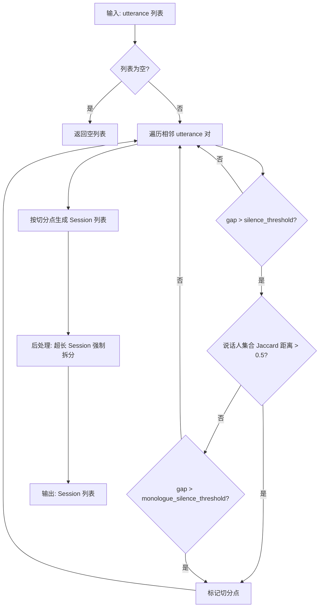
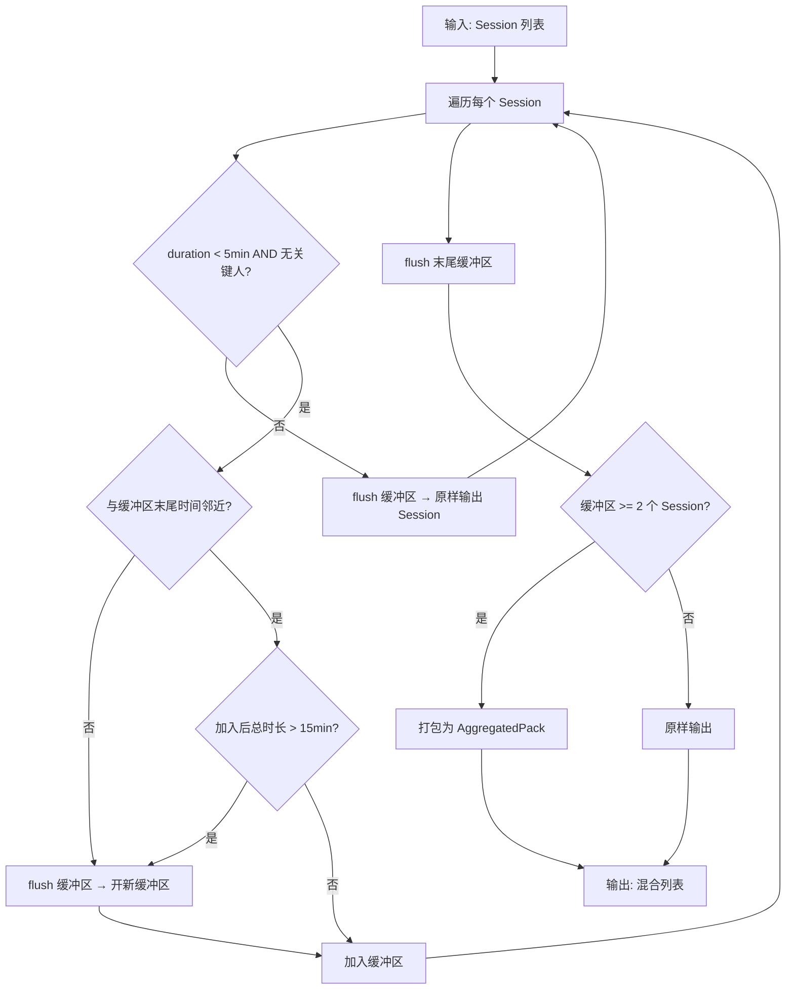
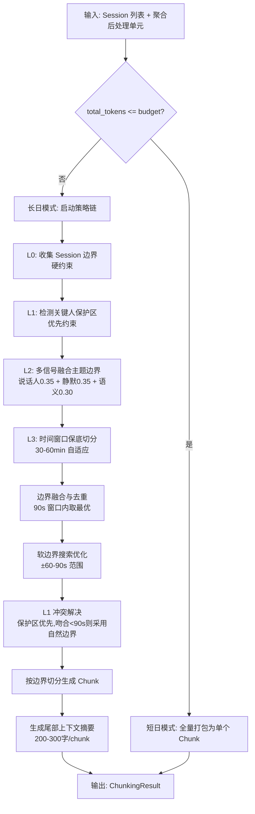

# 架构详设：会话检测 + 碎片聚合 + 分片引擎

> 本文档覆盖模块 3（会话检测器）、模块 4（碎片聚合器）、模块 5（分片引擎）的详细设计。
> 对应 PRD §1.2.2 分片策略引擎。

---

## 目录

1. [共享数据结构定义](#1-共享数据结构定义)
2. [模块 3：会话检测器 `core/session_detector.py`](#2-模块-3会话检测器)
3. [模块 4：碎片聚合器 `core/fragment_aggregator.py`](#3-模块-4碎片聚合器)
4. [模块 5：分片引擎 `core/chunking_engine.py`](#4-模块-5分片引擎)
5. [关键参数汇总表](#5-关键参数汇总表)

---

## 1. 共享数据结构定义

以下类型贯穿三个模块，统一定义于 `core/types.py`。

```python
from __future__ import annotations
from dataclasses import dataclass, field
from enum import Enum
from typing import Optional, Sequence

# ── 基础枚举 ─────────────────────────────────────────

class AlignmentQuality(Enum):
    HIGH = "high"
    MEDIUM = "medium"
    LOW = "low"

class KeyPersonLevel(Enum):
    P0 = "P0"
    P1 = "P1"
    P2 = "P2"
    P3 = "P3"

# ── 输入层核心结构 ───────────────────────────────────

@dataclass(frozen=True)
class Utterance:
    """预处理后的最小对话单元（合并后的话语段）。"""
    utterance_id: str                     # 全局唯一标识，如 "utt_20260327_093012_001"
    speaker_id: str                       # 说话人标识
    speaker_name: Optional[str]           # ASR / 配置推断的姓名
    start_time: float                     # 起始时间戳（秒，相对录音起点）
    end_time: float                       # 结束时间戳（秒）
    text: str                             # ASR 识别文本
    asr_confidence: float                 # ASR 置信度 0.0-1.0
    speaker_confidence: float             # 说话人归属置信度 0.0-1.0
    alignment_quality: AlignmentQuality   # 对齐质量
    key_person_level: Optional[KeyPersonLevel]  # 关键人等级（None 表示非关键人）
    token_count: int                      # 预计算的 token 数

    @property
    def duration(self) -> float:
        return self.end_time - self.start_time

# ── 会话检测输出 ─────────────────────────────────────

@dataclass
class Session:
    """自然对话会话——L0 硬约束边界单元。"""
    session_id: str                       # 如 "sess_001"
    utterances: list[Utterance]           # 包含的有序 utterance 列表
    start_time: float                     # 第一条 utterance.start_time
    end_time: float                       # 最后一条 utterance.end_time
    total_tokens: int                     # 所有 utterance token 之和
    speaker_set: set[str]                 # 出现过的说话人 ID 集合
    has_key_person: bool                  # 是否包含 P0/P1 关键人
    gap_before: Optional[float]           # 与前一个 Session 之间的静默时长（秒）

    @property
    def duration(self) -> float:
        return self.end_time - self.start_time

# ── 碎片聚合输出 ─────────────────────────────────────

@dataclass
class AggregatedPack:
    """碎片聚合包——将多个短 Session 打包为一个处理单元。"""
    pack_id: str                          # 如 "pack_003"
    sessions: list[Session]               # 被聚合的 Session 列表
    start_time: float
    end_time: float
    total_tokens: int
    is_aggregated: bool = True            # 标记是否为聚合产物

    @property
    def duration(self) -> float:
        return self.end_time - self.start_time

# ── 分片引擎输出 ─────────────────────────────────────

@dataclass
class Chunk:
    """最终分片——送入 LLM 的处理单元。"""
    chunk_id: str                         # 如 "chunk_001"
    sessions: list[Session]               # 包含的 Session（可能含 AggregatedPack 展开后的 Session）
    utterances: list[Utterance]           # 扁平化的全部 utterance
    start_time: float
    end_time: float
    total_tokens: int
    strategy_used: str                    # 产生此 chunk 的策略名，如 "L1_key_person"
    label: Optional[str]                  # 可读标签，如 "战略研讨会-第2部分，共4部分"
    tail_context_summary: Optional[str]   # 尾部上下文摘要（200-300 字）
    key_persons_involved: list[str]       # 涉及的关键人 ID 列表
    boundary_score: float                 # 边界质量评分 0.0-1.0

@dataclass
class ChunkingResult:
    """分片引擎总输出。"""
    chunks: list[Chunk]
    mode: str                             # "short_day" | "long_day"
    total_tokens: int
    metadata: dict                        # 策略选择日志、边界统计等
```

---

## 2. 模块 3：会话检测器

> 文件：`core/session_detector.py`
> 职责：识别全天录音中的自然对话边界，产出 Session 列表，作为后续所有分片策略的 **L0 硬约束**。

### 2.1 输入 / 输出

```python
# 输入
utterances: list[Utterance]   # 按 start_time 升序排列的预处理后 utterance 列表

# 输出
sessions: list[Session]       # 按时间排序的 Session 列表
```

### 2.2 双条件门控算法

核心检测条件：**静默 > 3 分钟** AND **说话人变化**（双条件同时满足才切分）。

设计意图：
- 仅用静默阈值会将"单人长时间思考后继续发言"误切为两段。
- 仅用说话人变化会在快速轮换对话中产生过多切分。
- 双条件门控在两者交集处切分，精准识别"一段对话结束、另一段对话开始"。

**说话人变化的定义**：比较静默前后各 N 条 utterance（默认 N=3）的说话人集合，若 Jaccard 距离 > 0.5 则认定发生变化。当静默前后仅有 1 条 utterance 时，直接比较 speaker_id 是否不同。

### 2.3 核心算法伪代码

```python
class SessionDetector:
    """会话检测器——双条件门控。"""

    def __init__(
        self,
        silence_threshold: float = 180.0,       # 静默阈值（秒），默认 3 分钟
        speaker_window: int = 3,                 # 说话人变化检测窗口大小
        jaccard_threshold: float = 0.5,          # 说话人集合 Jaccard 距离阈值
        max_session_duration: float = 7200.0,    # 最大会话时长（秒），默认 2 小时
        monologue_silence_threshold: float = 600.0,  # 独白场景静默阈值（秒），默认 10 分钟
    ):
        ...

    def detect(self, utterances: list[Utterance]) -> list[Session]:
        if not utterances:
            return []

        boundaries: list[int] = []  # 存储切分点的 utterance 索引

        for i in range(1, len(utterances)):
            gap = utterances[i].start_time - utterances[i - 1].end_time

            if gap <= self.silence_threshold:
                continue

            # 条件 1：静默超过阈值 ✓
            # 条件 2：检测说话人变化
            speakers_before = self._get_speaker_set(utterances, end=i, window=self.speaker_window)
            speakers_after  = self._get_speaker_set(utterances, start=i, window=self.speaker_window)
            speaker_changed = self._jaccard_distance(speakers_before, speakers_after) > self.jaccard_threshold

            if speaker_changed:
                boundaries.append(i)
            elif gap > self.monologue_silence_threshold:
                # 边界 case：超长静默（>10min）即使同一说话人也强制切分
                boundaries.append(i)

        # 后处理：超长 Session 内部强制切分
        sessions = self._split_by_boundaries(utterances, boundaries)
        sessions = self._enforce_max_duration(sessions)

        return sessions

    def _get_speaker_set(self, utterances, start=None, end=None, window=3) -> set[str]:
        """取指定范围内最近 window 条 utterance 的说话人集合。"""
        if end is not None:
            segment = utterances[max(0, end - window):end]
        else:
            segment = utterances[start:start + window]
        return {u.speaker_id for u in segment}

    @staticmethod
    def _jaccard_distance(set_a: set, set_b: set) -> float:
        if not set_a and not set_b:
            return 0.0
        union = set_a | set_b
        intersection = set_a & set_b
        return 1.0 - len(intersection) / len(union)

    def _enforce_max_duration(self, sessions: list[Session]) -> list[Session]:
        """超过 max_session_duration 的 Session 按时间均分再切。"""
        result = []
        for session in sessions:
            if session.duration <= self.max_session_duration:
                result.append(session)
            else:
                # 在最大静默间隔处切分，退化为等时间窗口切分
                sub_sessions = self._split_long_session(session)
                result.extend(sub_sessions)
        return result
```

### 2.4 边界 Case 处理

| 场景 | 检测行为 | 处理策略 |
|:---|:---|:---|
| **单人长时间独白**（如 2 小时讲座） | 静默>3min 条件可能满足，但说话人不变，门控不触发 | 若静默>10min（`monologue_silence_threshold`）强制切分；若 Session 超过 `max_session_duration` 则在内部最大静默点切分 |
| **全天无明显静默** | 所有 gap < 3min，不产生任何切分点 | 整天作为单个 Session；交由分片引擎 L1-L3 策略处理内部切分 |
| **频繁短静默**（如嘈杂环境） | gap 分布均匀但都 < 3min | 不触发切分，保持完整会话 |
| **录音中断恢复**（gap 极大，如数小时） | gap >> 3min 且大概率说话人变化 | 自然触发切分 |
| **仅 1 条 utterance** | 无 gap 可计算 | 返回包含单条 utterance 的 Session |
| **空输入** | 无 utterance | 返回空列表 |

### 2.5 流程图



---

## 3. 模块 4：碎片聚合器

> 文件：`core/fragment_aggregator.py`
> 职责：将 <5 分钟的非关键人短对话 Session 按时间邻近性聚合打包，避免碎片化浪费 LLM 调用。

### 3.1 输入 / 输出

```python
# 输入
sessions: list[Session]          # 会话检测器输出的 Session 列表（按时间排序）

# 输出
processing_units: list[Session | AggregatedPack]
# 返回混合列表：不需要聚合的 Session 原样保留，被聚合的 Session 打包为 AggregatedPack
```

### 3.2 聚合规则

| 规则 | 阈值 | 说明 |
|:---|:---|:---|
| 候选条件 | `duration < 300s`（5 分钟） | 仅对短 Session 执行聚合 |
| 关键人排除 | `has_key_person == False` | 含 P0/P1 关键人的 Session 不参与聚合 |
| 聚合包上限 | `pack_duration <= 900s`（15 分钟） | 单个聚合包总时长不超过 15 分钟 |
| 时间邻近性 | `gap <= 600s`（10 分钟） | 相邻候选 Session 间隔不超过 10 分钟才可聚合 |

### 3.3 时间邻近性分组算法

```python
class FragmentAggregator:
    """碎片聚合器——按时间邻近性打包非关键人短对话。"""

    def __init__(
        self,
        short_session_threshold: float = 300.0,   # 短 Session 阈值（秒）
        pack_duration_limit: float = 900.0,        # 聚合包时长上限（秒）
        proximity_threshold: float = 600.0,        # 时间邻近阈值（秒）
        min_aggregation_count: int = 2,            # 至少聚合 2 个 Session 才打包
    ):
        ...

    def aggregate(self, sessions: list[Session]) -> list[Session | AggregatedPack]:
        result: list[Session | AggregatedPack] = []
        pending: list[Session] = []       # 待聚合缓冲区
        pending_duration: float = 0.0     # 缓冲区累计时长

        for session in sessions:
            if not self._is_aggregation_candidate(session):
                # 非候选：先 flush 缓冲区，再原样输出当前 Session
                self._flush_pending(pending, result)
                pending, pending_duration = [], 0.0
                result.append(session)
                continue

            # 检查是否可以加入当前缓冲区
            if pending and not self._is_proximate(pending[-1], session):
                # 时间不邻近：flush 并开启新缓冲区
                self._flush_pending(pending, result)
                pending, pending_duration = [], 0.0

            # 检查加入后是否超限
            candidate_duration = pending_duration + session.duration
            if candidate_duration > self.pack_duration_limit and pending:
                # 超限：flush 当前缓冲区，当前 Session 开启新缓冲区
                self._flush_pending(pending, result)
                pending, pending_duration = [], 0.0

            pending.append(session)
            pending_duration += session.duration

        # 处理末尾缓冲区
        self._flush_pending(pending, result)
        return result

    def _is_aggregation_candidate(self, session: Session) -> bool:
        return (
            session.duration < self.short_session_threshold
            and not session.has_key_person
        )

    def _is_proximate(self, prev: Session, curr: Session) -> bool:
        gap = curr.start_time - prev.end_time
        return gap <= self.proximity_threshold

    def _flush_pending(
        self,
        pending: list[Session],
        result: list[Session | AggregatedPack],
    ) -> None:
        if not pending:
            return
        if len(pending) < self.min_aggregation_count:
            # 不足 2 个，不聚合，原样输出
            result.extend(pending)
        else:
            pack = AggregatedPack(
                pack_id=self._generate_pack_id(),
                sessions=list(pending),
                start_time=pending[0].start_time,
                end_time=pending[-1].end_time,
                total_tokens=sum(s.total_tokens for s in pending),
            )
            result.append(pack)
```

### 3.4 流程图



---

## 4. 模块 5：分片引擎

> 文件：`core/chunking_engine.py`
> 职责：将会话检测 + 碎片聚合后的处理单元，按照 L0→L1→L2→L3 四级分层策略切分为最终 Chunk，送入 LLM 摘要生成。

### 4.1 插件化架构设计

分片引擎采用 **策略模式（Strategy Pattern）** + **责任链（Chain of Responsibility）** 混合架构。每一层策略实现统一的抽象接口，引擎按优先级顺序逐层应用。

#### 4.1.1 策略接口定义（抽象类）

```python
from abc import ABC, abstractmethod
from dataclasses import dataclass

@dataclass
class ChunkingContext:
    """策略执行上下文——在策略链中传递的共享状态。"""
    token_budget: int                          # 单 Chunk 目标 token 上限
    total_tokens: int                          # 全天总 token 数
    key_person_config: dict                    # 关键人配置
    sessions: list[Session]                    # L0 会话检测结果（不可变引用）
    processing_units: list[Session | AggregatedPack]  # 聚合后的处理单元

@dataclass
class BoundaryCandidate:
    """候选切分边界。"""
    position_time: float                       # 候选边界时间点（秒）
    score: float                               # 边界质量评分 0.0-1.0
    source: str                                # 来源策略标识
    utterance_index: int                       # 最近的 utterance 索引
    is_session_boundary: bool                  # 是否恰好在 Session 边界上

class ChunkingStrategy(ABC):
    """分片策略抽象接口——所有策略层必须实现。"""

    @property
    @abstractmethod
    def name(self) -> str:
        """策略名称标识，如 'L0_session', 'L1_key_person'。"""
        ...

    @property
    @abstractmethod
    def priority(self) -> int:
        """优先级，数值越小越优先。L0=0, L1=1, L2=2, L3=3。"""
        ...

    @abstractmethod
    def find_boundaries(
        self,
        units: list[Session | AggregatedPack],
        context: ChunkingContext,
    ) -> list[BoundaryCandidate]:
        """识别候选切分边界。

        Args:
            units: 待切分的处理单元序列。
            context: 策略执行上下文。

        Returns:
            候选边界列表，按 position_time 升序。
        """
        ...

    @abstractmethod
    def validate_chunk(self, chunk: Chunk, context: ChunkingContext) -> bool:
        """校验生成的 Chunk 是否满足本策略的约束。"""
        ...
```

#### 4.1.2 引擎主控逻辑

```python
class ChunkingEngine:
    """分片引擎主控——协调四级策略链。"""

    def __init__(
        self,
        strategies: list[ChunkingStrategy] | None = None,
        token_budget: int = 200_000,
        soft_boundary_range: tuple[float, float] = (60.0, 90.0),
    ):
        # 默认策略链
        self.strategies = sorted(
            strategies or [
                L0SessionStrategy(),
                L1KeyPersonStrategy(),
                L2TopicBoundaryStrategy(),
                L3TimeWindowStrategy(),
            ],
            key=lambda s: s.priority,
        )
        self.token_budget = token_budget
        self.soft_boundary_range = soft_boundary_range

    def chunk(
        self,
        sessions: list[Session],
        processing_units: list[Session | AggregatedPack],
        key_person_config: dict,
    ) -> ChunkingResult:
        total_tokens = sum(s.total_tokens for s in sessions)

        context = ChunkingContext(
            token_budget=self.token_budget,
            total_tokens=total_tokens,
            key_person_config=key_person_config,
            sessions=sessions,
            processing_units=processing_units,
        )

        # 短日判断：无需分片
        if total_tokens <= self.token_budget:
            return self._build_single_chunk(sessions, context)

        # 长日路径：逐层收集边界候选
        all_boundaries = self._collect_boundaries(context)

        # 边界融合与去重
        merged = self._merge_boundaries(all_boundaries)

        # 软边界搜索优化
        optimized = [self._optimize_boundary(b, sessions) for b in merged]

        # 按边界切分生成 Chunk
        chunks = self._split_into_chunks(sessions, optimized, context)

        # 生成尾部上下文摘要
        self._attach_tail_context(chunks)

        return ChunkingResult(
            chunks=chunks,
            mode="long_day",
            total_tokens=total_tokens,
            metadata={"boundaries": optimized, "strategy_chain": [s.name for s in self.strategies]},
        )
```

### 4.2 L0 会话检测策略（硬约束）

L0 不额外产生新边界——它确立一条铁律：**任何 Chunk 不得跨越 Session 边界**。所有上游 Session 边界自动成为不可违反的切分点。

```python
class L0SessionStrategy(ChunkingStrategy):
    name = "L0_session"
    priority = 0

    def find_boundaries(self, units, context) -> list[BoundaryCandidate]:
        boundaries = []
        for i in range(1, len(context.sessions)):
            prev = context.sessions[i - 1]
            curr = context.sessions[i]
            boundaries.append(BoundaryCandidate(
                position_time=curr.start_time,
                score=1.0,                       # 硬约束，评分满分
                source=self.name,
                utterance_index=self._find_utterance_index(curr),
                is_session_boundary=True,
            ))
        return boundaries

    def validate_chunk(self, chunk, context) -> bool:
        # 校验：Chunk 中的所有 utterance 必须属于同一组连续 Session
        session_ids = {self._get_session_id(u, context) for u in chunk.utterances}
        return self._are_consecutive(session_ids, context)
```

### 4.3 L1 关键人保护策略（优先约束）

#### 4.3.1 保护区定义

"关键人保护区"是指 **P0/P1 关键人连续参与对话的时间段**。保护区内的内容不被切分（除非超过 60 分钟触发内部再细分）。

```python
@dataclass
class ProtectionZone:
    """关键人保护区。"""
    zone_id: str
    key_person_ids: list[str]             # 涉及的关键人
    key_person_level: KeyPersonLevel      # 最高等级
    start_time: float
    end_time: float
    utterances: list[Utterance]
    total_tokens: int

    @property
    def duration(self) -> float:
        return self.end_time - self.start_time
```

#### 4.3.2 优先约束实现逻辑

```python
class L1KeyPersonStrategy(ChunkingStrategy):
    name = "L1_key_person"
    priority = 1

    KEY_PERSON_GAP_THRESHOLD = 120.0       # 关键人对话间隔超过 2min 认为保护区结束
    MAX_ZONE_DURATION = 3600.0             # 保护区上限 60min，超过则内部再细分
    BOUNDARY_TOLERANCE = 90.0              # 与其他策略边界吻合容差（秒）

    def find_boundaries(self, units, context) -> list[BoundaryCandidate]:
        # Step 1: 扫描所有 utterance，识别关键人保护区
        zones = self._detect_protection_zones(context.sessions, context.key_person_config)

        boundaries = []
        for zone in zones:
            # Step 2: 保护区边界作为优先约束边界
            boundaries.append(BoundaryCandidate(
                position_time=zone.start_time,
                score=0.9,                       # 高分但非 1.0（为 L0 保留）
                source=self.name,
                utterance_index=...,
                is_session_boundary=False,
            ))
            boundaries.append(BoundaryCandidate(
                position_time=zone.end_time,
                score=0.9,
                source=self.name,
                utterance_index=...,
                is_session_boundary=False,
            ))

            # Step 3: 超长保护区内部切分
            if zone.duration > self.MAX_ZONE_DURATION:
                inner_boundaries = self._subdivide_zone(zone, context)
                boundaries.extend(inner_boundaries)

        return boundaries

    def _detect_protection_zones(
        self,
        sessions: list[Session],
        key_person_config: dict,
    ) -> list[ProtectionZone]:
        """扫描 utterance 序列，将 P0/P1 关键人连续参与的区间标记为保护区。

        算法：
        1. 遍历所有 utterance（跨 Session 不合并，因 L0 硬约束）
        2. 当遇到 P0/P1 关键人 utterance，开始或延续保护区
        3. 当连续 KEY_PERSON_GAP_THRESHOLD 秒无关键人发言，关闭保护区
        """
        zones = []
        current_zone_utts: list[Utterance] = []
        last_kp_time = -float("inf")

        for session in sessions:
            for utt in session.utterances:
                is_kp = utt.key_person_level in (KeyPersonLevel.P0, KeyPersonLevel.P1)
                if is_kp:
                    if utt.start_time - last_kp_time > self.KEY_PERSON_GAP_THRESHOLD and current_zone_utts:
                        zones.append(self._build_zone(current_zone_utts))
                        current_zone_utts = []
                    current_zone_utts.append(utt)
                    last_kp_time = utt.end_time
                else:
                    # 非关键人 utterance：若在保护区窗口内，也纳入保护区
                    if current_zone_utts and (utt.start_time - last_kp_time <= self.KEY_PERSON_GAP_THRESHOLD):
                        current_zone_utts.append(utt)

            # Session 边界处强制关闭保护区（L0 硬约束）
            if current_zone_utts:
                zones.append(self._build_zone(current_zone_utts))
                current_zone_utts = []
                last_kp_time = -float("inf")

        return zones

    def _subdivide_zone(self, zone: ProtectionZone, context: ChunkingContext) -> list[BoundaryCandidate]:
        """超长保护区（>60min）内部再细分。

        策略：优先使用 L2 主题边界；若无合适主题边界则退化为时间窗口等分。
        切分后每段标注关联性标签，如 "战略研讨会-第2部分，共4部分"。
        """
        ...

    def validate_chunk(self, chunk, context) -> bool:
        # 校验：P0/P1 关键人的连续对话不被割裂（除非超长再细分）
        ...
```

#### 4.3.3 优先约束冲突解决

当 L1 保护区边界与 L2/L3 边界冲突时：

| 冲突场景 | 解决规则 |
|:---|:---|
| L2 主题边界在保护区**内部** | 忽略 L2 边界，保护区完整保留 |
| L2 边界与保护区边界偏差 < 90s | 采用 L2 边界（更自然的切分点） |
| L2 边界与保护区边界偏差 >= 90s | 保留 L1 保护区边界 |
| L3 时间窗口切入保护区内部 | 忽略 L3，保护区完整保留 |

```python
def _resolve_conflict(
    self,
    l1_boundary: BoundaryCandidate,
    other_boundary: BoundaryCandidate,
) -> BoundaryCandidate:
    distance = abs(l1_boundary.position_time - other_boundary.position_time)
    if distance < self.BOUNDARY_TOLERANCE:
        # 高度吻合：采用另一策略的边界（更自然）
        other_boundary.score = max(other_boundary.score, l1_boundary.score)
        return other_boundary
    else:
        # 不吻合：L1 优先
        return l1_boundary
```

### 4.4 L2 主题边界策略（多信号融合）

#### 4.4.1 三信号融合算法

| 信号 | 权重 | 检测方式 | 实现细节 |
|:---|:---|:---|:---|
| 说话人切换 | **0.35** | 滑动窗口（5min）内说话人集合 Jaccard 距离 > 0.5 | 前后各取 5min 窗口比较 |
| 静默间隔 | **0.35** | 当前 gap 超过局部均值 2 倍标准差 | 局部窗口 = 前后 10min 内的所有 gap |
| 语义辅助 | **0.30** | 相邻文本窗口 embedding 余弦相似度低于阈值 | text2vec-base-chinese，窗口 500 字 |

**融合公式**：

$$
\text{BoundaryScore}(t) = 0.35 \times S_{\text{speaker}}(t) + 0.35 \times S_{\text{silence}}(t) + 0.30 \times S_{\text{semantic}}(t)
$$

当 $\text{BoundaryScore}(t) > \theta$（默认 $\theta = 0.55$）时，判定为主题边界候选。

#### 4.4.2 各信号评分计算

```python
class L2TopicBoundaryStrategy(ChunkingStrategy):
    name = "L2_topic_boundary"
    priority = 2

    SPEAKER_WEIGHT = 0.35
    SILENCE_WEIGHT = 0.35
    SEMANTIC_WEIGHT = 0.30
    BOUNDARY_THRESHOLD = 0.55              # 融合分数阈值
    SPEAKER_WINDOW_SECONDS = 300.0         # 说话人检测窗口 5min
    SILENCE_LOCAL_WINDOW = 600.0           # 静默统计局部窗口 10min
    SEMANTIC_TEXT_WINDOW = 500              # 语义比较文本窗口（字符数）
    SEMANTIC_SIMILARITY_FLOOR = 0.45       # 余弦相似度低于此值得满分
    SEMANTIC_SIMILARITY_CEIL = 0.75        # 高于此值得零分
    MIN_BOUNDARY_INTERVAL = 120.0          # 相邻边界最小间隔（秒）

    def find_boundaries(self, units, context) -> list[BoundaryCandidate]:
        all_utterances = self._flatten_utterances(units)
        candidates = []

        # 在每个 utterance 间隙处计算三信号融合分数
        for i in range(1, len(all_utterances)):
            t = all_utterances[i].start_time

            s_speaker = self._speaker_switch_score(all_utterances, i)
            s_silence = self._silence_score(all_utterances, i)
            s_semantic = self._semantic_score(all_utterances, i)

            score = (
                self.SPEAKER_WEIGHT * s_speaker
                + self.SILENCE_WEIGHT * s_silence
                + self.SEMANTIC_WEIGHT * s_semantic
            )

            if score > self.BOUNDARY_THRESHOLD:
                candidates.append(BoundaryCandidate(
                    position_time=t,
                    score=score,
                    source=self.name,
                    utterance_index=i,
                    is_session_boundary=False,
                ))

        # 后处理：合并过近的候选边界（保留得分最高者）
        return self._merge_nearby(candidates, self.MIN_BOUNDARY_INTERVAL)

    def _speaker_switch_score(self, utterances: list[Utterance], idx: int) -> float:
        """说话人切换信号评分。

        取 idx 前后各 SPEAKER_WINDOW_SECONDS 范围内的说话人集合，
        计算 Jaccard 距离。距离 > 0.5 → 1.0，距离 0.0 → 0.0，中间线性插值。
        """
        t = utterances[idx].start_time
        before = {u.speaker_id for u in utterances if t - self.SPEAKER_WINDOW_SECONDS <= u.start_time < t}
        after  = {u.speaker_id for u in utterances if t <= u.start_time <= t + self.SPEAKER_WINDOW_SECONDS}

        if not before or not after:
            return 0.0

        jd = 1.0 - len(before & after) / len(before | after)
        return min(1.0, jd / 0.5)  # 归一化：Jaccard=0.5 映射到 1.0

    def _silence_score(self, utterances: list[Utterance], idx: int) -> float:
        """静默间隔信号评分。

        当前 gap 与局部窗口内 gap 均值 + 2*标准差比较。
        超过 2σ → 1.0，低于均值 → 0.0，中间线性插值。
        """
        current_gap = utterances[idx].start_time - utterances[idx - 1].end_time
        t = utterances[idx].start_time

        # 收集局部窗口内的所有 gap
        local_gaps = []
        for j in range(1, len(utterances)):
            if abs(utterances[j].start_time - t) <= self.SILENCE_LOCAL_WINDOW:
                local_gaps.append(utterances[j].start_time - utterances[j - 1].end_time)

        if len(local_gaps) < 3:
            return 0.5  # 样本不足，给予中性分

        mean_gap = sum(local_gaps) / len(local_gaps)
        std_gap = (sum((g - mean_gap) ** 2 for g in local_gaps) / len(local_gaps)) ** 0.5

        if std_gap < 0.01:
            return 0.0

        z_score = (current_gap - mean_gap) / std_gap
        return max(0.0, min(1.0, z_score / 2.0))  # z=2 映射到 1.0

    def _semantic_score(self, utterances: list[Utterance], idx: int) -> float:
        """语义辅助信号评分。

        取 idx 前后各 SEMANTIC_TEXT_WINDOW 字符的文本，
        分别计算 embedding，用余弦相似度评估主题连续性。
        相似度越低 → 分数越高（主题变化越大）。
        """
        text_before = self._collect_text(utterances, end_idx=idx, char_limit=self.SEMANTIC_TEXT_WINDOW)
        text_after  = self._collect_text(utterances, start_idx=idx, char_limit=self.SEMANTIC_TEXT_WINDOW)

        if not text_before or not text_after:
            return 0.0

        sim = self._cosine_similarity(
            self._get_embedding(text_before),
            self._get_embedding(text_after),
        )

        # 线性映射：sim <= FLOOR → 1.0, sim >= CEIL → 0.0
        if sim <= self.SEMANTIC_SIMILARITY_FLOOR:
            return 1.0
        if sim >= self.SEMANTIC_SIMILARITY_CEIL:
            return 0.0
        return (self.SEMANTIC_SIMILARITY_CEIL - sim) / (self.SEMANTIC_SIMILARITY_CEIL - self.SEMANTIC_SIMILARITY_FLOOR)
```

### 4.5 L3 时间窗口策略（保底）

当 L1、L2 未产生足够切分点时，L3 作为保底按固定窗口切分。

```python
class L3TimeWindowStrategy(ChunkingStrategy):
    name = "L3_time_window"
    priority = 3

    DEFAULT_WINDOW = 2700.0                # 默认窗口 45 分钟
    MIN_WINDOW = 1800.0                    # 最小 30 分钟
    MAX_WINDOW = 3600.0                    # 最大 60 分钟

    def find_boundaries(self, units, context) -> list[BoundaryCandidate]:
        total_duration = context.sessions[-1].end_time - context.sessions[0].start_time
        window = self._adaptive_window(total_duration, context.total_tokens, context.token_budget)

        boundaries = []
        t = context.sessions[0].start_time + window
        end_t = context.sessions[-1].end_time

        while t < end_t:
            boundaries.append(BoundaryCandidate(
                position_time=t,
                score=0.3,                       # 低分，仅作保底
                source=self.name,
                utterance_index=self._nearest_utterance(t, context),
                is_session_boundary=False,
            ))
            t += window

        return boundaries

    def _adaptive_window(self, total_duration: float, total_tokens: int, budget: int) -> float:
        """自适应窗口：根据 token 密度调整。

        token 密度高（说话密集）→ 缩短窗口；密度低 → 拉长窗口。
        """
        if total_duration <= 0:
            return self.DEFAULT_WINDOW

        tokens_per_second = total_tokens / total_duration
        target_tokens_per_chunk = budget * 0.8          # 目标每 chunk 填充 80% budget
        window = target_tokens_per_chunk / max(tokens_per_second, 0.1)

        return max(self.MIN_WINDOW, min(self.MAX_WINDOW, window))
```

### 4.6 软边界搜索

所有策略产出的候选边界都经过软边界搜索优化——在 **+/-60~90 秒** 范围内寻找最自然的切分点。

```python
def _optimize_boundary(
    self,
    candidate: BoundaryCandidate,
    sessions: list[Session],
) -> BoundaryCandidate:
    """在候选边界附近搜索最佳切分点。

    搜索范围：candidate.position_time ± [60, 90] 秒
    优先级：Session 边界 > 长静默间隔 > 说话人轮换 > 自然句末
    """
    search_start = candidate.position_time - self.soft_boundary_range[1]  # -90s
    search_end   = candidate.position_time + self.soft_boundary_range[1]  # +90s

    all_utterances = self._flatten_all_utterances(sessions)
    best_point = candidate
    best_quality = -1.0

    for i in range(1, len(all_utterances)):
        t = all_utterances[i].start_time
        if t < search_start or t > search_end:
            continue

        quality = 0.0

        # 信号 1：是否处于 Session 边界（最高优先）
        if self._is_session_boundary(t, sessions):
            quality += 10.0

        # 信号 2：静默间隔长度（归一化）
        gap = all_utterances[i].start_time - all_utterances[i - 1].end_time
        quality += min(gap / 30.0, 1.0) * 3.0

        # 信号 3：说话人是否切换
        if all_utterances[i].speaker_id != all_utterances[i - 1].speaker_id:
            quality += 2.0

        # 信号 4：前一句是否以句末标点结尾
        if all_utterances[i - 1].text.rstrip().endswith(("。", "！", "？", ".", "!", "?")):
            quality += 1.0

        # 信号 5：距离原始候选点的偏移惩罚
        offset = abs(t - candidate.position_time)
        quality -= offset / self.soft_boundary_range[1] * 0.5

        if quality > best_quality:
            best_quality = quality
            best_point = BoundaryCandidate(
                position_time=t,
                score=candidate.score,
                source=candidate.source,
                utterance_index=i,
                is_session_boundary=self._is_session_boundary(t, sessions),
            )

    best_point.boundary_score = min(1.0, best_quality / 10.0)
    return best_point
```

### 4.7 边界融合与去重

多策略可能在相近位置产生候选边界，需合并去重。

```python
def _merge_boundaries(
    self,
    all_boundaries: list[BoundaryCandidate],
    merge_window: float = 90.0,
) -> list[BoundaryCandidate]:
    """合并 merge_window 秒内的候选边界。

    规则：
    1. 按 position_time 排序
    2. 在 merge_window 内取 score 最高者
    3. L0（Session 边界）永远保留，不被合并替代
    """
    if not all_boundaries:
        return []

    sorted_b = sorted(all_boundaries, key=lambda b: b.position_time)
    merged = [sorted_b[0]]

    for b in sorted_b[1:]:
        prev = merged[-1]
        if b.position_time - prev.position_time < merge_window:
            # 在合并窗口内：保留硬约束或更高分者
            if prev.is_session_boundary:
                continue  # L0 不被替代
            if b.is_session_boundary or b.score > prev.score:
                merged[-1] = b
        else:
            merged.append(b)

    return merged
```

### 4.8 尾部上下文摘要生成

每个 Chunk（除最后一个）附带 `tail_context_summary` 字段，供下一 Chunk 或合并阶段参考，实现跨片段连贯性。

```python
def _attach_tail_context(self, chunks: list[Chunk]) -> None:
    """为每个 Chunk（除末尾）生成 200-300 字的尾部上下文摘要。

    生成方式：规则提取（非 LLM），从 Chunk 尾部内容中抽取关键信息。
    """
    for i in range(len(chunks) - 1):
        chunk = chunks[i]

        # 取 Chunk 最后 15% 的 utterance 作为上下文窗口
        tail_count = max(3, len(chunk.utterances) // 7)
        tail_utts = chunk.utterances[-tail_count:]

        # 提取摘要要素
        speakers = list({u.speaker_name or u.speaker_id for u in tail_utts})
        key_persons = [u.speaker_name or u.speaker_id for u in tail_utts
                       if u.key_person_level in (KeyPersonLevel.P0, KeyPersonLevel.P1)]
        last_text = " ".join(u.text for u in tail_utts[-3:])  # 最后 3 句原文
        time_range = f"{self._format_time(tail_utts[0].start_time)}-{self._format_time(tail_utts[-1].end_time)}"

        summary = (
            f"[上下文接力] 时段{time_range}，"
            f"参与者: {', '.join(speakers[:5])}。"
            f"{'关键人 ' + ', '.join(key_persons) + ' 参与讨论。' if key_persons else ''}"
            f"末尾话题: {last_text[:200]}"
        )

        chunk.tail_context_summary = summary[:400]  # 硬截断 400 字
```

**完整阶段增强方案**（MVP 后）：尾部上下文摘要可替换为轻量级 LLM 调用（`max_tokens=200`），生成更精炼的语义摘要而非规则拼接。

### 4.9 引擎完整流程图



---

## 5. 关键参数汇总表

| 模块 | 参数 | 默认值 | 说明 |
|:---|:---|:---|:---|
| **会话检测器** | `silence_threshold` | 180s（3min） | 静默阈值，低于此不切分 |
| | `speaker_window` | 3 | 说话人变化检测窗口（utterance 数） |
| | `jaccard_threshold` | 0.5 | 说话人集合 Jaccard 距离阈值 |
| | `max_session_duration` | 7200s（2h） | 超长 Session 强制切分 |
| | `monologue_silence_threshold` | 600s（10min） | 独白场景下静默切分阈值 |
| **碎片聚合器** | `short_session_threshold` | 300s（5min） | 短 Session 判定阈值 |
| | `pack_duration_limit` | 900s（15min） | 聚合包时长上限 |
| | `proximity_threshold` | 600s（10min） | 时间邻近性阈值 |
| | `min_aggregation_count` | 2 | 最少聚合 Session 数 |
| **分片引擎** | `token_budget` | 200,000 | 单 Chunk token 上限 |
| | `soft_boundary_range` | (60s, 90s) | 软边界搜索范围 |
| **L1 关键人保护** | `KEY_PERSON_GAP_THRESHOLD` | 120s（2min） | 关键人对话间隔容忍 |
| | `MAX_ZONE_DURATION` | 3600s（60min） | 保护区上限 |
| | `BOUNDARY_TOLERANCE` | 90s | 边界吻合容差 |
| **L2 主题边界** | `SPEAKER_WEIGHT` | 0.35 | 说话人切换信号权重 |
| | `SILENCE_WEIGHT` | 0.35 | 静默间隔信号权重 |
| | `SEMANTIC_WEIGHT` | 0.30 | 语义辅助信号权重 |
| | `BOUNDARY_THRESHOLD` | 0.55 | 融合分数阈值 |
| | `SPEAKER_WINDOW_SECONDS` | 300s | 说话人比较窗口 |
| | `SILENCE_LOCAL_WINDOW` | 600s | 静默统计局部窗口 |
| | `SEMANTIC_TEXT_WINDOW` | 500 字符 | 语义比较文本窗口 |
| | `SEMANTIC_SIMILARITY_FLOOR` | 0.45 | 语义相似度低分阈值 |
| | `SEMANTIC_SIMILARITY_CEIL` | 0.75 | 语义相似度高分阈值 |
| | `MIN_BOUNDARY_INTERVAL` | 120s | 相邻边界最小间隔 |
| **L3 时间窗口** | `DEFAULT_WINDOW` | 2700s（45min） | 默认切分窗口 |
| | `MIN_WINDOW` | 1800s（30min） | 最小窗口 |
| | `MAX_WINDOW` | 3600s（60min） | 最大窗口 |

---

> **文档版本**：v1.0 | **对应 PRD 版本**：Qwen3-Max 修订版 §1.2.2
