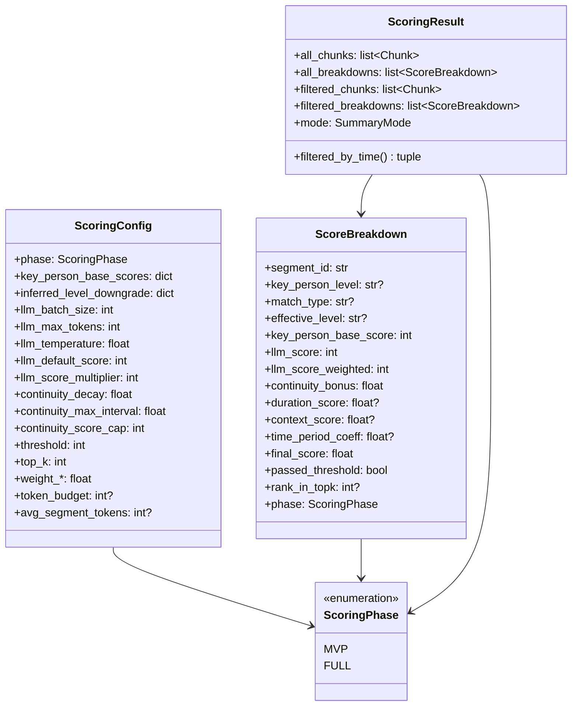
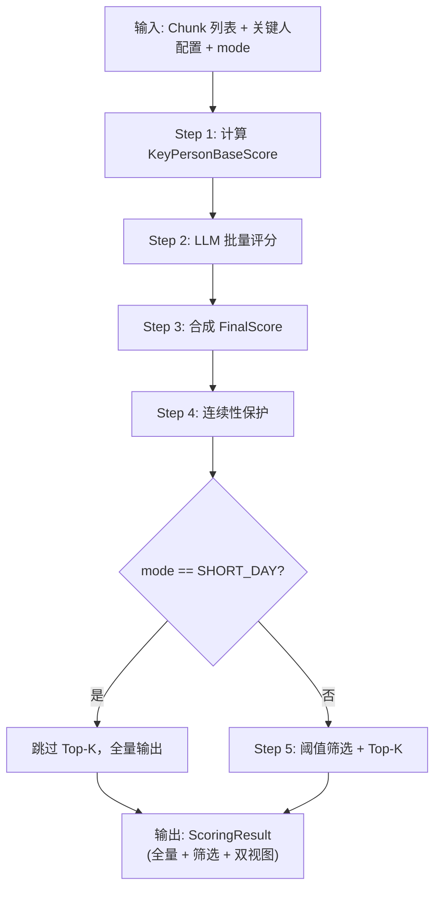
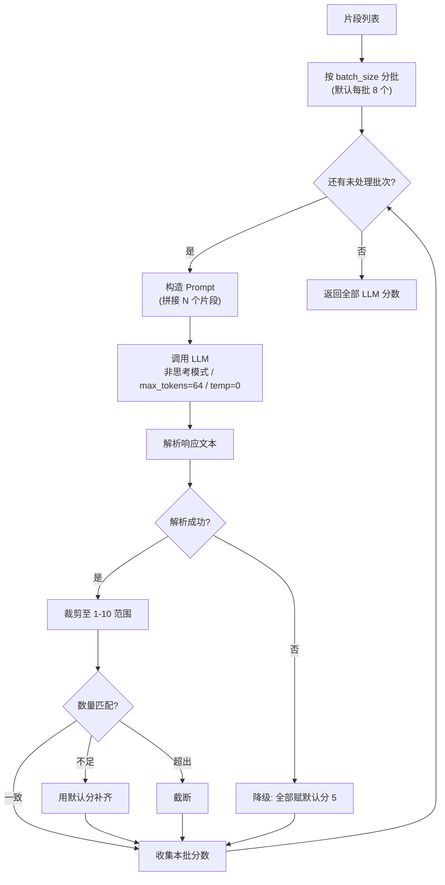
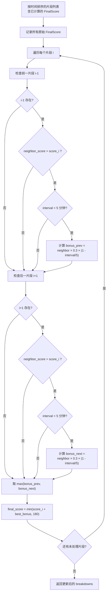
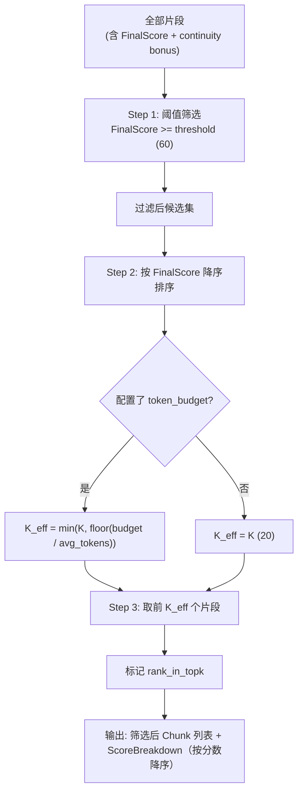
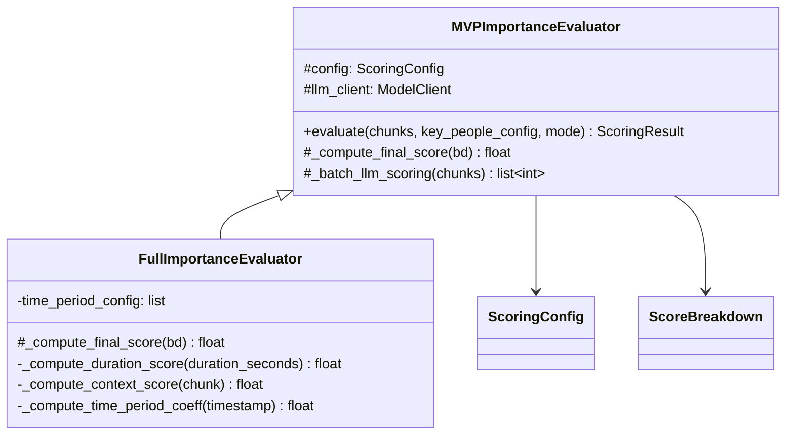
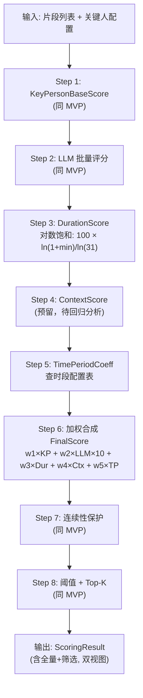

# 模块6：重要性评估器 详细设计

> **对应源文件**：`core/importance_evaluator.py` + `models/scoring.py`
>
> **PRD 依据**：§4 重要性评估模型全章

---

## 6.1 数据模型（models/scoring.py）

<!-- FIXED: BLOCK-2 — 评分模块直接使用分片引擎输出的 Chunk 类型，不再使用未定义的 Segment -->

### 6.1.0 Chunk 类型说明与 LLMClient / match_speaker_to_key_person 接口

评分模块的输入片段类型统一为分片引擎输出的 `Chunk`（定义于 `models/types.py`）。
原文档中的 `Segment` 即 `Chunk`，不再单独定义 `Segment` 类型。

```python
from models.types import Chunk
# 评分模块中所有"片段"均为 Chunk，关键字段映射：
#   chunk.chunk_id   — 片段唯一标识（原 segment.id）
#   chunk.text       — 拼接后的文本（原 segment.text）
#   chunk.speakers   — 说话人列表（原 segment.speakers）
#   chunk.start_time — 片段起始时间，float 秒（原 segment.start_time）
#   chunk.end_time   — 片段结束时间，float 秒
#   chunk.total_tokens — 片段 token 数
```

<!-- FIXED: 补充 LLMClient 接口定义，指向 ModelClient 协议 -->

**LLMClient 接口**：评分模块中引用的 `LLMClient` 实际对应 API 层定义的 `ModelClient` 协议
（定义于 `core/model_client.py`）。评分模块通过依赖注入获取该客户端实例：

```python
from typing import Protocol

class ModelClient(Protocol):
    """模型客户端协议（定义于 core/model_client.py）。
    评分模块中的 LLMClient 即此协议。"""

    async def chat_completion(
        self,
        messages: list[dict],
        max_tokens: int = 2048,
        temperature: float = 0.7,
        enable_thinking: bool = False,
    ) -> "ChatCompletionResponse": ...
```

<!-- FIXED: 补充 match_speaker_to_key_person 函数签名 -->

**match_speaker_to_key_person 函数**：由配置模块的 `KeyPersonMatcher` 提供
（定义于 `core/key_person_matcher.py`）：

```python
from models.types import MatchResult

def match_speaker_to_key_person(
    speaker: str,
    key_people_config: dict,
) -> MatchResult | None:
    """将说话人名称匹配至关键人配置。

    Returns:
        MatchResult(level="P0"~"P3", match_type="exact"|"alias"|"fuzzy"|"inferred")
        若无匹配返回 None。
    详见配置模块 KeyPersonMatcher 实现。
    """
    ...
```

### 6.1.1 ScoringPhase 枚举

标识当前评分器所处的实施阶段，决定评分公式选型与字段填充策略。

```python
from enum import Enum

class ScoringPhase(str, Enum):
    """评分阶段枚举。
    MVP 阶段仅使用 KeyPersonBaseScore + LLMScore；
    FULL 阶段引入 DurationScore、ContextScore、TimePeriodCoeff 及回归权重。
    """
    MVP = "mvp"
    FULL = "full"
```

### 6.1.2 ScoringConfig 数据类

集中管理评分流程中所有可调参数，支持从 YAML 配置文件加载并在运行时覆盖。

```python
from dataclasses import dataclass, field
from typing import Optional

@dataclass(frozen=True)
class ScoringConfig:
    """评分可配置参数。frozen=True 确保运行期间不可变。"""

    # ---- 阶段 ----
    phase: ScoringPhase = ScoringPhase.MVP

    # ---- 关键人基础分映射 ----
    key_person_base_scores: dict[str, int] = field(
        default_factory=lambda: {"P0": 80, "P1": 50, "P2": 20, "P3": 0}
    )

    # ---- L3 疑似降级映射（原始等级 -> 等效等级） ----
    inferred_level_downgrade: dict[str, str] = field(
        default_factory=lambda: {"P0": "P1", "P1": "P2", "P2": "P3", "P3": "P3"}
    )

    # ---- LLM 批量调用 ----
    llm_batch_size: int = 8              # 每批片段数（5-10，默认 8）
    llm_max_tokens: int = 64
    llm_temperature: float = 0.0
    llm_enable_thinking: bool = False    # MVP 使用非思考模式
    llm_default_score: int = 5           # 解析失败时的降级默认分
    llm_score_multiplier: int = 10       # LLMScore 放大系数

    # ---- 连续性保护 ----
    continuity_decay: float = 0.3        # 传播衰减系数
    continuity_max_interval: float = 5.0 # 最大有效间隔（分钟）
    continuity_max_hops: int = 1         # 最多传播跳数
    continuity_score_cap: int = 180      # bonus 叠加后上限

    # ---- 阈值与 Top-K ----
    threshold: int = 60                  # 最低分阈值
    top_k: int = 20                      # 最多保留片段数

    # ---- 完整阶段权重（FULL 阶段生效） ----
    weight_key_person: float = 1.0
    weight_llm: float = 1.0
    weight_duration: float = 0.3
    weight_context: float = 0.2
    weight_time_period: float = 0.1

    # ---- DurationScore 饱和参考点 ----
    duration_saturation_minutes: float = 30.0

    # ---- Token 预算联动 ----
    token_budget: Optional[int] = None         # 总 token 预算
    avg_segment_tokens: Optional[int] = None   # 片段平均 token 数
```

### 6.1.3 ScoreBreakdown 数据类

每个片段保留完整的评分分解记录，服务于调试、可解释性和后续模型迭代。

```python
from dataclasses import dataclass
from typing import Optional
from datetime import datetime

@dataclass
class ScoreBreakdown:
    """单个片段的评分分解记录。"""

    segment_id: str                      # 对应 Chunk.chunk_id

    # ---- 关键人维度 ----
    key_person_level: Optional[str]      # "P0" / "P1" / "P2" / "P3" / None
    match_type: Optional[str]            # "exact" / "alias" / "asr_corrected" / "fuzzy" / "inferred"
    effective_level: Optional[str]       # 疑似降级后的等效等级（若 match_type=="inferred"）
    key_person_base_score: int = 0

    # ---- LLM 语义维度 ----
    llm_score: int = 5                   # 原始 1-10 分
    llm_score_weighted: int = 50         # llm_score × multiplier

    # ---- 连续性保护 ----
    continuity_bonus: float = 0.0
    continuity_source_segment_id: Optional[str] = None  # bonus 来源片段

    # ---- 完整阶段维度（MVP 时为 None） ----
    duration_score: Optional[float] = None
    context_score: Optional[float] = None
    time_period_coeff: Optional[float] = None

    # ---- 最终得分 ----
    final_score: float = 0.0

    # ---- 筛选结果 ----
    threshold_applied: int = 60
    passed_threshold: bool = False
    rank_in_topk: Optional[int] = None

    # ---- 元数据 ----
    speakers: list[str] = field(default_factory=list)
    duration_seconds: Optional[float] = None
    timestamp: Optional[datetime] = None
    phase: ScoringPhase = ScoringPhase.MVP
```

<!-- FIXED: BLOCK-3 — 新增 ScoringResult 数据类，替代裸 tuple 返回 -->

### 6.1.4 ScoringResult 数据类

评分模块的统一输出容器，替代原有的裸 `tuple` 返回。同时提供"按分数降序"和"按时间升序"两个视图。

```python
from dataclasses import dataclass
from models.types import Chunk, SummaryMode

@dataclass
class ScoringResult:
    """评分模块统一输出。evaluate() 返回此类型而非裸 tuple。"""

    all_chunks: list[Chunk]                # 全量片段，按时间升序
    all_breakdowns: list[ScoreBreakdown]   # 全量评分记录，与 all_chunks 一一对应
    filtered_chunks: list[Chunk]           # Top-K 筛选后，按分数降序
    filtered_breakdowns: list[ScoreBreakdown]  # 与 filtered_chunks 一一对应
    mode: SummaryMode                      # SHORT_DAY / LONG_DAY / DEGRADED

    def filtered_by_time(self) -> tuple[list[Chunk], list[ScoreBreakdown]]:
        """返回筛选后片段按时间升序排列的视图（摘要生成模块需要此顺序）。"""
        paired = list(zip(self.filtered_chunks, self.filtered_breakdowns))
        paired.sort(key=lambda pair: pair[0].start_time)
        return [c for c, _ in paired], [b for _, b in paired]
```

> **输出视图说明**：
> - `filtered_chunks` / `filtered_breakdowns`：按 FinalScore **降序**，用于调试和重要性展示。
> - `filtered_by_time()`：按 `start_time` **升序**，用于摘要生成模块按时间线拼接文本。
> - `all_chunks` / `all_breakdowns`：全量数据按时间升序，SHORT_DAY 模式下 `filtered_chunks == all_chunks`。

### 6.1.5 数据模型关系图



---

## 6.2 MVP 评分器（core/importance_evaluator.py）

### 6.2.1 总体流程



### 6.2.2 KeyPersonBaseScore 计算逻辑

每个片段可包含多个说话人。取所有参与者中最高等级的关键人作为该片段的代表等级，映射为基础分。当最高等级来自 L3 疑似匹配时，按降级表处理。

```python
def compute_key_person_base_score(
    chunk: Chunk,
    key_people_config: dict,
    config: ScoringConfig,
) -> tuple[int, str | None, str | None, str | None]:
    """计算单个片段的 KeyPersonBaseScore。

    Returns:
        (base_score, level, match_type, effective_level)
    """
    best_level: str | None = None
    best_match_type: str | None = None
    best_priority = 999  # 越小越高优先

    LEVEL_PRIORITY = {"P0": 0, "P1": 1, "P2": 2, "P3": 3}

    for speaker in chunk.speakers:
        match = match_speaker_to_key_person(speaker, key_people_config)
        if match is None:
            continue
        level = match.level           # "P0" ~ "P3"
        match_type = match.match_type # "exact" / "alias" / ... / "inferred"

        priority = LEVEL_PRIORITY.get(level, 999)
        if priority < best_priority:
            best_priority = priority
            best_level = level
            best_match_type = match_type

    if best_level is None:
        # 未匹配到任何关键人 → 等同 P3
        return 0, None, None, None

    # L3 疑似降级处理
    effective_level = best_level
    if best_match_type == "inferred":
        effective_level = config.inferred_level_downgrade.get(best_level, best_level)

    base_score = config.key_person_base_scores[effective_level]
    return base_score, best_level, best_match_type, effective_level
```

**L3 疑似降级映射表**：

| 原始等级 | match_type | effective_level | KeyPersonBaseScore |
|:---------|:-----------|:----------------|:-------------------|
| P0       | inferred   | P1              | 50                 |
| P1       | inferred   | P2              | 20                 |
| P2       | inferred   | P3              | 0                  |
| P3       | inferred   | P3              | 0                  |
| P0       | exact      | P0              | 80                 |
| P1       | alias      | P1              | 50                 |
| -        | -（未匹配）| -               | 0                  |

### 6.2.3 LLMScore 批量调用

#### 分批逻辑

```python
def batch_segments(segments: list[Chunk], batch_size: int) -> list[list[Chunk]]:
    """将片段列表按 batch_size 切分为多个批次。"""
    return [
        segments[i : i + batch_size]
        for i in range(0, len(segments), batch_size)
    ]
```

#### Prompt 模板

```python
LLM_SCORING_PROMPT_TEMPLATE = """请评估以下 {n} 个对话片段的重要性。考虑维度：决策/指令/承诺/争议/紧急事项/任务分配/信息稀缺性。
对每个片段输出 1-10 分整数。

{segments_text}

请按顺序输出 {n} 个分数，用逗号分隔，仅输出数字。"""

def build_scoring_prompt(batch: list[Chunk]) -> str:
    """构造单批次的评分 Prompt。"""
    parts = []
    for i, seg in enumerate(batch, 1):
        speaker_info = "、".join(seg.speakers) if seg.speakers else "未知"
        parts.append(f"【片段{i}】[说话人: {speaker_info}] {seg.text}")
    segments_text = "\n".join(parts)
    return LLM_SCORING_PROMPT_TEMPLATE.format(n=len(batch), segments_text=segments_text)
```

#### 调用参数与解析逻辑

```python
import logging

logger = logging.getLogger(__name__)

async def call_llm_for_scores(
    batch: list[Chunk],
    llm_client: ModelClient,
    config: ScoringConfig,
) -> list[int]:
    """调用 LLM 对一批片段进行语义评分。

    调用参数：
      - enable_thinking: False（非思考模式）
      - max_tokens: 64
      - temperature: 0
    返回长度与 batch 一致的分数列表（1-10 整数）。
    """
    prompt = build_scoring_prompt(batch)

    # <!-- FIXED: BLOCK-2 — llm_client.complete() → chat_completion()，与 ModelClient 协议一致 -->
    response = await llm_client.chat_completion(
        messages=[{"role": "user", "content": prompt}],
        max_tokens=config.llm_max_tokens,       # 64
        temperature=config.llm_temperature,      # 0.0
        enable_thinking=config.llm_enable_thinking,  # False
    )

    return parse_llm_scores(response.text, len(batch), config)


def parse_llm_scores(
    raw_text: str,
    expected_count: int,
    config: ScoringConfig,
) -> list[int]:
    """解析 LLM 返回的逗号分隔分数字符串。

    解析规则：
      1. 按逗号分隔，strip 空白
      2. 每个 token 尝试转为 int
      3. 值域裁剪至 [1, 10]
      4. 数量不足时用 default_score 补齐
      5. 数量超出时截断至 expected_count
      6. 整体解析异常时全部降级为 default_score
    """
    default = config.llm_default_score  # 5

    try:
        tokens = [t.strip() for t in raw_text.strip().split(",")]
        scores = []
        for t in tokens:
            try:
                val = int(t)
                val = max(1, min(10, val))  # 裁剪至 [1, 10]
                scores.append(val)
            except ValueError:
                logger.warning("LLM 返回非整数 token: '%s'，使用默认分 %d", t, default)
                scores.append(default)

        # 数量修正
        if len(scores) < expected_count:
            logger.warning(
                "LLM 返回分数数量 %d < 期望 %d，用默认分 %d 补齐",
                len(scores), expected_count, default,
            )
            scores.extend([default] * (expected_count - len(scores)))
        elif len(scores) > expected_count:
            logger.warning(
                "LLM 返回分数数量 %d > 期望 %d，截断",
                len(scores), expected_count,
            )
            scores = scores[:expected_count]

        return scores

    except Exception as e:
        logger.error("LLM 评分解析整体失败: %s，全部降级为默认分 %d", e, default)
        return [default] * expected_count
```

#### LLM 批量评分完整流程图



### 6.2.4 FinalScore 合成

```python
def compute_mvp_final_score(
    base_score: int,
    llm_score: int,
    config: ScoringConfig,
) -> float:
    """MVP 阶段最终分 = KeyPersonBaseScore + LLMScore × 10"""
    return base_score + llm_score * config.llm_score_multiplier
```

| 场景示例                    | KeyPersonBaseScore | LLMScore | FinalScore |
|:---------------------------|:-------------------|:---------|:-----------|
| P0 精确匹配 + 高语义       | 80                 | 8        | 160        |
| P0 疑似匹配(→P1) + 中语义  | 50                 | 5        | 100        |
| P1 精确匹配 + 低语义       | 50                 | 2        | 70         |
| P3 / 未匹配 + 极高语义     | 0                  | 9        | 90         |
| P3 / 未匹配 + 低语义       | 0                  | 3        | 30（被过滤）|

---

## 6.3 连续性保护

### 6.3.1 设计目标

高分片段的前后相邻片段获得加成，形成"重要会话簇"，避免关键讨论的上下文被截断。

### 6.3.2 Bonus 计算公式

$$\text{bonus} = \text{neighbor\_score} \times 0.3 \times \max\left(0,\ 1 - \frac{\text{interval}}{5}\right)$$

其中：
- `neighbor_score`：相邻高分片段的 FinalScore
- `interval`：两片段之间的时间间隔（分钟）
- `0.3`：传播衰减系数（`config.continuity_decay`）
- `5`：最大有效间隔分钟数（`config.continuity_max_interval`）

### 6.3.3 传播规则

1. **仅向低分方向传播**：高分片段不从低分邻居获得加成。具体地，只有当 neighbor_score > 当前片段 FinalScore 时，才计算 bonus。
2. **最多一跳**：bonus 不会从 A 传到 B 再传到 C。仅原始 FinalScore 参与 bonus 计算，不使用已叠加 bonus 后的分数。
3. **单片段取较大值**：一个片段最多从前、后各一个邻居获得 bonus，取其中较大的一个。
4. **上限 180**：bonus 叠加后的总分 `min(final_score + bonus, config.continuity_score_cap)`。

### 6.3.4 算法伪代码

<!-- FIXED: .total_seconds() 类型错误 — start_time/end_time 已经是 float 秒，直接做差除以 60 -->

```python
def apply_continuity_protection(
    chunks: list[Chunk],
    breakdowns: list[ScoreBreakdown],
    config: ScoringConfig,
) -> list[ScoreBreakdown]:
    """对已计算 FinalScore 的片段列表应用连续性保护。

    前提：chunks 和 breakdowns 按时间顺序一一对应。
    """
    n = len(chunks)
    # 记录每个片段的原始 FinalScore（不含 bonus），用于传播计算
    original_scores = [bd.final_score for bd in breakdowns]

    for i in range(n):
        best_bonus = 0.0
        best_source_id = None

        for neighbor_idx in [i - 1, i + 1]:
            if neighbor_idx < 0 or neighbor_idx >= n:
                continue

            neighbor_score = original_scores[neighbor_idx]

            # 规则 1: 仅向低分方向传播
            if neighbor_score <= original_scores[i]:
                continue

            # 计算时间间隔（分钟）
            # NOTE: start_time / end_time 均为 float（秒），直接做差即可，无需 .total_seconds()
            interval = abs(
                chunks[i].start_time - chunks[neighbor_idx].end_time
            ) / 60.0

            # 超过最大间隔则不传播
            if interval >= config.continuity_max_interval:
                continue

            # 计算 bonus
            bonus = (
                neighbor_score
                * config.continuity_decay
                * max(0.0, 1.0 - interval / config.continuity_max_interval)
            )

            if bonus > best_bonus:
                best_bonus = bonus
                best_source_id = breakdowns[neighbor_idx].segment_id

        # 应用 bonus 并限制上限
        if best_bonus > 0:
            breakdowns[i].continuity_bonus = best_bonus
            breakdowns[i].continuity_source_segment_id = best_source_id
            breakdowns[i].final_score = min(
                original_scores[i] + best_bonus,
                config.continuity_score_cap,
            )

    return breakdowns
```

### 6.3.5 连续性保护流程图



### 6.3.6 示例

| 片段 | 原始 FinalScore | 间隔（到前一片段） | bonus 来源 | bonus 值 | 最终 FinalScore |
|:-----|:----------------|:------------------|:-----------|:---------|:----------------|
| A    | 150             | -                 | -          | 0        | 150             |
| B    | 40              | 2 min             | A          | 150 × 0.3 × (1 - 2/5) = 27 | 67 |
| C    | 30              | 6 min（距 B）     | -          | 0（超过 5 分钟） | 30       |

---

## 6.4 Top-K 与阈值筛选

### 6.4.1 筛选策略

执行顺序：**先过阈值，再取 Top-K**（两道筛选串联）。

### 6.4.2 K_effective 与 Token 预算联动

当配置了 `token_budget` 和 `avg_segment_tokens` 时，计算有效 K 值以避免超出 token 预算：

$$K_{\text{effective}} = \min\left(K,\ \left\lfloor \frac{\text{token\_budget}}{\text{avg\_segment\_tokens}} \right\rfloor \right)$$

### 6.4.3 实现伪代码

```python
import math
from typing import Optional

def filter_and_rank(
    chunks: list[Chunk],
    breakdowns: list[ScoreBreakdown],
    config: ScoringConfig,
) -> tuple[list[Chunk], list[ScoreBreakdown]]:
    """阈值筛选 + Top-K 排序。

    Returns:
        筛选后的 (片段列表, 评分记录列表)，按 FinalScore 降序。
    """
    # Step 1: 阈值筛选
    candidates = [
        (chunk, bd)
        for chunk, bd in zip(chunks, breakdowns)
        if bd.final_score >= config.threshold
    ]

    # 标记通过阈值的片段
    for _, bd in candidates:
        bd.passed_threshold = True
        bd.threshold_applied = config.threshold

    # Step 2: 按 FinalScore 降序排序
    candidates.sort(key=lambda pair: pair[1].final_score, reverse=True)

    # Step 3: 计算 K_effective
    k = config.top_k
    k_effective = k

    if config.token_budget is not None and config.avg_segment_tokens is not None:
        token_based_k = math.floor(config.token_budget / config.avg_segment_tokens)
        k_effective = min(k, token_based_k)
        if k_effective < k:
            logger.info(
                "Token 预算限制: K=%d -> K_effective=%d "
                "(budget=%d, avg_tokens=%d)",
                k, k_effective, config.token_budget, config.avg_segment_tokens,
            )

    # Step 4: 截断至 K_effective
    selected = candidates[:k_effective]

    # Step 5: 标记排名
    for rank, (_, bd) in enumerate(selected, 1):
        bd.rank_in_topk = rank

    result_chunks = [chunk for chunk, _ in selected]
    result_breakdowns = [bd for _, bd in selected]

    logger.info(
        "筛选完成: 总数=%d, 过阈值=%d, Top-K=%d, K_effective=%d, 最终保留=%d",
        len(chunks), len(candidates), k, k_effective, len(selected),
    )

    return result_chunks, result_breakdowns
```

### 6.4.4 筛选流程图



---

## 6.5 完整阶段评分器（预留接口）

### 6.5.1 继承关系

完整阶段评分器继承 MVP 评分器，在其基础上扩展三个新维度并引入权重配置。

<!-- FIXED: BLOCK-3 — evaluate() 返回 ScoringResult 而非裸 tuple -->
<!-- FIXED: BLOCK-4 — evaluate() 增加 mode: SummaryMode 参数，SHORT_DAY 跳过 Top-K -->
<!-- FIXED: 补充 LLMClient 指向 ModelClient 协议 -->

```python
import math
from models.types import SummaryMode

class MVPImportanceEvaluator:
    """MVP 阶段重要性评估器。"""

    def __init__(self, config: ScoringConfig, llm_client: ModelClient):
        """
        Args:
            config: 评分配置
            llm_client: 模型客户端，实现 ModelClient 协议（定义于 core/model_client.py）
        """
        self.config = config
        self.llm_client = llm_client

    async def evaluate(
        self,
        chunks: list[Chunk],
        key_people_config: dict,
        mode: SummaryMode = SummaryMode.LONG_DAY,
    ) -> ScoringResult:
        """完整评估流程：基础分 → LLM评分 → 合成 → 连续性 → 筛选。

        Args:
            chunks: 分片引擎输出的 Chunk 列表（按时间升序）
            key_people_config: 关键人配置字典
            mode: 摘要模式。SHORT_DAY 跳过 Top-K 筛选，全量输出；
                  LONG_DAY / DEGRADED 执行正常的阈值 + Top-K 筛选。

        Returns:
            ScoringResult 包含全量和筛选后的两组数据，以及模式标记。
        """
        breakdowns = []

        # Step 1: KeyPersonBaseScore
        for chunk in chunks:
            base_score, level, match_type, eff_level = (
                compute_key_person_base_score(chunk, key_people_config, self.config)
            )
            bd = ScoreBreakdown(
                segment_id=chunk.chunk_id,  # Chunk.chunk_id 作为片段唯一标识
                key_person_level=level,
                match_type=match_type,
                effective_level=eff_level,
                key_person_base_score=base_score,
                phase=self.config.phase,
            )
            breakdowns.append(bd)

        # Step 2: LLM 批量评分
        llm_scores = await self._batch_llm_scoring(chunks)
        for bd, score in zip(breakdowns, llm_scores):
            bd.llm_score = score
            bd.llm_score_weighted = score * self.config.llm_score_multiplier

        # Step 3: 合成 FinalScore
        for bd in breakdowns:
            bd.final_score = self._compute_final_score(bd)

        # Step 4: 连续性保护
        breakdowns = apply_continuity_protection(chunks, breakdowns, self.config)

        # Step 5: 阈值 + Top-K（根据 mode 决定是否跳过）
        if mode == SummaryMode.SHORT_DAY:
            # 短日模式：跳过 Top-K 筛选，评分仅用于排序展示，不裁剪内容
            # filtered = all（全量），但仍按分数降序排列以便展示
            sorted_pairs = sorted(
                zip(chunks, breakdowns),
                key=lambda pair: pair[1].final_score,
                reverse=True,
            )
            filtered_chunks = [c for c, _ in sorted_pairs]
            filtered_breakdowns = [b for _, b in sorted_pairs]
            for rank, bd in enumerate(filtered_breakdowns, 1):
                bd.passed_threshold = True
                bd.rank_in_topk = rank
        else:
            # LONG_DAY / DEGRADED：执行正常的阈值 + Top-K 筛选
            filtered_chunks, filtered_breakdowns = filter_and_rank(
                chunks, breakdowns, self.config
            )

        return ScoringResult(
            all_chunks=chunks,                       # 按时间升序（原始顺序）
            all_breakdowns=breakdowns,               # 与 all_chunks 一一对应
            filtered_chunks=filtered_chunks,         # 按分数降序
            filtered_breakdowns=filtered_breakdowns, # 与 filtered_chunks 一一对应
            mode=mode,
        )

    def _compute_final_score(self, bd: ScoreBreakdown) -> float:
        """MVP: FinalScore = KeyPersonBaseScore + LLMScore × 10"""
        return bd.key_person_base_score + bd.llm_score_weighted

    async def _batch_llm_scoring(self, chunks: list[Chunk]) -> list[int]:
        """分批调用 LLM 获取所有片段的语义评分。"""
        all_scores: list[int] = []
        batches = batch_segments(chunks, self.config.llm_batch_size)
        for batch in batches:
            scores = await call_llm_for_scores(batch, self.llm_client, self.config)
            all_scores.extend(scores)
        return all_scores


class FullImportanceEvaluator(MVPImportanceEvaluator):
    """完整阶段重要性评估器。继承 MVP，新增三个评分维度 + 权重配置。"""

    def __init__(
        self,
        config: ScoringConfig,
        llm_client: ModelClient,
        time_period_config: list[dict] | None = None,
    ):
        super().__init__(config, llm_client)
        self.time_period_config = time_period_config or []

    def _compute_final_score(self, bd: ScoreBreakdown) -> float:
        """完整公式：加权求和五个维度。

        FinalScore = w1 × KeyPersonBaseScore
                   + w2 × LLMScore × 10
                   + w3 × DurationScore
                   + w4 × ContextScore
                   + w5 × TimePeriodCoeff
        """
        c = self.config
        return (
            c.weight_key_person * bd.key_person_base_score
            + c.weight_llm * bd.llm_score_weighted
            + c.weight_duration * (bd.duration_score or 0.0)
            + c.weight_context * (bd.context_score or 0.0)
            + c.weight_time_period * (bd.time_period_coeff or 0.0)
        )

    def _compute_duration_score(self, duration_seconds: float) -> float:
        """DurationScore: 对数饱和曲线。

        DurationScore = 100 × ln(1 + duration_min) / ln(1 + saturation_min)
        """
        duration_min = duration_seconds / 60.0
        saturation = self.config.duration_saturation_minutes  # 30
        return 100.0 * math.log(1 + duration_min) / math.log(1 + saturation)

    def _compute_context_score(self, chunk: Chunk) -> float:
        """ContextScore: 结构特征评分（预留接口）。

        可参考特征：对话轮次数、发言人数量、发言比例均衡度等。
        具体实现在回归分析确定特征集后补充。
        """
        raise NotImplementedError("ContextScore 待回归分析后实现")

    def _compute_time_period_coeff(self, timestamp: datetime) -> float:
        """TimePeriodCoeff: 时段系数查表。

        从 time_period_config 中查找 timestamp 所在时段的 coefficient。
        若未匹配任何时段，返回 1.0（不加成不惩罚）。
        """
        time_of_day = timestamp.time()
        for period in self.time_period_config:
            start = period["start"]  # datetime.time
            end = period["end"]
            # 处理跨午夜时段（如 21:00 ~ 08:00）
            if start <= end:
                if start <= time_of_day < end:
                    return period["coefficient"]
            else:
                if time_of_day >= start or time_of_day < end:
                    return period["coefficient"]
        return 1.0
```

### 6.5.2 DurationScore 对数饱和曲线

| 时长       | DurationScore | 计算过程                    |
|:-----------|:--------------|:---------------------------|
| 1 分钟     | ~20           | 100 × ln(2) / ln(31)       |
| 5 分钟     | ~52           | 100 × ln(6) / ln(31)       |
| 15 分钟    | ~81           | 100 × ln(16) / ln(31)      |
| 30 分钟    | 100           | 100 × ln(31) / ln(31)      |
| 60 分钟    | ~113          | 100 × ln(61) / ln(31)      |
| 120 分钟   | ~127          | 100 × ln(121) / ln(31)     |

### 6.5.3 完整阶段类继承关系图



### 6.5.4 完整阶段评分流程图



---

## 附录 A：模块接口汇总

| 函数/类 | 文件 | 职责 |
|:--------|:-----|:-----|
| `ScoringPhase` | `models/scoring.py` | 评分阶段枚举 |
| `ScoringConfig` | `models/scoring.py` | 评分参数配置 |
| `ScoreBreakdown` | `models/scoring.py` | 评分分解记录 |
| `ScoringResult` | `models/scoring.py` | 评分模块统一输出容器（含全量+筛选两组数据） <!-- FIXED: BLOCK-3 --> |
| `compute_key_person_base_score()` | `core/importance_evaluator.py` | 计算关键人基础分（输入 `Chunk`） |
| `batch_segments()` | `core/importance_evaluator.py` | 片段分批 |
| `build_scoring_prompt()` | `core/importance_evaluator.py` | 构造 LLM 评分 Prompt |
| `call_llm_for_scores()` | `core/importance_evaluator.py` | 单批次 LLM 调用（通过 `ModelClient` 协议） |
| `parse_llm_scores()` | `core/importance_evaluator.py` | 解析 LLM 响应 |
| `apply_continuity_protection()` | `core/importance_evaluator.py` | 连续性保护 |
| `filter_and_rank()` | `core/importance_evaluator.py` | 阈值 + Top-K 筛选 |
| `MVPImportanceEvaluator` | `core/importance_evaluator.py` | MVP 评分器主类（`evaluate()` 返回 `ScoringResult`，支持 `mode` 参数） |
| `FullImportanceEvaluator` | `core/importance_evaluator.py` | 完整阶段评分器（预留） |
| `match_speaker_to_key_person()` | `core/key_person_matcher.py` | 说话人→关键人匹配（由配置模块 KeyPersonMatcher 提供） |
| `ModelClient` (协议) | `core/model_client.py` | LLM 客户端协议（原文档中的 LLMClient） |
