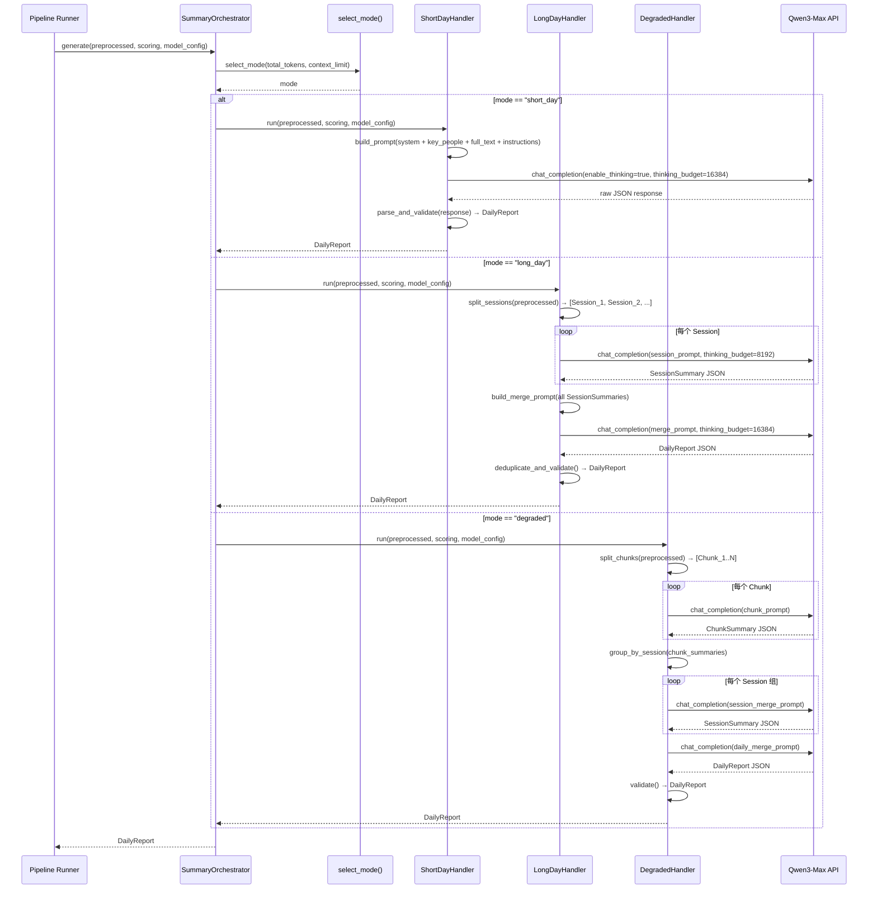
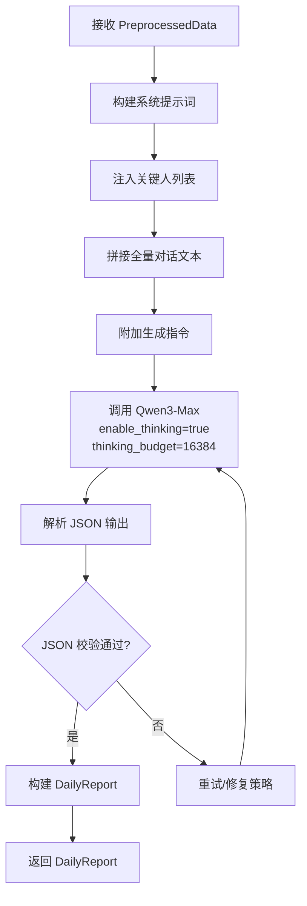
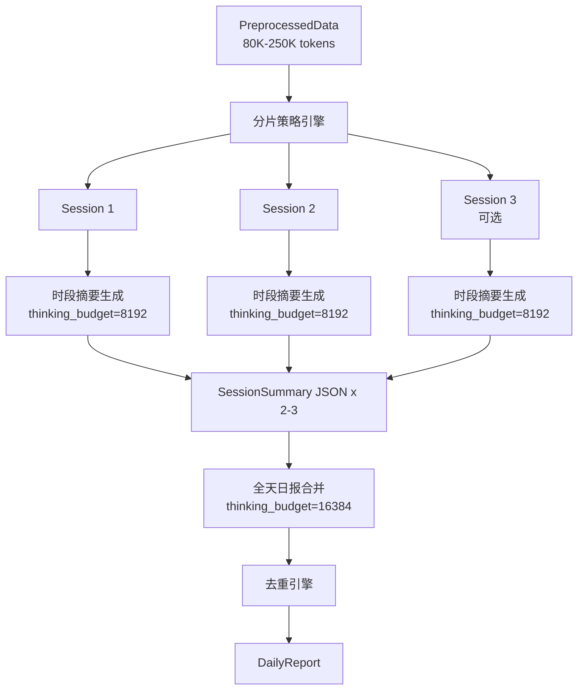
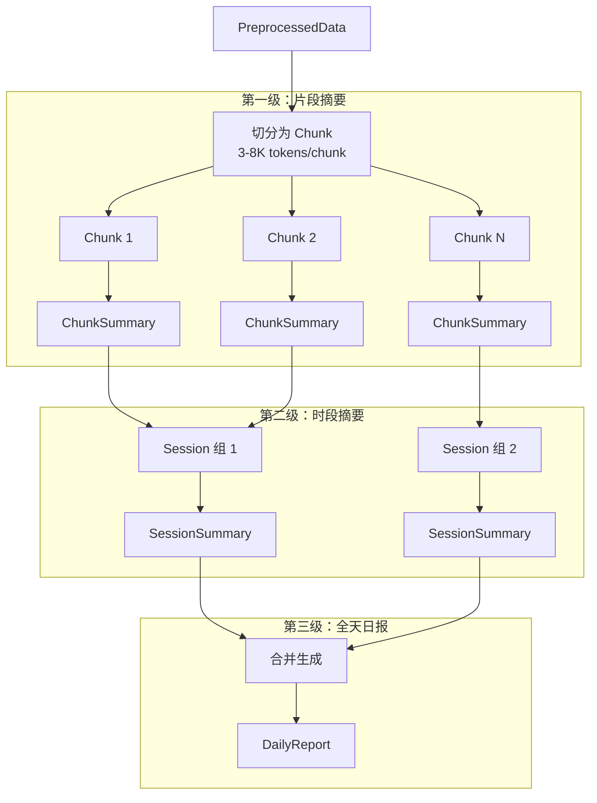
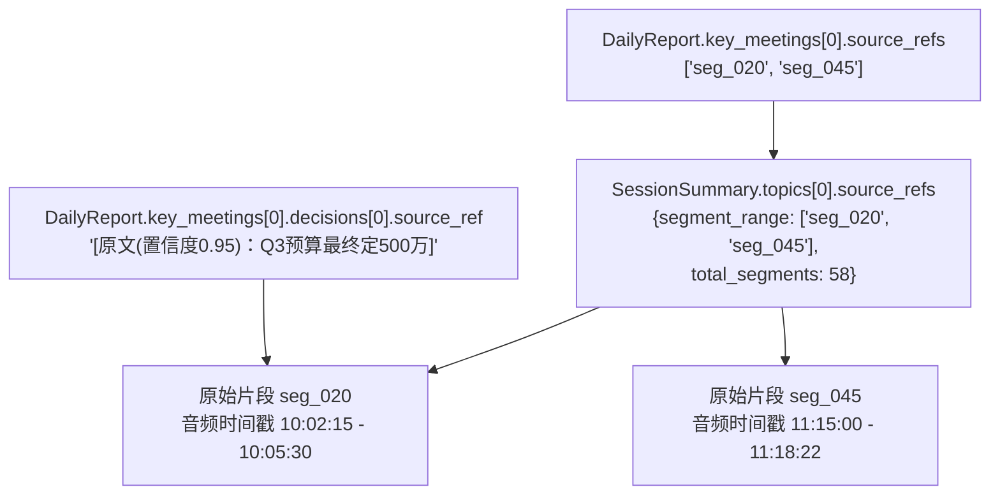

# 模块7：摘要生成器 详细设计

> 对应源码：`core/summarizer.py`、`models/summary.py`、`prompts/`
> 依据 PRD §5 多级摘要生成流程

<!-- FIXED: BLOCK-6 — 统一导入声明 -->
> **关键类型导入**（全模块统一）：
> ```python
> from models.types import ChatMessage, ChatCompletionResponse
> from core.model_client import ModelClient          # async 协议
> from core.token_budget import TokenBudgetController # 动态 token 预算
> from core.batch_client import BatchClient           # Batch API 客户端
> from core.retry_handler import RetryHandler         # 已内置于 ModelClient
> from exceptions import QwenExhaustedError
> ```

---

## 7.1 SummaryOrchestrator -- 核心调度器

### 7.1.1 职责概述

`SummaryOrchestrator` 是摘要生成层的唯一入口，负责：

1. 根据数据规模与模型能力选择处理模式（short_day / long_day / degraded）
2. 调度对应路径的生成流程
3. 统一输出为 `DailyReport` 对象

### 7.1.2 select_mode() 决策逻辑

```python
class SummaryOrchestrator:
    """摘要生成核心调度器。"""

    # <!-- FIXED: BLOCK-7 — 注入 TokenBudgetController 依赖 -->
    def __init__(
        self,
        model_client: ModelClient,
        config: SummaryConfig,
        token_budget_ctrl: TokenBudgetController,
        use_batch: bool = False,           # <!-- FIXED: 补充 Batch API 集成参数 -->
    ):
        self.model_client = model_client   # ModelClient 内部已包含 RetryHandler，摘要模块无需显式调用 <!-- FIXED: 明确 RetryHandler 集成方式 -->
        self.config = config
        self.token_budget_ctrl = token_budget_ctrl
        self.use_batch = use_batch
        self.batch_client: BatchClient | None = BatchClient(model_client) if use_batch else None
        self.short_day_handler = ShortDayHandler(model_client, config, token_budget_ctrl)
        self.long_day_handler = LongDayHandler(model_client, config, token_budget_ctrl)
        self.degraded_handler = DegradedHandler(model_client, config)

    def select_mode(
        self,
        total_tokens: int,
        model_context_limit: int,
    ) -> Literal["short_day", "long_day", "degraded"]:
        """
        三条件判定摘要路径。

        判定优先级：
          1. 模型能力不足 → degraded
          2. 数据量 < 80K → short_day
          3. 数据量 80K-250K → long_day
          4. 数据量 > 250K → degraded（超长回退）
        """
        if model_context_limit < 64_000:
            return "degraded"       # 小模型：三级架构
        if total_tokens < 80_000:
            return "short_day"      # ~90% 工作日
        if total_tokens <= 250_000:
            return "long_day"       # ~10% 高密度工作日
        return "degraded"           # 超长数据：回退三级

    async def generate(
        self,
        preprocessed: PreprocessedData,
        scoring_result: ScoringResult,
        model_config: ModelConfig,
    ) -> DailyReport:
        """统一入口：选路 → 调度 → 返回 DailyReport。"""
        total_tokens = preprocessed.total_token_count
        mode = self.select_mode(total_tokens, model_config.context_limit)

        # <!-- FIXED: 补充 Batch API 集成方案 -->
        if self.use_batch and self.batch_client is not None:
            return await self.batch_client.submit(
                mode=mode,
                preprocessed=preprocessed,
                scoring_result=scoring_result,
                model_config=model_config,
            )

        # <!-- FIXED: BLOCK-11 — 补充 QwenExhaustedError 处理 -->
        partial_results: list[SessionSummary] = []
        try:
            if mode == "short_day":
                result = await self.short_day_handler.run(
                    preprocessed, scoring_result, model_config
                )
            elif mode == "long_day":
                result = await self.long_day_handler.run(
                    preprocessed, scoring_result, model_config,
                    partial_results=partial_results,   # 收集已完成的时段结果
                )
            else:
                result = await self.degraded_handler.run(
                    preprocessed, scoring_result, model_config
                )
        except QwenExhaustedError as e:
            # 所有模型（主模型 + 降级模型）均已耗尽，推入人工队列
            logger.error(f"QwenExhaustedError in mode={mode}: {e}")
            return self._build_partial_report(partial_results, error=e)

        result.metadata.generation_mode = mode
        return result

    def _build_partial_report(
        self,
        partial_results: list[SessionSummary],
        error: QwenExhaustedError,
    ) -> DailyReport:
        """
        构建部分结果报告：将已完成的时段摘要合并为不完整日报，
        标记错误信息，并推入人工审核队列。
        """
        report = DailyReport(
            executive_summary="[自动生成中断] 部分时段摘要已完成，请人工补充。",
            key_meetings=[],
            action_items=[],
        )
        # 归集已完成时段的内容
        for session in partial_results:
            for topic in session.topics:
                report.key_meetings.append(
                    KeyMeeting.from_session_topic(session, topic)
                )
                report.action_items.extend(topic.action_items)
        report.metadata.generation_mode = "partial_failure"
        report.metadata.error_message = str(error)
        # 推入人工审核队列
        HumanReviewQueue.enqueue(report, reason="QwenExhaustedError")
        return report
```

**决策参数说明**

| 参数 | 来源 | 说明 |
|:---|:---|:---|
| `total_tokens` | `PreprocessedData.total_token_count` | 预处理后全量对话文本的 token 计数 |
| `model_context_limit` | `ModelConfig.context_limit` | 当前可用模型的上下文窗口大小 |

**阈值设计理据**

| 阈值 | 值 | 理由 |
|:---|:---|:---|
| 模型能力下限 | 64,000 | 低于此值无法在单次调用中容纳时段级数据+系统提示词+输出预留 |
| 短日/长日分界 | 80,000 | 为系统提示词(~2K) + 关键人(~500) + 输出预留(~32K) + 安全余量(~20K) 留出空间后，80K 有效内容恰好填满 262K 上下文 |
| 长日/降级分界 | 250,000 | 262K 上下文扣除系统开销后的理论上限 |

### 7.1.3 三条路径调度流程



### 7.1.4 输入/输出规格

**输入**

| 字段 | 类型 | 说明 |
|:---|:---|:---|
| `preprocessed` | `PreprocessedData` | 预处理后的时间-说话人-内容三元组序列，含会话边界、特征、元数据 |
| `scoring_result` | `ScoringResult` | 片段重要性评分，含 key_person_base_score + llm_score |
| `model_config` | `ModelConfig` | 模型名称、context_limit、API 端点、thinking 模式开关等 |

**输出**

| 字段 | 类型 | 说明 |
|:---|:---|:---|
| 返回值 | `DailyReport` | 统一格式日报对象（详见 7.5） |

---

## 7.2 短日模式实现

### 7.2.1 处理流程



### 7.2.2 输入构造：Prompt 拼接逻辑

```python
class ShortDayHandler:
    """短日模式：单次调用直出全天日报。"""

    # <!-- FIXED: BLOCK-7 — 去掉硬编码 TOKEN_BUDGET，改为通过 TokenBudgetController 动态分配 -->
    def __init__(
        self,
        model_client: ModelClient,
        config: SummaryConfig,
        token_budget_ctrl: TokenBudgetController,
    ):
        self.model_client = model_client
        self.config = config
        self.token_budget_ctrl = token_budget_ctrl

    async def run(
        self,
        preprocessed: PreprocessedData,
        scoring: ScoringResult,
        model_config: ModelConfig,
    ) -> DailyReport:
        # 动态获取 token 预算分配
        budget = self.token_budget_ctrl.allocate(
            total_tokens=preprocessed.total_token_count,
            mode="short_day",
        )
        # budget 返回: {"system_prompt": ..., "key_people": ..., "conversation": ...,
        #               "instructions": ..., "output_reserved": ..., "safety_margin": ...}

        # <!-- FIXED: BLOCK-6 — 使用 await + list[ChatMessage] 参数类型 -->
        messages = self._build_messages(preprocessed, scoring)
        response: ChatCompletionResponse = await self.model_client.chat_completion(
            model=model_config.model_name,
            messages=messages,
            enable_thinking=True,
            thinking_budget=16384,
        )
        return self._parse_response(response)

    # <!-- FIXED: BLOCK-6 — 返回类型改为 list[ChatMessage]，不再用 dict -->
    def _build_messages(
        self,
        preprocessed: PreprocessedData,
        scoring: ScoringResult,
    ) -> list[ChatMessage]:
        """构建 ChatMessage 列表。从 models/types.py 导入 ChatMessage。"""
        system_content = self._load_system_prompt("short_day_system.txt")
        user_content = self._assemble_user_content(preprocessed, scoring)
        return [
            ChatMessage(role="system", content=system_content),
            ChatMessage(role="user", content=user_content),
        ]

    def _assemble_user_content(
        self,
        preprocessed: PreprocessedData,
        scoring: ScoringResult,
    ) -> str:
        """
        拼接顺序（严格按序）：
          1. 关键人列表区段
          2. 全量对话文本区段
          3. 生成指令区段

        <!-- FIXED: 明确 scoring 在短日模式的使用方式 -->
        注意：短日模式下 scoring 不注入 prompt，仅用于后处理阶段：
        - key_meetings 按 FinalScore 降序排序
        - 不影响 prompt 内容构建
        """
        parts = [
            self._format_key_people_section(preprocessed.key_people),
            "---",
            self._format_conversation_section(preprocessed.utterances),
            "---",
            self._load_instruction_prompt("short_day_instructions.txt"),
        ]
        return "\n".join(parts)
```

    # <!-- FIXED: 明确 scoring 在短日模式的后处理使用方式 -->
    def _parse_response(self, response: ChatCompletionResponse) -> DailyReport:
        """解析响应并按 FinalScore 排序 key_meetings。"""
        report = self.parser.parse_daily_report(response)
        # 后处理：key_meetings 按评分的 FinalScore 降序排序
        report.key_meetings.sort(
            key=lambda m: self._get_max_score(m), reverse=True
        )
        return report
```

**拼接区段详解**

| 序号 | 区段 | 内容要素 | Token 预算 |
|:---|:---|:---|:---|
| 1 | 系统提示词（system role） | 角色定义 + 输出格式约束 + 反幻觉规则 + 校验清单 | 1,500-2,000 |
| 2 | 关键人列表（user 最前端） | 姓名、职务、关注领域、优先级标记 | 200-500 |
| 3 | 全量对话文本 | `[HH:MM:SS] 说话人: 内容` 按时间顺序排列 | ≤ 75,000 |
| 4 | 生成指令（user 末尾） | 输出 JSON 结构要求 + 直通通道规则 + 校验约束 | 200-300 |

### 7.2.3 思考模式调用参数

<!-- FIXED: BLOCK-6 — messages 在代码中为 list[ChatMessage]，此处展示序列化后的 API 请求体 -->
```python
# API 请求体（ChatMessage 序列化后的等效 JSON）
{
    "model": "qwen3-max",
    "enable_thinking": True,
    "thinking_budget": 16384,       # 16K tokens 推理空间（PRD 统一为 16,384） <!-- FIXED: thinking_budget 统一为 16,384 -->
    "messages": [
        {"role": "system", "content": "<系统提示词>"},
        {"role": "user",   "content": "<关键人列表>\n---\n<全量对话文本>\n---\n<生成指令>"},
    ],
}
```

| 参数 | 值 | 设计理由 |
|:---|:---|:---|
| `enable_thinking` | `true` | 启用内部推理链，提升主题聚类与去重质量 |
| `thinking_budget` | `16384` | 全天级推理需完成主题识别、跨时段关联、去重判断、排序等复杂任务，需要充足空间 |

### 7.2.4 关键事实直通通道 Prompt 设计

直通通道通过提示词中的显式指令实现，确保三类高价值信息不被压缩或改写：

```
【关键事实直通规则】
对于以下三类信息，你必须保留原始表述，不得改写或概括：

1. 决策（Decision）：含"决定""确认""批准""通过"等动词 + 具体对象
   → 输出格式：原文引用，附时间戳与决策人
   → 示例：{"content": "...", "decision_maker": "张三",
            "source_ref": "[原文(置信度0.95)：'Q3预算最终定500万']"}

2. 行动项（Action Item）：含责任人 + 任务描述 + 截止时间/优先级
   → 输出格式：结构化提取，保留原始表述
   → 示例：{"task": "...", "owner": "李四", "deadline": "本周五"}

3. 关键数据（Key Data）：数字、金额、百分比、日期等量化信息
   → 输出格式：原文引用，标注 ASR 置信度
   → 示例：[原文(置信度0.92)：'成本降低了15%']

引用标注格式：[原文(置信度X.XX)：'原始文本']
当 ASR 置信度 < 0.70 时，使用：[ASR识别不清晰，内容待确认：'原始文本']
```

### 7.2.5 JSON 输出解析与校验

```python
class ResponseParser:
    """解析并校验 LLM 输出的 JSON。"""

    MAX_RETRIES = 2

    # <!-- FIXED: BLOCK-6 — 入参改为 ChatCompletionResponse 对象，从 .content 提取 JSON -->
    def parse_daily_report(self, response: ChatCompletionResponse) -> DailyReport:
        """
        解析流程：
          1. 从 ChatCompletionResponse.content 提取原始文本
          2. 提取 JSON（处理 markdown 代码块包裹等情况）
          3. 结构校验（必填字段检查）
          4. 业务校验（交叉一致性）
          5. 构建 DailyReport 对象
        """
        raw_text = response.content      # 从响应对象提取文本
        json_str = self._extract_json(raw_text)
        data = json.loads(json_str)
        self._validate_structure(data)
        self._validate_business_rules(data)
        return DailyReport.from_dict(data)

    def parse_session_summary(self, response: ChatCompletionResponse) -> SessionSummary:
        """解析时段摘要响应。"""
        raw_text = response.content
        json_str = self._extract_json(raw_text)
        data = json.loads(json_str)
        return SessionSummary.from_dict(data)

    def parse_chunk_summary(self, response: ChatCompletionResponse) -> ChunkSummary:
        """解析片段摘要响应。"""
        raw_text = response.content
        json_str = self._extract_json(raw_text)
        data = json.loads(json_str)
        return ChunkSummary.from_dict(data)

    def _extract_json(self, raw: str) -> str:
        """处理 LLM 输出可能的包裹格式（```json ... ```）。"""
        # 尝试匹配 markdown 代码块
        match = re.search(r"```(?:json)?\s*\n?(.*?)\n?```", raw, re.DOTALL)
        if match:
            return match.group(1).strip()
        # 尝试直接解析整体
        return raw.strip()

    def _validate_structure(self, data: dict) -> None:
        """必填字段校验。"""
        required_fields = ["executive_summary", "key_meetings", "action_items"]
        for field in required_fields:
            if field not in data:
                raise ValidationError(f"缺少必填字段: {field}")

        for meeting in data.get("key_meetings", []):
            if "title" not in meeting or "decisions" not in meeting:
                raise ValidationError("key_meetings 条目缺少 title 或 decisions")

        for item in data.get("action_items", []):
            if "owner" not in item or "task" not in item:
                raise ValidationError("action_item 缺少 owner 或 task")

    def _validate_business_rules(self, data: dict) -> None:
        """业务规则校验。"""
        # 校验 executive_summary 长度（不超过 100 字）
        summary = data.get("executive_summary", "")
        if len(summary) > 150:  # 预留 50% 容差
            logger.warning(f"executive_summary 超长: {len(summary)} 字")

        # 校验 decision 必须含 source_ref
        for meeting in data.get("key_meetings", []):
            for decision in meeting.get("decisions", []):
                if "source_ref" not in decision:
                    raise ValidationError(
                        f"decision 缺少 source_ref: {decision.get('content', '')[:30]}"
                    )
```

---

## 7.3 长日模式实现

### 7.3.1 整体流程



### 7.3.2 分片策略

分片由 `SessionSplitter` 负责，按优先级递减应用三条策略：

```python
class SessionSplitter:
    """将全天对话按时段切分为 2-3 个 session。"""

    MAX_SESSION_TOKENS = 80_000
    SILENCE_THRESHOLD_MINUTES = 30

    def split(self, preprocessed: PreprocessedData) -> list[Session]:
        """
        分片策略优先级：
          1. 自然间断优先：≥30 分钟静默间隔
          2. 时段均衡兜底：上午/下午/晚间
          3. 主题完整性约束：不在主题中间切分
        """
        # 第一步：检测自然间断点
        split_points = self._find_natural_breaks(preprocessed.utterances)

        if self._is_valid_split(split_points, preprocessed):
            return self._apply_split(preprocessed, split_points)

        # 第二步：按时段均衡切分
        split_points = self._time_period_split(preprocessed.utterances)

        # 第三步：回退至最近的话题切换点（主题完整性约束）
        split_points = self._adjust_for_topic_integrity(
            split_points, preprocessed.utterances
        )

        return self._apply_split(preprocessed, split_points)

    def _find_natural_breaks(
        self, utterances: list[Utterance]
    ) -> list[int]:
        """查找 ≥30 分钟的静默间隔作为候选切分点。"""
        breaks = []
        for i in range(1, len(utterances)):
            gap = utterances[i].start_time - utterances[i - 1].end_time
            if gap.total_seconds() >= self.SILENCE_THRESHOLD_MINUTES * 60:
                breaks.append(i)
        return breaks

    def _time_period_split(
        self, utterances: list[Utterance]
    ) -> list[int]:
        """按上午(~12:00)/下午(~18:00)/晚间划分。"""
        boundaries = [time(12, 0), time(18, 0)]
        split_points = []
        for boundary in boundaries:
            idx = self._find_nearest_utterance(utterances, boundary)
            if idx is not None:
                split_points.append(idx)
        return split_points

    def _adjust_for_topic_integrity(
        self,
        split_points: list[int],
        utterances: list[Utterance],
    ) -> list[int]:
        """
        确保切分点不落在同一讨论主题中间。
        向前回退至最近的话题切换点（speaker 变化 + 间隔 > 3min）。
        """
        adjusted = []
        for point in split_points:
            adjusted_point = self._retreat_to_topic_boundary(
                point, utterances
            )
            adjusted.append(adjusted_point)
        return adjusted
```

**分片策略决策表**

| 优先级 | 策略 | 切分依据 | 回退条件 |
|:---|:---|:---|:---|
| 1 | 自然间断优先 | ≥30 分钟静默间隔 | 无足够间断点，或切分后某片 > 80K tokens |
| 2 | 时段均衡兜底 | 12:00 / 18:00 时间边界 | 某时段无数据 |
| 3 | 主题完整性约束 | 说话人切换 + 间隔 > 3 分钟 | 作用于前两步的切分点进行微调 |

### 7.3.3 第一级：时段摘要生成

```python
class LongDayHandler:
    """长日模式：两级弹性摘要。"""

    def __init__(
        self,
        model_client: ModelClient,
        config: SummaryConfig,
        token_budget_ctrl: TokenBudgetController,
    ):
        self.model_client = model_client
        self.config = config
        self.token_budget_ctrl = token_budget_ctrl
        self.splitter = SessionSplitter()
        self.parser = ResponseParser()
        self.deduplicator = Deduplicator()

    async def run(
        self,
        preprocessed: PreprocessedData,
        scoring: ScoringResult,
        model_config: ModelConfig,
        partial_results: list[SessionSummary] | None = None,
    ) -> DailyReport:
        # 第一步：分片
        sessions = self.splitter.split(preprocessed)

        # <!-- FIXED: BLOCK-7 — 通过 TokenBudgetController 获取动态预算 -->
        budget = self.token_budget_ctrl.allocate(
            total_tokens=preprocessed.total_token_count,
            mode="long_day",
        )

        # <!-- FIXED: BLOCK-11 — 单个时段摘要失败时跳过该时段并标记，不中断整个流程 -->
        # 第二步：逐时段生成摘要，单个失败不中断
        session_summaries: list[SessionSummary] = []
        skipped_sessions: list[dict] = []
        for session in sessions:
            try:
                summary = await self._generate_session_summary(
                    session, scoring, model_config
                )
                session_summaries.append(summary)
                if partial_results is not None:
                    partial_results.append(summary)  # 供外层异常处理收集
            except QwenExhaustedError as e:
                logger.warning(
                    f"时段 {session.session_id} 摘要生成失败，跳过: {e}"
                )
                skipped_sessions.append({
                    "session_id": session.session_id,
                    "error": str(e),
                })
                continue

        if not session_summaries:
            raise QwenExhaustedError("所有时段摘要均失败")

        # 第三步：合并生成全天日报
        report = await self._merge_to_daily_report(
            session_summaries, scoring, model_config
        )
        # 标记跳过的时段
        if skipped_sessions:
            report.metadata.skipped_sessions = skipped_sessions
        return report

    async def _generate_session_summary(
        self,
        session: Session,
        scoring: ScoringResult,
        model_config: ModelConfig,
    ) -> SessionSummary:
        # <!-- FIXED: BLOCK-6 — messages 使用 list[ChatMessage] -->
        messages: list[ChatMessage] = self._build_session_messages(session, scoring)
        # <!-- FIXED: BLOCK-6 — await async chat_completion，返回 ChatCompletionResponse -->
        response: ChatCompletionResponse = await self.model_client.chat_completion(
            model=model_config.model_name,
            messages=messages,
            enable_thinking=True,
            thinking_budget=8192,     # 时段级推理复杂度较低
        )
        return self.parser.parse_session_summary(response)
```

**时段摘要输出 JSON 结构**

```json
{
  "session_id": "session_morning",
  "time_range": "09:00-12:30",
  "session_theme": "产品评审与Q3预算",
  "participants": ["张三(产品总监)", "李四(财务)", "王五(研发)"],
  "topics": [
    {
      "topic_id": "topic_001",
      "title": "Q3预算分配方案",
      "duration_minutes": 45,
      "discussion_flow": "背景 -> 方案对比 -> 争议点 -> 最终决策",
      "key_points": ["要点1", "要点2"],
      "decisions": [
        {
          "content": "Q3研发预算确定为500万",
          "decision_maker": "张三",
          "source_ref": "[原文(置信度0.95)：'Q3预算最终定500万']",
          "timestamp": "10:32"
        }
      ],
      "action_items": [
        {
          "task": "输出Q3预算明细表",
          "owner": "李四",
          "deadline": "本周五",
          "priority": "high",
          "source_ref": "seg_042"
        }
      ],
      "status": "concluded"
    }
  ],
  "pending_topics": [
    {
      "topic_id": "topic_002",
      "reason": "参会者对优先级未达成一致",
      "next_step": "张三整理各方意见后重新组织讨论"
    }
  ],
  "critical_facts": [
    {
      "type": "key_data",
      "content": "Q3预算500万",
      "source_ref": "[原文(置信度0.95)：'Q3预算最终定500万']"
    }
  ],
  "source_refs": {
    "segment_range": ["seg_001", "seg_058"],
    "total_segments": 58
  }
}
```

**字段职责一览**

| 字段 | 类型 | 说明 | 下游用途 |
|:---|:---|:---|:---|
| `topic_id` | `str` | 格式 `topic_XXX`，时段内唯一 | 跨时段关联、输出溯源 |
| `pending_topics` | `list[PendingTopic]` | 未决议题，含原因与下一步 | 合并阶段归集至扩展层 |
| `critical_facts` | `list[CriticalFact]` | 直通内容，不经压缩 | 合并阶段原样传递至最终日报 |
| `source_refs` | `SourceRefRange` | 本时段覆盖的原始片段范围 | 溯源链构建 |
| `status` | `enum` | `concluded` / `pending` / `ongoing` | 驱动扩展层 pending_topics 生成 |

### 7.3.4 第二级：全天日报合并

```python
    async def _merge_to_daily_report(
        self,
        session_summaries: list[SessionSummary],
        scoring: ScoringResult,
        model_config: ModelConfig,
    ) -> DailyReport:
        # 预处理：跨时段 topic_id 关联
        topic_map = self._build_topic_map(session_summaries)

        # 预处理：归集 critical_facts
        all_critical_facts = self._collect_critical_facts(session_summaries)

        # 构建合并 prompt
        # <!-- FIXED: BLOCK-6 — messages 使用 list[ChatMessage] -->
        messages: list[ChatMessage] = self._build_merge_messages(
            session_summaries, topic_map, all_critical_facts
        )

        # <!-- FIXED: BLOCK-6 — await async chat_completion，返回 ChatCompletionResponse -->
        response: ChatCompletionResponse = await self.model_client.chat_completion(
            model=model_config.model_name,
            messages=messages,
            enable_thinking=True,
            thinking_budget=16384,    # 全天级合并需要充足推理空间
        )

        report = self.parser.parse_daily_report(response)

        # 后处理：去重
        report = self.deduplicator.deduplicate(report)

        return report
```

<!-- FIXED: 明确长日模式中 scoring 的消费方式 -->
> **长日模式 scoring 使用方式**：scoring 结果用于时段内内容排序（高分片段优先出现在 prompt 中）和 key_meetings 优先级排定（按 FinalScore 降序）。不用于内容裁剪。

#### topic_id 跨时段关联实现

```python
class TopicLinker:
    """跨时段 topic_id 关联引擎。"""

    SIMILARITY_THRESHOLD = 0.90

    def build_topic_map(
        self, session_summaries: list[SessionSummary]
    ) -> dict[str, list[str]]:
        """
        构建 topic_id 关联映射。
        返回: {canonical_topic_id: [related_topic_ids]}

        关联策略:
          1. topic_id 完全匹配（同一 topic 跨时段出现）
          2. 主题标题语义相似度 >= 0.90
          3. 参与人重合度 >= 60%
        """
        all_topics = self._extract_all_topics(session_summaries)
        topic_map: dict[str, list[str]] = {}

        for i, topic_a in enumerate(all_topics):
            for topic_b in all_topics[i + 1:]:
                if self._should_link(topic_a, topic_b):
                    canonical = topic_a.topic_id
                    topic_map.setdefault(canonical, [canonical])
                    topic_map[canonical].append(topic_b.topic_id)

        return topic_map

    def _should_link(self, a: TopicInfo, b: TopicInfo) -> bool:
        """判断两个 topic 是否为同一议题。"""
        # 相同 topic_id 直接关联
        if a.topic_id == b.topic_id:
            return True

        # 标题语义相似度
        similarity = self.embedding_model.cosine_similarity(a.title, b.title)
        if similarity < self.SIMILARITY_THRESHOLD:
            return False

        # 参与人重合度辅助验证
        participant_overlap = self._participant_overlap_ratio(a, b)
        return participant_overlap >= 0.6
```

#### 去重逻辑

```python
class Deduplicator:
    """语义相似度 + 实体级校验双重去重。"""

    SEMANTIC_THRESHOLD = 0.91       # 0.90-0.92 区间中值
    ENTITY_OVERLAP_THRESHOLD = 0.80

    def deduplicate(self, report: DailyReport) -> DailyReport:
        """对 DailyReport 中的信息项执行去重。"""
        report.action_items = self._dedup_action_items(report.action_items)
        for meeting in report.key_meetings:
            meeting.decisions = self._dedup_decisions(meeting.decisions)
        return report

    def _dedup_action_items(
        self, items: list[ActionItem]
    ) -> list[ActionItem]:
        """
        行动项去重：责任人相同 + 任务相似度 >= 0.90。
        合并后保留最完整版本（含最明确的截止日期与优先级）。
        """
        unique: list[ActionItem] = []
        for item in items:
            duplicate_idx = self._find_duplicate_action(item, unique)
            if duplicate_idx is not None:
                unique[duplicate_idx] = self._merge_actions(
                    unique[duplicate_idx], item
                )
            else:
                unique.append(item)
        return unique

    def _is_semantic_duplicate(self, text_a: str, text_b: str) -> bool:
        """语义相似度判定。"""
        similarity = self.embedding_model.cosine_similarity(text_a, text_b)
        return similarity >= self.SEMANTIC_THRESHOLD

    def _is_entity_match(self, text_a: str, text_b: str) -> bool:
        """实体级校验：核心实体（人名、数字、日期）重合率 >= 80%。"""
        entities_a = self.ner_extractor.extract(text_a)
        entities_b = self.ner_extractor.extract(text_b)
        if not entities_a and not entities_b:
            return True
        overlap = len(entities_a & entities_b)
        total = max(len(entities_a), len(entities_b))
        return (overlap / total) >= self.ENTITY_OVERLAP_THRESHOLD if total > 0 else True
```

**去重策略汇总**

| 维度 | 方法 | 阈值 | 向量模型 |
|:---|:---|:---|:---|
| 语义相似度 | 句向量余弦相似度 | 0.90-0.92 | text2vec-base-chinese 或 m3e-large |
| 实体级校验 | NER 提取 + 实体集合重合率 | 核心实体重合 ≥ 80% | -- |
| 行动项去重 | 责任人匹配 + 任务相似度 | 责任人相同 + 相似度 ≥ 0.90 | 同上 |

#### critical_facts 归集

```python
    def _collect_critical_facts(
        self, session_summaries: list[SessionSummary]
    ) -> list[CriticalFact]:
        """
        从各时段摘要中归集 critical_facts。
        直通内容不经压缩，按时间顺序排列后注入合并 prompt。
        """
        all_facts: list[CriticalFact] = []
        for session in session_summaries:
            for fact in session.critical_facts:
                fact.source_session = session.session_id
                all_facts.append(fact)

        # 去重：相同 source_ref 视为同一事实
        return self._dedup_facts(all_facts)
```

---

## 7.4 降级模式实现

### 7.4.1 三级串联流程



### 7.4.2 实现伪代码

```python
class DegradedHandler:
    """降级模式：三级渐进压缩架构。"""

    CHUNK_TOKEN_LIMIT = 8_000       # 单片段 token 上限
    SESSION_TOKEN_LIMIT = 24_000    # 时段合并 token 上限
    DAILY_TOKEN_LIMIT = 24_000      # 全天合并 token 上限

    async def run(
        self,
        preprocessed: PreprocessedData,
        scoring: ScoringResult,
        model_config: ModelConfig,
    ) -> DailyReport:
        # ---- 第一级：片段摘要 ----
        chunks = self._split_to_chunks(preprocessed)
        chunk_summaries = await asyncio.gather(
            *[self._summarize_chunk(chunk, model_config) for chunk in chunks]
        )

        # ---- 第二级：时段摘要 ----
        session_groups = self._group_chunks_by_session(chunk_summaries)
        session_summaries = await asyncio.gather(
            *[
                self._merge_session(group, model_config)
                for group in session_groups
            ]
        )

        # ---- 第三级：全天日报 ----
        report = await self._merge_daily(session_summaries, model_config)
        return report

    async def _summarize_chunk(
        self,
        chunk: Chunk,
        model_config: ModelConfig,
    ) -> ChunkSummary:
        """片段级摘要。不启用思考模式（小模型不支持或效果不佳）。"""
        # <!-- FIXED: BLOCK-6 — messages 使用 list[ChatMessage]，response 为 ChatCompletionResponse -->
        messages: list[ChatMessage] = self._build_chunk_messages(chunk)
        response: ChatCompletionResponse = await self.model_client.chat_completion(
            model=model_config.model_name,
            messages=messages,
            enable_thinking=False,
        )
        return self.parser.parse_chunk_summary(response)

    async def _merge_session(
        self,
        chunk_summaries: list[ChunkSummary],
        model_config: ModelConfig,
    ) -> SessionSummary:
        """将同一时段的片段摘要合并为时段摘要（同 5.2.2 格式）。"""
        messages: list[ChatMessage] = self._build_session_merge_messages(chunk_summaries)
        response: ChatCompletionResponse = await self.model_client.chat_completion(
            model=model_config.model_name,
            messages=messages,
            enable_thinking=False,
        )
        return self.parser.parse_session_summary(response)

    async def _merge_daily(
        self,
        session_summaries: list[SessionSummary],
        model_config: ModelConfig,
    ) -> DailyReport:
        """将各时段摘要合并为全天日报（同 5.4 格式）。"""
        messages: list[ChatMessage] = self._build_daily_merge_messages(session_summaries)
        response: ChatCompletionResponse = await self.model_client.chat_completion(
            model=model_config.model_name,
            messages=messages,
            enable_thinking=False,
        )
        return self.parser.parse_daily_report(response)
```

**降级模式各级 Token 预算**

| 级别 | 输入上限 | 输出上限 | thinking |
|:---|:---|:---|:---|
| 第一级：片段摘要 | 3-8K tokens（单片段） | ≤ 12K | 不启用 |
| 第二级：时段摘要 | 同一时段的片段摘要集合 | ≤ 24K | 不启用 |
| 第三级：全天日报 | 各时段摘要集合 | ≤ 24K | 不启用 |

**片段级摘要输出结构**

```json
{
  "chunk_id": "chunk_012",
  "summary": "200字内核心摘要",
  "key_points": ["要点1", "要点2", "要点3"],
  "action_items": [
    {"task": "任务描述", "owner": "责任人", "deadline": "截止日期", "priority": "high"}
  ],
  "key_people_involved": ["张三", "李四"],
  "importance_score": 85,
  "importance_rationale": "P0级关键人参与，涉及战略决策",
  "source_refs": ["seg_001", "seg_002"]
}
```

---

## 7.5 输出模型（models/summary.py）

### 7.5.1 DailyReport 数据类

```python
@dataclass
class DailyReport:
    """
    全天日报统一输出模型。
    无论 short_day / long_day / degraded 模式，最终均输出此结构。
    分为核心层（必生成）+ 扩展层（可选）。
    """

    # ========== 核心层（必生成） ==========
    executive_summary: str
    """执行摘要，3-5 句话概述全天核心结论，50-100 字。"""

    key_meetings: list["KeyMeeting"]
    """关键会议/讨论回顾，按重要性排序，3-5 个，各 200-300 字。"""

    action_items: list["ActionItem"]
    """行动事项总表，按责任人组织。"""

    # ========== 扩展层（可选） ==========
    pending_topics: list["PendingTopic"] | None = None
    """悬置议题列表。存在 status=pending 的议题时生成。"""

    follow_up: list["FollowUp"] | None = None
    """跟进建议。存在行动项或悬置议题时生成。"""

    tomorrow_known_schedule: list["ScheduleItem"] | None = None
    """明日已知安排。仅基于对话中明确提及的时间承诺，不做推断。"""

    # ========== 元数据 ==========
    metadata: "ReportMetadata" = field(default_factory=ReportMetadata)

    # ========== 阅读视图生成 ==========
    def to_30s_view(self) -> str:
        """30 秒速览版：~100 字。"""
        return self._truncate(self.executive_summary, max_chars=100)

    def to_3min_view(self) -> str:
        """3 分钟标准版：500-800 字。"""
        parts = [self.executive_summary]
        for meeting in self.key_meetings:
            parts.append(f"## {meeting.title}")
            for d in meeting.decisions:
                parts.append(f"  - 决策: {d.content}")
        parts.append("## 行动事项")
        for item in self.action_items:
            parts.append(f"  - [{item.priority}] {item.owner}: {item.task}")
        return "\n".join(parts)

    def to_full_view(self) -> str:
        """完整存档版：1,500-3,000 字，含全部核心层 + 扩展层 + 溯源引用。"""
        parts = [self.to_3min_view()]
        if self.pending_topics:
            parts.append("## 悬置议题")
            for pt in self.pending_topics:
                parts.append(f"  - {pt.title}: {pt.reason}")
        if self.follow_up:
            parts.append("## 跟进建议")
            for fu in self.follow_up:
                parts.append(f"  - {fu.suggestion}")
        if self.tomorrow_known_schedule:
            parts.append("## 明日已知安排")
            for s in self.tomorrow_known_schedule:
                parts.append(f"  - {s.time}: {s.description}")
        return "\n".join(parts)

    @classmethod
    def from_dict(cls, data: dict) -> "DailyReport":
        """从 JSON dict 构建 DailyReport 实例。"""
        return cls(
            executive_summary=data["executive_summary"],
            key_meetings=[KeyMeeting.from_dict(m) for m in data["key_meetings"]],
            action_items=[ActionItem.from_dict(a) for a in data["action_items"]],
            pending_topics=(
                [PendingTopic.from_dict(p) for p in data["pending_topics"]]
                if data.get("pending_topics") else None
            ),
            follow_up=(
                [FollowUp.from_dict(f) for f in data["follow_up"]]
                if data.get("follow_up") else None
            ),
            tomorrow_known_schedule=(
                [ScheduleItem.from_dict(s) for s in data["tomorrow_known_schedule"]]
                if data.get("tomorrow_known_schedule") else None
            ),
        )
```

### 7.5.2 子结构定义

```python
@dataclass
class KeyMeeting:
    """关键会议/讨论条目。"""
    title: str
    time_range: str                         # "10:00-11:30"
    participants: list[str]
    summary: str                            # 200-300 字
    decisions: list["Decision"]
    topic_ids: list[str]                    # 关联的 topic_id 列表
    source_refs: list[str]                  # ["seg_020", "seg_045"]

    @classmethod
    def from_dict(cls, data: dict) -> "KeyMeeting":
        return cls(
            title=data["title"],
            time_range=data.get("time_range", ""),
            participants=data.get("participants", []),
            summary=data.get("summary", ""),
            decisions=[Decision.from_dict(d) for d in data.get("decisions", [])],
            topic_ids=data.get("topic_ids", []),
            source_refs=data.get("source_refs", []),
        )


@dataclass
class Decision:
    """决策记录。"""
    content: str                            # 决策内容
    decision_maker: str                     # 决策人
    source_ref: str                         # "[原文(置信度0.95)：'...']"
    timestamp: str | None = None            # "10:32"

    @classmethod
    def from_dict(cls, data: dict) -> "Decision":
        return cls(
            content=data["content"],
            decision_maker=data["decision_maker"],
            source_ref=data["source_ref"],
            timestamp=data.get("timestamp"),
        )


@dataclass
class ActionItem:
    """行动事项。"""
    task: str                               # 任务描述
    owner: str                              # 责任人
    deadline: str | None = None             # 截止日期
    priority: str = "medium"                # high / medium / low
    source_ref: str | None = None           # 溯源引用

    @classmethod
    def from_dict(cls, data: dict) -> "ActionItem":
        return cls(
            task=data["task"],
            owner=data["owner"],
            deadline=data.get("deadline"),
            priority=data.get("priority", "medium"),
            source_ref=data.get("source_ref"),
        )


@dataclass
class PendingTopic:
    """悬置议题。"""
    topic_id: str
    title: str
    reason: str                             # 未决原因
    next_step: str                          # 建议下一步

    @classmethod
    def from_dict(cls, data: dict) -> "PendingTopic":
        return cls(
            topic_id=data.get("topic_id", ""),
            title=data.get("title", ""),
            reason=data["reason"],
            next_step=data["next_step"],
        )


@dataclass
class FollowUp:
    """跟进建议。"""
    suggestion: str
    related_action_ids: list[str] = field(default_factory=list)
    related_topic_ids: list[str] = field(default_factory=list)

    @classmethod
    def from_dict(cls, data: dict) -> "FollowUp":
        return cls(
            suggestion=data["suggestion"],
            related_action_ids=data.get("related_action_ids", []),
            related_topic_ids=data.get("related_topic_ids", []),
        )


@dataclass
class ScheduleItem:
    """明日已知安排（仅基于对话中明确提及的时间承诺）。"""
    time: str                               # "14:00"
    description: str
    source_ref: str | None = None           # 溯源至原始对话

    @classmethod
    def from_dict(cls, data: dict) -> "ScheduleItem":
        return cls(
            time=data["time"],
            description=data["description"],
            source_ref=data.get("source_ref"),
        )


@dataclass
class CriticalFact:
    """关键事实直通内容。"""
    type: str                               # "decision" / "action_item" / "key_data"
    content: str
    source_ref: str
    source_session: str | None = None       # 来源时段 session_id


@dataclass
class ReportMetadata:
    """日报元数据。"""
    generation_mode: str = ""               # "short_day" / "long_day" / "degraded" / "partial_failure"
    report_date: str = ""                   # "2026-03-27"
    total_tokens_processed: int = 0
    api_calls_count: int = 0
    generation_time_seconds: float = 0.0
    model_name: str = ""
    error_message: str | None = None        # <!-- FIXED: BLOCK-11 — 记录 QwenExhaustedError 信息 -->
    skipped_sessions: list[dict] | None = None  # <!-- FIXED: BLOCK-11 — 记录跳过的时段 -->
```

### 7.5.3 三级阅读体验生成方法

| 视图 | 方法 | 内容来源 | 目标长度 | 实现方式 |
|:---|:---|:---|:---|:---|
| 30 秒速览版 | `to_30s_view()` | `executive_summary` 截取 | ~100 字 | 字符截断 + 句末对齐 |
| 3 分钟标准版 | `to_3min_view()` | executive_summary + key_meetings 标题与决策 + action_items | 500-800 字 | 字段拼接模板 |
| 完整存档版 | `to_full_view()` | 全部核心层 + 扩展层 + 溯源引用 | 1,500-3,000 字 | 全字段渲染 |

> 30 秒速览版不额外调用 API，由 `to_30s_view()` 对 `executive_summary` 进行规则截取实现。

### 7.5.4 溯源链（source_refs）数据结构



**溯源链层级关系**

| 层级 | source_refs 类型 | 内容 | 指向 |
|:---|:---|:---|:---|
| DailyReport.key_meetings | `list[str]` | 片段 ID 列表 | SessionSummary / 原始片段 |
| DailyReport.decisions | `str` | 含 ASR 置信度的原文引用 | 原始对话片段 |
| DailyReport.action_items | `str` | 片段 ID | 原始对话片段 |
| SessionSummary.source_refs | `SourceRefRange` | segment_range + total_segments | 原始片段范围 |
| ChunkSummary.source_refs | `list[str]` | 片段 ID 列表 | 原始对话片段 |

```python
@dataclass
class SourceRefRange:
    """时段级溯源范围。"""
    segment_range: tuple[str, str]          # ("seg_001", "seg_058") 起止片段
    total_segments: int                     # 覆盖片段总数

    def contains(self, seg_id: str) -> bool:
        """判断某片段 ID 是否在本范围内。"""
        start_num = int(self.segment_range[0].split("_")[1])
        end_num = int(self.segment_range[1].split("_")[1])
        target_num = int(seg_id.split("_")[1])
        return start_num <= target_num <= end_num
```

---

## 7.6 提示词模板（prompts/）

### 7.6.1 模板文件组织

```
prompts/
  short_day_system.txt          # 短日模式系统提示词
  short_day_instructions.txt    # 短日模式生成指令
  long_day_session_system.txt   # 长日模式-时段摘要系统提示词
  long_day_session_instructions.txt  # 长日模式-时段摘要生成指令
  long_day_merge_system.txt     # 长日模式-合并系统提示词
  long_day_merge_instructions.txt    # 长日模式-合并生成指令
  degraded_chunk_system.txt     # 降级模式-片段摘要系统提示词
  degraded_session_system.txt   # 降级模式-时段合并系统提示词
  degraded_daily_system.txt     # 降级模式-全天合并系统提示词
  _partials/
    role_definition.txt         # 共享：角色定义
    anti_hallucination.txt      # 共享：反幻觉规则
    output_format.txt           # 共享：输出格式约束
    critical_fact_rules.txt     # 共享：关键事实直通规则
    validation_checklist.txt    # 共享：校验清单
```

### 7.6.2 各模板核心结构

#### short_day_system.txt

```
{role_definition}

【输出格式】
{output_format_daily_report}

【反幻觉规则】
{anti_hallucination_rules}

【关键事实直通规则】
{critical_fact_rules}

【输出校验清单】
{validation_checklist}
```

**关键占位符**

| 占位符 | 来源 | 说明 |
|:---|:---|:---|
| `{role_definition}` | `_partials/role_definition.txt` | 系统角色定义 |
| `{output_format_daily_report}` | `_partials/output_format.txt` | JSON 输出结构约束 |
| `{anti_hallucination_rules}` | `_partials/anti_hallucination.txt` | 反幻觉三条规则 |
| `{critical_fact_rules}` | `_partials/critical_fact_rules.txt` | 决策/行动项/关键数据直通规则 |
| `{validation_checklist}` | `_partials/validation_checklist.txt` | 输出前逐项检查清单 |

#### short_day_instructions.txt（用户消息末尾）

```
请基于以上对话记录，生成结构化全天日报。

要求：
1. 输出严格 JSON 格式，包含 executive_summary / key_meetings / action_items
2. key_meetings 按重要性排序，每个条目含 decisions 子字段
3. 所有决策和关键数据必须附带 source_ref 原文引用
4. executive_summary 控制在 100 字以内
5. {pending_topics_instruction}
6. {tomorrow_schedule_instruction}
```

| 占位符 | 说明 |
|:---|:---|
| `{pending_topics_instruction}` | 存在未决议题时的处理指令 |
| `{tomorrow_schedule_instruction}` | 明日安排提取指令（仅基于明确时间承诺） |

#### long_day_session_system.txt

```
{role_definition}

你正在处理全天对话的【{session_name}】时段（{time_range}）。
本时段是全天 {total_sessions} 个时段中的第 {session_index} 个。

【输出格式】
{output_format_session_summary}

【反幻觉规则】
{anti_hallucination_rules}

【关键事实直通规则】
{critical_fact_rules}

{previous_session_context}
```

**附加占位符**

| 占位符 | 说明 |
|:---|:---|
| `{session_name}` | 时段名称（"上午" / "下午" / "晚间"） |
| `{time_range}` | 时段时间范围（"09:00-12:30"） |
| `{total_sessions}` | 全天总时段数 |
| `{session_index}` | 当前时段序号 |
| `{output_format_session_summary}` | SessionSummary JSON 结构约束 |
| `{previous_session_context}` | 前一时段的 200-300 字上下文接力摘要（首个时段为空） |

#### long_day_merge_system.txt

```
{role_definition}

你将收到 {session_count} 个时段摘要的 JSON 输出，请合并生成全天日报。

【合并任务】
1. 通过 topic_id 识别跨时段同一议题，合并讨论脉络
2. 去重：合并重复的行动项与决策，保留最完整版本
3. 全局排序：按重要性而非时间顺序组织输出
4. 归集各时段的 critical_facts 至最终日报

【输出格式】
{output_format_daily_report}

【反幻觉规则】
{anti_hallucination_rules}

【校验清单】
{validation_checklist}
```

| 占位符 | 说明 |
|:---|:---|
| `{session_count}` | 时段摘要数量 |

#### 关键人列表区段（动态生成，非模板文件）

```
【关键人列表】
{key_people_formatted}

请在摘要中优先关注以上人员的发言、决策与行动项。
---
```

| 占位符 | 说明 |
|:---|:---|
| `{key_people_formatted}` | 格式化的关键人信息，每行一人：`- 姓名｜职务｜关注：领域1、领域2` |

### 7.6.3 变量替换机制

```python
class PromptTemplate:
    """提示词模板引擎。"""

    TEMPLATE_DIR = Path("prompts/")
    PARTIALS_DIR = TEMPLATE_DIR / "_partials"

    def __init__(self):
        self._partial_cache: dict[str, str] = {}

    def render(self, template_name: str, **variables) -> str:
        """
        加载模板文件并执行变量替换。

        替换流程（两遍）：
          1. 第一遍：展开 partial 引用 {partial_name} → 加载 _partials/partial_name.txt
          2. 第二遍：替换运行时变量 {variable_name} → variables[variable_name]
        """
        raw = self._load_template(template_name)

        # 第一遍：展开 partials
        expanded = self._expand_partials(raw)

        # 第二遍：替换运行时变量
        rendered = expanded
        for key, value in variables.items():
            rendered = rendered.replace(f"{{{key}}}", str(value))

        # 校验：检查是否有未替换的占位符
        unreplaced = re.findall(r"\{(\w+)\}", rendered)
        if unreplaced:
            logger.warning(f"模板 {template_name} 中存在未替换变量: {unreplaced}")

        return rendered

    def _expand_partials(self, template: str) -> str:
        """展开 partial 引用。{xxx} 如果对应 _partials/xxx.txt 则替换为文件内容。"""
        def replace_partial(match: re.Match) -> str:
            name = match.group(1)
            partial_path = self.PARTIALS_DIR / f"{name}.txt"
            if partial_path.exists():
                return self._load_partial(name)
            return match.group(0)   # 非 partial，保留原样供第二遍替换

        return re.sub(r"\{(\w+)\}", replace_partial, template)

    def _load_template(self, name: str) -> str:
        path = self.TEMPLATE_DIR / name
        return path.read_text(encoding="utf-8")

    def _load_partial(self, name: str) -> str:
        if name not in self._partial_cache:
            path = self.PARTIALS_DIR / f"{name}.txt"
            self._partial_cache[name] = path.read_text(encoding="utf-8")
        return self._partial_cache[name]
```

**两遍替换示意**

```
第一遍 (partial 展开):
  "{role_definition}" → 加载 _partials/role_definition.txt 内容
  "{anti_hallucination_rules}" → 加载 _partials/anti_hallucination.txt 内容
  "{session_name}" → 无对应 partial 文件，保留原样

第二遍 (运行时变量替换):
  "{session_name}" → "上午"
  "{time_range}" → "09:00-12:30"
```

---

## 附录 A：模式间差异对照表

| 维度 | 短日模式 | 长日模式 | 降级模式 |
|:---|:---|:---|:---|
| 触发条件 | tokens < 80K | 80K-250K tokens | 模型 context < 64K 或 tokens > 250K |
| API 调用次数 | 1 | 3-4 | 10+ |
| thinking 模式 | 启用 (16384) | 时段 8192 / 合并 16384 | 不启用 |
| 分片 | 无 | 2-3 个时段 | 多片段 -> 时段 -> 全天 |
| 去重 | 模型内部完成 | 语义相似度 + 实体校验 | 同长日模式 |
| topic_id | 模型单次内部分配 | 时段分配 + 跨时段关联 | 片段分配 + 逐级传递 |
| scoring 使用 | 不注入 prompt，仅后处理排序 <!-- FIXED: 明确 scoring 使用 --> | 时段内容排序 + key_meetings 优先级 | 同长日模式 |
| Token 预算 | `TokenBudgetController.allocate(mode="short_day")` <!-- FIXED: BLOCK-7 --> | `TokenBudgetController.allocate(mode="long_day")` | 固定值（降级模型 context 有限） |
| 错误处理 | 捕获 QwenExhaustedError → 人工队列 <!-- FIXED: BLOCK-11 --> | 单时段失败跳过并标记 | 捕获 QwenExhaustedError → 人工队列 |
| 输出格式 | DailyReport | DailyReport | DailyReport |

## 附录 B：关键配置参数汇总

| 参数 | 默认值 | 所在配置 | 说明 |
|:---|:---|:---|:---|
| `short_day_threshold` | 80,000 | `SummaryConfig` | 短日/长日分界 token 数 |
| `long_day_max` | 250,000 | `SummaryConfig` | 长日/降级分界 token 数 |
| `model_context_min` | 64,000 | `SummaryConfig` | 最低模型上下文要求 |
| `thinking_budget_full` | 16,384 | `SummaryConfig` | 全天级推理 token 预算 |
| `thinking_budget_session` | 8,192 | `SummaryConfig` | 时段级推理 token 预算 |
| `silence_threshold_min` | 30 | `SessionSplitter` | 自然间断判定（分钟） |
| `semantic_dedup_threshold` | 0.91 | `Deduplicator` | 语义去重相似度阈值 |
| `entity_overlap_threshold` | 0.80 | `Deduplicator` | 实体重合率阈值 |
| `chunk_token_limit` | 8,000 | `DegradedHandler` | 降级模式单片段上限 |
| `max_parse_retries` | 2 | `ResponseParser` | JSON 解析重试次数 |
| `use_batch` | `false` | `SummaryOrchestrator` | 是否通过 Batch API 提交 <!-- FIXED: 补充 Batch API 参数 --> |

---

<!-- FIXED: 补充 Batch API 集成方案 -->
## 附录 C：Batch API 集成方案

`SummaryOrchestrator` 构造函数新增 `use_batch: bool` 参数（默认 `False`）。当 `use_batch=True` 时：

1. 不走实时 `chat_completion` 路径，改为通过 `BatchClient.submit()` 提交异步批量任务
2. `BatchClient` 封装 Qwen Batch API，将 messages 序列化为 JSONL 并提交
3. 返回值为 `DailyReport`（异步轮询获取结果后解析）
4. 适用于非实时场景（如夜间批量生成历史日报）

```python
class BatchClient:
    """Batch API 客户端，封装异步批量提交。"""

    def __init__(self, model_client: ModelClient):
        self.model_client = model_client

    async def submit(
        self,
        mode: str,
        preprocessed: PreprocessedData,
        scoring_result: ScoringResult,
        model_config: ModelConfig,
    ) -> DailyReport:
        """提交批量任务并异步等待结果。"""
        # 1. 根据 mode 构建完整 messages
        # 2. 序列化为 JSONL 格式
        # 3. 调用 Batch API 提交
        # 4. 轮询等待完成
        # 5. 解析结果并返回 DailyReport
        ...
```

---

<!-- FIXED: 明确 RetryHandler 集成方式 -->
## 附录 D：RetryHandler 集成说明

`ModelClient` 内部已集成 `RetryHandler`，摘要模块 **无需显式调用** 重试逻辑。具体行为：

| 层级 | 重试职责 | 说明 |
|:---|:---|:---|
| `ModelClient` | 网络级重试 | 连接超时、429 限流、500 服务端错误，按指数退避重试 |
| `ModelClient` | 模型降级 | 主模型失败后自动切换降级模型（如 qwen3-max -> qwen3-plus） |
| `ModelClient` | 异常上抛 | 所有模型均失败时抛出 `QwenExhaustedError` |
| `SummaryOrchestrator` | 业务级处理 | 捕获 `QwenExhaustedError`，构建部分结果并推入人工队列 |
| `ResponseParser` | 解析级重试 | JSON 解析失败时重试（`MAX_RETRIES=2`），属于摘要模块内部逻辑 |

摘要模块只需关注 `QwenExhaustedError` 的捕获处理，不应绕过或重复 `ModelClient` 的重试机制。
