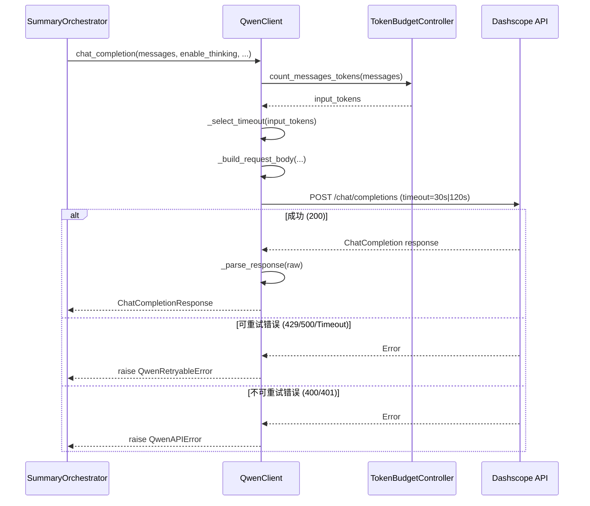
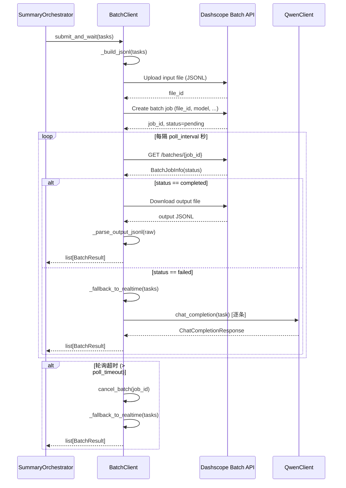
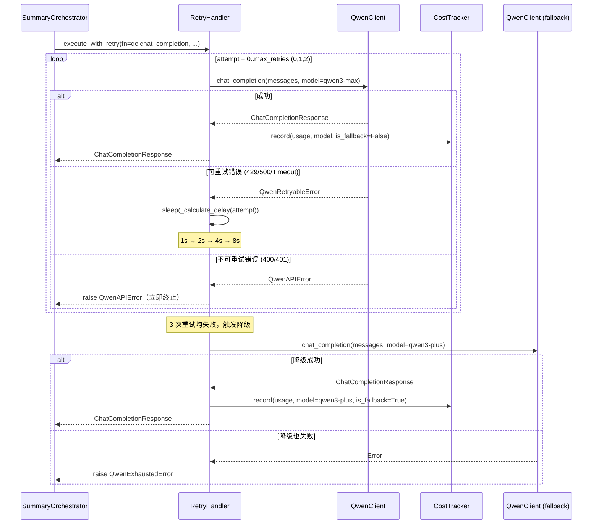
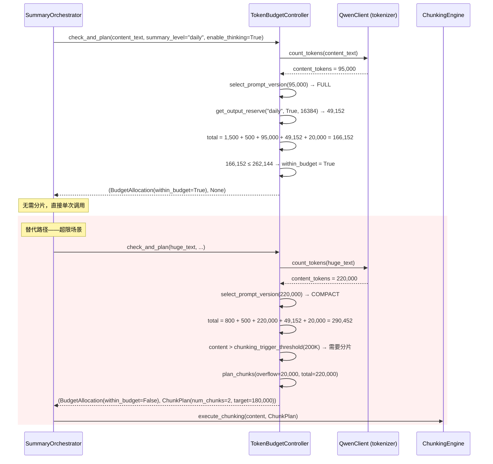

# 架构详设：API 接口层（模块 8–11）

> 对应 PRD §7.1 `api/` 目录，覆盖实时客户端、Batch 客户端、重试处理器、Token 预算控制器四个子模块。

---

## 模块 8：实时 API 客户端（`api/qwen_client.py`）

### 8.1 职责概述

基于 OpenAI Compatible API 封装 Qwen3-Max 的实时单条调用能力，提供统一的 `chat_completion` 接口，屏蔽底层 HTTP 细节，集成 Token 精确计数与超时控制。

### 8.2 类/函数签名

```python
from dataclasses import dataclass, field
from typing import Optional, Protocol
from enum import Enum


<!-- FIXED: BLOCK-6 — 增加 ModelClient Protocol 定义 -->
class ModelClient(Protocol):
    """模型客户端协议——摘要模块依赖此抽象，不直接依赖 QwenClient"""
    async def chat_completion(
        self, messages: list["ChatMessage"], *,
        model: Optional[str] = None,
        enable_thinking: bool = False,
        thinking_budget: Optional[int] = None,
        max_tokens: Optional[int] = None,
        temperature: Optional[float] = None,
    ) -> "ChatCompletionResponse": ...


class ThinkingMode(Enum):
    DISABLED = "disabled"
    ENABLED = "enabled"


@dataclass
class ChatMessage:
    role: str          # "system" | "user" | "assistant"
    content: str


@dataclass
class TokenUsage:
    prompt_tokens: int
    completion_tokens: int
    total_tokens: int
    thinking_tokens: int = 0           # 思考模式下的思维链 token 数


@dataclass
class ChatCompletionResponse:
    """统一响应结构——Batch 客户端复用同一数据类"""
    content: str                        # 模型生成的回答文本
    usage: TokenUsage
    model: str                          # 实际使用的模型标识
    thinking_content: Optional[str] = None   # 思考模式下的思维链原文
    request_id: str = ""                # 阿里云请求 ID，用于排查
    finish_reason: str = "stop"         # stop | length | content_filter


@dataclass
class QwenClientConfig:
    """由 config/model_params.yaml 加载，运行时不可变"""
    api_base: str = "https://dashscope.aliyuncs.com/compatible-mode/v1"
    model: str = "qwen3-max-2026-01-23"      # <!-- FIXED: BLOCK-8 --> 默认锁定快照版本
    fallback_model: str = "qwen3-plus"       # <!-- FIXED: BLOCK-8 --> 对齐 PRD 2.4.2
    api_key_env: str = "QWEN_API_KEY"        # 从环境变量读取，不硬编码
    default_temperature: float = 0.3         # <!-- FIXED: 对齐配置模块场景默认值 -->
    default_max_tokens: int = 32_768         # <!-- FIXED: BLOCK-7 --> 对齐思考模式最大输出
    timeout_normal: int = 30                 # 秒，普通请求
    timeout_large: int = 120                 # 秒，大窗口请求（>100K tokens）
    large_window_threshold: int = 100_000    # 输入 tokens 超过此值使用大超时


class QwenClient:
    """实时 API 客户端"""

    def __init__(self, config: QwenClientConfig):
        """
        初始化：
        1. 从环境变量加载 API Key
        2. 初始化 OpenAI 兼容客户端（openai.OpenAI）
        3. 加载 Qwen3 tokenizer（用于精确计数）
        """
        ...

    <!-- FIXED: BLOCK-6 — chat_completion 改为 async def -->
    async def chat_completion(
        self,
        messages: list[ChatMessage],
        *,
        model: Optional[str] = None,
        enable_thinking: bool = False,
        thinking_budget: Optional[int] = None,
        max_tokens: Optional[int] = None,
        temperature: Optional[float] = None,
    ) -> ChatCompletionResponse:
        """
        核心入口：发送 Chat Completion 请求并返回统一响应。

        参数:
            messages        - 消息列表（system + user）
            model           - 覆盖默认模型
            enable_thinking - 启用思考模式
            thinking_budget - 思维链 token 上限（仅 enable_thinking=True 时生效）
            max_tokens      - 输出 token 上限
            temperature     - 采样温度

        返回:
            ChatCompletionResponse

        异常:
            QwenAPIError          - 不可重试的 API 错误
            QwenRetryableError    - 可重试的 API 错误（由 retry_handler 捕获）
        """
        ...

    def count_tokens(self, text: str) -> int:
        """使用 Qwen3 tokenizer 精确计算 token 数"""
        ...

    def count_messages_tokens(self, messages: list[ChatMessage]) -> int:
        """计算完整 messages 列表的 token 数（含 role 标记开销）"""
        ...

    def _build_request_body(
        self,
        messages: list[ChatMessage],
        model: str,
        enable_thinking: bool,
        thinking_budget: Optional[int],
        max_tokens: int,
        temperature: float,
    ) -> dict:
        """
        组装 OpenAI 兼容请求体。
        思考模式时追加 enable_thinking / thinking_budget 字段。
        """
        ...

    def _parse_response(self, raw_response) -> ChatCompletionResponse:
        """
        从 openai 库返回的 ChatCompletion 对象中提取：
        - content：choices[0].message.content
        - thinking_content：choices[0].message.thinking_content（如有）
        - usage：prompt_tokens / completion_tokens / thinking_tokens
        - request_id、finish_reason
        """
        ...

    def _select_timeout(self, input_tokens: int) -> int:
        """输入 tokens > large_window_threshold 时返回 timeout_large，否则 timeout_normal"""
        ...
```

### 8.3 核心流程 Sequence Diagram



### 8.4 配置参数

| 参数 | 来源 | 默认值 | 说明 |
|:---|:---|:---|:---|
| `api_base` | `config/model_params.yaml` | `https://dashscope.aliyuncs.com/compatible-mode/v1` | OpenAI 兼容端点 |
| `model` | `config/model_params.yaml` | `qwen3-max-2026-01-23`（快照版本） | 模型标识 <!-- FIXED: BLOCK-8 --> |
| `api_key` | 环境变量 `QWEN_API_KEY` | — | **禁止硬编码** |
| `timeout_normal` | `config/model_params.yaml` | 30s | 普通请求超时 |
| `timeout_large` | `config/model_params.yaml` | 120s | 大窗口请求超时 |
| `large_window_threshold` | `config/model_params.yaml` | 100,000 tokens | 切换至大超时的阈值 |
| `default_temperature` | `config/model_params.yaml` | 0.3 | 默认采样温度 <!-- FIXED: 对齐配置模块 --> |
| `default_max_tokens` | `config/model_params.yaml` | 32,768 | 默认最大输出 tokens <!-- FIXED: BLOCK-7 --> |

### 8.5 错误处理矩阵

| 错误类型 | HTTP 状态码 | 异常类 | 是否可重试 | 处理方式 |
|:---|:---|:---|:---|:---|
| Rate Limit | 429 | `QwenRetryableError` | 是 | 交由 `retry_handler` 指数退避 |
| Server Error | 500/502/503 | `QwenRetryableError` | 是 | 交由 `retry_handler` 指数退避 |
| 请求超时 | — | `QwenRetryableError` | 是 | 交由 `retry_handler` 指数退避 |
| Bad Request | 400 | `QwenAPIError` | 否 | 立即抛出，记录请求体摘要 |
| Unauthorized | 401 | `QwenAPIError` | 否 | 立即抛出，告警通知 |
| Content Filter | 200 (finish_reason=content_filter) | `QwenContentFilterError` | 否 | 记录并标记，跳过该片段 |
| 输出截断 | 200 (finish_reason=length) | — | 视情况 | 记录警告；若为 JSON 输出触发修复流程 |
| 网络连接失败 | — | `QwenRetryableError` | 是 | 交由 `retry_handler` 指数退避 |

---

## 模块 9：Batch API 客户端（`api/batch_client.py`）

### 9.1 职责概述

封装阿里云百炼 Batch API 的"提交 → 轮询 → 获取结果"完整生命周期，用于非实时场景（日终全量日报、历史回刷），**节省 50% API 费用**。返回与实时客户端相同的 `ChatCompletionResponse` 数据结构。

### 9.2 类/函数签名

```python
from dataclasses import dataclass
from typing import Optional
from enum import Enum


class BatchJobStatus(Enum):
    PENDING = "pending"
    RUNNING = "running"
    COMPLETED = "completed"
    FAILED = "failed"
    EXPIRED = "expired"
    CANCELLED = "cancelled"


@dataclass
class BatchTask:
    """单个 Batch 任务描述"""
    custom_id: str                      # 调用方自定义 ID，用于结果关联
    messages: list[ChatMessage]
    model: Optional[str] = None
    enable_thinking: bool = False
    thinking_budget: Optional[int] = None
    max_tokens: Optional[int] = None
    temperature: Optional[float] = None


@dataclass
class BatchJobInfo:
    """Batch 作业元信息"""
    job_id: str
    status: BatchJobStatus
    total_tasks: int
    completed_tasks: int = 0
    failed_tasks: int = 0
    created_at: str = ""
    completed_at: Optional[str] = None


@dataclass
class BatchResult:
    """单个 Batch 任务结果"""
    custom_id: str
    response: Optional[ChatCompletionResponse]   # 成功时填充
    error: Optional[str] = None                   # 失败时填充


@dataclass
class BatchClientConfig:
    api_base: str = "https://dashscope.aliyuncs.com/compatible-mode/v1"
    api_key_env: str = "QWEN_API_KEY"
    model: str = "qwen3-max"
    poll_interval: int = 30              # 轮询间隔（秒）
    poll_timeout: int = 3600             # 最大等待时间（秒），超时降级
    max_tasks_per_batch: int = 100       # 单批次最大任务数


class BatchClient:
    """Batch API 客户端"""

    def __init__(self, config: BatchClientConfig, qwen_client: QwenClient):
        """
        初始化：
        1. 加载配置
        2. 注入 QwenClient 实例（降级时回退到实时调用）
        """
        ...

    async def submit_batch(self, tasks: list[BatchTask]) -> BatchJobInfo:
        """
        提交 Batch 作业：
        1. 将 tasks 转换为 JSONL 格式的输入文件
        2. 上传输入文件
        3. 创建 Batch 作业
        4. 返回作业元信息
        """
        ...

    async def poll_until_complete(self, job_id: str) -> BatchJobInfo:
        """
        轮询作业状态直到完成或超时。
        每隔 poll_interval 秒查询一次。
        超过 poll_timeout 秒抛出 BatchTimeoutError。
        """
        ...

    async def get_results(self, job_id: str) -> list[BatchResult]:
        """
        下载完成作业的输出文件，解析为 BatchResult 列表。
        每个 BatchResult.response 与实时 API 返回结构一致。
        """
        ...

    async def submit_and_wait(
        self, tasks: list[BatchTask]
    ) -> list[BatchResult]:
        """
        便捷方法：提交 → 轮询 → 获取结果，一步到位。
        超时或全部失败时自动降级到实时逐条调用。
        """
        ...

    async def _fallback_to_realtime(
        self, tasks: list[BatchTask]
    ) -> list[BatchResult]:
        """
        降级路径：Batch API 不可用时，逐条调用 QwenClient.chat_completion。
        返回相同的 BatchResult 结构。
        """
        ...

    def _build_jsonl(self, tasks: list[BatchTask]) -> str:
        """
        将任务列表转换为 Batch API 要求的 JSONL 格式。
        每行一个 JSON 对象：
        {"custom_id": "...", "method": "POST", "url": "/v1/chat/completions", "body": {...}}
        """
        ...

    def _parse_output_jsonl(self, raw_jsonl: str) -> list[BatchResult]:
        """解析 Batch API 输出 JSONL，映射到 BatchResult"""
        ...

    async def cancel_batch(self, job_id: str) -> bool:
        """取消正在执行的 Batch 作业"""
        ...

    async def list_jobs(
        self, limit: int = 20, status: Optional[BatchJobStatus] = None
    ) -> list[BatchJobInfo]:
        """查询历史 Batch 作业列表"""
        ...
```

### 9.3 核心流程 Sequence Diagram



### 9.4 配置参数

| 参数 | 来源 | 默认值 | 说明 |
|:---|:---|:---|:---|
| `poll_interval` | `config/model_params.yaml` | 30s | 轮询间隔 |
| `poll_timeout` | `config/model_params.yaml` | 3600s (1h) | 最大等待，超时触发降级 |
| `max_tasks_per_batch` | `config/model_params.yaml` | 100 | 单批最大任务数 |
| `model` | `config/model_params.yaml` | `qwen3-max` | Batch 使用的模型 |

### 9.5 错误处理矩阵

| 错误类型 | 触发条件 | 处理方式 |
|:---|:---|:---|
| 文件上传失败 | 网络异常 / 鉴权失败 | 重试 1 次后降级到实时调用 |
| Batch 创建失败 | 参数错误 / 配额耗尽 | 降级到实时调用，告警通知 |
| 轮询超时 | 超过 `poll_timeout` | 取消作业，降级到实时调用 |
| 作业状态 failed | 服务端处理失败 | 降级到实时调用 |
| 作业状态 expired | 作业过期未处理 | 降级到实时调用 |
| 部分任务失败 | 个别 task 返回 error | 成功的直接返回；失败的走实时补调 |
| 输出解析失败 | JSONL 格式异常 | 记录原始内容，降级到实时调用 |

---

## 模块 10：重试处理器（`api/retry_handler.py`）

### 10.1 职责概述

为所有 API 调用提供统一的指数退避重试、降级切换与成本监控能力。作为装饰器 / 上下文管理器使用，与 `QwenClient` 解耦。

### 10.2 类/函数签名

```python
from dataclasses import dataclass, field
from typing import Callable, Optional, TypeVar, Any
import time

T = TypeVar("T")


<!-- FIXED: BLOCK-8 — 统一 retry 字段名为 backoff_base / backoff_multiplier / max_retries / max_delay -->
@dataclass
class RetryConfig:
    """重试策略配置"""
    max_retries: int = 3
    backoff_base: float = 1.0            # 初始退避（秒）
    max_delay: float = 8.0              # 最大退避（秒）
    backoff_multiplier: float = 2.0      # 退避乘数：1s → 2s → 4s → 8s
    retryable_status_codes: tuple = (429, 500, 502, 503)
    fallback_model: str = "qwen3-plus"   # <!-- FIXED: BLOCK-8 --> 降级模型对齐 PRD 2.4.2


@dataclass
class CostRecord:
    """单次调用的成本记录"""
    timestamp: float
    model: str
    prompt_tokens: int
    completion_tokens: int
    thinking_tokens: int = 0
    estimated_cost_yuan: float = 0.0
    is_fallback: bool = False            # 是否降级调用


class CostTracker:
    """成本监控——按调用累计 token 消耗与预估费用"""

    def __init__(self):
        self._records: list[CostRecord] = []

    def record(self, usage: TokenUsage, model: str, is_fallback: bool = False) -> CostRecord:
        """记录一次调用的 token 消耗，估算费用"""
        ...

    def get_daily_summary(self) -> dict:
        """
        返回当日汇总：
        {
            "total_prompt_tokens": int,
            "total_completion_tokens": int,
            "total_thinking_tokens": int,
            "total_estimated_cost": float,
            "call_count": int,
            "fallback_count": int,
            "by_model": { model: {...} }
        }
        """
        ...

    def check_budget_alert(self, daily_limit_yuan: float) -> bool:
        """当日累计费用超过阈值时返回 True"""
        ...


class RetryHandler:
    """重试处理器"""

    def __init__(self, config: RetryConfig, cost_tracker: CostTracker):
        ...

    def execute_with_retry(
        self,
        fn: Callable[..., ChatCompletionResponse],
        *args,
        fallback_fn: Optional[Callable[..., ChatCompletionResponse]] = None,
        **kwargs,
    ) -> ChatCompletionResponse:
        """
        执行 fn 并在可重试错误时进行指数退避重试。

        流程:
        1. 调用 fn(*args, **kwargs)
        2. 成功 → 记录成本，返回结果
        3. 可重试错误 → sleep(delay)，delay *= backoff_factor，重试
        4. 达到 max_retries → 调用 fallback_fn（降级模型），记录降级标记
        5. 降级也失败 → 抛出 QwenExhaustedError

        返回:
            ChatCompletionResponse（含实际使用模型信息）
        """
        ...

    def _is_retryable(self, error: Exception) -> bool:
        """
        判断错误是否可重试：
        - QwenRetryableError（429/500/502/503/Timeout）→ True
        - QwenAPIError（400/401）→ False
        - 其他未知异常 → False
        """
        ...

    def _calculate_delay(self, attempt: int) -> float:
        """
        计算第 attempt 次重试的等待时间：
        delay = min(backoff_base * (backoff_multiplier ** attempt), max_delay)
        即：1s, 2s, 4s, 8s
        """
        ...


def with_retry(config: Optional[RetryConfig] = None):
    """
    装饰器形式——简化调用方使用。

    @with_retry()
    def call_model(...):
        return qwen_client.chat_completion(...)
    """
    ...
```

### 10.3 核心流程 Sequence Diagram



### 10.4 配置参数

| 参数 | 来源 | 默认值 | 说明 |
|:---|:---|:---|:---|
| `max_retries` | `config/model_params.yaml` | 3 | 最大重试次数 |
| `backoff_base` | `config/model_params.yaml` | 1.0s | 首次退避延迟 <!-- FIXED: BLOCK-8 --> |
| `max_delay` | `config/model_params.yaml` | 8.0s | 退避上限 |
| `backoff_multiplier` | `config/model_params.yaml` | 2.0 | 指数退避乘数 <!-- FIXED: BLOCK-8 --> |
| `fallback_model` | `config/model_params.yaml` | `qwen3-plus` | 降级模型 <!-- FIXED: BLOCK-8 --> |
| `daily_cost_limit` | `config/model_params.yaml` | 10.0 (元) | 日预算告警阈值 |

### 10.5 错误处理矩阵

| 错误类型 | HTTP 状态码 | 可重试 | 重试策略 | 最终降级 |
|:---|:---|:---|:---|:---|
| Rate Limit | 429 | 是 | 指数退避 1→2→4→8s | 切换 qwen3-plus |
| Server Error | 500 | 是 | 指数退避 | 切换 qwen3-plus |
| Bad Gateway | 502 | 是 | 指数退避 | 切换 qwen3-plus |
| Service Unavailable | 503 | 是 | 指数退避 | 切换 qwen3-plus |
| 请求超时 | — | 是 | 指数退避 | 切换 qwen3-plus |
| Bad Request | 400 | **否** | 立即终止 | 抛出异常，不降级 |
| Unauthorized | 401 | **否** | 立即终止 | 抛出异常，告警通知 |
| 降级模型也失败 | any | **否** | — | 抛出 `QwenExhaustedError`，进入人工队列 |

### 10.6 成本估算逻辑

```python
# 阶梯计价表（元/百万 tokens）
INPUT_PRICING = [(32_000, 2.5), (128_000, 4.0), (252_000, 7.0)]
OUTPUT_PRICING_NORMAL = [(32_000, 10.0), (128_000, 16.0), (252_000, 28.0)]
OUTPUT_PRICING_THINKING = 28.0  # 思考模式统一价

def estimate_cost(prompt_tokens: int, completion_tokens: int,
                  thinking_tokens: int, model: str) -> float:
    """
    按 PRD §2.1.3 阶梯计价规则计算单次调用费用。
    - 输入按阶梯累计
    - 输出区分思考模式/非思考模式
    - qwen-plus 按其独立价格体系计算
    """
    ...
```

---

## 模块 11：Token 预算控制器（`api/token_budget.py`）

### 11.1 职责概述

管理单次 API 调用的 Token 预算分配，实现弹性预算策略（PRD §2.3）：系统提示词 → 内容载荷 → 输出预留的三段式分配；超限时自动触发分片或压缩。

### 11.2 类/函数签名

```python
from dataclasses import dataclass
from typing import Optional
from enum import Enum


class PromptVersion(Enum):
    FULL = "full"           # 完整版（含示例、详细格式说明）
    COMPACT = "compact"     # 精简版（去除示例，仅保留核心指令）


@dataclass
class BudgetAllocation:
    """单次调用的 Token 预算分配结果"""
    system_prompt_tokens: int       # 系统提示词实际 token 数
    key_people_tokens: int          # 关键人配置注入 token 数
    content_payload_tokens: int     # 有效内容载荷 token 数
    output_reserved_tokens: int     # 输出预留 token 数
    total_tokens: int               # 总计（应 ≤ 模型上下文上限）
    prompt_version: PromptVersion   # 使用的提示词版本
    within_budget: bool             # 是否在预算范围内
    overflow_tokens: int = 0        # 超出的 token 数（>0 时需要分片）


@dataclass
class ChunkPlan:
    """分片方案"""
    num_chunks: int
    target_tokens_per_chunk: int    # 每片目标 token 数
    overflow_tokens: int            # 触发分片的溢出量


<!-- FIXED: BLOCK-7 — 修正 Token 预算参数，对齐 PRD ≥20,000 安全余量 & 思考模式最大输出 32,768 -->
@dataclass
class TokenBudgetConfig:
    model_context_limit: int = 262_144
    system_prompt_full_tokens: int = 1_500       # 完整提示词预估
    system_prompt_compact_tokens: int = 800      # 精简提示词预估
    key_people_tokens: int = 500                 # 关键人配置注入上限
    output_tokens_segment: int = 4_000           # 片段级输出预留
    output_tokens_session: int = 6_000           # 时段级输出预留
    output_tokens_daily: int = 32_768            # 全天级输出预留（对齐思考模式最大输出）
    thinking_budget_default: int = 16_384        # 思考模式默认预算
    compact_prompt_threshold: int = 190_000      # 内容载荷超此值切换精简提示词
    chunking_trigger_threshold: int = 200_000    # 超此值触发分片
    safety_margin_tokens: int = 20_000           # 安全余量（对齐 PRD ≥20,000）


class TokenBudgetController:
    """Token 预算控制器"""

    def __init__(self, config: TokenBudgetConfig, qwen_client: QwenClient):
        """
        初始化：注入 QwenClient 以使用其 count_tokens 方法。
        """
        ...

    def allocate(
        self,
        content_text: str,
        *,
        summary_level: str = "daily",         # "segment" | "session" | "daily"
        enable_thinking: bool = False,
        thinking_budget: Optional[int] = None,
    ) -> BudgetAllocation:
        """
        核心方法：为一次调用计算 Token 预算分配。

        流程：
        1. 精确计算 content_text 的 token 数
        2. 确定输出预留（按 summary_level）
        3. 若启用思考模式，额外预留 thinking_budget
        4. 选择提示词版本（内容 ≤190K → full，否则 compact）
        5. 计算总需求，判断是否超限
        """
        ...

    def check_and_plan(
        self,
        content_text: str,
        *,
        summary_level: str = "daily",
        enable_thinking: bool = False,
    ) -> tuple[BudgetAllocation, Optional[ChunkPlan]]:
        """
        预算检查 + 自动分片规划。

        返回：
        - BudgetAllocation：当前文本的预算分配（可能 within_budget=False）
        - ChunkPlan | None：需要分片时返回分片方案
        """
        ...

    def plan_chunks(self, overflow_tokens: int, total_content_tokens: int) -> ChunkPlan:
        """
        计算分片方案：
        - target_per_chunk = chunking_trigger_threshold - safety_margin
        - num_chunks = ceil(total_content_tokens / target_per_chunk)
        - 每片控制在 180K tokens 以内（PRD §2.3）
        """
        ...

    def select_prompt_version(self, content_tokens: int) -> PromptVersion:
        """
        弹性提示词选择：
        - content_tokens ≤ 190K → FULL
        - content_tokens > 190K → COMPACT
        """
        ...

    def get_output_reserve(
        self,
        summary_level: str,
        enable_thinking: bool,
        thinking_budget: Optional[int] = None,
    ) -> int:
        """
        <!-- FIXED: BLOCK-7 — 按场景区分输出预留 -->
        计算输出预留 tokens：
        - 基础预留：segment=4,000 / session=6,000 / daily=32,768
        - 思考模式：额外加 thinking_budget（默认 16,384）
        """
        ...
```

### 11.3 核心流程 Sequence Diagram



### 11.4 配置参数

| 参数 | 来源 | 默认值 | 说明 |
|:---|:---|:---|:---|
| `model_context_limit` | `config/model_params.yaml` | 262,144 | 模型上下文窗口 |
| `system_prompt_full_tokens` | `config/model_params.yaml` | 1,500 | 完整提示词预估 token 数 |
| `system_prompt_compact_tokens` | `config/model_params.yaml` | 800 | 精简提示词预估 token 数 |
| `key_people_tokens` | `config/model_params.yaml` | 500 | 关键人注入上限 |
| `output_tokens_segment` | `config/model_params.yaml` | 4,000 | 片段级输出预留 <!-- FIXED: BLOCK-7 --> |
| `output_tokens_session` | `config/model_params.yaml` | 6,000 | 时段级输出预留 <!-- FIXED: BLOCK-7 --> |
| `output_tokens_daily` | `config/model_params.yaml` | 32,768 | 全天级输出预留（对齐思考模式最大输出）<!-- FIXED: BLOCK-7 --> |
| `thinking_budget_default` | `config/model_params.yaml` | 16,384 | 默认思维链预算 |
| `compact_prompt_threshold` | `config/model_params.yaml` | 190,000 | 切换精简提示词的内容阈值 |
| `chunking_trigger_threshold` | `config/model_params.yaml` | 200,000 | 触发分片的内容阈值 |
| `safety_margin_tokens` | `config/model_params.yaml` | 20,000 | 安全余量（对齐 PRD ≥20,000）<!-- FIXED: BLOCK-7 --> |

### 11.5 错误处理矩阵

| 场景 | 检测方式 | 处理策略 | 降级路径 |
|:---|:---|:---|:---|
| 内容 ≤ 190K tokens | `allocate()` 自动判定 | 使用完整版提示词，单次调用 | — |
| 190K < 内容 ≤ 200K | `allocate()` 自动判定 | 切换精简版提示词，单次调用 | — |
| 200K < 内容 ≤ 250K | `check_and_plan()` 返回 `ChunkPlan` | 触发分片，每片 ≤ 180K | 由 `ChunkingEngine` 执行 |
| 内容 > 250K tokens | `check_and_plan()` | 多片分片 + 三级架构 | 片段→时段→全天 |
| Tokenizer 不可用 | 初始化时捕获异常 | 回退到字符数估算（÷1.5） | 精度下降但流程不中断 |
| 输出实际超预留 | `finish_reason == "length"` | 记录警告，触发 JSON 修复或重试 | 增大 `max_tokens` 重试一次 |

---

## 附录：统一异常类层次

```python
class QwenBaseError(Exception):
    """API 层基础异常"""
    pass

class QwenAPIError(QwenBaseError):
    """不可重试的 API 错误（400/401 等）"""
    def __init__(self, status_code: int, message: str, request_id: str = ""):
        self.status_code = status_code
        self.request_id = request_id
        super().__init__(f"[{status_code}] {message} (req_id={request_id})")

class QwenRetryableError(QwenBaseError):
    """可重试的 API 错误（429/500/Timeout）"""
    def __init__(self, status_code: int, message: str, request_id: str = ""):
        self.status_code = status_code
        self.request_id = request_id
        super().__init__(f"[Retryable {status_code}] {message}")

class QwenContentFilterError(QwenBaseError):
    """内容被安全过滤"""
    pass

class QwenExhaustedError(QwenBaseError):
    """所有重试与降级均失败"""
    pass

class BatchTimeoutError(QwenBaseError):
    """Batch 作业轮询超时"""
    pass

class TokenBudgetExceededError(QwenBaseError):
    """Token 预算超限且无法自动分片"""
    pass
```

---

<!-- FIXED: BLOCK-8 — 附录 YAML 改为引用配置模块的统一定义，此处仅保留 API 层视角的快速参考 -->
## 附录：`config/model_params.yaml` 快速参考

> **权威定义**位于配置模块（模块 12）的 `ModelParamsConfig` Pydantic 模型。以下为 API 层消费的关键字段摘要，完整 Schema 以配置模块为准。

```yaml
# config/model_params.yaml — 统一 Schema（权威定义见配置模块 12.6）
model:
  name: "qwen3-max-2026-01-23"            # 快照版本（统一使用单一 name 字段）
  fallback: "qwen3-plus"                   # 降级模型（对齐 PRD 2.4.2）
  api_base: "https://dashscope.aliyuncs.com/compatible-mode/v1"
  api_key_env: "QWEN_API_KEY"
  thinking_budget_default: 16384
  batch_api_enabled: true

# 超时配置
timeout:
  normal: 30                              # 秒
  large_window: 120                       # 秒
  large_window_threshold: 100000          # tokens

# 各场景调用参数
calls:
  segment_summary:
    max_tokens: 4000
    enable_thinking: false
    temperature: 0.3
  period_summary:
    max_tokens: 6000
    enable_thinking: false
    temperature: 0.3
  daily_report:
    max_tokens: 32768                     # 对齐思考模式最大输出
    enable_thinking: true
    thinking_budget: 16384
    temperature: 0.3
  importance_eval:
    max_tokens: 64
    enable_thinking: false
    temperature: 0
    batch_size: 10

# Token 预算
token_budget:
  model_context_limit: 262144
  system_prompt_full_tokens: 1500
  system_prompt_compact_tokens: 800
  key_people_tokens: 500
  output_tokens:
    segment: 4000
    session: 6000
    daily: 32768                          # 对齐思考模式最大输出
  compact_prompt_threshold: 190000
  chunking_trigger_threshold: 200000
  safety_margin: 20000                    # 对齐 PRD ≥20,000
  short_day_threshold: 80000
  long_day_max: 250000
  system_prompt_budget: 2000
  key_people_inject_budget: 600

# 重试策略（统一字段名）
retry:
  max_retries: 3
  backoff_base: 1.0
  backoff_multiplier: 2.0
  max_delay: 8.0
  retryable_status_codes: [429, 500, 502, 503]

# Batch API
batch:
  enabled: true
  poll_interval: 30
  poll_timeout: 3600
  max_tasks_per_batch: 100

# 成本监控
cost:
  daily_limit_yuan: 10.0
  monthly_limit_yuan: 200.0
  alert_threshold_pct: 80
```
