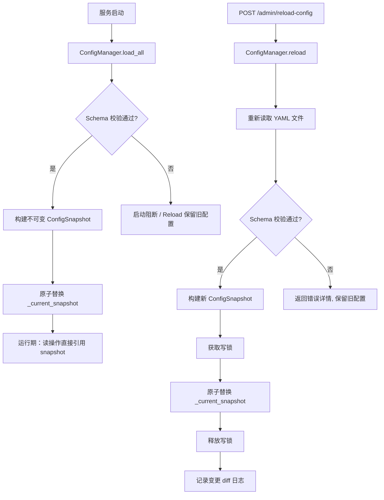
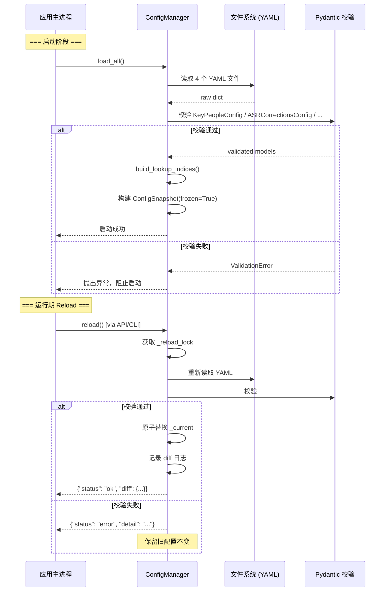
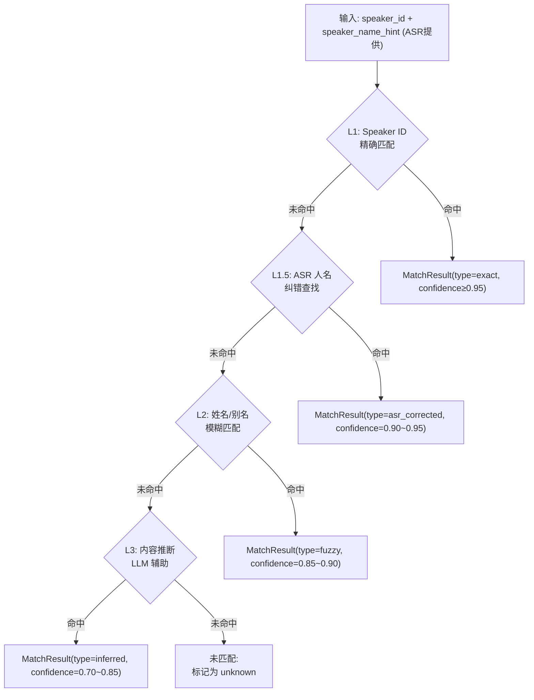
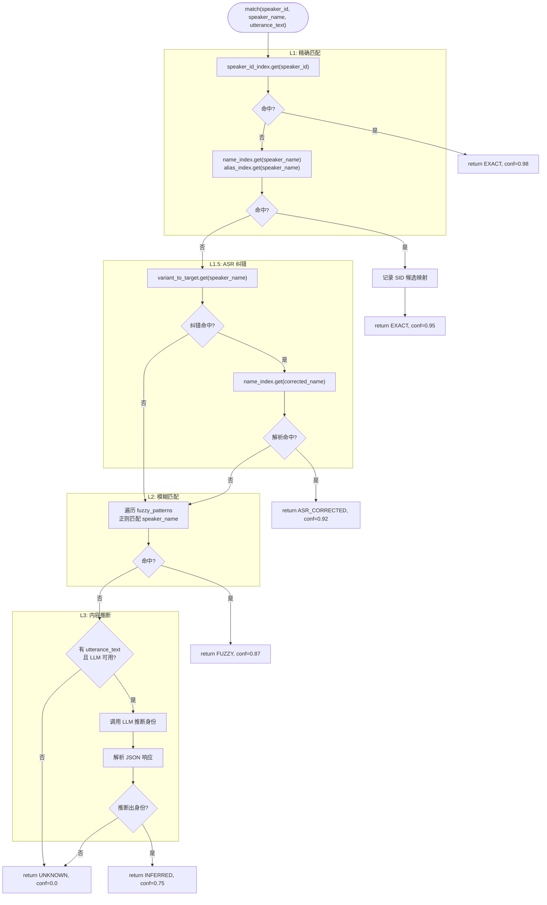
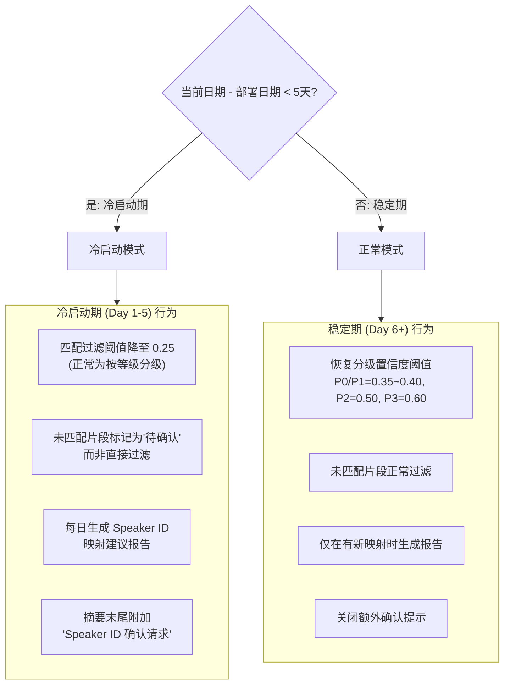
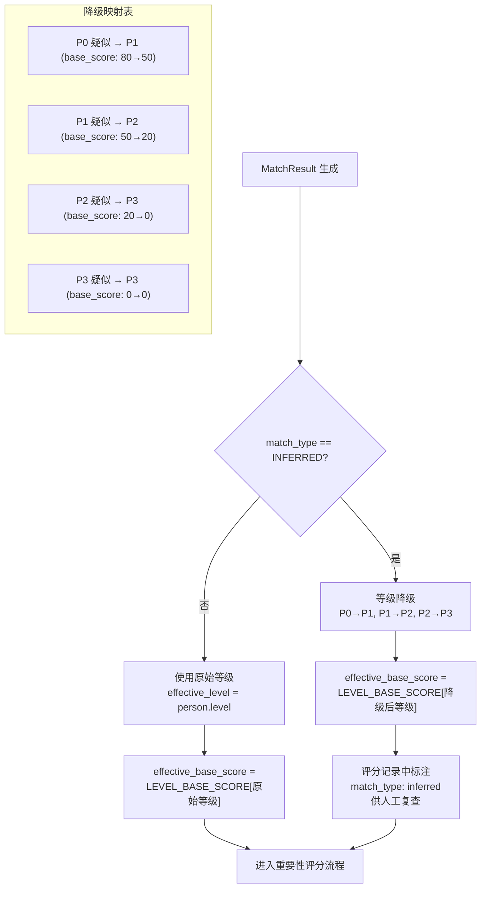
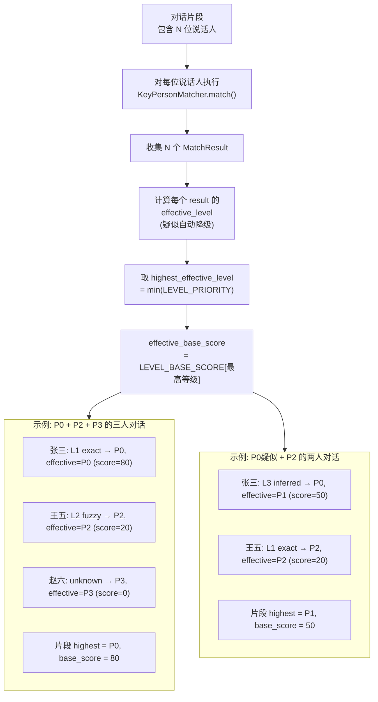
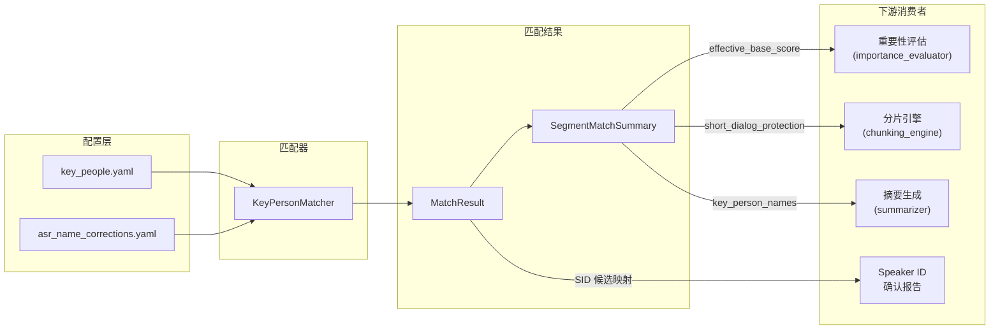

# 模块 12-14：配置管理、关键人匹配器、匹配结果

---

## 模块 12：配置管理器（config/）

### 12.1 架构总览

配置管理器采用"启动加载 + 手动 Reload"的轻量化方案，所有配置文件纳入 Git 仓库统一版本管理。核心设计原则：**不可变对象 + 原子替换**，确保运行期读取零锁开销。



### 12.2 ConfigManager 类设计

```python
import threading
from datetime import datetime
from pathlib import Path
from dataclasses import dataclass, field
from typing import Optional
import yaml
import logging

logger = logging.getLogger(__name__)


@dataclass(frozen=True)
class ConfigSnapshot:
    """不可变配置快照——frozen=True 确保运行期无法被意外修改"""
    key_people: "KeyPeopleConfig"
    asr_corrections: "ASRCorrectionsConfig"
    time_periods: "TimePeriodConfig"
    model_params: "ModelParamsConfig"
    loaded_at: datetime = field(default_factory=datetime.now)
    version_hash: str = ""  # 配置内容的 MD5，用于变更检测


class ConfigManager:
    """
    配置管理器：启动加载 + 手动 Reload + 并发安全

    并发模型：
    - 读操作：直接读取 _current 引用，无需加锁（Python 引用赋值是原子的）
    - 写操作（Reload）：通过 _reload_lock 序列化，构建新 snapshot 后原子替换引用
    """

    def __init__(self, config_dir: Path):
        self._config_dir = config_dir
        self._current: Optional[ConfigSnapshot] = None
        self._reload_lock = threading.Lock()  # 仅 Reload 写操作使用

    # ── 启动加载 ──────────────────────────────────────────
    def load_all(self) -> None:
        """
        启动时调用。校验失败抛出异常，阻止服务启动。
        """
        snapshot = self._build_snapshot()
        self._current = snapshot
        logger.info(
            "Config loaded: version_hash=%s, %d key_people, %d asr_corrections",
            snapshot.version_hash,
            len(snapshot.key_people.people),
            sum(len(c.variants) for c in snapshot.asr_corrections.corrections),
        )

    # ── 手动 Reload ───────────────────────────────────────
    def reload(self) -> dict:
        """
        手动触发重新加载。
        返回 {"status": "ok", "diff": ...} 或 {"status": "error", "detail": ...}
        """
        with self._reload_lock:
            try:
                new_snapshot = self._build_snapshot()
            except ConfigValidationError as e:
                logger.warning("Reload failed, keeping old config: %s", e)
                return {"status": "error", "detail": str(e)}

            old_snapshot = self._current
            self._current = new_snapshot  # 原子替换

            diff = self._compute_diff(old_snapshot, new_snapshot)
            logger.info("Config reloaded: %s", diff)
            return {"status": "ok", "diff": diff}

    # ── 运行期读取（无锁） ──────────────────────────────
    @property
    def snapshot(self) -> ConfigSnapshot:
        """运行期读取，直接返回当前不可变快照引用"""
        return self._current

    @property
    def key_people(self) -> "KeyPeopleConfig":
        return self._current.key_people

    @property
    def asr_corrections(self) -> "ASRCorrectionsConfig":
        return self._current.asr_corrections

    # ── 内部构建逻辑 ──────────────────────────────────────
    def _build_snapshot(self) -> ConfigSnapshot:
        """读取所有 YAML -> Pydantic 校验 -> 构建不可变快照"""
        raw_kp = self._load_yaml("key_people.yaml")
        raw_asr = self._load_yaml("asr_name_corrections.yaml")
        raw_tp = self._load_yaml("time_period_config.yaml")
        raw_mp = self._load_yaml("model_params.yaml")

        # Pydantic 校验（校验失败自动抛出 ValidationError）
        kp_config = KeyPeopleConfig(**raw_kp)
        asr_config = ASRCorrectionsConfig(**raw_asr)
        tp_config = TimePeriodConfig(**raw_tp)
        mp_config = ModelParamsConfig(**raw_mp)

        # 构建查找索引（预计算，提升匹配性能）
        kp_config.build_lookup_indices()

        version_hash = self._compute_hash(raw_kp, raw_asr, raw_tp, raw_mp)

        return ConfigSnapshot(
            key_people=kp_config,
            asr_corrections=asr_config,
            time_periods=tp_config,
            model_params=mp_config,
            version_hash=version_hash,
        )

    def _load_yaml(self, filename: str) -> dict:
        path = self._config_dir / filename
        if not path.exists():
            raise ConfigValidationError(f"Config file not found: {path}")
        with open(path, "r", encoding="utf-8") as f:
            return yaml.safe_load(f)

    def _compute_hash(self, *raw_configs) -> str:
        import hashlib, json
        combined = json.dumps(raw_configs, ensure_ascii=False, sort_keys=True)
        return hashlib.md5(combined.encode()).hexdigest()[:12]

    def _compute_diff(self, old: ConfigSnapshot, new: ConfigSnapshot) -> dict:
        """对比新旧配置，生成人可读的变更摘要"""
        diff = {}
        if old is None:
            return {"type": "initial_load"}
        if old.key_people != new.key_people:
            old_ids = {p.id for p in old.key_people.people}
            new_ids = {p.id for p in new.key_people.people}
            diff["key_people"] = {
                "added": list(new_ids - old_ids),
                "removed": list(old_ids - new_ids),
                "modified_count": len(old_ids & new_ids),  # 简化：仅计数
            }
        if old.version_hash != new.version_hash:
            diff["version_hash"] = {"old": old.version_hash, "new": new.version_hash}
        return diff


class ConfigValidationError(Exception):
    """配置校验失败"""
    pass
```

### 12.3 key_people.yaml 的 Pydantic 模型定义

#### 12.3.1 YAML 文件结构示例

```yaml
# config/key_people.yaml
version: "2026-03-27"
people:
  - id: "kp001"
    name: "张三"
    aliases: ["张总", "总裁", "CEO"]
    level: "P0"
    speaker_ids: ["spk_017"]
    short_dialog_protection: true
    always_include: true
  - id: "kp002"
    name: "李四"
    aliases: ["李总监"]
    level: "P1"
    speaker_ids: ["spk_042"]
    short_dialog_protection: false
    always_include: false
  - id: "kp003"
    name: "王五"
    aliases: ["王经理", "老王"]
    level: "P2"
    speaker_ids: []
    short_dialog_protection: false
    always_include: false
```

#### 12.3.2 Pydantic 模型

```python
from pydantic import BaseModel, Field, field_validator, model_validator
from enum import Enum
from typing import Optional


class PersonLevel(str, Enum):
    P0 = "P0"
    P1 = "P1"
    P2 = "P2"
    P3 = "P3"


# ── 等级 → 基础保障分映射 ───────────────────────────────
LEVEL_BASE_SCORE: dict[PersonLevel, int] = {
    PersonLevel.P0: 80,
    PersonLevel.P1: 50,
    PersonLevel.P2: 20,
    PersonLevel.P3: 0,
}

# ── 等级 → ASR 置信度阈值映射 ────────────────────────────
LEVEL_CONFIDENCE_THRESHOLD: dict[PersonLevel, float] = {
    PersonLevel.P0: 0.35,
    PersonLevel.P1: 0.40,
    PersonLevel.P2: 0.50,
    PersonLevel.P3: 0.60,
}


class KeyPerson(BaseModel):
    """单个关键人配置"""
    id: str = Field(..., description="全局唯一标识", pattern=r"^kp\d{3,}$")
    name: str = Field(..., min_length=1, description="正式姓名")
    level: PersonLevel
    aliases: list[str] = Field(default_factory=list, description="别名、昵称、职务称谓")
    speaker_ids: list[str] = Field(default_factory=list, description="关联 ASR Speaker ID")
    short_dialog_protection: bool = Field(default=False, description="短对话保护开关")
    always_include: bool = Field(default=False, description="无条件包含标记")

    @field_validator("short_dialog_protection")
    @classmethod
    def validate_short_dialog_protection(cls, v, info):
        """short_dialog_protection 仅 P0/P1 有效"""
        if v and info.data.get("level") not in (PersonLevel.P0, PersonLevel.P1):
            raise ValueError("short_dialog_protection only valid for P0/P1")
        return v

    @property
    def base_score(self) -> int:
        return LEVEL_BASE_SCORE[self.level]

    @property
    def confidence_threshold(self) -> float:
        return LEVEL_CONFIDENCE_THRESHOLD[self.level]


class KeyPeopleConfig(BaseModel):
    """关键人配置根模型"""
    version: str = Field(..., description="配置版本号（日期格式推荐）")
    people: list[KeyPerson] = Field(..., min_length=1)

    # ── 预计算查找索引（非序列化字段） ─────────────────
    _name_index: dict[str, KeyPerson] = {}
    _alias_index: dict[str, KeyPerson] = {}
    _speaker_id_index: dict[str, KeyPerson] = {}

    @model_validator(mode="after")
    def validate_unique_ids(self):
        ids = [p.id for p in self.people]
        if len(ids) != len(set(ids)):
            raise ValueError("Duplicate person IDs detected")
        return self

    def build_lookup_indices(self) -> None:
        """构建 O(1) 查找索引，在 ConfigManager._build_snapshot 中调用"""
        self._name_index = {}
        self._alias_index = {}
        self._speaker_id_index = {}

        for person in self.people:
            # 姓名索引（精确匹配用）
            self._name_index[person.name] = person
            # 别名索引
            for alias in person.aliases:
                self._alias_index[alias] = person
            # Speaker ID 索引
            for sid in person.speaker_ids:
                self._speaker_id_index[sid] = person

    def find_by_name(self, name: str) -> Optional[KeyPerson]:
        return self._name_index.get(name) or self._alias_index.get(name)

    def find_by_speaker_id(self, speaker_id: str) -> Optional[KeyPerson]:
        return self._speaker_id_index.get(speaker_id)

    def all_names_and_aliases(self) -> list[str]:
        """返回全部姓名+别名列表，用于模糊匹配候选集"""
        result = []
        for p in self.people:
            result.append(p.name)
            result.extend(p.aliases)
        return result
```

### 12.4 asr_name_corrections.yaml 的数据结构

#### 12.4.1 YAML 文件结构

```yaml
# config/asr_name_corrections.yaml
corrections:
  - target: "张总"
    variants: ["章总", "张宗", "掌总", "张总监"]
  - target: "李明"
    variants: ["黎明", "李鸣", "里明"]
  - target: "王五"
    variants: ["王武", "汪五"]
```

#### 12.4.2 Pydantic 模型

```python
class ASRCorrectionEntry(BaseModel):
    """单条纠错映射"""
    target: str = Field(..., min_length=1, description="正确的目标名称（须存在于 key_people 的 name 或 aliases 中）")
    variants: list[str] = Field(..., min_length=1, description="ASR 常见误识别变体列表")


class ASRCorrectionsConfig(BaseModel):
    """ASR 人名纠错配置"""
    corrections: list[ASRCorrectionEntry] = Field(default_factory=list)

    # ── 预计算查找索引 ────────────────────────────────
    _variant_to_target: dict[str, str] = {}

    def build_lookup_index(self) -> None:
        """构建 variant → target 的反向索引"""
        self._variant_to_target = {}
        for entry in self.corrections:
            for variant in entry.variants:
                self._variant_to_target[variant] = entry.target

    def correct(self, raw_name: str) -> Optional[str]:
        """
        查找纠错映射。
        返回修正后的名称，若无匹配返回 None。
        """
        return self._variant_to_target.get(raw_name)

    @model_validator(mode="after")
    def validate_no_duplicate_variants(self):
        all_variants = []
        for entry in self.corrections:
            all_variants.extend(entry.variants)
        if len(all_variants) != len(set(all_variants)):
            raise ValueError("Duplicate variants detected across correction entries")
        return self
```

### 12.5 time_period_config.yaml 的数据结构

#### 12.5.1 YAML 文件结构

```yaml
# config/time_period_config.yaml
time_periods:
  - name: "早间会议"
    start: "08:00"
    end: "09:00"
    coefficient: 1.2
    description: "晨会、战略对齐"
  - name: "核心工作时段"
    start: "09:00"
    end: "12:00"
    coefficient: 1.1
  - name: "午后工作时段"
    start: "14:00"
    end: "18:00"
    coefficient: 1.1
  - name: "晚间加班"
    start: "18:00"
    end: "21:00"
    coefficient: 0.9
  - name: "深夜"
    start: "21:00"
    end: "08:00"
    coefficient: 0.7
```

#### 12.5.2 Pydantic 模型

```python
from datetime import time


class TimePeriodEntry(BaseModel):
    """单个时段定义"""
    name: str = Field(..., min_length=1)
    start: str = Field(..., pattern=r"^\d{2}:\d{2}$")
    end: str = Field(..., pattern=r"^\d{2}:\d{2}$")
    coefficient: float = Field(..., ge=0.1, le=5.0, description="时段系数")
    description: str = ""

    @property
    def start_time(self) -> time:
        h, m = self.start.split(":")
        return time(int(h), int(m))

    @property
    def end_time(self) -> time:
        h, m = self.end.split(":")
        return time(int(h), int(m))

    def contains(self, t: time) -> bool:
        """判断时刻 t 是否落在本时段内（支持跨午夜）"""
        if self.start_time <= self.end_time:
            return self.start_time <= t < self.end_time
        else:
            # 跨午夜：如 21:00 → 08:00
            return t >= self.start_time or t < self.end_time


class TimePeriodConfig(BaseModel):
    """时段系数配置"""
    time_periods: list[TimePeriodEntry] = Field(..., min_length=1)

    def get_coefficient(self, t: time) -> float:
        """根据时刻返回对应的时段系数，未命中任何时段则返回 1.0"""
        for period in self.time_periods:
            if period.contains(t):
                return period.coefficient
        return 1.0
```

### 12.6 model_params.yaml 的数据结构

#### 12.6.1 YAML 文件结构

```yaml
# config/model_params.yaml
model:
  name: "qwen3-max-2026-01-23"       # 快照版本，禁止使用 qwen3-max
  fallback: "qwen3-plus"              # 降级模型
  thinking_budget_default: 16000
  batch_api_enabled: true

calls:
  segment_summary:
    max_tokens: 4000
    enable_thinking: false
    temperature: 0.3
  period_summary:
    max_tokens: 6000
    enable_thinking: false
    temperature: 0.3
  daily_report:
    max_tokens: 8000
    enable_thinking: true
    thinking_budget: 16384
    temperature: 0.3
  importance_eval:
    max_tokens: 64
    enable_thinking: false
    temperature: 0
    batch_size: 10              # 每批评估片段数

token_budget:
  short_day_threshold: 80000     # 短日模式上限（tokens）
  long_day_max: 250000           # 长日模式上限
  system_prompt_budget: 2000
  key_people_inject_budget: 600
  safety_margin: 20000

retry:
  max_retries: 3
  backoff_base: 1                # 指数退避基数（秒）
  backoff_multiplier: 2          # 1s → 2s → 4s → 8s
```

#### 12.6.2 Pydantic 模型

```python
class CallParams(BaseModel):
    """单个 LLM 调用场景的参数"""
    max_tokens: int = Field(..., ge=1)
    enable_thinking: bool = False
    thinking_budget: int = Field(default=0, ge=0)
    temperature: float = Field(default=0.3, ge=0.0, le=2.0)
    batch_size: int = Field(default=1, ge=1, description="批量调用时每批片段数")


class ModelSpec(BaseModel):
    name: str = Field(..., description="模型快照版本")
    fallback: str = Field(default="qwen3-plus", description="降级模型")
    thinking_budget_default: int = Field(default=16000, ge=0)
    batch_api_enabled: bool = True


class TokenBudget(BaseModel):
    short_day_threshold: int = 80000
    long_day_max: int = 250000
    system_prompt_budget: int = 2000
    key_people_inject_budget: int = 600
    safety_margin: int = 20000


class RetryConfig(BaseModel):
    max_retries: int = Field(default=3, ge=0)
    backoff_base: float = Field(default=1.0, ge=0)
    backoff_multiplier: float = Field(default=2.0, ge=1.0)


class ModelParamsConfig(BaseModel):
    """模型参数配置根模型"""
    model: ModelSpec
    calls: dict[str, CallParams] = Field(
        ..., description="各调用场景参数，key 为场景标识"
    )
    token_budget: TokenBudget = Field(default_factory=TokenBudget)
    retry: RetryConfig = Field(default_factory=RetryConfig)

    def get_call_params(self, scenario: str) -> CallParams:
        if scenario not in self.calls:
            raise KeyError(f"Unknown call scenario: {scenario}")
        return self.calls[scenario]
```

### 12.7 配置加载完整流程图



---

## 模块 13：关键人匹配器

### 13.1 四层匹配流水线总览



### 13.2 KeyPersonMatcher 类设计

```python
import re
from dataclasses import dataclass, field
from enum import Enum
from typing import Optional


class MatchType(str, Enum):
    EXACT = "exact"                # L1: Speaker ID / 姓名精确
    ASR_CORRECTED = "asr_corrected"  # L1.5: ASR 纠错
    FUZZY = "fuzzy"                # L2: 模糊匹配
    INFERRED = "inferred"          # L3: 内容推断（疑似）
    UNKNOWN = "unknown"            # 未匹配


# ── 疑似匹配等级降级映射 ─────────────────────────────────
INFERRED_LEVEL_DOWNGRADE: dict[PersonLevel, PersonLevel] = {
    PersonLevel.P0: PersonLevel.P1,  # P0 疑似 → 按 P1 处理
    PersonLevel.P1: PersonLevel.P2,  # P1 疑似 → 按 P2 处理
    PersonLevel.P2: PersonLevel.P3,  # P2 疑似 → 按 P3 处理
    PersonLevel.P3: PersonLevel.P3,  # P3 维持
}


@dataclass
class MatchResult:
    """单个说话人的匹配结果"""
    matched_person: Optional[KeyPerson]     # None 表示未匹配
    match_type: MatchType
    confidence: float                        # 0.0 ~ 1.0
    raw_speaker_id: str                      # 原始 Speaker ID
    raw_speaker_name: str                    # ASR 提供的名称提示

    @property
    def effective_level(self) -> PersonLevel:
        """
        有效等级：疑似匹配自动降级一档。
        exact / asr_corrected / fuzzy → 原始等级
        inferred → 降级后等级
        unknown → P3
        """
        if self.matched_person is None:
            return PersonLevel.P3
        original_level = self.matched_person.level
        if self.match_type == MatchType.INFERRED:
            return INFERRED_LEVEL_DOWNGRADE[original_level]
        return original_level

    @property
    def effective_base_score(self) -> int:
        return LEVEL_BASE_SCORE[self.effective_level]

    @property
    def is_suspected(self) -> bool:
        return self.match_type == MatchType.INFERRED


class KeyPersonMatcher:
    """
    关键人匹配器：L1 → L1.5 → L2 → L3 四层流水线

    使用方式：
        matcher = KeyPersonMatcher(config_manager.snapshot)
        result = matcher.match(speaker_id="spk_017", speaker_name="张总")
    """

    def __init__(
        self,
        config: ConfigSnapshot,
        llm_client=None,
        cold_start_mode: bool = False,
    ):
        self._kp_config = config.key_people
        self._asr_config = config.asr_corrections
        self._llm_client = llm_client
        self._cold_start_mode = cold_start_mode

        # Speaker ID 映射管理器
        self._sid_mapper = SpeakerIDMapper()

        # 预编译 L2 正则模式
        self._fuzzy_patterns = self._build_fuzzy_patterns()

    # ── 主入口 ─────────────────────────────────────────
    def match(
        self,
        speaker_id: str,
        speaker_name: str = "",
        utterance_text: str = "",
    ) -> MatchResult:
        """
        对单个说话人执行四层匹配。
        speaker_name: ASR 设备提供的名称提示（可能为空）
        utterance_text: 该说话人的代表性发言文本（L3 推断用）
        """
        # L1: Speaker ID 精确匹配
        result = self._match_l1(speaker_id, speaker_name)
        if result:
            return result

        # L1.5: ASR 人名纠错
        result = self._match_l1_5(speaker_id, speaker_name)
        if result:
            return result

        # L2: 模糊匹配（姓名/别名/职务称谓正则）
        result = self._match_l2(speaker_id, speaker_name)
        if result:
            return result

        # L3: 内容推断（LLM 辅助，仅在有 utterance_text 且配置了 LLM 时触发）
        if utterance_text and self._llm_client:
            result = self._match_l3(speaker_id, speaker_name, utterance_text)
            if result:
                return result

        # 未匹配
        self._sid_mapper.record_unmatched(speaker_id, speaker_name)
        return MatchResult(
            matched_person=None,
            match_type=MatchType.UNKNOWN,
            confidence=0.0,
            raw_speaker_id=speaker_id,
            raw_speaker_name=speaker_name,
        )

    # ── L1: Speaker ID + 姓名精确匹配 ─────────────────
    def _match_l1(self, speaker_id: str, speaker_name: str) -> Optional[MatchResult]:
        # 优先通过 Speaker ID 查找
        person = self._kp_config.find_by_speaker_id(speaker_id)
        if person:
            # 命中已知 Speaker ID → 高置信度
            return MatchResult(
                matched_person=person,
                match_type=MatchType.EXACT,
                confidence=0.98,
                raw_speaker_id=speaker_id,
                raw_speaker_name=speaker_name,
            )

        # 其次通过姓名/别名精确查找
        if speaker_name:
            person = self._kp_config.find_by_name(speaker_name)
            if person:
                # 记录新的 Speaker ID 映射关系（待人工确认）
                self._sid_mapper.record_candidate(speaker_id, person, source="l1_name")
                return MatchResult(
                    matched_person=person,
                    match_type=MatchType.EXACT,
                    confidence=0.95,
                    raw_speaker_id=speaker_id,
                    raw_speaker_name=speaker_name,
                )
        return None

    # ── L1.5: ASR 人名纠错 ─────────────────────────────
    def _match_l1_5(self, speaker_id: str, speaker_name: str) -> Optional[MatchResult]:
        if not speaker_name:
            return None

        corrected_name = self._asr_config.correct(speaker_name)
        if corrected_name is None:
            return None

        person = self._kp_config.find_by_name(corrected_name)
        if person:
            self._sid_mapper.record_candidate(speaker_id, person, source="l1.5_asr_correction")
            return MatchResult(
                matched_person=person,
                match_type=MatchType.ASR_CORRECTED,
                confidence=0.92,
                raw_speaker_id=speaker_id,
                raw_speaker_name=speaker_name,
            )
        return None

    # ── L2: 模糊匹配（职务称谓正则） ──────────────────
    def _match_l2(self, speaker_id: str, speaker_name: str) -> Optional[MatchResult]:
        if not speaker_name:
            return None

        for pattern, person in self._fuzzy_patterns:
            if pattern.search(speaker_name):
                self._sid_mapper.record_candidate(speaker_id, person, source="l2_fuzzy")
                return MatchResult(
                    matched_person=person,
                    match_type=MatchType.FUZZY,
                    confidence=0.87,
                    raw_speaker_id=speaker_id,
                    raw_speaker_name=speaker_name,
                )
        return None

    def _build_fuzzy_patterns(self) -> list[tuple[re.Pattern, "KeyPerson"]]:
        """
        为每个关键人构建正则模式：
        - 姓 + 职务后缀：如 "张" + r"(总|总裁|董事长)" → 匹配"张总"
        - 全名模糊：允许中间插入1字（ASR误插）
        """
        patterns = []
        title_suffixes = r"(总|总裁|董事长|总监|经理|主管|院长|主任|部长|组长|老师)"

        for person in self._kp_config.people:
            surname = person.name[0]  # 取姓氏
            # 姓 + 职务称谓
            p = re.compile(rf"^{re.escape(surname)}{title_suffixes}$")
            patterns.append((p, person))

            # 全名允许1字偏差：如 "张三" → "张.?三"
            if len(person.name) >= 2:
                chars = [re.escape(c) for c in person.name]
                fuzzy_name = ".?".join(chars)
                p2 = re.compile(rf"^{fuzzy_name}$")
                patterns.append((p2, person))

        return patterns

    # ── L3: 内容推断匹配（LLM 辅助） ──────────────────
    def _match_l3(
        self, speaker_id: str, speaker_name: str, utterance_text: str
    ) -> Optional[MatchResult]:
        """
        通过 LLM 分析发言内容，推断说话人身份。
        触发条件：L1/L1.5/L2 均未命中 且 存在发言文本 且 LLM 可用。
        """
        # 构建关键人候选列表
        candidates = [
            f"- {p.name}（{p.level.value}）: {', '.join(p.aliases)}"
            for p in self._kp_config.people
        ]
        candidates_text = "\n".join(candidates)

        prompt = f"""以下是某位说话人的发言片段，请根据发言内容、语气、涉及的职责范围，
判断该说话人最可能是以下哪位关键人。

## 关键人列表
{candidates_text}

## 说话人信息
- Speaker ID: {speaker_id}
- ASR 提供的名称: {speaker_name or '(无)'}

## 发言内容（取前500字）
{utterance_text[:500]}

## 输出要求
如果能推断出身份，输出 JSON: {{"person_id": "kpXXX", "reason": "..."}}
如果无法判断，输出 JSON: {{"person_id": null, "reason": "无法确定"}}
仅输出 JSON，不要输出其他内容。"""

        try:
            response = self._llm_client.call(
                prompt=prompt,
                max_tokens=128,
                temperature=0,
                enable_thinking=False,
            )
            result_json = self._parse_l3_response(response)

            if result_json and result_json.get("person_id"):
                person = self._find_person_by_id(result_json["person_id"])
                if person:
                    self._sid_mapper.record_candidate(
                        speaker_id, person, source="l3_inferred"
                    )
                    return MatchResult(
                        matched_person=person,
                        match_type=MatchType.INFERRED,
                        confidence=0.75,
                        raw_speaker_id=speaker_id,
                        raw_speaker_name=speaker_name,
                    )
        except Exception:
            # LLM 调用失败不阻断流程
            pass
        return None

    def _parse_l3_response(self, response: str) -> Optional[dict]:
        import json
        try:
            return json.loads(response.strip())
        except json.JSONDecodeError:
            return None

    def _find_person_by_id(self, person_id: str) -> Optional[KeyPerson]:
        for p in self._kp_config.people:
            if p.id == person_id:
                return p
        return None
```

### 13.3 四层匹配详细流程图



### 13.4 Speaker ID 映射管理

#### 13.4.1 数据结构

```python
from dataclasses import dataclass, field
from datetime import datetime, date
from collections import defaultdict


@dataclass
class SpeakerIDCandidate:
    """Speaker ID 的关键人候选映射记录"""
    speaker_id: str
    person_id: str               # 关联的 KeyPerson.id
    person_name: str
    source: str                  # 来源层级：l1_name / l1.5_asr_correction / l2_fuzzy / l3_inferred
    occurrences: int = 1         # 该映射出现的次数
    first_seen: datetime = field(default_factory=datetime.now)
    last_seen: datetime = field(default_factory=datetime.now)
    confirmed: bool = False      # 是否已人工确认


@dataclass
class UnmatchedSpeaker:
    """未匹配到关键人的 Speaker ID 记录"""
    speaker_id: str
    speaker_name_hints: list[str] = field(default_factory=list)
    representative_utterances: list[str] = field(default_factory=list)
    occurrence_count: int = 0
    first_seen: datetime = field(default_factory=datetime.now)


class SpeakerIDMapper:
    """
    Speaker ID 映射管理器

    职责：
    1. 记录匹配过程中发现的 Speaker ID → KeyPerson 候选关系
    2. 记录未匹配的 Speaker ID（含代表性发言）
    3. 冷启动期（Day 1-5）的特殊行为
    4. 生成 Speaker ID 确认报告
    """

    def __init__(self, deploy_date: Optional[date] = None):
        self._candidates: dict[str, list[SpeakerIDCandidate]] = defaultdict(list)
        self._unmatched: dict[str, UnmatchedSpeaker] = {}
        self._deploy_date = deploy_date or date.today()

    @property
    def is_cold_start(self) -> bool:
        """判断当前是否处于冷启动期（部署后 5 天内）"""
        days_since_deploy = (date.today() - self._deploy_date).days
        return days_since_deploy < 5

    @property
    def cold_start_day(self) -> int:
        """返回冷启动第几天（1-5），非冷启动期返回 0"""
        days = (date.today() - self._deploy_date).days + 1
        return days if days <= 5 else 0

    # ── 记录候选映射 ──────────────────────────────────
    def record_candidate(
        self, speaker_id: str, person: KeyPerson, source: str
    ) -> None:
        existing = self._find_candidate(speaker_id, person.id)
        if existing:
            existing.occurrences += 1
            existing.last_seen = datetime.now()
        else:
            self._candidates[speaker_id].append(
                SpeakerIDCandidate(
                    speaker_id=speaker_id,
                    person_id=person.id,
                    person_name=person.name,
                    source=source,
                )
            )

    # ── 记录未匹配 ───────────────────────────────────
    def record_unmatched(
        self, speaker_id: str, speaker_name: str, utterance: str = ""
    ) -> None:
        if speaker_id not in self._unmatched:
            self._unmatched[speaker_id] = UnmatchedSpeaker(speaker_id=speaker_id)
        entry = self._unmatched[speaker_id]
        entry.occurrence_count += 1
        if speaker_name and speaker_name not in entry.speaker_name_hints:
            entry.speaker_name_hints.append(speaker_name)
        if utterance and len(entry.representative_utterances) < 3:
            # 最多保留3条代表性发言
            entry.representative_utterances.append(utterance[:200])

    # ── 查找候选 ─────────────────────────────────────
    def _find_candidate(
        self, speaker_id: str, person_id: str
    ) -> Optional[SpeakerIDCandidate]:
        for c in self._candidates.get(speaker_id, []):
            if c.person_id == person_id:
                return c
        return None

    # ── 生成确认报告 ─────────────────────────────────
    def generate_confirmation_report(self) -> dict:
        """
        生成 Speaker ID 确认报告，附加在每日摘要末尾。
        冷启动期每日生成；稳定期仅在有新未确认映射时生成。
        """
        report = {
            "date": date.today().isoformat(),
            "is_cold_start": self.is_cold_start,
            "cold_start_day": self.cold_start_day,
            "pending_confirmations": [],
            "unmatched_speakers": [],
        }

        # 待确认的映射关系
        for sid, candidates in self._candidates.items():
            for c in candidates:
                if not c.confirmed:
                    report["pending_confirmations"].append({
                        "speaker_id": sid,
                        "suggested_person": c.person_name,
                        "person_id": c.person_id,
                        "match_source": c.source,
                        "occurrences": c.occurrences,
                        "first_seen": c.first_seen.isoformat(),
                    })

        # 未匹配的 Speaker ID
        for sid, entry in self._unmatched.items():
            report["unmatched_speakers"].append({
                "speaker_id": sid,
                "name_hints": entry.speaker_name_hints,
                "occurrence_count": entry.occurrence_count,
                "sample_utterances": entry.representative_utterances,
            })

        return report
```

#### 13.4.2 冷启动期行为差异



#### 13.4.3 映射确认流程

```python
def confirm_mapping(self, speaker_id: str, person_id: str) -> bool:
    """
    人工确认 Speaker ID 映射。
    确认后应写入 key_people.yaml 的 speaker_ids 字段并触发 Reload。
    """
    candidate = self._find_candidate(speaker_id, person_id)
    if candidate:
        candidate.confirmed = True
        return True
    return False

def export_confirmed_for_config(self) -> dict[str, list[str]]:
    """
    导出已确认映射，格式为 {person_id: [speaker_ids...]}。
    用于批量更新 key_people.yaml。
    """
    result: dict[str, list[str]] = defaultdict(list)
    for sid, candidates in self._candidates.items():
        for c in candidates:
            if c.confirmed:
                result[c.person_id].append(sid)
    return dict(result)
```

### 13.5 置信度阈值分级实现

```python
def get_confidence_threshold(
    self, person: Optional[KeyPerson]
) -> float:
    """
    根据关键人等级和冷启动状态返回置信度阈值。
    低于此阈值的 ASR 片段将被过滤。
    """
    if self._cold_start_mode or (
        hasattr(self, '_sid_mapper') and self._sid_mapper.is_cold_start
    ):
        return 0.25  # 冷启动期统一降低阈值

    if person is None:
        return 0.60  # 非关键人

    return person.confidence_threshold
    # P0 → 0.35, P1 → 0.40, P2 → 0.50, P3 → 0.60
```

### 13.6 疑似标记机制详细流程



---

## 模块 14：关键人匹配结果

### 14.1 MatchResult 数据类完整定义

```python
@dataclass
class MatchResult:
    """
    关键人匹配结果数据类

    核心字段说明：
    - matched_person: 匹配到的关键人配置对象，None 表示未匹配
    - match_type: 匹配层级标识（exact/asr_corrected/fuzzy/inferred/unknown）
    - confidence: 匹配置信度，0.0~1.0
    - effective_level: 计算属性，疑似匹配自动降级后的有效等级
    """
    matched_person: Optional[KeyPerson]
    match_type: MatchType
    confidence: float
    raw_speaker_id: str
    raw_speaker_name: str

    @property
    def effective_level(self) -> PersonLevel:
        if self.matched_person is None:
            return PersonLevel.P3
        original = self.matched_person.level
        if self.match_type == MatchType.INFERRED:
            return INFERRED_LEVEL_DOWNGRADE[original]
        return original

    @property
    def effective_base_score(self) -> int:
        return LEVEL_BASE_SCORE[self.effective_level]

    @property
    def is_suspected(self) -> bool:
        return self.match_type == MatchType.INFERRED

    @property
    def person_name(self) -> str:
        if self.matched_person:
            return self.matched_person.name
        return self.raw_speaker_name or self.raw_speaker_id

    @property
    def short_dialog_protection(self) -> bool:
        """短对话保护仅在非疑似匹配且配置开启时生效"""
        if self.matched_person is None:
            return False
        if self.is_suspected:
            return False  # 疑似匹配不享受短对话保护
        return self.matched_person.short_dialog_protection

    @property
    def always_include(self) -> bool:
        """无条件包含仅在非疑似匹配且配置开启时生效"""
        if self.matched_person is None:
            return False
        if self.is_suspected:
            return False  # 疑似匹配不享受无条件包含
        return self.matched_person.always_include

    def to_dict(self) -> dict:
        """序列化为字典，用于日志和评分记录"""
        return {
            "person_id": self.matched_person.id if self.matched_person else None,
            "person_name": self.person_name,
            "match_type": self.match_type.value,
            "confidence": self.confidence,
            "original_level": self.matched_person.level.value if self.matched_person else None,
            "effective_level": self.effective_level.value,
            "effective_base_score": self.effective_base_score,
            "is_suspected": self.is_suspected,
            "raw_speaker_id": self.raw_speaker_id,
            "raw_speaker_name": self.raw_speaker_name,
        }
```

### 14.2 多人对话的优先级判定逻辑

PRD 要求：多人对话取所有参与者中的**最高等级**，避免"平均效应"稀释关键人。疑似匹配按降级后的等效等级参与比较。

```python
# ── 等级优先级排序（数值越小优先级越高） ──────────────
LEVEL_PRIORITY: dict[PersonLevel, int] = {
    PersonLevel.P0: 0,
    PersonLevel.P1: 1,
    PersonLevel.P2: 2,
    PersonLevel.P3: 3,
}


@dataclass
class SegmentMatchSummary:
    """
    对话片段级别的匹配汇总结果

    一个对话片段可能包含多位说话人，此类汇总全部匹配结果，
    计算片段的有效等级和基础分。
    """
    segment_id: str
    speaker_results: list[MatchResult]

    @property
    def highest_effective_level(self) -> PersonLevel:
        """取所有参与者中的最高有效等级"""
        if not self.speaker_results:
            return PersonLevel.P3
        return min(
            (r.effective_level for r in self.speaker_results),
            key=lambda lv: LEVEL_PRIORITY[lv],
        )

    @property
    def effective_base_score(self) -> int:
        """基于最高有效等级计算基础分"""
        return LEVEL_BASE_SCORE[self.highest_effective_level]

    @property
    def has_key_person(self) -> bool:
        """是否包含关键人（P0/P1/P2）"""
        return self.highest_effective_level in (
            PersonLevel.P0, PersonLevel.P1, PersonLevel.P2,
        )

    @property
    def has_suspected_only(self) -> bool:
        """最高等级是否仅来自疑似匹配"""
        best_level = self.highest_effective_level
        for r in self.speaker_results:
            if r.effective_level == best_level and not r.is_suspected:
                return False
        return True

    @property
    def short_dialog_protection(self) -> bool:
        """任一参与者启用短对话保护即生效"""
        return any(r.short_dialog_protection for r in self.speaker_results)

    @property
    def always_include(self) -> bool:
        """任一参与者启用无条件包含即生效"""
        return any(r.always_include for r in self.speaker_results)

    def key_person_names(self) -> list[str]:
        """返回所有已匹配关键人的姓名列表（去重）"""
        names = []
        seen = set()
        for r in self.speaker_results:
            if r.matched_person and r.person_name not in seen:
                names.append(r.person_name)
                seen.add(r.person_name)
        return names
```

### 14.3 多人对话优先级判定流程图



### 14.4 匹配结果与下游模块集成



匹配结果流向下游的关键接口：

| 下游模块 | 消费字段 | 用途 |
|:---|:---|:---|
| 重要性评估 | `effective_base_score` | 作为 FinalScore 公式中的 KeyPersonBaseScore |
| 分片引擎 | `short_dialog_protection`, `has_key_person` | 关键人保护区划定 |
| 摘要生成 | `key_person_names()`, `effective_level` | Prompt 中注入关键人上下文 |
| 置信度过滤 | `confidence`, `effective_level` | 分级阈值决定 ASR 片段保留/丢弃 |
| Speaker ID 报告 | `SpeakerIDMapper` 内部状态 | 冷启动期每日确认报告 |
