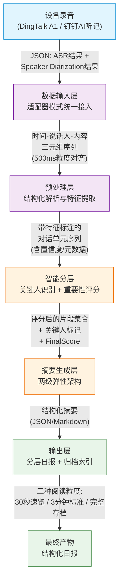
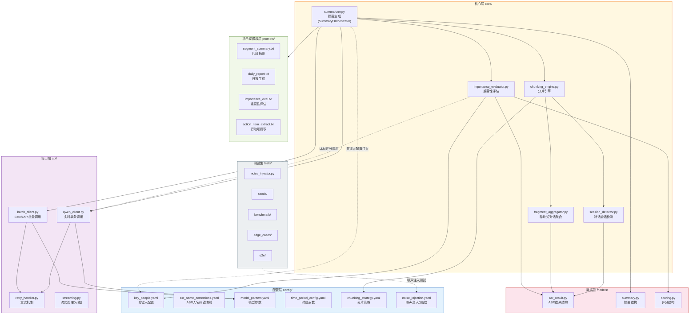
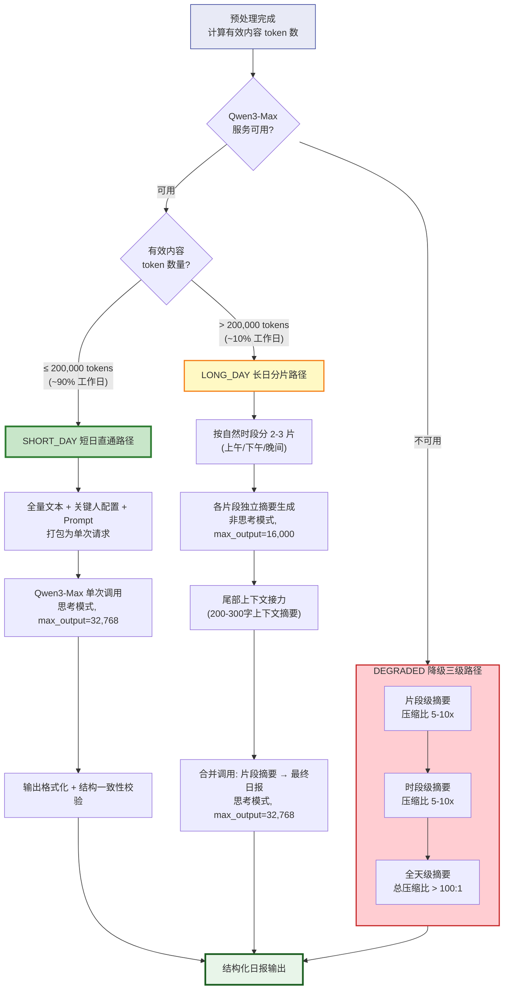

# 总体架构

## 1. 系统定位

全天录音智能摘要系统基于 Qwen3-Max 262K 大上下文窗口，将设备全天连续录音的 ASR 转录文本经关键人识别、重要性评估与弹性分层处理，自动生成结构化日报。

---

## 2. 总体数据流

从设备录音到结构化日报的完整数据流如下：

**各环节说明**：

| 环节 | 输入 | 处理 | 输出 |
|:---|:---|:---|:---|
| 数据输入层 | 设备原始 JSON (ASR + Diarization) | 适配器模式统一格式、500ms 粒度时间对齐 | 时间-说话人-内容三元组序列 |
| 预处理层 | 三元组序列 | 会话检测、数据清洗、话语合并、特征计算、元数据关联 | 带特征标注的对话单元 |
| 智能分层 | 对话单元序列 | 四级关键人匹配 (L1/L1.5/L2/L3) + MVP 统一评分 | 评分排序后的片段集合 |
| 摘要生成层 | 评分片段 + 关键人配置 + Prompt | 短日直通 / 长日分片 / 降级三级 | 结构化摘要内容 |
| 输出层 | 结构化摘要 | 格式化、分层渲染、多维索引归档 | 三粒度日报 + 归档记录 |

---

## 3. 核心组件图

---

## 4. 两级弹性架构决策流

**三条路径对比**：

| 路径 | 触发条件 | 模型调用次数 | 适用比例 | 输出质量 |
|:---|:---|:---|:---|:---|
| **短日直通** (short_day) | 有效内容 ≤ 200K tokens | 1 次 | ~90% 工作日 | 最高（全局上下文完整） |
| **长日分片** (long_day) | 有效内容 200K-250K tokens | 3-4 次（分片+合并） | ~10% 工作日 | 高（尾部上下文接力保障连贯） |
| **降级三级** (degraded) | 模型不可用 / 回退小模型 | 多次（三级渐进压缩） | 异常降级 | 中等（信息有损压缩） |

---

## 5. 技术栈概览

| 类别 | 技术选型 | 用途 |
|:---|:---|:---|
| **大语言模型** | Qwen3-Max (262K context) | 核心摘要生成、重要性评估、跨片段推理 |
| **降级模型** | Qwen3-Plus | 模型不可用时的降级备选 |
| **文本向量化** | text2vec-base-chinese / m3e-large | 语义去重（相似度>0.90-0.92时合并）、主题边界检测 |
| **数据模型** | Pydantic | ASR 结果、摘要、评分等结构化数据校验 |
| **配置管理** | YAML + Git | 关键人配置版本化管理、策略参数外置 |
| **分词器** | Qwen3 官方 tokenizer | 精确 token 计数，驱动路径选择与预算控制 |
| **API 调用** | 阿里云百炼 (实时API + Batch API) | 模型服务接入，Batch API 降本 50% |
| **重试机制** | 指数退避 (1s/2s/4s/8s) | 模型调用失败容错 |
| **测试框架** | Golden Case YAML + 噪声注入 | 端到端回归测试、ASR 噪声鲁棒性验证 |

---

## 6. 模块清单总表

| 模块名称 | 文件路径 | 职责 | 上游依赖 | 下游消费 |
|:---|:---|:---|:---|:---|
| **关键人配置** | `config/key_people.yaml` | 定义关键人等级、别名、保护策略 | Git 版本管理 | 重要性评估、摘要生成 |
| **ASR 人名纠错映射** | `config/asr_name_corrections.yaml` | 同音字/形近字的人名纠错规则 | 人工维护 | 预处理层元数据关联 |
| **模型参数配置** | `config/model_params.yaml` | Qwen3 调用参数（温度、max_tokens 等） | 人工维护 | qwen_client、batch_client |
| **时段系数配置** | `config/time_period_config.yaml` | 工作/休息时段系数定义 | 人工维护 | 重要性评估 |
| **分片策略配置** | `config/chunking_strategy.yaml` | 分片阈值、软边界搜索范围等参数 | 人工维护 | 分片引擎 |
| **ASR 结果模型** | `models/asr_result.py` | ASR 转录结果的 Pydantic 数据结构 | -- | 会话检测、碎片聚合、分片引擎 |
| **摘要模型** | `models/summary.py` | 摘要产物的 Pydantic 数据结构 | -- | 摘要生成、输出层 |
| **评分模型** | `models/scoring.py` | 重要性评分的 Pydantic 数据结构 | -- | 重要性评估 |
| **会话检测器** | `core/session_detector.py` | 基于静默间隔(>3min)+说话人变化识别自然会话边界 | asr_result.py | 分片引擎 (L0 硬约束) |
| **碎片聚合器** | `core/fragment_aggregator.py` | 将 <2min 碎片短对话合并为完整语义单元(上限15min) | asr_result.py | 分片引擎 |
| **分片引擎** | `core/chunking_engine.py` | 四层分片策略(L0会话/L1关键人/L2主题/L3时间窗口) | 会话检测器、碎片聚合器、分片策略配置 | 摘要生成 |
| **重要性评估** | `core/importance_evaluator.py` | MVP 统一评分: FinalScore = KeyPersonBase + LLM*10 | scoring.py、关键人配置、qwen_client | 摘要生成、输出排序 |
| **摘要生成器** | `core/summarizer.py` | SummaryOrchestrator: 协调短日/长日/降级三条路径 | 分片引擎、重要性评估、Prompt 模板、API 层 | 输出层 |
| **片段摘要 Prompt** | `prompts/segment_summary.txt` | 片段级摘要的 LLM 提示词模板 | -- | 摘要生成器 |
| **日报生成 Prompt** | `prompts/daily_report.txt` | 全天日报的 LLM 提示词模板 | -- | 摘要生成器 |
| **重要性评估 Prompt** | `prompts/importance_eval.txt` | LLMScore 评估的提示词模板 | -- | 重要性评估 |
| **行动项提取 Prompt** | `prompts/action_item_extract.txt` | 行动事项提取的提示词模板 | -- | 摘要生成器 |
| **Qwen 实时客户端** | `api/qwen_client.py` | 封装 Qwen3-Max 实时单条 API 调用 | model_params.yaml、retry_handler | 摘要生成器、重要性评估 |
| **Batch API 客户端** | `api/batch_client.py` | 批量提交+异步结果拉取，非实时场景降本 50% | model_params.yaml、retry_handler | 摘要生成器 |
| **重试处理器** | `api/retry_handler.py` | 指数退避重试 (1s/2s/4s/8s)，3次失败降级至 qwen-plus | -- | qwen_client、batch_client |
| **流式处理** | `api/streaming.py` | 流式输出支持（可选，非核心路径） | qwen_client | 前端展示 |
| **噪声注入器** | `tests/noise_injector.py` | 按定义噪声类型对干净 ASR 文本进行扰动 | noise_injection.yaml | 测试用例 |
| **端到端测试** | `tests/e2e/` | Golden Case 驱动的全链路回归测试 | 全部核心模块 | CI/CD |
