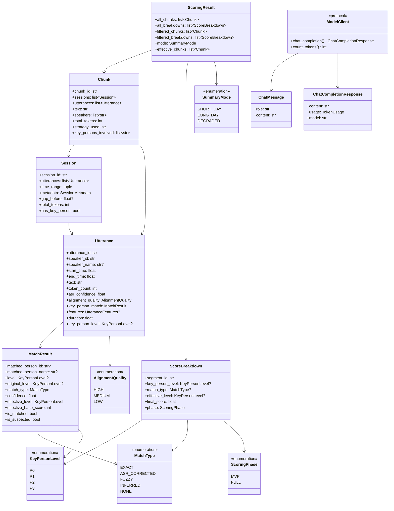

# 共享类型定义 — models/types.py

> **目的**：定义全流水线共享的核心数据类型，作为各模块间的**唯一数据契约**，消除跨模块数据结构不一致问题。
>
> **解决的审计阻塞项**：BLOCK-1（Utterance 不兼容）、BLOCK-2（Segment/Chunk 接口断裂）、BLOCK-3（ScoringResult 未定义）、BLOCK-4（短日 Top-K 矛盾）、BLOCK-6（ModelClient 协议缺失）、BLOCK-9（MatchResult 枚举不一致）、BLOCK-10（80K/200K 阈值混淆）。
>
> **规则**：所有模块**必须**从 `models/types.py` 导入以下类型，**禁止**自行重新定义同名类。

---

## 目录

1. [基础枚举](#1-基础枚举)
2. [核心数据类](#2-核心数据类)
3. [评分相关](#3-评分相关)
4. [API 相关](#4-api-相关)
5. [配置常量](#5-配置常量)
6. [类型关系总览](#6-类型关系总览)
7. [迁移指引](#7-各模块迁移指引)

---

## 1. 基础枚举

所有枚举统一继承 `str, Enum`，确保 JSON 序列化时直接输出字符串值。

```python
from __future__ import annotations

from enum import Enum
from dataclasses import dataclass, field
from typing import Optional, Protocol, Sequence
from datetime import datetime


# ━━━━━━━━━━━━━━━━━━━━━━━━━━━━━━━━━━━━━━━━━━━━━━━━━━━━
# 1.1 关键人等级
# ━━━━━━━━━━━━━━━━━━━━━━━━━━━━━━━━━━━━━━━━━━━━━━━━━━━━

class KeyPersonLevel(str, Enum):
    """关键人优先级等级。

    P0: 最高优先级（如 CEO/总裁），基础保障分 80
    P1: 高优先级（如总监/VP），基础保障分 50
    P2: 中优先级（如经理），基础保障分 20
    P3: 普通人员，基础保障分 0
    """
    P0 = "P0"
    P1 = "P1"
    P2 = "P2"
    P3 = "P3"


# ━━━━━━━━━━━━━━━━━━━━━━━━━━━━━━━━━━━━━━━━━━━━━━━━━━━━
# 1.2 匹配类型（解决 BLOCK-9）
# ━━━━━━━━━━━━━━━━━━━━━━━━━━━━━━━━━━━━━━━━━━━━━━━━━━━━

class MatchType(str, Enum):
    """关键人匹配方式枚举。

    统一各模块的不同命名：
    - Module 1 旧名 "alias"   → 统一为 FUZZY
    - Module 1 旧名 "none"    → 统一为 NONE
    - Module 6 旧名 "unknown" → 统一为 NONE
    """
    EXACT = "exact"                 # L1: Speaker ID 或姓名精确匹配
    ASR_CORRECTED = "asr_corrected" # L1.5: ASR 人名纠错后匹配
    FUZZY = "fuzzy"                 # L2: 姓名/别名模糊匹配
    INFERRED = "inferred"           # L3: 内容推断（疑似），自动降级一档
    NONE = "none"                   # 未匹配到任何关键人


# ━━━━━━━━━━━━━━━━━━━━━━━━━━━━━━━━━━━━━━━━━━━━━━━━━━━━
# 1.3 对齐质量
# ━━━━━━━━━━━━━━━━━━━━━━━━━━━━━━━━━━━━━━━━━━━━━━━━━━━━

class AlignmentQuality(str, Enum):
    """ASR 与说话人分离的时间对齐质量。

    Module 1 原定义不继承 str；Module 2 原定义不继承 str。
    统一为 str, Enum 以支持 JSON 序列化。
    """
    HIGH = "high"
    MEDIUM = "medium"
    LOW = "low"


# ━━━━━━━━━━━━━━━━━━━━━━━━━━━━━━━━━━━━━━━━━━━━━━━━━━━━
# 1.4 评分阶段
# ━━━━━━━━━━━━━━━━━━━━━━━━━━━━━━━━━━━━━━━━━━━━━━━━━━━━

class ScoringPhase(str, Enum):
    """评分器实施阶段。

    MVP: 仅 KeyPersonBaseScore + LLMScore
    FULL: 引入 DurationScore、ContextScore、TimePeriodCoeff 及回归权重
    """
    MVP = "mvp"
    FULL = "full"


# ━━━━━━━━━━━━━━━━━━━━━━━━━━━━━━━━━━━━━━━━━━━━━━━━━━━━
# 1.5 摘要模式
# ━━━━━━━━━━━━━━━━━━━━━━━━━━━━━━━━━━━━━━━━━━━━━━━━━━━━

class SummaryMode(str, Enum):
    """摘要生成路径模式。

    由 SummaryOrchestrator.select_mode() 决策。
    消费方根据此值判断应使用 ScoringResult 中的哪组数据：
    - SHORT_DAY: 使用 all_segments（全量），评分仅用于展示排序
    - LONG_DAY:  使用 filtered_segments（Top-K），评分用于内容优先级
    - DEGRADED:  使用 filtered_segments，三级压缩
    """
    SHORT_DAY = "short_day"
    LONG_DAY = "long_day"
    DEGRADED = "degraded"
```

---

## 2. 核心数据类

### 2.1 MatchResult（解决 BLOCK-9）

统一替代 Module 1 的 `KeyPersonMatch` 和 Module 6 的 `MatchResult`。

```python
# ━━━━━━━━━━━━━━━━━━━━━━━━━━━━━━━━━━━━━━━━━━━━━━━━━━━━
# 等级降级映射（L3 疑似匹配专用）
# ━━━━━━━━━━━━━━━━━━━━━━━━━━━━━━━━━━━━━━━━━━━━━━━━━━━━

INFERRED_LEVEL_DOWNGRADE: dict[KeyPersonLevel, KeyPersonLevel] = {
    KeyPersonLevel.P0: KeyPersonLevel.P1,   # P0 疑似 → 按 P1 处理
    KeyPersonLevel.P1: KeyPersonLevel.P2,   # P1 疑似 → 按 P2 处理
    KeyPersonLevel.P2: KeyPersonLevel.P3,   # P2 疑似 → 按 P3 处理
    KeyPersonLevel.P3: KeyPersonLevel.P3,   # P3 维持
}

# 等级 → 基础保障分映射
LEVEL_BASE_SCORE: dict[KeyPersonLevel, int] = {
    KeyPersonLevel.P0: 80,
    KeyPersonLevel.P1: 50,
    KeyPersonLevel.P2: 20,
    KeyPersonLevel.P3: 0,
}


@dataclass(frozen=True)
class MatchResult:
    """关键人匹配结果。

    统一命名（替代 Module 1 的 KeyPersonMatch 和 Module 6 的 MatchResult）。
    frozen=True 确保匹配结果一旦产出不可篡改。

    字段说明：
    - matched_person_id / matched_person_name: 匹配到的关键人标识和姓名。
      未匹配时均为 None。
    - level: 关键人的原始配置等级。未匹配时为 None。
    - original_level: 仅在 match_type == INFERRED 时，记录降级前的原始等级。
      其他匹配类型下与 level 相同，均为 None（未匹配时）或原始值。
    - match_type: 匹配方式，取 MatchType 枚举值。
    - confidence: 匹配置信度，0.0-1.0。未匹配时为 0.0。
    """
    matched_person_id: Optional[str]        # 关键人 ID（如 "kp001"），未匹配为 None
    matched_person_name: Optional[str]       # 关键人姓名，未匹配为 None
    level: Optional[KeyPersonLevel]          # 配置中的原始等级，未匹配为 None
    original_level: Optional[KeyPersonLevel] # 降级前等级（仅 INFERRED 时不同于 level）
    match_type: MatchType                    # 匹配方式
    confidence: float                        # 匹配置信度 0.0-1.0

    @property
    def effective_level(self) -> KeyPersonLevel:
        """有效等级：疑似匹配自动降级一档。

        - EXACT / ASR_CORRECTED / FUZZY → 返回 level 原值
        - INFERRED → 返回降级后等级（P0→P1, P1→P2, P2→P3, P3→P3）
        - NONE → 返回 P3
        """
        if self.level is None:
            return KeyPersonLevel.P3
        if self.match_type == MatchType.INFERRED:
            return INFERRED_LEVEL_DOWNGRADE[self.level]
        return self.level

    @property
    def effective_base_score(self) -> int:
        """有效等级对应的基础保障分。"""
        return LEVEL_BASE_SCORE[self.effective_level]

    @property
    def is_matched(self) -> bool:
        """是否成功匹配到关键人。"""
        return self.match_type != MatchType.NONE

    @property
    def is_suspected(self) -> bool:
        """是否为疑似匹配（L3 推断）。"""
        return self.match_type == MatchType.INFERRED
```

**各匹配层级与 MatchResult 字段对应关系**：

| 匹配层 | match_type | confidence 典型值 | level | effective_level |
|:---|:---|:---|:---|:---|
| L1 Speaker ID 精确 | `EXACT` | 0.95-0.98 | 配置等级 | = level |
| L1.5 ASR 纠错 | `ASR_CORRECTED` | 0.90-0.95 | 配置等级 | = level |
| L2 模糊匹配 | `FUZZY` | 0.85-0.90 | 配置等级 | = level |
| L3 内容推断 | `INFERRED` | 0.70-0.85 | 配置等级 | 降级一档 |
| 未匹配 | `NONE` | 0.0 | None | P3 |

---

### 2.2 Utterance（解决 BLOCK-1）

统一 Module 1 和 Module 2 的两个不兼容 `Utterance` 定义。

```python
@dataclass(frozen=True)
class Utterance:
    """预处理后的最小对话单元（合并后的话语段）。

    这是全流水线的核心数据结构，由 Module 1（预处理层）生产，
    Module 2（分片引擎）、Module 3（评分器）、Module 4（摘要生成器）消费。

    解决 BLOCK-1 不兼容问题的统一规范：
    - 时间单位：秒（float），与 Module 2 对齐（Module 1 输出时需 ms → s 转换）
    - 唯一 ID：utterance_id，格式 "utt_{YYYYMMDD}_{HHMMSS}_{序号:03d}"
    - token 计数：token_count，预处理阶段用 Qwen3 tokenizer 精确计算
    - 关键人：使用统一的 MatchResult，替代 Module 1 的 KeyPersonMatch
    - 不可变：frozen=True，一旦创建不可修改
    """

    # ---- 标识 ----
    utterance_id: str
    """全局唯一标识，格式 "utt_{YYYYMMDD}_{HHMMSS}_{序号:03d}"。"""

    # ---- 说话人 ----
    speaker_id: str
    """说话人标识，如 "spk_001"。"""

    speaker_name: Optional[str]
    """ASR / 配置推断的说话人姓名。AI听记设备提供，可为 None。"""

    # ---- 时间（单位：秒） ----
    start_time: float
    """起始时间戳（秒，相对录音起点）。Module 1 输出时由 ms 转换。"""

    end_time: float
    """结束时间戳（秒，相对录音起点）。"""

    # ---- 文本 ----
    text: str
    """ASR 识别文本，由多个 Segment 合并而来。"""

    token_count: int
    """使用 Qwen3 tokenizer 精确计算的 token 数。
    预处理阶段一次性计算，避免下游重复分词。"""

    # ---- 置信度 ----
    asr_confidence: float
    """ASR 识别置信度（合并后取均值），0.0-1.0。"""

    min_asr_confidence: float
    """合并前各 Segment 中的最低 ASR 置信度，用于质量判断。"""

    speaker_confidence: float
    """说话人归属置信度（合并后取均值），0.0-1.0。"""

    alignment_quality: AlignmentQuality
    """对齐质量（合并后取最差值）。"""

    # ---- 合并元信息 ----
    segment_count: int
    """合并前的原始 Segment 数量。"""

    has_overlap: bool
    """是否包含重叠标记的 Segment（AI听记设备标记）。"""

    # ---- 关键人匹配（由预处理 Step 5 填充） ----
    key_person_match: MatchResult
    """关键人匹配结果。未匹配时 match_type == MatchType.NONE。"""

    # ---- 特征（由预处理 Step 4 填充） ----
    features: Optional["UtteranceFeatures"] = None
    """结构化特征，供评分和分片使用。Module 1 Step 4 计算填充。"""

    @property
    def duration(self) -> float:
        """时长（秒）。"""
        return self.end_time - self.start_time

    @property
    def key_person_level(self) -> Optional[KeyPersonLevel]:
        """便捷属性：关键人有效等级。未匹配返回 None。"""
        if self.key_person_match.is_matched:
            return self.key_person_match.effective_level
        return None
```

**Module 1 → Module 2 字段映射**：

| Module 1 旧字段 | 统一 Utterance 字段 | 转换说明 |
|:---|:---|:---|
| `start_ms: int` | `start_time: float` | `start_ms / 1000.0` |
| `end_ms: int` | `end_time: float` | `end_ms / 1000.0` |
| （无） | `utterance_id: str` | 预处理阶段生成 |
| （无） | `token_count: int` | 预处理阶段用 tokenizer 计算 |
| `key_person_match: KeyPersonMatch` | `key_person_match: MatchResult` | 类名变更 + 枚举值统一 |
| `features: UtteranceFeatures` | `features: UtteranceFeatures` | 不变 |
| `avg_asr_confidence` | `asr_confidence` | 字段名简化 |
| `worst_alignment` | `alignment_quality` | 字段名统一 |

---

### 2.3 Session

统一替代 Module 1 的 `ProcessedSession` / `ConversationSession` 和 Module 2 的 `Session`。

```python
@dataclass
class SessionMetadata:
    """会话级聚合元信息。"""
    total_duration_sec: float               # 会话总时长（秒）
    utterance_count: int                    # utterance 数量
    speaker_ids: list[str]                  # 出现过的说话人 ID 列表
    key_person_ids: list[str]               # 匹配到的关键人 ID 列表
    dominant_speaker_id: Optional[str]      # 发言时长最长的说话人
    scene_guess: Optional[str]              # 会话级场景推测
    filtered_segment_count: int = 0         # 置信度过滤掉的原始片段数
    avg_asr_confidence: float = 0.0         # 会话整体平均 ASR 置信度


@dataclass
class Session:
    """自然对话会话——L0 硬约束边界单元。

    替代 Module 1 的 ProcessedSession 和 Module 2 的 Session。
    由会话检测器（SessionDetector）产出，作为分片引擎的硬约束边界。

    任何分片策略都不会跨越 Session 边界。
    """
    session_id: str
    """会话标识，格式 "{device_id}_{序号:03d}" 或 "sess_{序号:03d}"。"""

    utterances: list[Utterance]
    """包含的有序 Utterance 列表，按 start_time 升序排列。"""

    time_range: tuple[float, float]
    """起止时间（秒），即 (first_utt.start_time, last_utt.end_time)。"""

    metadata: SessionMetadata
    """会话级聚合元信息。"""

    gap_before: Optional[float] = None
    """与前一个 Session 之间的静默时长（秒），首个 Session 为 None。"""

    @property
    def start_time(self) -> float:
        return self.time_range[0]

    @property
    def end_time(self) -> float:
        return self.time_range[1]

    @property
    def duration(self) -> float:
        return self.end_time - self.start_time

    @property
    def total_tokens(self) -> int:
        """所有 utterance token 之和。"""
        return sum(u.token_count for u in self.utterances)

    @property
    def speaker_set(self) -> set[str]:
        """出现过的说话人 ID 集合。"""
        return {u.speaker_id for u in self.utterances}

    @property
    def has_key_person(self) -> bool:
        """是否包含 P0 或 P1 关键人。"""
        return any(
            u.key_person_level in (KeyPersonLevel.P0, KeyPersonLevel.P1)
            for u in self.utterances
        )
```

---

### 2.4 Chunk（解决 BLOCK-2）

分片引擎的输出单元。增加 `text` 和 `speakers` 字段，解决评分模块无法获取所需数据的问题。

```python
@dataclass
class Chunk:
    """最终分片——送入 LLM 或评分器的处理单元。

    由分片引擎产出。解决 BLOCK-2：评分模块需要的 text 和 speakers 字段
    现在作为 Chunk 的一等公民提供，无需额外转换。
    """
    chunk_id: str
    """分片标识，格式 "chunk_{序号:03d}"。"""

    sessions: list[Session]
    """包含的 Session 列表（可能由 AggregatedPack 展开）。"""

    utterances: list[Utterance]
    """扁平化的全部 Utterance，按时间排序。
    冗余字段，等价于 [u for s in sessions for u in s.utterances]，
    预计算以避免下游重复展开。"""

    text: str
    """拼接文本。由所有 utterance.text 按时间顺序用换行符连接。
    格式: "[HH:MM:SS] speaker_name: text"
    供评分模块和摘要模块直接使用。"""

    speakers: list[str]
    """涉及的所有说话人 ID 列表（去重，按首次出现顺序）。
    解决 BLOCK-2：评分模块 compute_key_person_base_score 需要此字段。"""

    total_tokens: int
    """所有 utterance token_count 之和。"""

    strategy_used: str
    """产生此 Chunk 的策略名。
    取值: "L1_key_person" | "L2_topic" | "L3_time_window" | "aggregated"。"""

    key_persons_involved: list[str]
    """涉及的关键人 ID 列表（去重）。"""

    start_time: float = 0.0
    """第一条 utterance 的 start_time。"""

    end_time: float = 0.0
    """最后一条 utterance 的 end_time。"""

    label: Optional[str] = None
    """可读标签，如 "战略研讨会-第2部分，共4部分"。"""

    tail_context_summary: Optional[str] = None
    """尾部上下文摘要（200-300 字），供下一 Chunk 或合并阶段参考。"""

    boundary_score: float = 0.0
    """边界质量评分 0.0-1.0。"""

    @property
    def duration(self) -> float:
        return self.end_time - self.start_time


@dataclass
class ChunkingResult:
    """分片引擎总输出。"""
    chunks: list[Chunk]
    mode: SummaryMode
    """当前摘要模式，由 SummaryOrchestrator 决策后传入分片引擎。"""
    total_tokens: int
    metadata: dict = field(default_factory=dict)
    """策略选择日志、边界统计等调试信息。"""
```

---

## 3. 评分相关（解决 BLOCK-3, BLOCK-4）

### 3.1 ScoreBreakdown

与 Module 3 原定义保持一致，仅将松散的 `str` 类型字段改为对应枚举。

```python
@dataclass
class ScoreBreakdown:
    """单个片段/Chunk 的评分分解记录。

    保留完整的评分分解，服务于调试、可解释性和后续模型迭代。
    """

    segment_id: str
    """对应 Chunk.chunk_id 或其他可溯源标识。"""

    # ---- 关键人维度 ----
    key_person_level: Optional[KeyPersonLevel] = None
    """关键人原始等级。未匹配时为 None。"""

    match_type: Optional[MatchType] = None
    """匹配方式。使用统一的 MatchType 枚举，替代原 str 类型。"""

    effective_level: Optional[KeyPersonLevel] = None
    """疑似降级后的等效等级。非 INFERRED 时与 key_person_level 相同。"""

    key_person_base_score: int = 0
    """关键人基础保障分（P0=80, P1=50, P2=20, P3=0）。"""

    # ---- LLM 语义维度 ----
    llm_score: int = 5
    """LLM 原始语义评分 1-10。解析失败时降级为默认分 5。"""

    llm_score_weighted: int = 50
    """llm_score * llm_score_multiplier（默认 *10）。"""

    # ---- 连续性保护 ----
    continuity_bonus: float = 0.0
    """连续性保护加成分。"""

    continuity_source_segment_id: Optional[str] = None
    """加成来源片段的 segment_id。"""

    # ---- 完整阶段维度（MVP 阶段为 None） ----
    duration_score: Optional[float] = None
    context_score: Optional[float] = None
    time_period_coeff: Optional[float] = None

    # ---- 最终得分 ----
    final_score: float = 0.0
    """MVP: KeyPersonBaseScore + LLMScore * 10 + continuity_bonus"""

    # ---- 筛选结果 ----
    threshold_applied: int = 60
    """使用的最低分阈值。"""

    passed_threshold: bool = False
    """是否通过阈值筛选。"""

    rank_in_topk: Optional[int] = None
    """Top-K 排名（从 1 开始），未进入 Top-K 为 None。"""

    # ---- 元数据 ----
    speakers: list[str] = field(default_factory=list)
    duration_seconds: Optional[float] = None
    timestamp: Optional[float] = None
    """片段起始时间（秒）。用于排序。"""

    phase: ScoringPhase = ScoringPhase.MVP
```

### 3.2 ScoringResult（解决 BLOCK-3, BLOCK-4）

```python
@dataclass
class ScoringResult:
    """评分模块的统一输出包装。

    解决 BLOCK-3：评分→摘要接口断裂。提供结构化的评分输出，
    替代原来的 tuple[list[Segment], list[ScoreBreakdown]]。

    解决 BLOCK-4：短日模式下 Top-K 筛选与 PRD 矛盾。
    通过 mode 字段让消费方自行决定使用哪组数据：
    - SHORT_DAY: 消费方应使用 all_chunks（全量），评分仅用于展示排序
    - LONG_DAY / DEGRADED: 消费方应使用 filtered_chunks（Top-K 筛选后）

    数据组织：
    - all_* 字段：全量数据，按时间升序排列
    - filtered_* 字段：经阈值 + Top-K 筛选后的数据，按分数降序排列
    """

    # ---- 全量数据（按时间升序） ----
    all_chunks: list[Chunk]
    """全部评分片段，按 start_time 升序排列。"""

    all_breakdowns: list[ScoreBreakdown]
    """全部评分分解，与 all_chunks 一一对应（同序）。"""

    # ---- 筛选后数据（按分数降序） ----
    filtered_chunks: list[Chunk]
    """通过阈值 + Top-K 筛选后的片段，按 final_score 降序排列。
    SHORT_DAY 模式下此列表与 all_chunks 相同（不执行筛选）。"""

    filtered_breakdowns: list[ScoreBreakdown]
    """与 filtered_chunks 一一对应的评分分解（同序）。"""

    # ---- 模式标记 ----
    mode: SummaryMode
    """当前摘要模式。消费方据此决定使用 all_* 还是 filtered_*。"""

    # ---- 评分配置快照 ----
    config_snapshot: Optional["ScoringConfig"] = None
    """评分时使用的配置快照，用于审计和复现。"""

    @property
    def effective_chunks(self) -> list[Chunk]:
        """根据 mode 返回消费方应使用的 Chunk 列表。

        SHORT_DAY → all_chunks（全量，按时间排序，评分仅用于展示）
        LONG_DAY / DEGRADED → filtered_chunks（Top-K，按分数排序）
        """
        if self.mode == SummaryMode.SHORT_DAY:
            return self.all_chunks
        return self.filtered_chunks

    @property
    def effective_breakdowns(self) -> list[ScoreBreakdown]:
        """与 effective_chunks 对应的评分分解。"""
        if self.mode == SummaryMode.SHORT_DAY:
            return self.all_breakdowns
        return self.filtered_breakdowns
```

---

## 4. API 相关（解决 BLOCK-6）

### 4.1 ChatMessage & ChatCompletionResponse

```python
@dataclass
class ChatMessage:
    """LLM 对话消息。

    各模块统一使用此类型构建 messages 列表，
    替代 Module 4 的 list[dict] 和 Module 5 的 list[ChatMessage]（已统一）。
    """
    role: str
    """消息角色: "system" | "user" | "assistant"。"""

    content: str
    """消息内容。"""


@dataclass
class TokenUsage:
    """Token 使用量统计。"""
    prompt_tokens: int
    completion_tokens: int
    total_tokens: int
    thinking_tokens: int = 0
    """思考模式下的思维链 token 数。非思考模式为 0。"""


@dataclass
class ChatCompletionResponse:
    """LLM 调用统一响应结构。

    实时客户端和 Batch 客户端均返回此类型。
    """
    content: str
    """模型生成的回答文本。"""

    usage: TokenUsage
    """Token 使用量。"""

    model: str
    """实际使用的模型标识。"""

    thinking_content: Optional[str] = None
    """思考模式下的思维链原文。非思考模式为 None。"""

    request_id: str = ""
    """请求 ID（如阿里云请求 ID），用于排查。"""

    finish_reason: str = "stop"
    """完成原因: "stop" | "length" | "content_filter"。"""
```

### 4.2 ModelClient 协议（解决 BLOCK-6）

```python
class ModelClient(Protocol):
    """LLM 客户端协议。

    解决 BLOCK-6：摘要模块期望 async 方法，API 层定义为同步。
    所有 LLM 客户端实现（QwenClient、MockClient、BatchClient 等）
    必须实现此协议。

    使用 Protocol 而非 ABC，允许结构化子类型匹配（鸭子类型），
    无需显式继承。
    """

    async def chat_completion(
        self,
        messages: list[ChatMessage],
        *,
        model: Optional[str] = None,
        enable_thinking: bool = False,
        thinking_budget: Optional[int] = None,
        max_tokens: Optional[int] = None,
        temperature: Optional[float] = None,
    ) -> ChatCompletionResponse:
        """发送 Chat Completion 请求并返回统一响应。

        Args:
            messages: 消息列表，使用 ChatMessage 类型。
            model: 覆盖默认模型标识。
            enable_thinking: 启用思考模式。
            thinking_budget: 思维链 token 上限（仅 enable_thinking=True 时生效）。
            max_tokens: 输出 token 上限。
            temperature: 采样温度。

        Returns:
            ChatCompletionResponse 统一响应。

        Raises:
            QwenRetryableError: 可重试的 API 错误（429/500/超时）。
            QwenAPIError: 不可重试的 API 错误（400/401）。
            QwenExhaustedError: 主模型+降级模型均失败。
        """
        ...

    def count_tokens(self, text: str) -> int:
        """使用模型对应的 tokenizer 精确计算 token 数。"""
        ...

    def count_messages_tokens(self, messages: list[ChatMessage]) -> int:
        """计算完整 messages 列表的 token 数（含 role 标记开销）。"""
        ...
```

---

## 5. 配置常量（解决 BLOCK-10）

### 5.1 Token 预算阈值

解决 BLOCK-10：明确区分两个不同概念的阈值。

```python
# ━━━━━━━━━━━━━━━━━━━━━━━━━━━━━━━━━━━━━━━━━━━━━━━━━━━━
# Token 预算关键阈值（解决 BLOCK-10）
# ━━━━━━━━━━━━━━━━━━━━━━━━━━━━━━━━━━━━━━━━━━━━━━━━━━━━

SHORT_DAY_THRESHOLD: int = 80_000
"""摘要模式切换阈值（tokens）。

用途：SummaryOrchestrator.select_mode() 决策。
- total_tokens < 80,000 → SHORT_DAY（~90% 工作日）
- total_tokens 80,000 ~ 250,000 → LONG_DAY（~10% 工作日）
- total_tokens > 250,000 → DEGRADED

来源：PRD §1.1.4，扣除系统开销后 80K 有效内容恰好填满 262K 上下文。
此值由 config/model_params.yaml 中的 token_budget.short_day_threshold 配置。
"""

LONG_DAY_MAX_THRESHOLD: int = 250_000
"""长日模式上限（tokens）。超过此值降级为三级压缩。"""

CHUNK_TOKEN_BUDGET: int = 200_000
"""单 Chunk 最大 token 容量。

用途：分片引擎内部参数，决定单个 Chunk 的 token 上限。
仅在分片引擎切分逻辑中使用，与摘要模式切换无关。

来源：Qwen3-Max 262K 上下文 - 系统提示词(2K) - 关键人注入(600)
      - 输出预留(32K) - 安全余量(20K) ≈ 200K 可用载荷。
此值由 config/model_params.yaml 或 chunking_strategy.yaml 配置。
"""

MODEL_CONTEXT_LIMIT: int = 262_144
"""Qwen3-Max 上下文窗口大小（tokens）。"""

DEGRADED_MODEL_THRESHOLD: int = 64_000
"""模型能力下限。低于此值的模型自动降级为三级压缩。"""
```

### 5.2 阈值关系图

```
全天 token 总量
     │
     ├── < 80K ──────────────────────► SHORT_DAY
     │                                  └─ 全量送入单次 LLM 调用
     │                                  └─ Chunk token ≤ 200K（单 Chunk）
     │
     ├── 80K ~ 250K ─────────────────► LONG_DAY
     │                                  └─ 按时段分 2-3 个 Session
     │                                  └─ 每个 Session ≤ 80K tokens
     │
     └── > 250K ─────────────────────► DEGRADED
                                        └─ 三级压缩：Chunk(3-8K) → Session → Daily
```

---

## 6. 类型关系总览



---

## 7. 各模块迁移指引

### Module 1（数据输入 + 预处理）

| 变更项 | 旧 | 新 |
|:---|:---|:---|
| `Utterance` 时间 | `start_ms: int`, `end_ms: int` | `start_time: float`, `end_time: float`（秒） |
| `Utterance` 新增字段 | 无 | `utterance_id`, `token_count` |
| `KeyPersonMatch` | Module 1 自有定义 | 改用 `MatchResult` |
| `AlignmentQuality` | `Enum`（不继承 str） | `str, Enum` |
| match_type 值 `"alias"` | Module 1 旧值 | 改为 `MatchType.FUZZY` |
| match_type 值 `"none"` | Module 1 旧值 | 改为 `MatchType.NONE` |
| `ProcessedSession` | Module 1 自有定义 | 改用 `Session` |
| `Utterance.worst_alignment` | Module 1 字段名 | 改为 `alignment_quality` |
| `Utterance.avg_asr_confidence` | Module 1 字段名 | 改为 `asr_confidence` |

### Module 2（分片引擎）

| 变更项 | 旧 | 新 |
|:---|:---|:---|
| `Utterance` | Module 2 自有定义 | 从 `models/types.py` 导入 |
| `Session` | Module 2 自有定义 | 从 `models/types.py` 导入，增加 `metadata` 字段 |
| `Chunk` | 无 `text`/`speakers` | 新增 `text`, `speakers` 字段 |
| `ChunkingResult.mode` | `str`（"short_day"\|"long_day"） | `SummaryMode` 枚举 |
| `AlignmentQuality` | `Enum`（不继承 str） | `str, Enum` |

### Module 3（评分器）

| 变更项 | 旧 | 新 |
|:---|:---|:---|
| 输入类型 | `Segment`（未定义） | 直接消费 `Chunk` |
| 输出类型 | `tuple[list, list]` | `ScoringResult` 数据类 |
| `ScoreBreakdown.match_type` | `Optional[str]` | `Optional[MatchType]` |
| `ScoreBreakdown.key_person_level` | `Optional[str]` | `Optional[KeyPersonLevel]` |
| Top-K 筛选 | 所有模式一律执行 | `SHORT_DAY` 模式下 `filtered_chunks = all_chunks` |

### Module 4（摘要生成器）

| 变更项 | 旧 | 新 |
|:---|:---|:---|
| 输入 `scoring_result` | 类型未定义 | `ScoringResult`，使用 `effective_chunks` 属性 |
| `messages` 构建 | `list[dict]` | `list[ChatMessage]` |
| `model_client` 类型 | 无明确类型 | `ModelClient` 协议 |

### Module 5（API 层）

| 变更项 | 旧 | 新 |
|:---|:---|:---|
| `chat_completion` | 同步 `def` | 异步 `async def`（实现 `ModelClient` 协议） |
| `ChatMessage` | Module 5 自有定义 | 从 `models/types.py` 导入 |
| `ChatCompletionResponse` | Module 5 自有定义 | 从 `models/types.py` 导入 |

### Module 6（配置管理）

| 变更项 | 旧 | 新 |
|:---|:---|:---|
| `PersonLevel` | Module 6 自有定义 | 改用 `KeyPersonLevel` |
| `MatchType` | Module 6 自有定义（`UNKNOWN` 值） | 从 `models/types.py` 导入（`NONE` 值） |
| `MatchResult` | Module 6 自有定义（含 `matched_person: KeyPerson`） | 从 `models/types.py` 导入（改用 id + name 扁平字段） |
